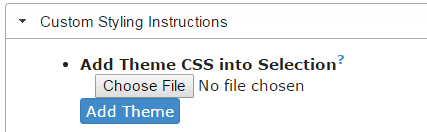
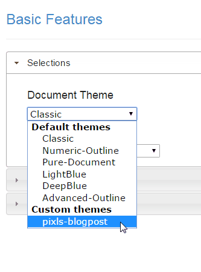

Writing Content
===============

So you want to write some content for the site?  Awesome!

First, reach out to someone to make sure what you are wanting to write isn't already being worked on.  You can reach out to Pat (pat@patdavid.net) via email.  You can also check the [wiki topic on discuss][] to see what's possibly being worked on or in the queue (feel free to reply to that topic if you want feedback).  We also have our IRC channel, #pixls.us on irc.freenode.net ([webclient][]) if you want to drop in and ask someone (patdavid, DrSlony, andabata, LoTR, houz, Mimir can all point you in the right direction - beware of houz though, he bites).

There are two main ways to write content for the site.  The easy way, and the hard way.  The easy way is for those folks who simply want to write a blog post or article and don't want to mess around with git or cloning the entire website.  The hard way is for those folks who want to help with the website in some way or make 100% sure that their content looks the way they want.

Unless you are going to hack at the website code, I suggest the easy way...

The Easy Way
------------
The easy way doesn't require you to do anything fancy.

Articles/posts for the site are written in [Markdown][].  These are just plain text files with some very lightweight markup to denote a few things (see the link for a basic Markdown introduction).

In order to view your Markdown rendered as it would appear on the website, we can use a browser + an appropriate extension.

### Installing (Chrome)
To preview everything as it would appear on the website, the extension will need to allow custom css as well.

In [Chrome][] the [MarkView][] extension is known to work.

1. Install [MarkView][].
    * Allow it to work on local files:
        In Chrome, go to: `chrome://extensions/` to see all of your extensions.  
        Find the MarkView extesion in the list and make sure the option to __"Allow access to file URLs"__ is _checked_:
        

2. Download the combined CSS file for pixls blogposts and save it somewhere easy to find:  
    https://raw.githubusercontent.com/patdavid/markview-css/master/pixls-blogpost.css

3. Add the CSS as an option in MarkView.
    * From the `chrome://extensions` MarkView entry, click **Options**.  
    Alternatively, from the MarkView icon on the Chrome toolbar, Right-Click and choose **Options**.
    * Under the section _"Custom Styling Instructions"_:
    
    * Find **"Add Theme CSS into Selection"** and click the _"Choose File"_ button.
    * Choose the `pixls-blogpost.css` file you downloaded in the previous step and click the _"Add Theme"_ button.

4. Select a "Document Theme".
    * In the section _"Selection"_, under **"Document Theme** the drop-down should have an entry for `pixls-blogpost` now.  Choose that theme.

    

[webclient]: http://webchat.freenode.net/?channels=%23pixls.us&uio=MTY9dHJ1ZSYyPXRydWUmOT10cnVl02
[wiki topic on discuss]: https://discuss.pixls.us/t/new-upcoming-pixls-us-posts-wiki/1393
[Markdown]: https://daringfireball.net/projects/markdown/basics
[Chrome]: https://www.google.com/chrome/browser/desktop/
[MarkView]: https://chrome.google.com/webstore/detail/markview/iaddkimmopgchbbnmfmdcophmlnghkim
