## Introduction (Concept/Theory)

The term [_Chiaroscuro_][ch] is derived from the Italian _chiaro_ meaning ‘clear, bright’ and _oscuro_ meaning ‘dark, obscure’.  In art the term has come to refer to the use of bold contrasts between light and shadow, particularly across an entire composition, where they are a prominent feature of the work.

[ch]: https://en.wikipedia.org/wiki/Chiaroscuro

This interplay of shadow and light is particularly important in allowing the viewer to extrapolate volume from a flat image.  The use of a single light source helps to accentuate the perception of volume as well as adding drama and dynamics to the scene.

Historically the use of chiaroscuro can often be associated with the works of old masters such as [Rembrandt](https://en.wikipedia.org/wiki/Rembrandt) and [Caravaggio](https://en.wikipedia.org/wiki/Caravaggio).  The use of such extreme lighting immediately evokes a sense of shape and volume, while focusing the attention of the viewer.

<figure>
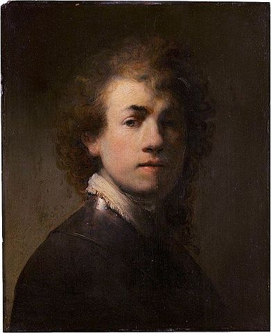
<figcaption>
<a href='https://commons.wikimedia.org/wiki/File:Rembrandt_van_Rijn_184.jpg'>_Self Portrait with Gorget_</a> by [Rembrandt](https://en.wikipedia.org/wiki/Rembrandt)
</figcaption>
</figure>

<figure>
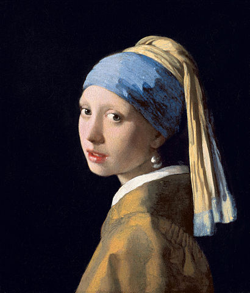
<figcaption>
[_Girl with a Pearl Earring_](https://en.wikipedia.org/wiki/Girl_with_a_Pearl_Earring) by [Johannes Vermeer](https://en.wikipedia.org/wiki/Johannes_Vermeer)
</figcaption>
</figure>

The aim of this tutorial will be to emulate the lighting characteristics of chiaroscuro in producing a portrait to evoke the feeling of an old master painting.

### Equipment

In examining chiaroscuro portraiture, it becomes apparent that a strong characteristic of the images is the use of single light source on the scene.  So this tutorial will focus on using a single source to illuminate the portrait.

Getting the keylight off the camera is essential.  The closer the keylight is to the axis of the camera the larger the reduction in shadows.  This is counter to the intention of this workflow.  Shadows are an essential component in producing this look, and on-camera lighting simply will not work.

The reason to choose a softbox versus the myriad of other light modifiers available is simple: control.  Umbrellas can soften the light, but due to their open nature have a tendency to spill light everywhere while doing so.  A softbox allows the light to be softened while also retaining a higher level of spill control.

Light spill can still occur with a softbox, so the best option is to bring the light in as close as possible to the subject.  Due to the inverse square nature of light attenuation, this will help to drop the background very dark (or black) when exposing properly for the subject.

<figure class='big-vid'>
<a href='three-dots.jpg'>
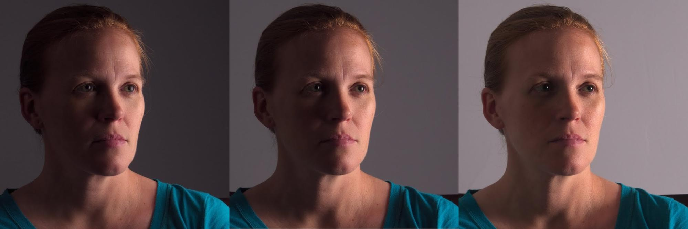
</a>
</figure>

__Left__  
For example, in the sample images above, a 20 inch softbox was initially located about 18 inches away from the subject (first).  The rear wall was approximately 48 inches away from the subject or just over twice the distance from the softbox.  Thus, on a proper exposure for the subject, the background would be around 3 stops lower in light.  This is seen as the background in the first image has dropped to a dark gray.

__Middle__  
When the light distance to the subject is doubled and the light distance to the rear wall stays the same, the ratio is not as extreme between them.  The light distance from the subject is now 36 inches, while the light distance to the rear wall is still 48 inches.  When properly exposing for the subject, the rear wall is now only about 1 stop lower in light.

__Right__  
In the final example, the distance from the light to both the subject and the rear wall are very close.  As such, a proper exposure for the subject almost brings the wall to a middle exposure.

What this example provides is a good visual guide for how to position the subject and light relative to the surroundings to create the desired look.  To accentuate the ratio between dark and light in the image it would be best to move the light as close to the subject as possible.

If there is nothing to reflect light on the shadow side of the subject, then the shadows would fall to very dark or black.  Usually, there are at least walls and ceilings in a space that will reflect some light, and the amount falling on the shadow side can be attenuated by either moving the subject nearer to a wall on that side, or using a bounce/reflector as desired.

## Shooting

### Planning

The setup for the shot would be to push the key light in very close to the model, while still allowing some bounce to slightly fill the shadows.

<figure>
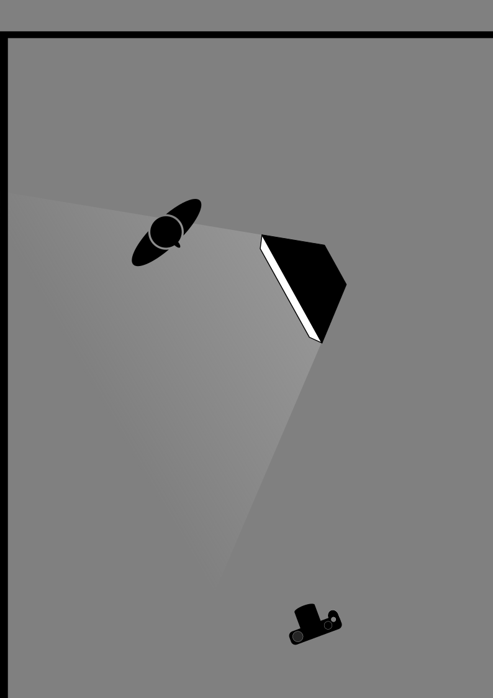
</figure>

As noted previously, having the key light close to the model would allow the rest of the scene to become much darker.  The softbox is arranged such that the face is almost completely vertical and the bottom edge is just above the models eyes.  This was to feather the lower edge of the light falloff along the front of the model.

There are 2 main adjustments that can be made to fine-tune the image result with this setup.

The first is the key light distance/orientation to the subject.  This will dictate the proper exposure for the subject.  For this image the intention is to push the key light in as close as possible without being in frame.  There is also the option of angling the key light relative to the subject.  In the diagram above, the softbox is actually angled away from the subject.  The intention here was to feather the edge of the light in order to control spill onto the rest of the model (putting more emphasis on her face).

The second adjustment, once the key light is in a good location, is the distance from the key light and subject together, to the surrounding walls (or a reflector if one is being used).  Moving both subject and keylight closer to the side wall will increase the amount of reflected light being bounced into the shadows.

#### Mood Board

If possible, it can be extremely helpful to both the model and photographer to have a Mood Board available.  This is usually just a collection or collage of images that help to convey the desired feeling or desired result from the session.  For help in directing the model, the images do not necessarily need the same lighting setup.  The intention is to help the model understand what your vision is for the pose and facial expressions.

### The Shoot

The lighting is set up and the model understands what type of look is desired, so all that’s left is to shoot the image!

<figure class='big-vid'>
<a href='mairi-contact.jpg'>
    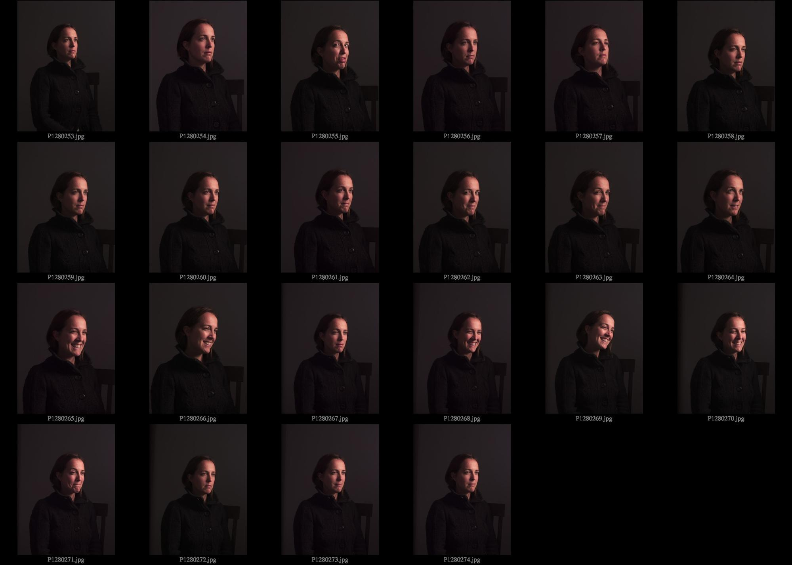
</a>
</figure>

In the end, I favored the last image in the sequence for a combination of the models head position/body language and the slight smile she has.

## Postprocessing

Having chosen the final image from the contact sheet, it’s now time to proceed with developing the image and retouching as needed.

If you'd like to follow along you can download the raw .ORF file: 

[**Mairi_Troisieme.ORF**](Mairi_Troisieme.ORF) (13MB)

This file is licensed 
([Creative Commons, By-Attribution, Non-Commercial, Share-Alike](https://creativecommons.org/licenses/by-nc-sa/3.0/ "Creative Commons By-Attribution Non-Commercial Share-Alike")), and is the same image that I shared with everyone on the forums for a PlayRaw processing practice.  You can see how other folks approached processing this image [in the topic on discuss](https://discuss.pixls.us/t/playraw-mairi-troisieme/967).  If you decide to try this out for yourself, come share your results with us!

### Raw Development

There are various [Free raw processing tools](/software) available and for this tutorial I will be using the wonderful [darktable](http://www.darktable.org).

<figure>

</figure>

#### Base Curve

Not surprisingly the initial image loaded without any modifications is a bit dark and rather flat looking.  By default darktable should have recognized that the file is from Olympus, and attempted to apply a sane base curve to the linear raw data.  If it doesn’t you can choose the preset “olympus like alternate”.

I found that the preset tended to crush the darkest tones a bit too much, and instead opted for a simple curve with a single point as seen here:

<figure class='big-vid'>
<a href='darktable_0001.jpg'>
    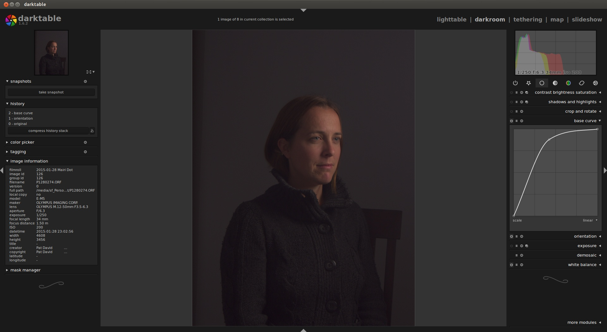
</a>
</figure>

Resist the temptation to try and adjust overall exposure and contrast with the base curve.  These parameters will be adjusted shortly in the appropriate modules.  The base curve is only intended to transform the linear raw rgb to something that looks good on your output device.  The base curve will affect how the contrasts, colors, and saturation all relate in the final output.  For the purposes of this tutorial, it is enough to simply choose a preset.

The next series of steps focus on adjusting various exposure parameters for the image.  Conceptually they start with the most broad adjustment, exposure, then to slightly more targeted adjustments such as contrast, brightness, and saturation, then finish with targeted tonal adjustments in tone curves.

[darktable manual: base curve](https://www.darktable.org/usermanual/ch03s04.html.php#base_curve)

#### Exposure

Once the base curve is set, the next module to adjust would be the overall exposure of the image (and the black point).  This is done in the “exposure” module (below the base curve).

<figure class='big-vid'>
<a href='darktable_0002.jpg'>
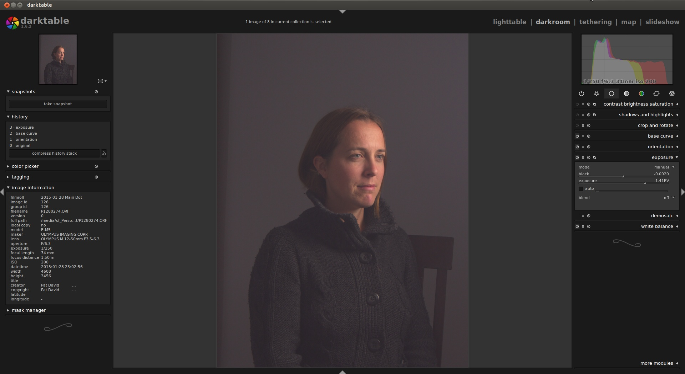
</a>
</figure>

The important area to watch while adjusting the exposure for the image is the histogram.  The image was exposed a little dark, so increase the exposure overall for the image.  In the histogram, avoid clipping any channels by allowing them to be pushed outside the range.  In this case, the desire is to provide a nice mid-level brightness to the models face.  The exposure can be raised until the channels begin to clip on the far right of the histogram, then brought back down a bit to leave some headroom.

The darkest areas of the histogram on the left are clipped a bit, so raising the black level brings the detail back in the darkest shadows.  When in doubt try to let the histogram guide you with data from the image.  Particularly around the highest and lowest values (avoid clipping if possible).

An easy way to think of the exposure module is that it allows the entire image exposure to be shifted along with compressing/expanding the overall range by modifying the black point.

[darktable manual: exposure](https://www.darktable.org/usermanual/ch03s04.html.php#exposure)

#### Contrast Brightness Saturation

Where the Exposure module shifts the overall image values from a global perspective, modules such as the “contrast brightness saturation” allow finer tuning of the image within the range of the exposure.

To emphasis the models face, while also strengthening the interplay of shadow and light on the image, drop the brightness down to taste.  I brought the brightness levels down quite a bit (-0.31) to push almost all of the image below medium brightness.

<figure class='big-vid'>
<a href='darktable_0003.jpg'>
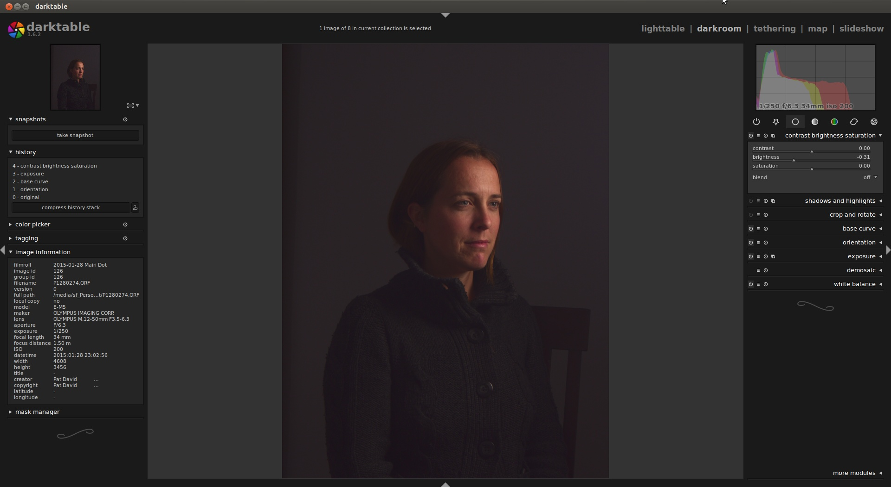
</a>
</figure>

Overall this helps to emphasis the models face over the rest of the image initially.  While the rest of the image is comprised of various dark/neutral tones, the models face is not.  Pushing the saturation down as well will remove much of the color from the scene and face.  This is done to bring the skin tones back down to something slightly more natural looking, while also muting some of those tones.

<figure class='big-vid'>
<a href='darktable_0004.jpg'>
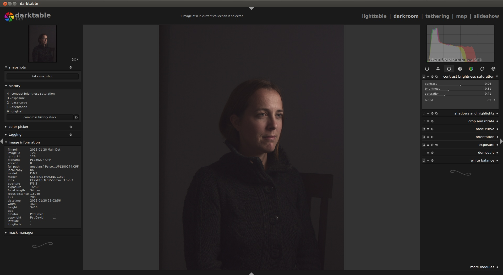
</a>
</figure>

The skin now looks a bit more natural but muted.  The background tones have become more neutral as well.  A very slight bump in contrast to taste finishes out this module.

[darktable manual: contrast brightness saturation](https://www.darktable.org/usermanual/ch03s04.html.php#contrast_brightness_saturation)

#### Tone Curve

A final modification to the exposure of the image is through a tone curve adjustment.  This gives us the ability to make some slight changes to particular tonal ranges.  In this case pushing the darker tones down a bit more while boosting the upper mid and high tones.

<figure class='big-vid'>
<a href='darktable_0005.jpg'>
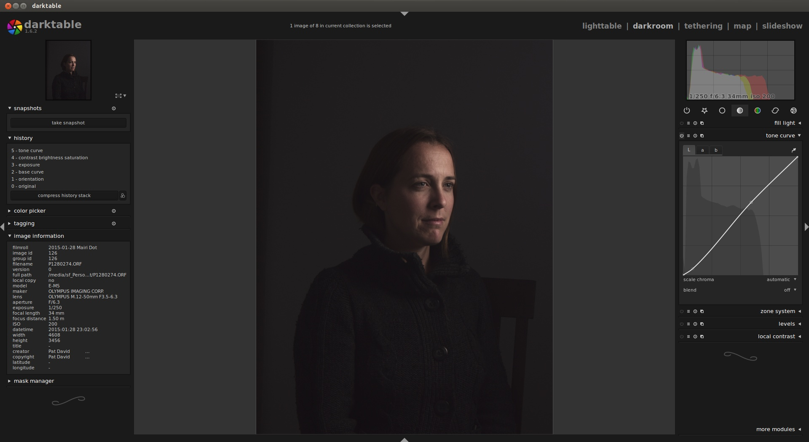
</a>
</figure>

This is actually a type of contrast increase, but controlled to specific tones based on the curve.  The darkest darks (bottom of the curve) get pushed a little bit darker, which will include most of the sweater, background, and shadow side of the models face.  The very slight rolling boost to the lighter tones primarily helps to allow the face to brighten up against the background even more.

The changes are very slight and to taste.  The tone curve is very sensitive to changes, and often only very small modifications are required to achieve a given result.

[darktable manual: tone curve](https://www.darktable.org/usermanual/ch03s04s02.html.php#tone_curve)

#### Sharpen

By default the sharpen module will apply a small amount of sharpening to the image.  The module uses unsharp mask for sharpening, so the radius parameter is the blur radius into the unsharp mask.  I wanted to sharpen lightly very fine details, so set the radius to ~1, with an amount around 0.9 and no threshold.  This produced results that are very hard to distinguish from the default settings, but appears to sharpen smaller structures just slightly more.

<figure class='big-vid'>
<a href='darktable_0006.jpg'>
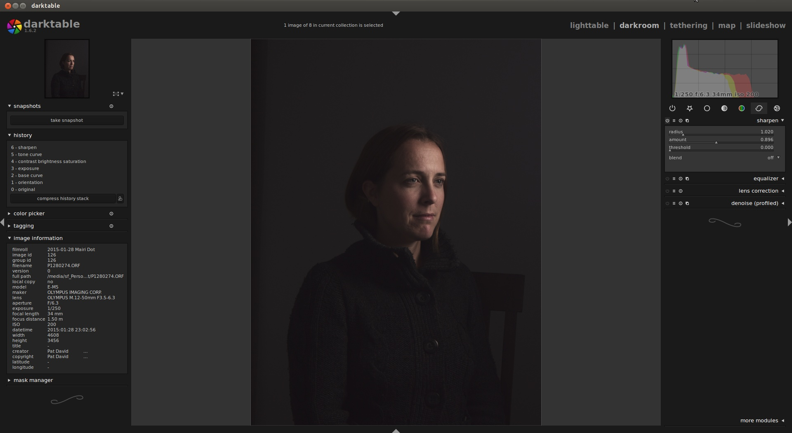
</a>
</figure>

I personally include a final sharpening step as a side effect of using wavelet decompose for skin retouching later in the process with [GIMP][].  As such I am not usually as concerned about sharpening here as much.  If I were, there are better modules for adjusting sharpening from wavelets using the equalizer module.

[GIMP]: https://www.gimp.org

[darktable manual: sharpen](https://www.darktable.org/usermanual/ch03s04s04.html.php#sharpen)

#### Denoise (profiled)

The darktable team and its users profiled many different cameras for noise profiles at various ISOs to build a statistical model with brightness across the three color channels.  Using these profiles, darktable can then do a better job at efficiently denoising images.  In the case of my camera (Olympus OM-D E-M5), there was a profile already captured for ISO200.

<figure class='big-vid'>

</figure>

In this case, the chroma noise wasn’t too bad, and a very slight reduction in luma noise would be sufficient for the image.  As such, I used a non-local means with a large patch size (to retain sharpness) and a low strength.  This was all applied uniformly against the HSV lightness option.

[darktable manual: denoise - profiled](https://www.darktable.org/usermanual/ch03s04s04.html.php#denoise_profiled)

#### Export

Finally!  The image tones and exposure are in a desirable state, so export the results to a new file.  I tend to use either TIF or PNG at 16 bit.  This is in case I want to work in a full 16 bit workflow with the latest [GIMP][], or may want to in the future.

### GIMP

When there are still some pixel-level modifications that need to be done to the image, the go-to software is [GIMP][].

* Skin retouching
* spot healing/touchups
* Background rebuild

<figure>

</figure>

#### Skin Retouching with Wavelet Decompose

This step is not always needed, but who doesn’t want their skin to look a little nicer if possible?

The ability to modify an image based on detail scales isolated on their own layers is a very powerful tool.  The approach is similar to frequency separation, but has the advantage of providing multiple frequencies to modify simultaneously of progressively larger and larger detail scales.  This offers a large range of flexibility and an easier workflow vs. frequency separation (you can work on any detail scale simply by switching to a different layer).

I used to use the wonderful [Wavelet Decompose](http://registry.gimp.org/node/11742) plugin from marcor on the GIMP plugin registry.  I have since switched to using the same result from [G'MIC](http://gmic.eu) once David Tschumperlé added it in for me.  It can be found in G'MIC under:

Details &rarr; Split details [wavelets]

Running **Split details [wavelets]** against the image to produce 5 wavelet scales and a residual layer yields (cropped):

<figure>

</figure>

The plugin (or script) will produce 5 layers of isolated details plus a residual layer of low-frequency color information.  Seen here in ascending size of detail scales.  The finest scales (1 & 2) will be hard to discern the details as they are quite fine.

To help visualizing what the different scale levels look like here is a view of the same levels above, normalized:

<figure>
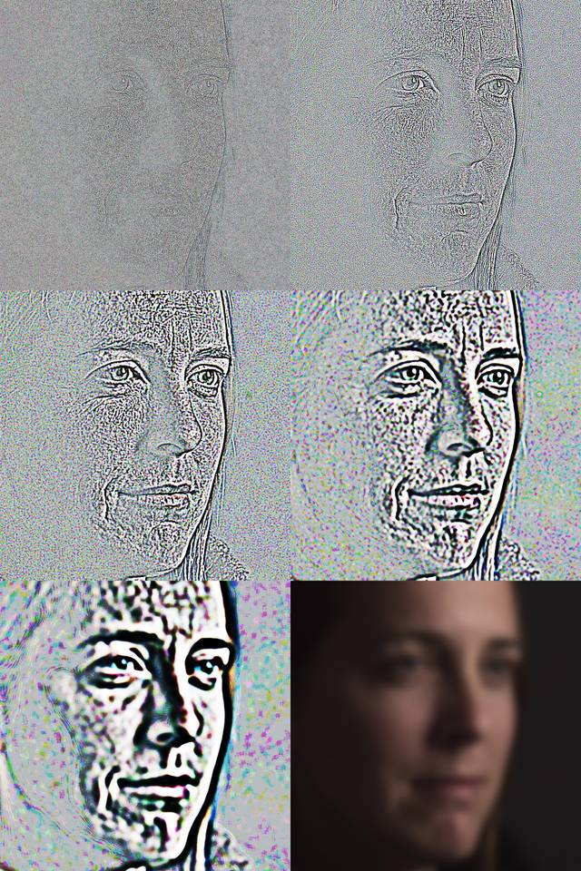
</figure>

The normalized view shows clearly the various types of detail scales on each layer.

There are various types of changes that can be made to the final image from these details scales.  In this image, we are going to focus on evening out the skin tones overall.  The scales with the biggest impact on even skin tones for this image are 4 and 5.

A good workflow when smoothing overall skin tones and using wavelet scales is to work on smoothing from the largest detail scales and working down to finer scales.  Usually, a nice amount of pleasing tonal smoothing can be accomplished in the first couple of coarse detail scales.

#### Skin Retouching Zones

Different portions of a face will often require different levels of smoothing.  Below is a rough map of facial contours to consider when retouching.  Not all faces will require the exact same regions, but it is a good starting point to consider when approaching a new image.

<figure>
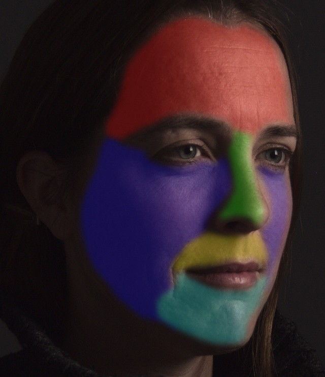
</figure>

The selections are made with the Free Select Tool with the “Feather edges” option on and set to roughly 30px.

#### Smoothing

A good starting point to consider is the forehead on the largest detail scale (5).  The basic workflow is to select a region of interest and a layer of detail, then to suppress the features on that detail level.  The method of suppressing features is a matter of personal taste but is usually done across the entire selection using a blur filter of some sort.

A good first choice would be to use a gaussian blur (or Selective Gaussian Blur) to smooth the selection.  A better choice, if G’MIC is installed, is to use a bilateral blur for its edge-preserving properties.  The rest of these examples will use the bilateral blur for smoothing.

Considering the forehead region:

<figure>
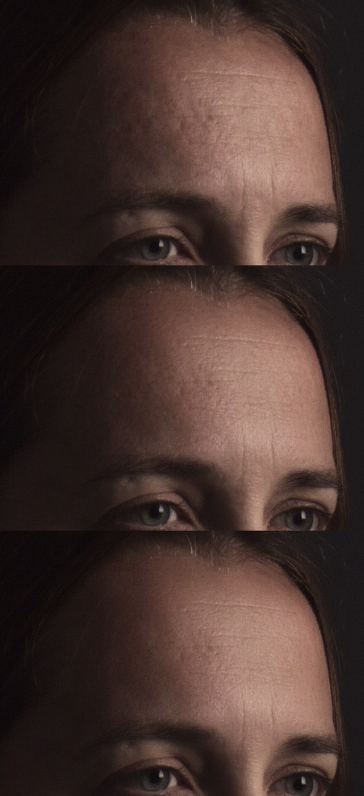
</figure>

The first image is the original.  The second image is after running a bilateral blur (in G’MIC: Smooth [bilateral]), with the default parameter values:

* Spatial variance: 10
* Value variance: 7
* Iterations: 2

These values were chosen from experience using this filter for the same purpose across many, many images.  The results of running a single blur on the largest wavelet scale is immediately obvious.  The unevenness of the skin and tones overall are smoothed in a pleasing way, while still retaining the finer details that allow the eye to see a realistic skin texture.

The last image is the result of working on the next detail scale layer down (Wavelet scale 4), with much softer blur parameters:

* Spatial variance: 5
* Value variance: 2
* Iterations: 1

This pass does a good job of finishing off the skin tones globally.  The overall impression of the skin is much smoother than the original, but crucial fine details are all left intact (wrinkles, pores) to keep the it looking realistic.

This same process is repeated for each of the facial regions described.  In some cases the results of running the first bilateral blur on the largest scale level is enough to even out the tones (the cheeks and upper lip for example).  The chin got the same treatment as the forehead.  The process is entirely subjective, and will vary from person to person for the parameters.  Experimentation is encouraged here.

More importantly, the key word to consider while working on skin tones is **_moderation_**.  It is also important to check your results zoomed out, as this will give you an impression of the image as seen when scaled to something more web-sized.  A good rule of thumb might be: 

> “If it looks good to you, go back and reduce the effect more”.

The original vs. results after wavelet smoothing:

<figure>
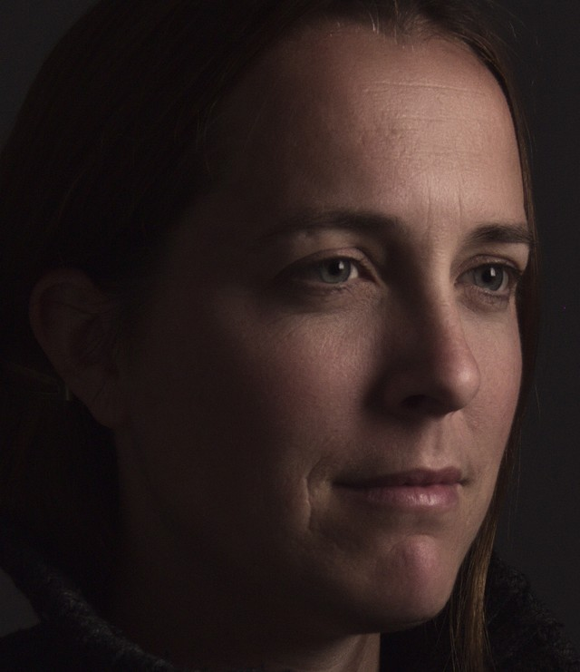
<figcaption>
Wavelet Smoothed. 
Click to compare original
</figcaption>
</figure>

<noscript>
<figure>

<figcaption>
Original
</figcaption>
</figure>
</noscript>

When the work is finished on the wavelet scales, a new layer from all of the visible layers can be created to continue touching up spot areas that may need it.

Layer → New from Visible

#### Spot Touchups

The use of wavelets is good for a large-scale selection area smoothing but a different set of tools is required for spot touchups where needed.  For example, there is a stray hair that runs across the models forehead that can be removed using the Heal tool.

For best results when using the Heal tool, use a hard edged brush.  Soft edges can sometimes lead to a slight smearing in the feathered edge of a brush that is undesirable. Due to the nature of the heal algorithm sampling, it is also advisable to avoid trying to heal across hard/contrasty edges.

This is also a good tool to use for small blemishes that might have been tedious to repair across all of the wavelet scales from the previous section.  This is also a good time to repair hot-spots, fly-away hairs, or other small details.

#### Sweater Enhancement

The model is wearing a nicely textured sweater but the details and texture are a slightly muted.  A small increase in contrast and local details will help to bring some enhancement to the textures and tones.  One method of enhancing local details would be to use the Unsharp Mask enhancement with a high radius and low amount (HiRaLoAm is an acronym some might use for this).  

Create a duplicate of the “Spot Healing” layer that was worked on in the previous step, and apply an Unsharp Mask to the layer using HiRaLoAm values.

For example, a good starting point for parameters might be:

* Radius: 200
* Amount: 0.25

With these parameters the sharpen function will instead tend to increase local contrast more, providing more “presence” or “pop” to the sweater texture.

#### Background Rebuild

The background of the image is a little too uniformly dark and could benefit from some lightening and variation.  A nice lighter background gradient will enhance the subject a little.

Normally this could be obtained through the use of a second strobe (probably gridded or with a snoot) firing at the background.  In our case we will have to fake the same result through some masking.

First, a crop is chosen to focus the composition a little stronger on the subject.  I placed the center of the models face along the right-side golden section vertical and tried to place things near the center of the frame:

<figure>
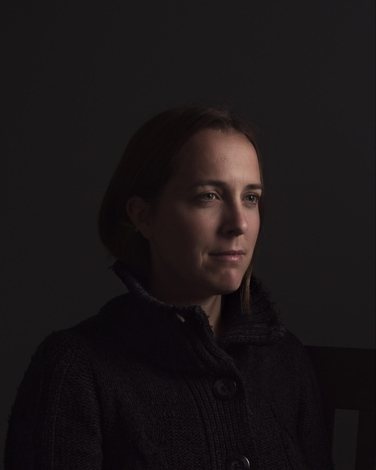
</figure>

The slight-centered crop is to emulate the type of crop that might be expected from a classical painting (thereby strengthening the overall theme of the portrait further).

#### Subject Isolation

There are a few different methods to approach the background modification.  The method I describe here is simply one of them.

The image at this point is duplicated and the duplicate has the levels raised to brighten it up considerably.  In this way, a simple layer mask can control the brightness and where it occurs in the image at this point.

<figure>
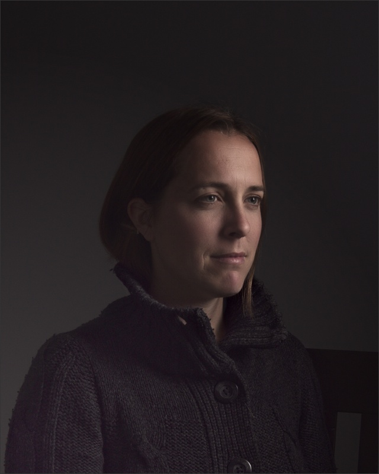
</figure>

<figure>
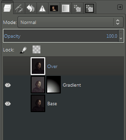
</figure>

This is what will give our background a gradient of light.  To get our subject back to dark will require masking the subject on a layer mask again.  A quick way to get a mask to work from is to add a layer mask to the “Over” layer, letting the background show through, but turning the subject opaque.

Add a layer mask to the “Over” layer as a “Grayscale copy of layer”, and check the “Invert mask” option:

<figure>
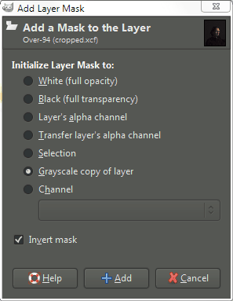
</figure>

With an initial mask in place, a quick use of the tool:

Colors &rarr; Threshold

will allow you to modify the mask to define the shoulder of the model as a good transition.  The mask will be quite narrow.  Adjust the threshold until the lighter background is speckle-free and there is a good definition of the edge of the sweater against the background.

<figure>
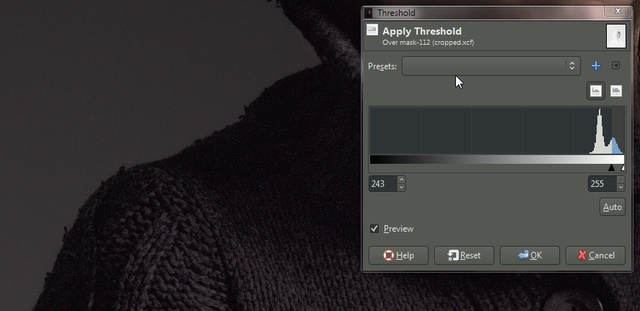
</figure>

Once the initial mask is in place it can be cleaned up further by making the subject entirely opaque (white on the mask), and the background fully transparent (black on the mask).  This can be done with paint tools easily.  For not much work a decent mask and result can be had:

<figure>
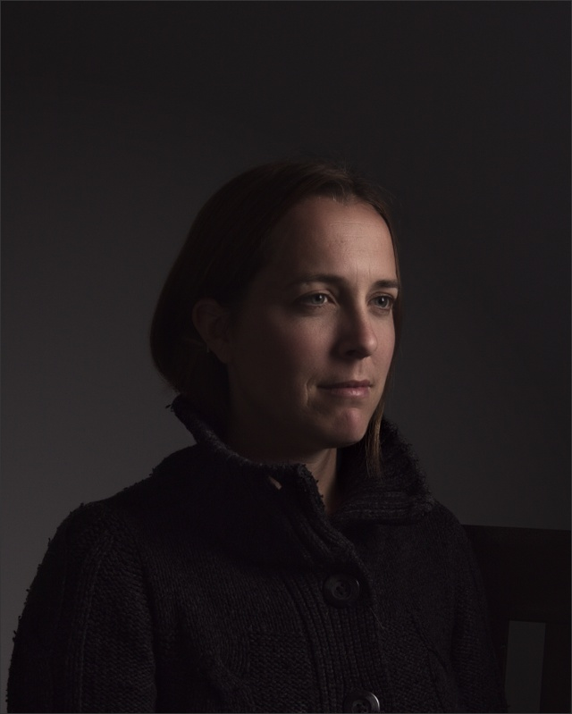
</figure>

This provides a nice contrast of the background being lighter behind the darker portions of the model and the opposite on the lighter subjects face.

#### Lighten Face Highlights

Speaking of the subjects face, there’s a nice simple method for applying a small accent on the highlighted portions of the models face in order to draw more attention to her.

Duplicate the lightened layer that was used to create the background gradient, move it to the top of the layer stack, and remove the layer mask from it.

<figure>
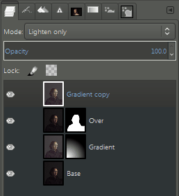
</figure>

Set the layer mode of the copied layer to “Lighten only.

As before, add a new layer mask to it, “Grayscale copy of layer”, but don’t check the “Invert mask” option.  This time use the Levels tool:

Colors → Levels

to raise the blacks of the mask up to about mid-way or more.  This will isolate the lightening mask to the brightest tones in the image that happen to correspond to the models face. You should see your adjustments modify the mask on-canvas in real-time.  When you are happy with the highlights, apply.

<figure>
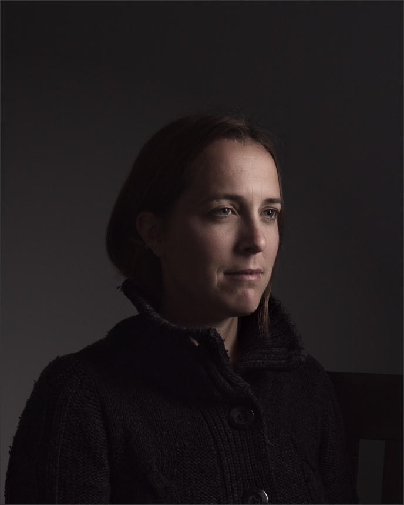
</figure>

#### Last Sharpening Pass + Grain

Finally, using I like to apply a last pass of sharpening to the image, and to overlay some grain from a grain field I have to help add some structure to the image as well as mask any gradient issues when rebuilding the background.  For this particular image the grain step isn’t really needed as there’s already sufficient luma noise to provide its own structure.

Usually, I will use the smallest of the wavelet scales from the prior steps and sometimes the next largest scale as well (Wavelet scale 1 & 2).  I’ll leave Wavelet scale 1 at 100% opacity, and scale 2 usually around 50% opacity (to taste, of course).

<figure class='big-vid'>
<a href='mairi-final.jpg'>
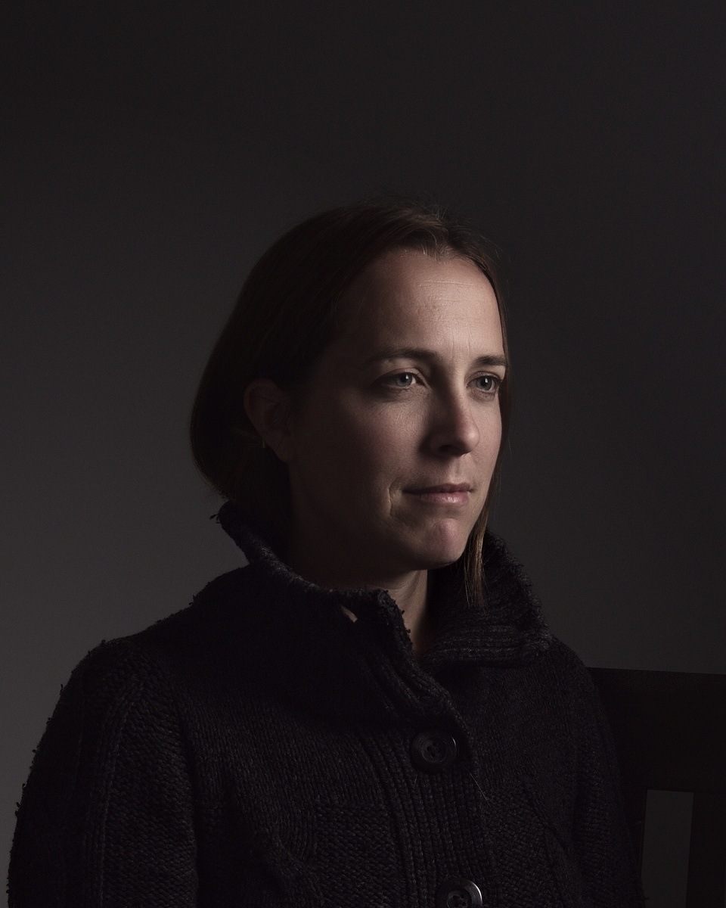
</a>
</figure>

Minor touchups that could still be done might include darkening the chair in the bottom right corner, darkening the gradient in the bottom left corner, and possibly adding a slight white overlay to the eyes to subtly give them a small pop.

As it stands now I think the image is a decent representation of a chiaroscuro portrait that mimics the style of a classical composition and interplay between light and shadows across the subject.
