This tutorial explains how to achieve an effect based on the post processing by [photographer Masashi Wakui][].  His primary subjects appear as urban landscape views of Japan where he uses some pretty and aggressive color toning to complement his scenes along with a soft 'bloom' effect on the highlights. The results evoke a strong feeling of an almost cyberpunk or futuristic aesthetic (particularly for fans of [Bladerunner][] or [Akira][]!).

[photographer Masashi Wakui]: https://www.flickr.com/photos/megane_wakui/
[Bladerunner]: http://www.imdb.com/title/tt0083658/
[Akira]: http://www.imdb.com/title/tt0094625

<figure>

</figure>

This tutorial started its life in the [pixls.us forum][], which was inspired by [a forum post][] seeking assistance on replicating the color grading and overall look/feel of Masashi's photography.

[pixls.us forum]: https://discuss.pixls.us/t/technique-inspired-by-masashi-wakui-post/2618 "Technique inspired by masashi wakui post"
[a forum post]: https://discuss.pixls.us/t/achieve-the-masashi-wakui-look/634 "Achieve the Masashi Wakui look"

## Prerequisites

To follow along will require a couple of plugins for GIMP. 

The [Luminosity Mask][] filter will be used to target color grading to specific tones. You can find out more about _luminosity masks_ in GIMP at [Pat David's blog post][lum] and his [follow-up blog post][lum2].  If you need to install the script, directions can be found (along with the scripts) at the [PIXLS.US GIMP scripts git repository][].

You will also need the [Wavelet decompose][] plugin. The easiest way to get this plugin is to use the one available in [G'MIC][]. As a bonus you'll get access to many other incredible filters as well! Once you've installed [G'MIC][] the filter can be found under  
`Details → Split details [wavelets]`.

[Luminosity Mask]: http://registry.gimp.org/node/28644
[lum]: http://blog.patdavid.net/2011/10/getting-around-in-gimp-luminosity-masks.html
[lum2]: http://blog.patdavid.net/2013/11/getting-around-in-gimp-luminosity-masks.html
[PIXLS.US GIMP scripts git repository]: https://github.com/pixlsus/GIMP-Scripts#installing-gimp-scripts-scheme-scm
[Wavelet decompose]: http://registry.gimp.org/node/11742
[G'MIC]: https://gmic.eu

We will do some basic toning and then apply Gimp's wavelet decompose filter to do some magic.
Two things will be used from the wavelet decompose results:
- the residual
- the coarsest wavelet scale (number 8 in this case)

The basic idea is to use the residual of the the wavelet decompose filter to color the image. What this does is average and blur the colors. The trick strengthens the effect of the surroundings being colored by the lights. The number of wavelet scales to use depends on the pixel size of the picture; the relative size of the coarsest wavelet scale compared to the picture is the defining parameter. The wavelet scale 8 will then produce overemphasised local contrasts, which will accentuate the lights further. This works nicely in pictures with lights as the brightest areas will be around lights. Used on daytime picture this effect will also accentuate brighter areas which will lead to a kind of "glow" effect. I tried this as well and it does look good on some pictures while on others it looks just wrong. Try it!

We will be applying all the following steps to this picture, taken in Akihabara, Tokyo.

<figure class="big-vid">
    <a href="Akihabara_original.jpg">
      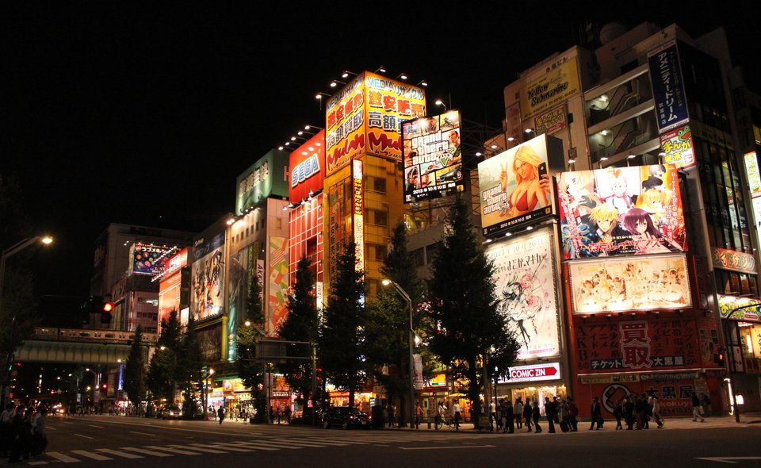
    </a>
    <figcaption>
    The starting image (<a href='Akihabara_original.jpg' title='Download the full resolution version to follow along'>download full resolution</a>).
    </figcaption>
</figure>

1. Apply the _luminosity mask_ filter to the base picture. We will use this later.

 Filters → Generic → Luminosity Masks

2. Duplicate the base picture (Ctrl+Shift+D).

 Layer → Duplicate Layer

3. Tone the shadows of the duplicated picture using the _tone curve_ by lowering the reds in the shadows. If you want your shadows to be less green, slightly raise the blues in the shadows.

 Colors → Curves
 <figure>
       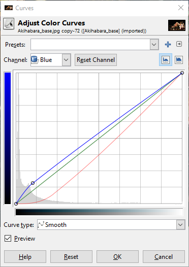
 </figure>

 <figure class="big-vid">
     <a href="Akihabara_tonedshadows.jpg">
       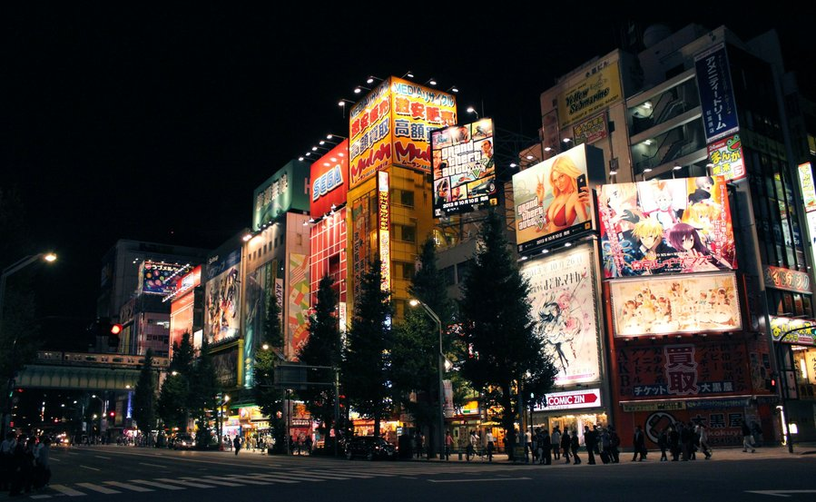
     </a>
 </figure>

4. Apply a _layer mask_ to the duplicated and toned picture. Choose the DD luminosity mask from a channel.

 Layer → Mask → Add Layer Mask
 <figure>
    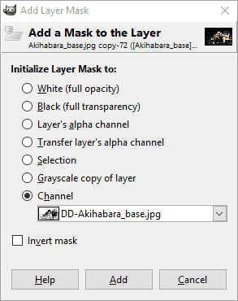
 </figure>

5. With both layers visible, create a new layer from what is visible. Call this layer the "blended" layer.

 Layer → New from Visible

 <figure class="big-vid">
     <a href="Akihabara_blended.jpg">
       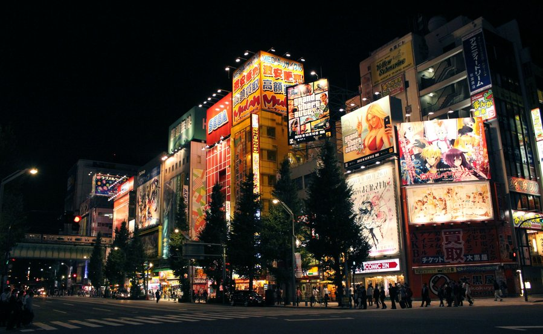
     </a>
 </figure>

6. Apply the _wavelet decompose_ filter to the "blended" layer and choose 9 as number of detail scales.  Set the G'MIC _output_ mode to "New layer(s)" (see below).

 Filters → G'MIC 
 Details → Split Details [wavelets]

 <figure class='big-vid'>
     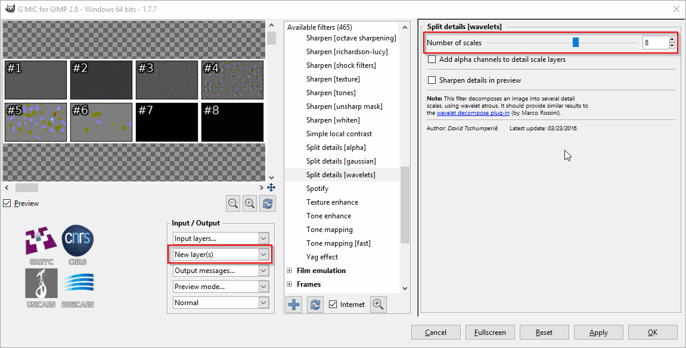
 <figcaption>
 Remember to set G'MIC to output the results on _New Layer(s)_.
 </figcaption>
 </figure>

7. Make the __blended__ and __blended [residual]__ layers visible. Then set the mode of the __blended [residual]__ layer to _color_. This will give you a picture with averaged, blurred colors.

 <figure class="big-vid">
     <a href="Akihabara_color_100.jpg">
       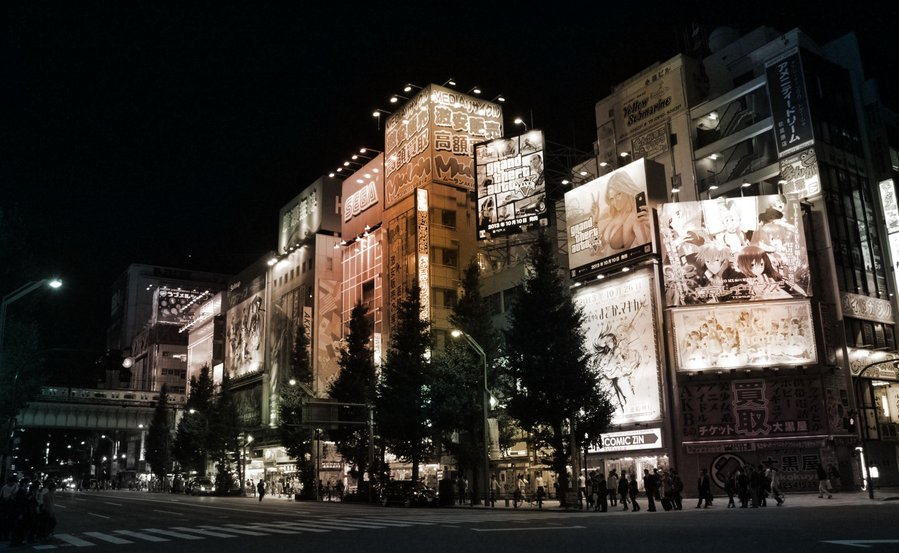
     </a>
 </figure>

8. Turn the opacity of the __blended [residual]__ down to 70%, or any other value to your taste, to bring back some color detail.

 <figure class="big-vid">
     <a href="Akihabara_color_70.jpg">
       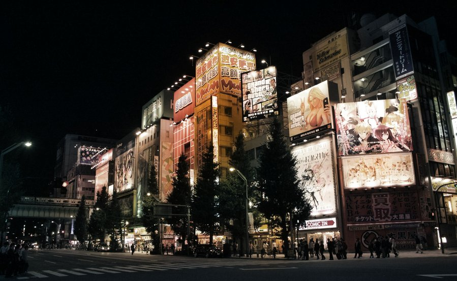
     </a>
 </figure>

9. Turn on the __blended [scale #8]__ layer, set the mode to _grain&nbsp;merge_, and see how the lights start shining. Adjust opacity to taste.

 <figure class="big-vid">
     <a href="Akihabara_scale_8.jpg">
       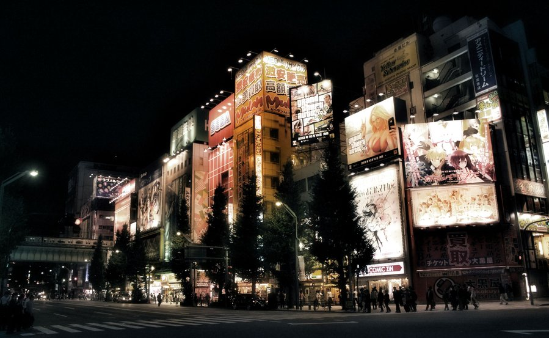
     </a>
 </figure>

10. Optional: Turn the wavelet scale 3 (or any other) on to sharpen the picture and blend to taste.

11. Make sure the following layers are visible:
    - blended
    - residual
    - wavelet scale 8
    - Any other wavelet scale you want to use for sharpening

12. Make a new layer from visible

 Layer → New from Visible

13. Raise and slightly crush the shadows using the tone curve.

 <figure>
       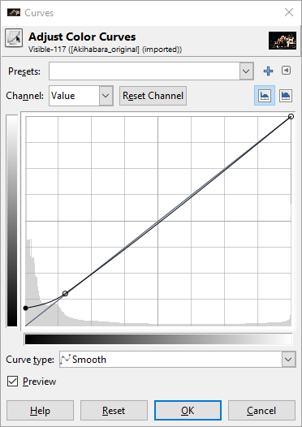
 </figure>

14. Optional: Adjust saturation to taste. If there are predominantly white lights and the
colors come mainly from other objects, the residual will be washed out, as is
the case with this picture. 

 I noticed that the reds and yellows were very dominant compared to greens and blues.  So using the **Hue-Saturation** dialog I raised the master saturation by _+70_ and lowered the yellow saturation by _-50_ and lowered the red saturation by _-40_ all using an overlap of _60_.

The final result:

<figure class="big-vid">
      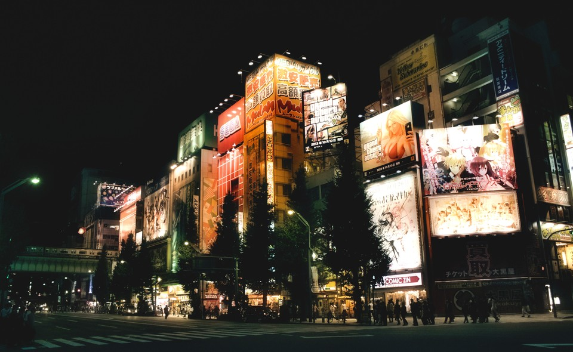
    <figcaption>
    The final result.  (Click to compare to original.) 
    <a href="Akihabara_final.jpg">Download the full size result.</a>
    </figcaption>
</figure>

