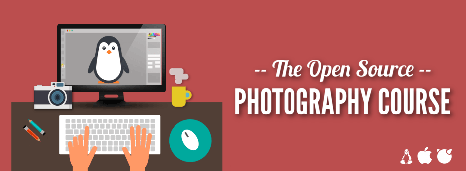
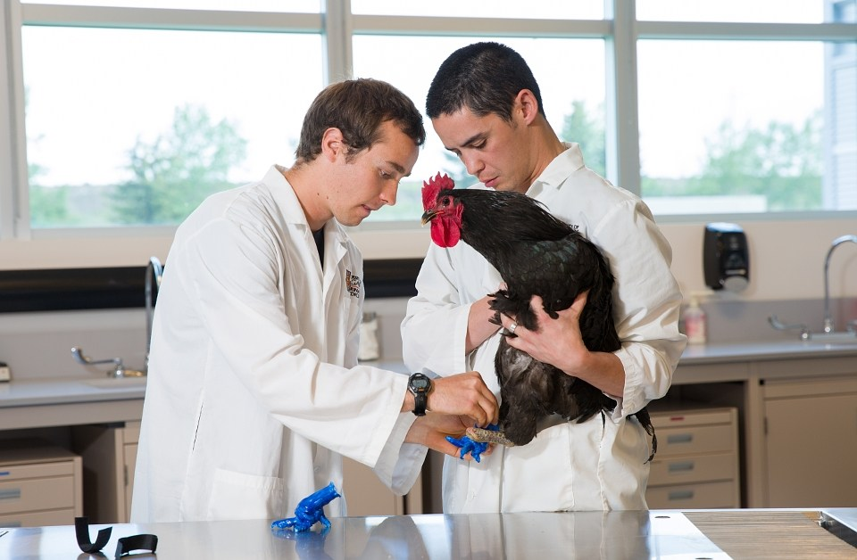
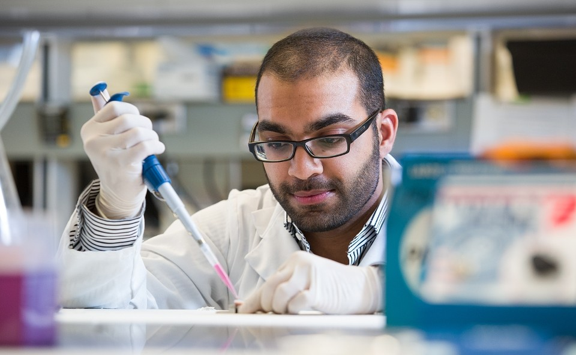
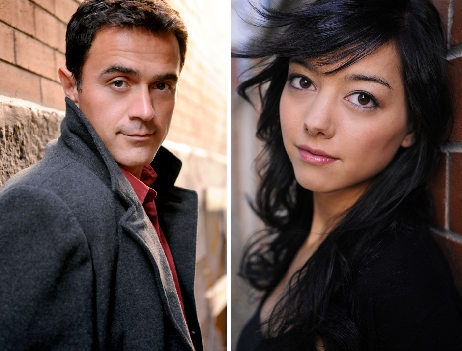
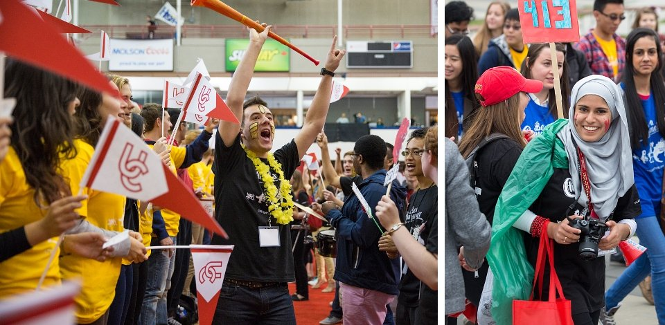

[Riley Brandt] is a full-time photographer (*and sometimes videographer*) at the [University of Calgary].
He previously worked for the weekly (Calgary) local magazine [Fast Forward Weekly (FFWD)] as well as [Sophia Models International],
and his work has been published in many places from the *Wall Street Journal* to *Der Spiegel* (and [more](http://www.rileybrandt.com/about/)).

<figure>

</figure>

He recently announced the availability of [*The Open Source Photography Course*](http://www.rileybrandt.com/lessons/).
It's a full photographic workflow course using only free, open source software that he has spent the last *ten months* putting together.

Riley has graciously offered two free copies for us to give away!  
For a chance to win, see [this blog post](/blog/2015/07/the-open-source-photography-course/).

<figure class='big-vid'>

</figure>

I was lucky enough to get a few minutes of Riley's time to ask him a few questions about his photography and this course.

## A Chat with Riley Brandt

### Tell us a bit about yourself! 

Hello, my name is Riley Brandt and I am a professional photographer at the University of Calgary. 

At work, I get to spend my days running around a university campus taking pictures of everything from a rooster with prosthetic legs made in a 3D printer, to wild students dressed in costumes jumping into freezing cold water for charity. It can be pretty awsome.

Outside of work, I am a supporter of Linux and open source software. I am also a bit of a film geek.

<figure>

<figcaption>

<small>[*ed. note: He's not kidding - That's a rooster with prosthetic legs...*]</small>
</figcaption>
</figure>

### I see you were trained in photojournalism.  Is this still your primary photographic focus?

Though I definitely enjoy portraits, fashion and lifestyle photography, my day to day work as a photographer at a university is very similar to my photojournalism days.

I have to work with whatever poor lighting conditions I am given, and I have to turn around those photos quickly to meet deadlines.

However, I recently became an uncle for the first time to a baby boy, so I imagine I will be expanding into new born and toddler photography very soon :)

<figure class='big-vid'>

<figcaption>

[Environmental Portrait](http://www.rileybrandt.com/project/enviro-portraits/) by Riley Brandt 

</figcaption>
</figure>

### How long have you been a photographer? 

Photography started as a hobby for me when I was living the Czech Republic in the late 90s and early 2000s. My first SLR camera was the classic Canon AE1 (which I still have).

I didn't start to work as a full time professional photographer until I graduated from the Journalism program at SAIT Polytechnic in 2008.

### What type of photography do you enjoy doing the most?

In a nutshell, I enjoy photographing people. This includes both portraits and candid moments at events.

I love meeting someone with an interesting story, and then trying to capture some of their personality in an image.

At events, I've witnessed everything from the joy of someone meeting an astronaut they idolize, to the anguish of a parent at graduation collecting a degree instead of their child who was killed. Capturing genuine emotion at events is challenging, and overwhelming at times, but is also very gratifying.

It would be hard for me to choose between candids or portraits. I enjoy them both.

<figure class='big-vid'>

<figcaption>

[Portraits](http://www.rileybrandt.com/project/portraits/) by Riley Brandt
</figcaption>
</figure>

### How would you describe your personal style? 

I've been told several times that my images are very “clean”. Which I think means I limit the image to only a few key elements, and remove any major distractions.

### If you had to choose your favorite image from your portfolio, what would it be? 

I don't have a favorite image in my collection.

However, at the end of a work week, I usually have at least one image that I am really happy with. A photo that I will look at again when I get home from work. An image that I look forward to seeing published. Those are my favorites.

### Has free-software always been the foundation of your workflow? 

Definitely not. I started with Adobe software, and still use it (and other non-free software) at work. Though hopefully that will change.

I switched to free software for all my personal work at home, because all my computers at home run Linux.

I also dislike at lot of Adobe's actions as a company, ie: horrible security and switching to a “cloud” version of their software which is really just a DRM scheme. 

There many significant reasons to not run non-free software, but what really motivated my switch initially was simply that Adobe never released a Linux version of their software.

### What is your normal OS/platform?

I guess I am transitioning from Ubuntu to Fedora (both GNU/Linux). My main desktop is still running Ubuntu Gnome 14.04. But my laptop is running Fedora 21.

Ubuntu doesn't offer an up to date version of the Gnome desktop environment. It also doesn't use the Gnome Software Centre or many Gnome apps. Fedora does. So my desktop will be running Fedora in the near future as well.

<figure class='big-vid'>

<figcaption>

[Lifestyle](http://www.rileybrandt.com/project/lifestyle/) by Riley Brandt
</figcaption>
</figure>

### What drove you to consider creating a free-software centric course? 

Because it was so difficult for me to transition from Adobe software to free software, I wanted to provide an easier option for others trying to do the same thing.

Instead of spending weeks or months searching through all the different manuals, tutorials and websites, someone can spend a weekend watching my course and be up and running quickly.

Also, it was just a great project to work on. I got to combine two of my passions, Linux and photography.

### Is the course the same as your own approach?

Yes, it's the same way I work. 

I start with fundamentals like monitor calibration and file management. Then onto basics like correcting exposure, color, contrast and noise. After that, I cover less frequently used tools. It's the same way I work.

### The course focuses heavily on [darktable] for RAW processing - have you also tried any of the other options such as RawTherapee? 

I originally tried [digiKam] because it looked like it had most of the features I needed. However, KDE and I are like oil and water. The user interface felt impenetrable to me, so I moved on.

I also tried [RawTherapee], but only briefly. I got some bad results in the beginning, but that was probably due to my lack of familiarity with the software. I might give it another go one day.

Once [darktable] added advanced selective editing with masks, I was all in. I like the photo management element as well.

<figure class='big-vid'>

</figure>

### Have you considered expanding your (course) offerings to include other aspects of photography? 

Umm.. not just yet. I first need to rest :)

### If you were to expand the current course, what would you like to focus on next? 

It's hard to say right now. Possibly a more in depth look at GIMP. Or a series where viewers watch me edit photos from start to finish.

### It took 10 months to create this course, will you be taking a break or starting right away on the next installment? :) 
 
A break for sure :) I spent most of my weekends preparing and recording a lesson for the past year. So yes, first a break.

### Some parting words?

 I would like to recommend the [Desktop Publishing course] created by [GIMP Magazine] editor Steve Czajka for anyone who is trying to transition from Adobe InDesign to Scribus.

I would also love to see someone create a similar course for [Inkscape].

## The Course

<figure> 

</figure>

[*The Open Source Photography Course*](http://www.rileybrandt.com/lessons/) is available for order now at [Riley's website](http://www.rileybrandt.com/).
The course is:
* Over 5 *hours* of video material
* DRM free
* 10% of net profits donated back to FOSS projects
* Available in open format (WebM/VP8) or popular (H.264), all 1080p
* $50USD 

He has also released some preview videos of the course:

<iframe width="640" height="360" src="https://www.youtube-nocookie.com/embed/TGwuMYsuAuY?list=PL33t7emXCBHkg6a6Ao_ULh7fsgWXg5ua9" frameborder="0" allowfullscreen></iframe>

From his site is a nice course outline to get a feel for what is covered:

## Course Outline

#### Chapter 1. Getting Started

1. Course Introduction   
<small>Welcome to The Open Source Photography Course</small>
2. Calibrate Your Monitor   
<small>Start your photography workflow the right way by calibrating your monitor with dispcalGUI</small>
3. File Management   
<small>Make archiving and searching for photos easier by using naming conventions and folder organization</small>
4. Download and Rename   
<small>Use Rapid Photo Downloader to rename all your photos during the download process</small>

#### Chapter 2. Raw Editing in darktable

1. Introduction to darktable, Part One   
<small>Get to know darktable’s user interface</small>
2. Introduction to darktable, Part Two   
<small>Take a quick look at the slideshow view in darktable</small>
3. Import and Tag   
<small>Import photos into darktable and tag them with keywords, copyright information and descriptions</small>
4. Rating Images   
<small>Learn an efficient way to cull, rate, add color labels and filter photos in lighttable</small>
5. Darkroom Overview   
<small>Learn the basics of the darkroom view including basic module adjustments and creating favorites</small>
6. Correcting Exposure, Part 1   
<small>Correct exposure with the base curves, levels, exposure, and curves modules</small>
7. Correcting Exposure, Part 2   
<small>See several examples of combining modules to correct an image’s exposure</small>
8. Correct White Balance   
<small>Use presets and make manual changes in the white balance module to color correct your images</small>
9. Crop and Rotate   
<small>Navigate through the many crop and rotate options including guides and automatic cropping</small>
10. Highlights and Shadows   
<small>Recover details lost in the shadows and highlights of your photos</small>
11. Adding Contrast   
<small>Make your images stand out by adding contrast with the levels, tone curve and contrast modules</small>
12. Sharpening   
<small>Fix those soft images with the sharpen, equalizer and local contrast modules</small>
13. Clarity   
<small>Sharpen up your midtones by utilizing the local contrast and equalizer modules</small>
14. Lens Correction   
<small>Learn how to fix lens distortion, vignetting and chromatic aberrations</small>
15. Noise Reduction   
<small>Learn the fastest, easiest and best way to clean up grainy images taken in low light</small>
16. Masks, Part one   
<small>Discover the possibilities of selective editing with the shape, gradient and path tools</small>
17. Masks, Part Two   
<small>Take you knowledge of masks further in this lesson about parametric masks</small>
18. Color Zones   
<small>Learn how to limit your adjustments to a specific color’s hue, saturation or brightness</small>
19. Spot Removal   
<small>Save time by making simple corrections in darktable, instead of opening up GIMP</small>
20. Snapshots   
<small>Quickly compare different points in your editing history with snapshots</small>
21. Presets and Styles   
<small>Save your favorite adjustments for later with presets and styles</small>
22. Batch Editing   
<small>Save time by editing one image, then quickly applying those same edits to hundreds of images</small>
23. Searching for Images   
<small>Learn how to sort and search through a large collection of images in Lighttable</small>
24. Adding Effects   
<small>Get creative in the effects group with vignetting, framing, split toning and more</small>
25. Exporting Photos   
<small>Learn how to rename, resize and convert you RAW photos to JPEG, TIFF and other formats</small>

#### Chapter 3. Touch Ups in GIMP

1. Introduction to GIMP   
<small>Install GIMP, then get to know your way around the user interface</small>
2. Setting Up GIMP, Part 1   
<small>Customize the user interface, adjust a few tools and install color profiles</small>
3. Setting Up GIMP, Part 2   
<small>Set keyboard shortcuts that mimic Photoshop’s and install a couple of plugins</small>
4. Touch Ups   
<small>Use the heal tool and the clone tool to clean up your photos</small>
5. Layer Masks   
<small>Learn how to make selective edits and non-destructive edits using layer masks</small>
6. Removing Distractions   
<small>Combine layers, a helpful plugin and layer masks to remove distractions from your photos</small>
7. Preparing Images for the Web   
<small>Reduce file size while retaining quality before you upload your photos to the web</small>
8. Getting Help and Finding the Community   
<small>Find out which websites, mailing lists and forums to go to for help and friendly discussions</small>

---

<small>All the images in this post &copy; [Riley Brandt].</small>

[Riley Brandt]: http://www.rileybrandt.com/
[University of Calgary]: http://www.ucalgary.ca/
[Fast Forward Weekly (FFWD)]: http://www.ffwdweekly.com/
[Sophia Models International]: http://www.sophiamodels.com/
[Desktop Publishing course]: http://gimpmagazine.org/courses/
[GIMP Magazine]: http://gimpmagazine.org/
[U. Calgary website]: http://www.ucalgary.ca/utoday/issue/2015-07-10/3d-printed-feet-allow-foghorn-rooster-walk-again
[RawTherapee]: http://rawtherapee.com/
[darktable]: http://www.darktable.org
[digiKam]: https://www.digikam.org/
[Inkscape]: https://inkscape.org
