Color has this amazing ability to evoke emotional responses from us.
From the warm glow of a sunny summer afternoon to a cool refreshing early evening in fall.
We associate colors with certain moods, places, feelings, and memories (consciously or not).

Volumes have been written on color and I am in no ways even remotely qualified to speak on it.
So I won't.

Instead, we are going to take a look at the use of the **Curves** tool in [GIMP].
Even though GIMP is used to demonstrate these ideas, the principles are generic to just about any RGB curve adjustments.

## Your Pixels and You

First there's something you need to consider if you haven't before, and that's what goes into representing a colored pixel on your screen.

<figure>
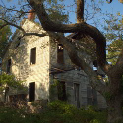
<figcaption>
Open up an image in GIMP.
</figcaption>
</figure>

<figure>
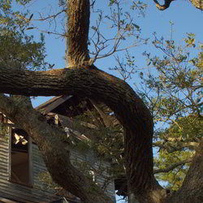
<figcaption>
Now zoom in.
</figcaption>
</figure>

<figure>
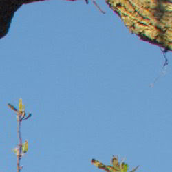
<figcaption>
Nope - don't be shy now, zoom in more!
</figcaption>
</figure>

<figure>
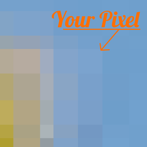
<figcaption>
Aaand there's your pixel.
So let's investigate what goes into making your pixel.
</figcaption>
</figure>

Remember, each pixel is represented by a combination of 3 colors: <b style="color:red">Red</b>, <b style="color: green;">Green</b>, and <b style="color: blue;">Blue</b>.
In GIMP (currently at 8-bit), that means that each RGB color can have a value from **0 - 255**, and combining these three colors with varying levels in each channel will result in all the colors you can see in your image.

If all three channels have a value of 255 - then the resulting color will be pure white.
If all three channels have a value of 0 - then the resulting color will be pure black.

If all three channels have the same value, then you will get a shade of gray (128,128,128 would be a middle gray color for instance).

So now let's see what goes into making up your pixel:

<figure>
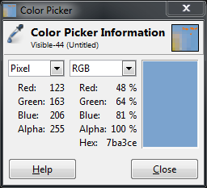
<figcaption>
The RGB components that mix into your final blue pixel.
</figcaption>
</figure>

As you can see, there is more blue than anything else (it is a blue-ish pixel after all), followed by green, then a dash of red.
If we were to change the values of each channel, but kept ratio the same between Red, Green, and Blue, then we would keep the same color and just lighten or darken the pixel by some amount.

## Curves: Value
So let's leave your pixel alone for the time being, and actually have a look at the **Curves** dialog.
I'll be using this wonderful image by <a href="http://www.flickr.com/photos/qsimple/">Eric</a> from <a href="http://www.flickr.com">Flickr</a>.

<figure>
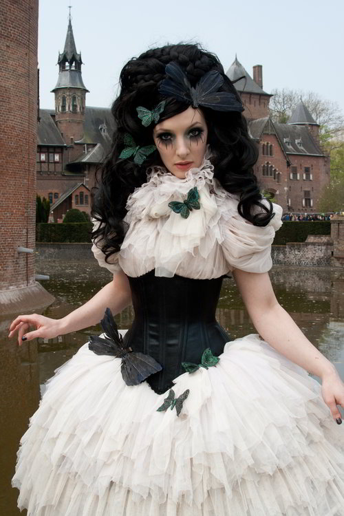
<figcaption>
<a href="http://www.flickr.com/photos/qsimple/5636649561/">Hollow Moon</a> by <a href="http://www.flickr.com/photos/qsimple/">qsimple/Eric</a> on <a href="http://www.flickr.com">Flickr</a>. (<a class='cc' href="http://creativecommons.org/licenses/by-nc-sa/2.0/">cbna</a>)
</figcaption>
</figure>

Opening up my **Curves** dialog shows me the following:

<figure>
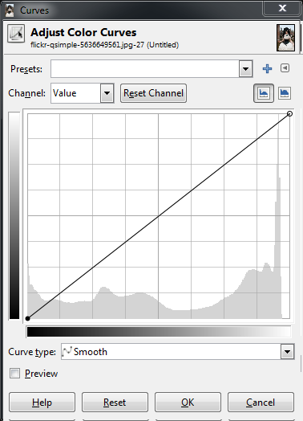
</figure>

We can see that I start off with the curve for the **Value** of the pixels.
I could also use the drop down for **"Channel"** to change to red, green or blue curves if I wanted to.
For now let's look at **Value**, though.

In the main area of the dialog I am presented with a linear curve, behind which I will see a histogram of the value data for the entire image (showing the amount of each value across my image).
Notice a spike in the high values on the right, and a small gap at the brightest values.

<figure>
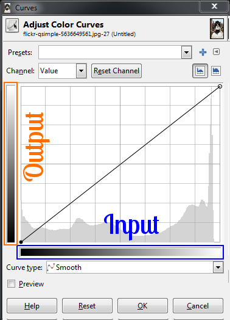
</figure>

What we can do right now is to adjust the values of each pixel in the image using this curve.
The best way to visualize it is to remember that the bottom range from black to white represents the **<i>current</i>** value of the pixels, and the left range is the value to be mapped to.

So to show an example of how this curve will affect your image, suppose I wanted to remap all the values in the image that were in the midtones, and to make them all lighter.
I can do this by clicking on the curve near the midtones, and dragging the curve higher in the Y direction:

<figure>
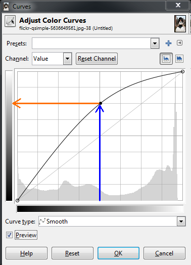
</figure>

What this curve does is takes the values around the midtones, and pushes their values to be much lighter than they were.
In this case, values around 128 were re-mapped to now be closer to 192.

Because the curve is set **Smooth**, there will be a gradual transition for all the tones surrounding my point to be pulled in the same direction (this makes for a smoother fall-off as opposed to an abrupt change at one value).
Because there is only a single point in the curve right now, this means that all values will be pulled higher.

<figure>
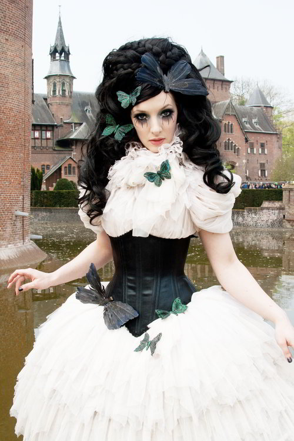
<figcaption>
The results of pushing the midtones of the value curve higher (click to compare to original).
</figcaption>
</figure>

Care should be taken when fiddling with these curves to not blow things out or destroy detail, of course.
I only push the curves here to illustrate what they do.

A very common curve adjustment you may hear about is to apply a slight "S" curve to your values.
The effect of this curve would be to darken the dark tones, and to lighten the light tones - in effect increasing global contrast on your image.
For instance, if I click on another point in the curves, and adjust the points to form a shape like so:

<figure>
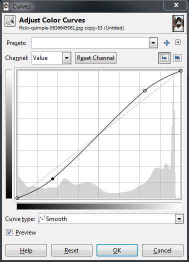
<figcaption>
A slight "S" curve
</figcaption>
</figure>

This will now cause dark values to become even darker, while the light values get a small boost.
The curve still passes through the midpoint, so middle tones will stay closer to what they were.

<figure>
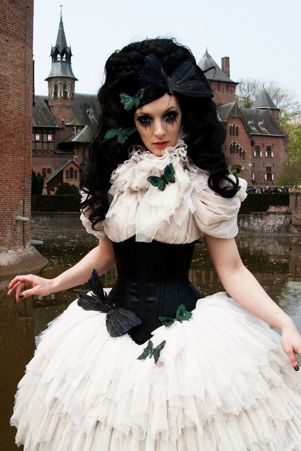
<figcaption>
Slight "S" curve increases global contrast (click for original).
</figcaption>
</figure>

In general, I find it easiest to visualize in terms of which regions in the curve will effect different tones in your image.
Here is a quick way to visualize it (that is true for value as well as RGB curves):

<figure>

</figure>

If there is one thing you take away from reading this, let it be the image above.

## Curves: Colors
So how does this apply to other channels?  Let's have a look.

The exact same theory applies in the RGB channels as it did with values.
The relative positions of the darks, midtones, and lights are still the same in the curve dialog.
The primary difference now is that you can control the contribution of color in specific tonal regions of your image.

<figure>

<figcaption>
Value, Red, Green, Blue channel picker.
</figcaption>
</figure>

You choose which channel you want to adjust from the **"Channel"** drop-down.

To begin demonstrating what happens here it helps to have an idea of generally what effect you would like to apply to your image.
This is often the hardest part of adjusting the color tones if you don't have a clear idea to start with.

For example, perhaps we wanted to "cool" down the shadows of our image.
"Cool" shadows are commonly seen during the day in shadows out of direct sunlight.
The light that does fall in shadows is mostly reflected light from a blue-ish sky, so the shadows will trend slightly more blue.  

To try this, let's adjust the <b style="color: blue;">Blue</b> channel to be a little more prominent in the darker tones of our image, but to get back to normal around the midtones and lighter.

<figure>
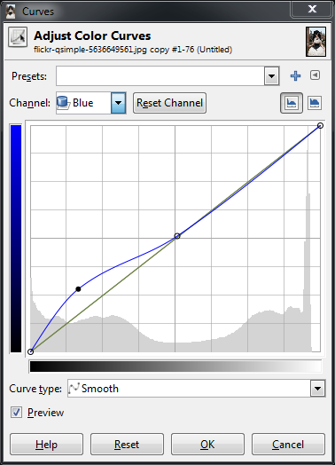
<figcaption>
Boosting blues in darker tones
</figcaption>
</figure>

<figure>
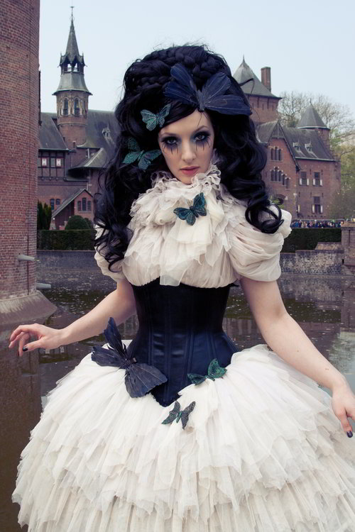
<figcaption>
Pushing up blues in darker tones (click for original).
</figcaption>
</figure>

Now, here's a question:  If I wanted to "cool" the darker tones with more blue, what if I wanted to "warm" the lighter tones by adding a little yellow?

Well, there's no "Yellow" curve to modify, so how to approach that?  Have a look at this HSV color wheel below:

<figure>

</figure>

The thing to look out for here is that opposite your blue tones on this wheel, you'll find yellow.
In fact, for each of the Red, Green, and Blue channels, the opposite colors on the color wheel will show you what an absence of that color will do to your image.
So remember:

Red &rarr; Cyan
Green &rarr; Magenta
Blue &rarr; Yellow

What this means to you while manipulating curves is that if you drag a curve for blue up, you will boost the blue in that region of your image.
If instead you drag the curve for blue down, you will be **<i>removing</i>** blues (or boosting the **Yellows** in that region of your image).

So to boost the blues in the dark tones, but increase the yellow in the lighter tones, you could create a sort of "reverse" S-curve in the blue channel:

<figure>

</figure>

<figure>
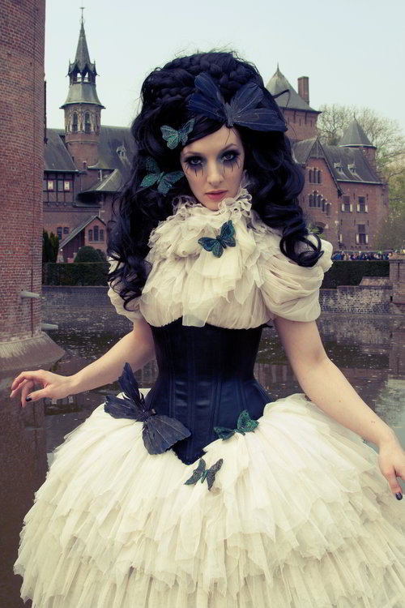
<figcaption>
Boost blues in darks, boost yellow in high tones (click for original).
</figcaption>
</figure>

In the green channel for instance, you can begin to introduce more magenta into the tones by decreasing the curve.
So dropping the green curve in the dark tones, and letting it settle back to normal towards the high tones will produce results like this:

<figure>
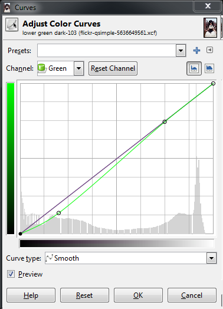
</figure>

<figure>
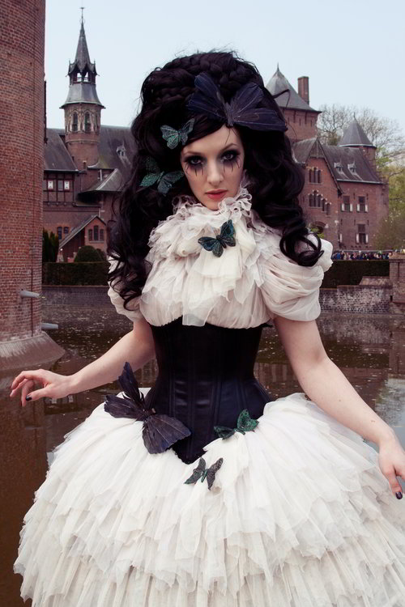
<figcaption>
Suppressing the <b style="color: green;">green</b> channel in darks/mids adds a bit of <b style="color: magenta;">magenta</b>
 (click for original).
</figcaption>
</figure>

In isolation, these curves are fun to play with, but I think that perhaps walking through some actual examples of color toning/grading would help to illustrate what I'm talking about here.
I'll choose a couple of common toning examples to show what happens when you begin mixing all three channels up.

## Color Toning/Grading

### <b style="color: orange;">Orange</b> and <b style="color: teal;">Teal</b> Hell

I use the (*cinema film*) term *color grading* here because the first adjustment we will have a look at to illustrate curves is a horrible hollywood trend that is best described by <a href="http://theabyssgazes.blogspot.com/2010/03/teal-and-orange-hollywood-please-stop.html" target="_blank">Todd Miro on his blog</a>.

*Grading* is a term for color toning on film, and Todd's post is a funny look at the prevalence of orange and teal in modern film palettes.
So it's worth a look just to see how silly this is (and hopefully to raise awareness of the obnoxiousness of this practice).

The general thought here is that caucasian skin tones trend towards orange, and if you have a look at a complementary color on the color wheel, you'll notice that directly opposite orange is a teal color.

<figure>
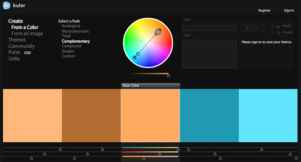
<figcaption>
Screenshot from <a href="https://color.adobe.com">Kuler</a> borrowed from Todd.
</figcaption>
</figure>

If you don't already know about it, Adobe has online a fantastic tool for color visualization and palette creation called [~~Kuler~~](http://kuler.adobe.com) [**Adobe Color CC**](https://color.adobe.com).
It lets you work on colors based on some classic rules, or even generate a color palette from images.
Well worth a visit and a fantastic bookmark  for fiddling with color.

So a quick look at the desired effect would be to keep/boost the skin tones into a sort of orange-y pinkish color, and to push the darker tones into a teal/cyan combination.
(Colorists on films tend to use a Lift, Gamma, Gain model, but we'll just try this out with our curves here).

Quick disclaimer - I am purposefully exaggerating these modifications to illustrate what they do.
Like most things, moderation and restraint will go a long ways towards not causing your viewers eyeballs to bleed.
_Remember - **light touch!**_

So I know that I want to see my skin tones head into an orange-ish color.
In my image the skin tones are in the upper mids/low highs range of values, so I will start around there.

<figure>
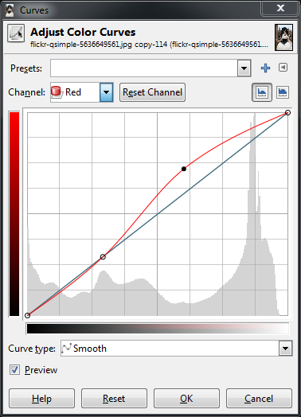
</figure>

What I've done is put a point around the low midtones to anchor the curve closer to normal for those tones.
This lets me fiddle with the red channel and to isolate it roughly to the mid and high tones only.
The skin tones in this image in the red channel will fall toward the upper end of the mids, so I've boosted the reds there.
Things may look a little weird at first:

<figure>

</figure>

If you look back at the color wheel again, you'll notice that between red and green, there is a yellow, and if you go a bit closer towards red the yellow turns to more of an orange.
What this means is that if we add some more green to those same tones, the overall colors will start to shift towards an orange.

So we can switch to the green channel now, put a point in the lower midtones again to hold things around normal, and slightly boost the green.
Don't boost it all the way to the reds, but about 2/3rds or so to taste.

<figure>
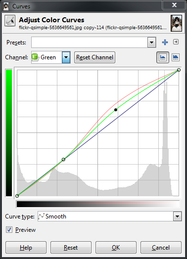
</figure>

<figure>
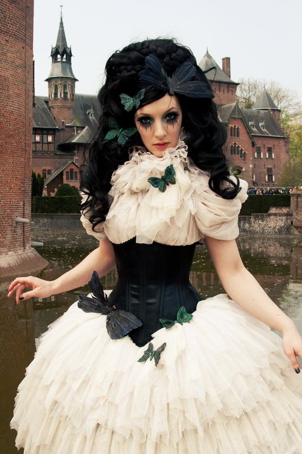
</figure>

This puts a little more red/orange-y color into the tones around the skin.
You could further adjust this by perhaps including a bit more yellow as well.
To do this, I would again put an anchor point in the low mid tones on the blue channel, then slightly drop the blue curve in the upper tones to introduce a bit of yellow.

<figure>
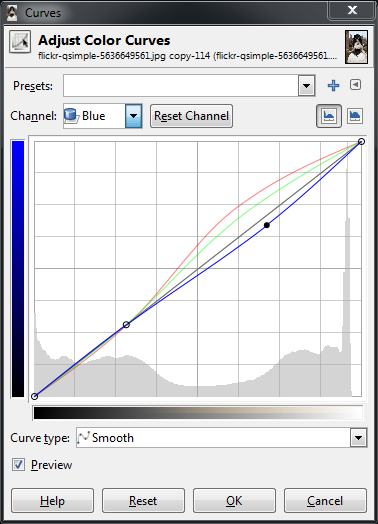
</figure>

<figure>

</figure>

Remember, we're experimenting here so feel free to try things out as we move along.
I may consider the upper tones to be finished at the moment, and now I would want to look at introducing a more blue/teal color into the darker tones.

I can start by boosting a bit of blues in the dark tones.
I'm going to use the anchor point I already created, and just push things up a bit.

<figure>
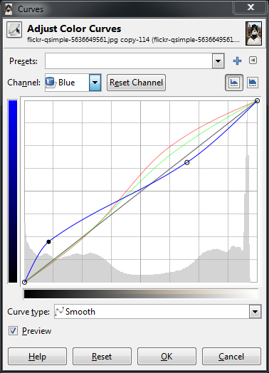
</figure>

<figure>

</figure>

Now I want to make the darker tones a bit more teal in color.
Remember the color wheel - <b style="color: teal;">teal</b> is the absence of red - so we will drop down the red channel in the lower tones as well.

<figure>
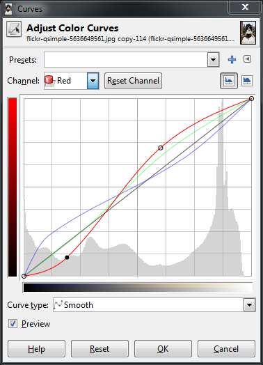
</figure>

<figure>
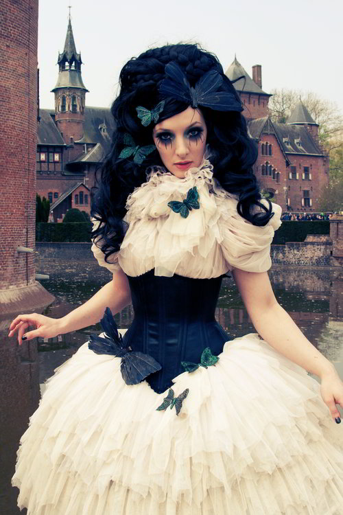
</figure>

And finally to push a very slight magenta into the dark tones as well, I'll push down the green channel a bit.

<figure>
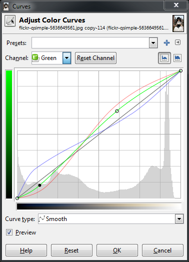
</figure>

<figure>
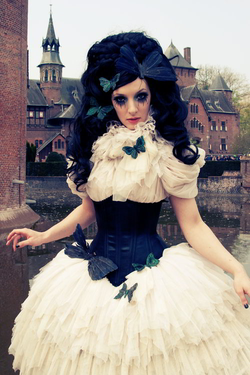
</figure>

If I wanted to go a step further, I could also put an anchor point up close to the highest values to keep the brightest parts of the image closer to a white instead of carrying over a color cast from our previous operations.  

If your previous operations also darkened the image a bit, you could also now revisit the **Value** channel, and make modifications there as well.
In my case I bumped the midtones of the image just a bit to brighten things up slightly.

<figure>
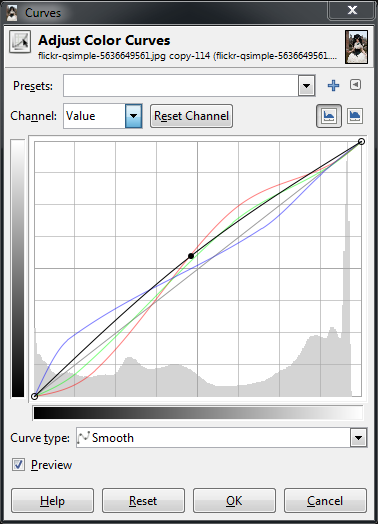
</figure>

Finally to end up at something like this.

<figure>
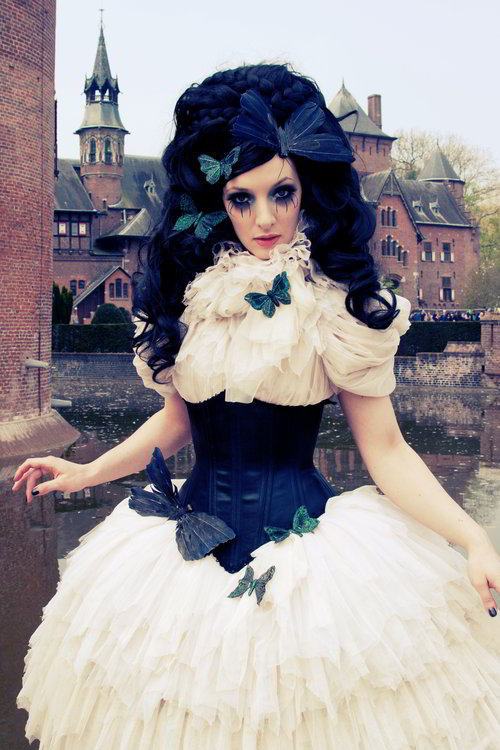
<figcaption>
After fooling around a bit - disgusting, isn't it?
 (click for original).
</figcaption>
</figure>

I am exaggerating things here to illustrate a point.
Please don't do this to your photos. :)

If you'd like to download the curves file of the results we reached above, get it here:  
[Orange Teal Hell Color Curves](https://docs.google.com/open?id=0B21lPI7Ov4CVdmJnOXpkQjN4aWc)

## Conclusion

Remember, think about what the color curves represent in your image to help you achieve your final results.
Begin looking at the different tonalities in your image and how you'd like them to appear as part of your final vision.

For even more fun - realize that the colors in your images can help to evoke emotional responses in the viewer, and adjust things accordingly.
I'll leave it as an exercise for the reader to determine some of the associations between colors and different emotions.

[GIMP]: http://www.gimp.org
