In my previous post on [Color Curves for Toning/Grading](/articles/basic-color-curves/), I looked at the basics of what the Curves dialog lets you do in [GIMP].
I had been meaning to revisit the subject with a little more restraint (the color curve in that post was a little rough and gross, but it was for illustration so I hope it served its purpose).

This time I want to look at the use of curves a little more carefully.
You'd be amazed at the subtlety that gentle curves can produce in toning your images.
Even small changes in your curves can have quite the impact on your final result.
For instance, have a look at the four film emulation curves created by <a href="http://www.prime-junta.net/pont/How_to/100_Curves_and_Films/_Curves_and_films.html">Petteri Sulonen</a> (if you haven't read his page yet on creating these curves, it's well worth your time):

<figure>
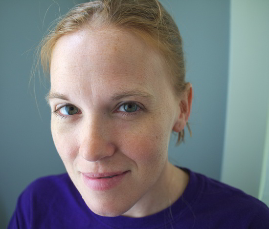
<figcaption>
Original
</figcaption>
</figure>

<figure>
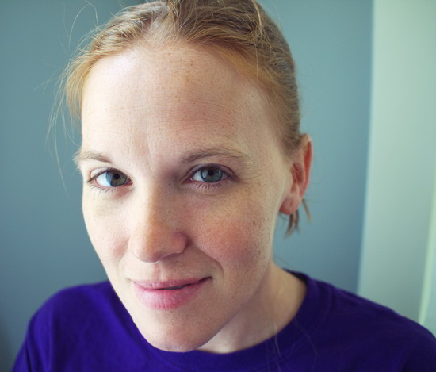
<figcaption>
Portra*esque* (Kodak Portra NC400 Film)
</figcaption>
</figure>

<figure>
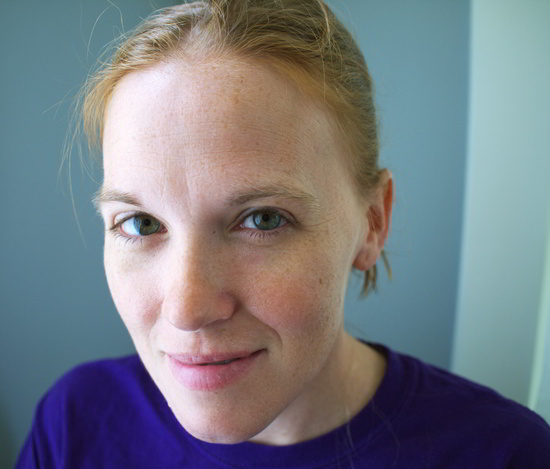
<figcaption>
Provia*esque* (Fujichrome Provia)
</figcaption>
</figure>

<figure>
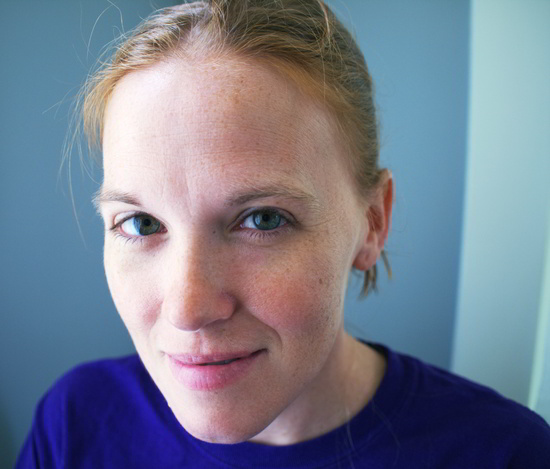
<figcaption>
Velvia*esque* (Fujichrome Velvia)
</figcaption>
</figure>

<figure>
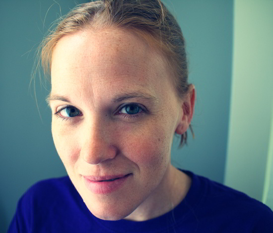
<figcaption>
Crossprocess (E6 slide film in C-41 neg. processing)
</figcaption>
</figure>

I can't thank Petteri enough for releasing these curves for everyone to use (for us GIMP users, there is a .zip file at the bottom of his post that contains these curves packaged up).
Personally I am a huge fan of the Portra*esque* curve that he has created.
If there is a person in my images, it's usually my go-to curve as a starting point.
It really does generate some wonderful skin tones overall.

The problem in generating these curves is that one has to be very, very familiar with the characteristics of the film stocks you are trying to emulate.
I never shot Velvia personally, so it is hard for me to have a reference point to start from when attempting to emulate this type of film.

What we can do, however, is to use our personal vision or sense of aesthetic to begin toning our images to something that we like.  GIMP has some great tools for helping us to become more aware of color and the effects of each channel on our final image.  That is what we are going to explore...

Disclaimer

I cannot stress enough that what we are approaching here is an entirely subjective interpretation of what is pleasing to our own eyes.  Color is a very complex subject and deserves study to really understand.  Hopefully some of the things I talk about here will help pique your interest to push further and experiment!
 
There is no right or wrong, but rather what you find pleasing to your own eye.

## Approximating Tones

What we will be doing is using **Sample Points** and the **Curves** dialog to modify the color curves in my image above to emulate something else.  It could be another photograph, or even a painting.

I'll be focusing on the skin tones, but the method can certainly be used for other things as well.

<figure>

<figcaption>
My wonderful model.
</figcaption>
</figure>

With an image you have, begin considering what you might like to approximate the tones on.  For instance, in my image above I want to work on the skin tones to see where it leads me.

Now find an image that you like, and would like to approximate the tones from.  It helps if the image you are targeting already has tones *somewhat* similar to what you are starting with (for instance, I would look for another Caucasian image with similar tones to start from, as opposed to Asian).  Keeping tones at least similar will reduce the violence you'll do to your final image.

So for my first example, perhaps I would like to use the knowledge that the Old Masters already had in regards to color, and would like to emulate the skin tones from Vermeer's *Girl with the Pearl Earring*.

<figure>

<figcaption>
<a href="http://en.wikipedia.org/wiki/Johannes_Vermeer">Johannes Vermeer</a> - <a href="http://en.wikipedia.org/wiki/Girl_with_a_Pearl_Earring">The Girl With The Pearl Earring (1665)</a>
</figcaption>
</figure>

In GIMP I will have my original image already opened, and will then open my target image as a new layer.  I'll pull this layer to one side of my image to give me a view of the areas I am interested in (faces and skin).

<figure>
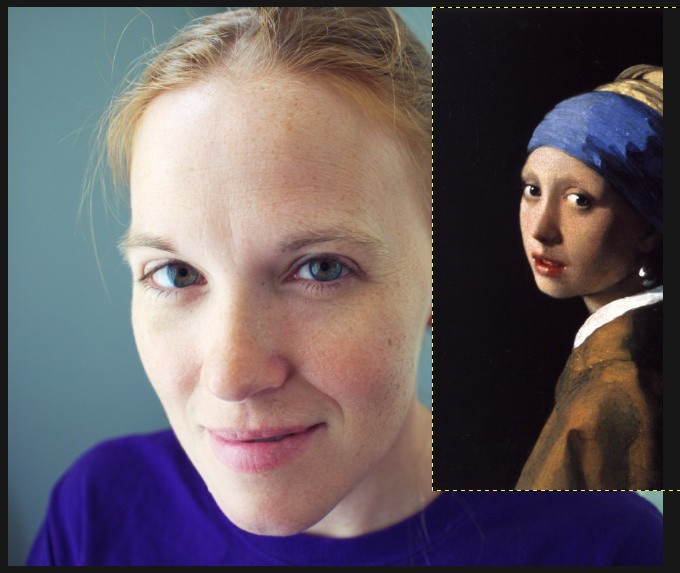
</figure>

I will be using <a href="http://docs.gimp.org/en/gimp-sample-point-dialog.html">**Sample Points**</a> extensively as I proceed.  Read up on them if you haven't used them before.  They are basically a means of giving you real-time feedback of the values of a pixel in your image (you can track up to four points at one time).

I will put a first sample point somewhere on the higher skin tones of my base image.  In this case, I will put one on my models forehead (we'll be moving it around shortly, so somewhere in the neighborhood is fine).

<figure>
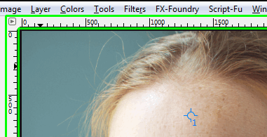
</figure>

**Ctrl + Left Click** in the ruler area of your main window (shown in green above), and drag out into your image.  There should be crosshairs across your entire image screen showing you where you are dragging.

When you release the mouse button, you've dropped a **Sample Point** onto your image.  You can see it in my image above as a small crosshair with the number **1** next to it.

GIMP <i>should</i> open the sample points dialog for you when you create the first point, but if not you can access it from the image menu under:

Windows → Dockable Dialogs → Sample Points

<figure>
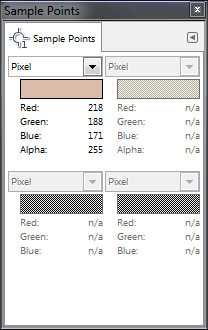
</figure>

This is what the dialog looks like.
You can see the RGB pixel data for the first sample point that I have already placed.
As you place more sample points, they will each be reflecting their data on this dialog.

You can go ahead and place more sample points on your image now.  I'll place another sample point, but this time I will put it on my target image where the tones seem similar in brightness.

<figure>
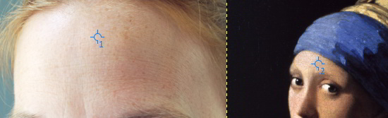
</figure>

What I'll then do is change the data being shown in the **Sample Points** dialog to show HSV data instead of Pixel data.

<figure>
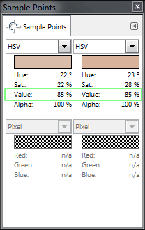
</figure>

Now, I will shoot for around 85% value on my source image, and try to find a similar value level in similar tones from my target image as well.  Once you've placed a sample point, you can continue to move it around and see what types of values it gives you.  (If you use another tool in the meantime, and can no longer move just the sample point - you can just select the **Color Picker Tool** to be able to move them again).

Move the points around your skin tones until you get about the same **Value** for both points.

Once you have them, make sure your original image layer is active, then start up the curves dialog.

Colors → Curves...

Now here is something really handy to know while using the Curves dialog: if you hover your mouse over your image, you'll notice that the cursor is a dropper - you can click and drag on an area of your image, and the corresponding value will show up in your curves dialog for that pixel (or averaged area of pixels if you turn that on).  

So click and drag to about the same pixel you chose in your original image for the sample point.

<figure>
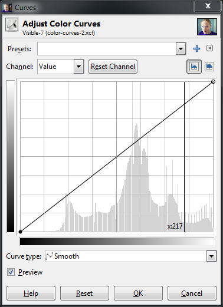
<figcaption>
Curves dialog with a value point (217) for my sampled pixel.
</figcaption>
</figure>

Here is what my working area currently looks like:

<figure class='big-vid'>
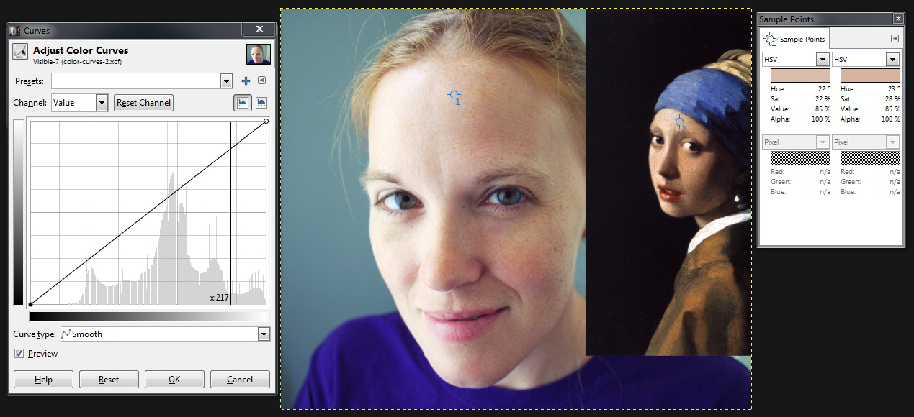
</figure>

I have my curves dialog open, and an area around my sample point chosen so that the values will be visible in the dialog, my images with their associated sample points, and the sample points dialog showing me the values of those points.

The basic idea now is to adjust my RGB channels to get my original image sample point (#1) to match my target image sample point (#2).

Because I selected an area around my sample point with the curves dialog open, I will know roughly where those values need to be adjusted.  Let's start with the <b style="color: #FF0000;">Red</b> channel.

First, set the **Sample Points** dialog back to **<i>Pixel</i>** to see the RGBA data for that pixel.

<figure>
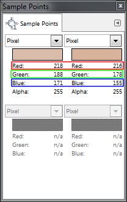
</figure>

We can now see that to match the pixel colors we will need to make some adjustments to each channel.  Specifically, 

the <b style="color: #ff0000">Red</b> channel will have to come down a bit (218 → 216), 

the <b style="color: #00ff00">Green</b> down some as well (188 → 178), 

and <b style="color: #0000ff">Blue</b> much more (171 → 155).

You may want to resize your **Curves** dialog window larger to be able to more finely control the curves.  If we look at the Red channel in my example, we would want to adjust the curve down slightly at the vertical line that shows us where our pixel values are:

<figure>
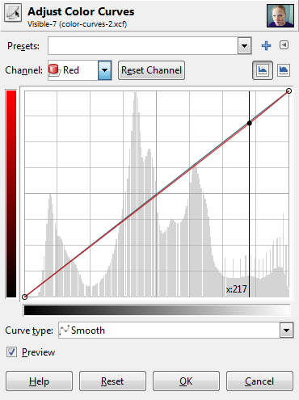
</figure>

We can adjust the red channel curve along this vertical axis (marked x:217) until our pixel red value matches the target (216).

Then just change over to the green channel and do the same:

<figure>
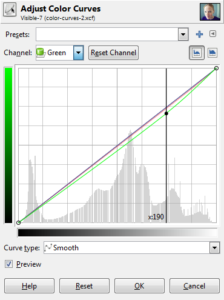
</figure>

Here we are adjusting the green curve vertically along the axis marked x:190 until our pixel green value matches the target (178).

Finally, follow the same procedure for the blue channel:

<figure>
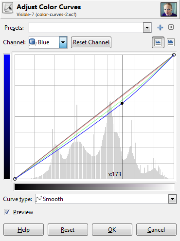
</figure>

As before, we adjust along the vertical axis x:173 until our blue channel matches the target (155).

At this point, our first sample point pixel should be the same color as from our target.

The important thing to take away from this exercise is to be watching your image as you are adjusting these channels to see what types of effects they produce.  Dropping the green channel should have seen a slight addition of magenta to your image, and dropping the blue channel should have shown you the addition of a yellow to balance it.

Watch your image as you make these changes.

_**Don't** hit *OK* on your curves dialog yet!_

You'll want to repeat this procedure, but using some sample points that are darker than the previous ones.  Our first sample points had values of about 85%, so now let's see if we can match pixels down below 50% as well.

*Without* closing your curves dialog, you should be able to click and drag your sample points around still.  So I would set your **Sample Points** dialog to show you HSV values again, and now drag your first point around on your image until you find some skin that's in a darker value, maybe around 40-45%.

Once you do, try to find a corresponding value in your target image (or something close at least).

I managed to find skin tones with values around 45% in both of my images:

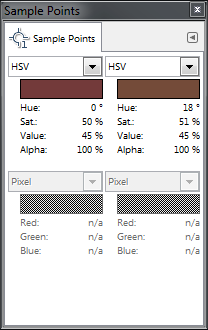
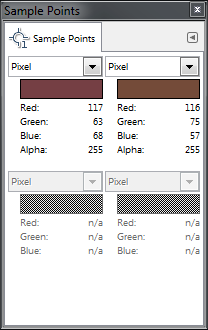

In these darker tones, I can see that the adjustments I will have to make are for:

<b style="color: #ff0000">Red</b> down a bit (116 → 114),

<b style="color: #00ff00">Green</b> bumped up some (60 → 73),

<b style="color: #0000ff">Blue</b> slightly down (55 → 53).

With the curves dialog still active, I then click and drag on my original image until I am in the same area as my sample point again.  This give me my vertical line showing me the value location in my curves dialog, just as before:

<figure>
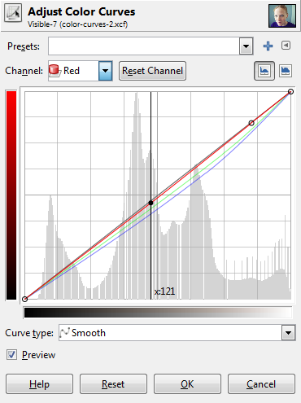
<figcaption>
<b style="color: #FF0000">Red</b> down to 114.
</figcaption>
</figure>

<figure>
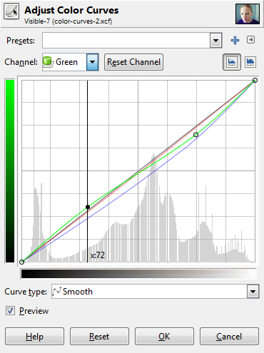
<figcaption>
<b style="color: #00FF00;">Green</b> up to 73.
</figcaption>
</figure>

<figure>
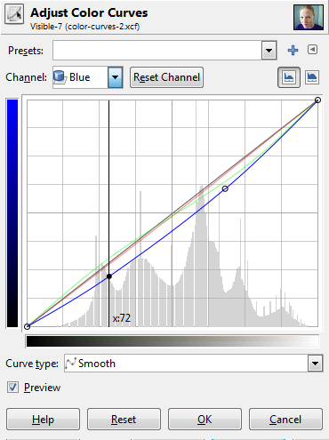
<figcaption>
<b style="color: #0000FF">Blue</b> down to 53.
</figcaption>
</figure>

At this point you <i>should</i> have something similar to the tones of your target image.  Here is my image after these adjustments so far:

<figure>
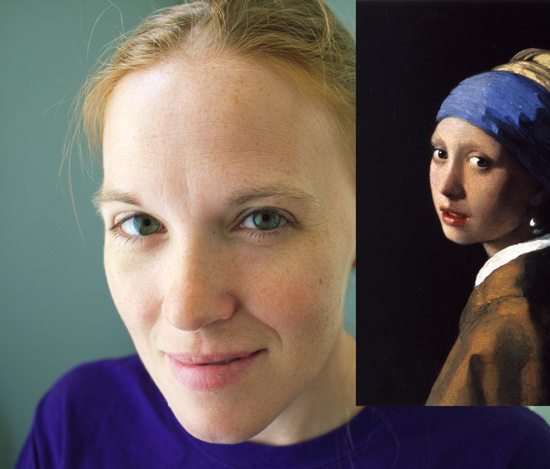
<figcaption>
Effects of the curves so far (click to compare to original).
</figcaption>
</figure>

Once you've got things in a state that you like, it would be a good idea to save your progress.
At the top of the Curves dialog there is a **"+"** symbol.
This will let you add the current settings to your favorites.
This will allow you to recall these settings later to continue working on them.

**However**, you're results might not quite look right at the moment.  So why not?

Well, the first problem is that **Sample Points** will only allow you to sample a single pixel value.  There's a chance that the pixels you pick are not truly representative of the correct skin tones in that range (for instance you may have inadvertently clicked a pixel that represents the oil paint cracks in the image).  It would be nice if there were an option for Sample Points to allow an adjustable sample radius (if there is an option I haven't found it yet).

The second issue is that similar value points might be very different colors overall.  Hopefully your sources will be nice for you to pick in areas that you know are relatively consistent and representative of the tones you want, but it's not always a guarantee.

If the results are not quite what you want at the moment, you can do what I will sometimes do and go back to the beginning...

While still keeping the curves dialog open you can pull your sample points to another location, and match the target again.  Try choosing another sample point with a similar value as the first one.  This time instead of adding new points the curve as you make adjustments, just drag the existing points you previously placed.

## It's an Iterative Process

Depending on how interested you are in tweaking your resulting curve, you may find yourself going around a couple of times.  That's ok.

<figure>
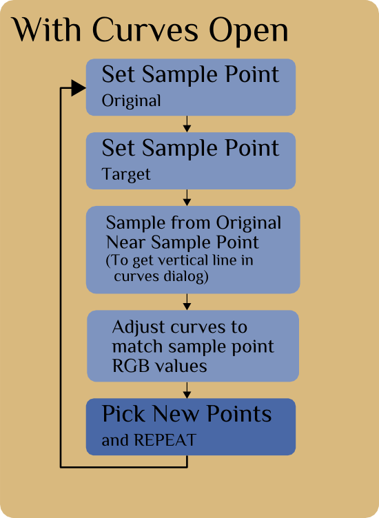
</figure>

I would recommend keeping your curves to having two control points at first.  You want your curves to be smooth across the range (any abrupt changes will do strange things to your final image).

If you are doing a couple of iterations, try modifying existing points on your curves instead of adding new ones.  <b style="font-size:1.3em;"><i>It may not be an exact match</i></b>, but it doesn't have to be.  It only needs to look nice to your eyes.

There won't be a perfect solution for a perfect color matching between images, but we can produce pleasing curves that emulate the results we are looking for.

## In Conclusion

I personally have found the process of doing this with different images to be quite instructive in how the curves will affect my image.
If you try this out and pay careful attention to what is happening while you do it, I'm hopeful you will come away with a similar appreciation of what these curves will do.

Most importantly, don't be constrained by what you are targeting, but rather use it as a stepping off point for inspiration and experimentation for your own expression!

I'll finish with a couple of other examples...

<figure>
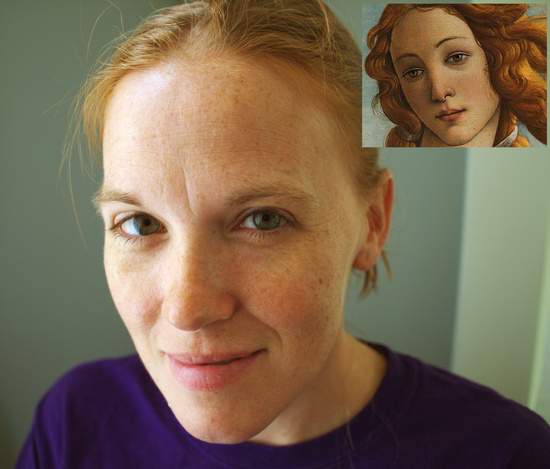
<figcaption>
[Sandro Botticelli](http://en.wikipedia.org/wiki/Sandro_Botticelli) - [*The Birth of Venus*](http://en.wikipedia.org/wiki/The_Birth_of_Venus_(Botticelli)) (click to compare to original)
</figcaption>
</figure>

<figure>
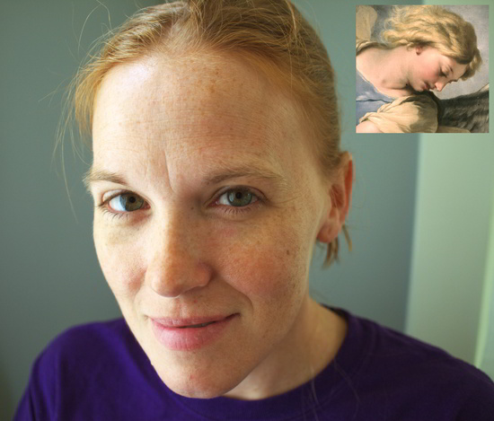
<figcaption>
[Fa Presto - St. Michael](http://www.googleartproject.com/collection/gemaldegalerie-staatliche-museen-zu-berlin/artwork/st-michael-fa-presto/320372/) (click to compare original)
</figcaption>
</figure>

And finally, as promised, here's the video tutorial that steps through everything I've explained above:

<iframe width="560" height="315" src="https://www.youtube.com/embed/rVfIuYV5Ghs" frameborder="0" allowfullscreen=""></iframe>

From a request, I've packaged up some of the curves from this tutorial (Pearl Earring, St. Michael, the previous Orange/Teal Hell, and another I was playing with from a Norman Rockwell painting): 

[Download the Curves (7zip .7z)](https://docs.google.com/open?id=0B21lPI7Ov4CVT1gyVlpvc3psWVU)

[GIMP]: http://www.gimp.org
