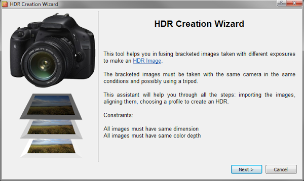

I have a mostly love/hate relationship with HDR images (well, tonemapping HDR more than the HDR themselves).
I think the problem is that it's very easy to create really bad HDR images that the photographer _thinks look really good_.
I know because I've been there:

<figure>

<figcaption>Don't judge me, it was a weird time in my life...</figcaption>
</figure> 

The best term I've heard used to describe over-processed images created from an HDR is <i>"clown vomit" </i>(which would also be a great name for a band, by the way).
They are easily spotted with some tell-tale signs such as the halos at high-contrast edges, the unrealistically hyper-saturated colors that make your eyes bleed, and a general affront to good taste.
In fact, while I'm putting up embarrassing images that I've done in the past, here's one that scores on all the points for a crappy image from an HDR:

<figure>

<figcaption><a target="_blank" href="http://www.youtube.com/watch?v=juFZh92MUOY">“My Eyes! The goggles do nothing!”</a></figcaption>
</figure> 

Crap-tastic! 
Of course, the allure here is that it provides first timers a glimpse into something new, and they feel the desire to crank every setting up to 11 with no regards to good taste or aesthetics.

If you take anything away from this post, let it be this:  **"Turn it _DOWN_"**. 
If it looks good to you, then it's too much. ;)

<!-- more -->

HDR lightprobes are used in movie fx compositing to ensure that the lighting on CG models matches exactly the lighting for a live-action scene.  By using an HDR lightprobe, you can match the lighting exactly to what is filmed.
 
 
I originally learned about, and used, HDR images when I would use them to illuminate a scene in <a href="http://www.blender.org/">Blender</a>.  In fact, I will still often use <a href="http://www.pauldebevec.com/Probes/">Paul Debevec's Uffizi gallery lightprobe</a> to light scene renders in Blender today.

For example, you may be able to record 10-12 stops of light information using a modern camera.  Some old films could record 12-13 stops of light, while your eyes can approximately see up to 14 stops.

HDR images are intended to capture *more* than this number of stops.  (Depending on your patience, significantly more in some cases).

I can go on a bit about the technical aspects of HDR imaging, but I won't.  It's boring.  Plus, I'm sure you can <a href="http://en.wikipedia.org/wiki/High-dynamic-range_imaging">use Wikipedia</a>, or <a href="http://lmgtfy.com/?q=HDR">Google </a>yourselves. :)
In the end, just realize that an HDR image is simply one where there is a greater amount of light information being stored than is able to be captured by your camera sensor in one shot.

## Taking an HDR image(s)

More light information than my camera can record in one shot?  
Then how do I take an HDR photo?

You don't.

You take multiple photos of a scene, and *combine* them to create the final HDR image.
Before I get into the process of capturing these photos to create an HDR with, consider something:

### When/Why to use HDR

An HDR image is most useful to you when the scene you want to capture has bright and dark areas that fall outside the range of a single exposure, *and you feel that there is something important enough outside that range to include in your final image*.

That last part is important, because sometimes it's OK to have some of your photo be too dark for details (or too light).  This is an aesthetic decision of course, but keep it in mind...

Here's what happens.  Say you have a pretty scene you would like to photograph.  Maybe it's the <a href="http://www.flickr.com/photos/jp_photo_online/7369521956/">Lower Chapel of Sainte Chapelle</a>:

<figure class='big-vid'>

<figcaption><a href="http://www.flickr.com/photos/jp_photo_online/7369521956/">Sainte Chapelle Lower Chapel</a> by <a href="http://www.flickr.com/photos/jp_photo_online/with/7369521956/">iwillbehomesoon</a> on Flickr (<a href='https://creativecommons.org/licenses/by-nc-sa/2.0/'>cbsna</a>)</figcaption>
</figure> 

You may setup to take the shot, but when you are setting your exposure you may run into a problem.  To expose for the brighter parts of the image means that the shadows fall to black too quickly, crushing out the details there.

If you expose for the shadows, then the brighter parts of the image quickly clip beyond white.

The use case for an HDR is when you can't find a happy medium between those two exposures.

A similar situation comes up when you want to shoot any ground details against a bright sky, but you want to keep the details in both.  Have a look at this example:

<figure class='big-vid'>

<figcaption>
<a href="http://www.flickr.com/photos/fredvdd/236863839/">HDR Layers</a> 
by <a href="http://www.flickr.com/photos/fredvdd">dontmindme</a>, on Flickr 
(<a href="https://creativecommons.org/licenses/by-nc-sa/2.0/" title="Creative Commons, BY-NC-SA">cbna</a>)
</figcaption>
</figure>

In the first column, if you expose for the ground, the sky blows out.

In the second, you can drop the exposure to bring the sky in a bit, but the ground is getting too dark.

In the third, the sky is exposed nicely, but the ground has gone to mostly black.

If you wanted to keep the details in the sky and ground at the same time, you might use an HDR (you could technically also use exposure blending with just a couple of exposures and blend them by hand, but I digress) to arrive at the last column.

### Shooting Images for an HDR
Many cameras have an auto-bracketing feature that will let you quickly shoot a number of photos while changing the exposure value (EV) of each.  You can also do this by hand simply by changing one parameter of your exposure each time.

You can technically change any of ISO, shutter speed, or aperture to modify the exposure, but **I'd recommend you change only the shutter speed** (or EV value when in Aperture Priority modes).

The reason is that changing the shutter speed will not alter the depth-of-field (DoF) of your view or introduce any extra noise the way changing the aperture or ISO would.

When considering your scene, you will also want to try to stick to static scenes if possible.
The reason is that objects that move around (swaying trees, people, cars, fast moving clouds, etc.) could end up as ghosts or mis-alignments in your final image.
So as you're starting out, choose your scene to help you achieve success.

Set up your camera someplace very steady (like a tripod), dial in your exposure and take a shot.
If you let your camera meter your scene for you then this is a good middle starting point.

For example, if you setup your camera and meter your scene, it might report a 1⁄160 second exposure.  This is our starting point (**0EV**).

<figure>

<figcaption>The base exposure, 1&frasl;160 s, 0EV</figcaption>
</figure>

To capture the lower values, just cut your shutter speed in half ( 1&frasl;80 second, +1EV), and take a photo.  Repeat if you'd like ( 1&frasl;40 second, +2EV).

<figure>

<figcaption>
1⁄80 second, +1EV (left), 1⁄40 second, +2EV (right)
</figcaption>
</figure>

To capture the upper values, just double your starting point shutter speed ( 1⁄320, -1EV) and take a photo. Repeat if you'd like again ( 1⁄640, -2EV).

<figure>

<figcaption>
1⁄320, -1EV (left), 1⁄640, -2EV (right)
</figcaption>
</figure>

This will give you 5 images covering a range of -2EV to +2EV:

<table id="EVs"><tbody><tr><th>Shutter Speed</th><th>Exposure Value</th></tr>
<tr><td>1⁄640</td><td>-2EV</td></tr>
<tr><td>1⁄320</td><td>-1EV</td></tr>
<tr><td>1⁄160</td><td>0EV</td></tr>
<tr><td>1⁄80</td><td>+1EV</td></tr>
<tr><td>1⁄40</td><td>+2EV</td></tr>
</tbody></table>

Your values don't have to be exactly 1EV each time, LuminanceHDR is usually smart enough to figure out what's going on from the EXIF data in your image - I chose full EV stops here to simplify the example.

So armed with your images, it's time to turn them into an HDR image!

## Creating an HDR Image
You kids have it too easy these days.  We used to have to bring all the images into Hugin and align them before we could save an hdr/exr file.  Nowadays you've got a phenomenal piece of Free/Open Source Software to handle this for you:

<a href="http://qtpfsgui.sourceforge.net/" style="font-size:1.5rem;">LuminanceHDR</a>  
(Previously qtpfsgui. Seriously.)

After installing it, open it up and hit "**New HDR Image**":

<figure>

</figure>

This will open up the _"HDR Creation Wizard"_ that will walk you through the steps of creating the HDR.  The splash screen notes a couple of constraints.

<figure>

</figure>

On the next screen, you'll be able to load up all of the images in your stack.  Just hit the big green "<b style="color:green; font-size:1.5em;">+</b>" button in the middle, and choose all of your images:

<figure>

</figure>

LuminanceHDR will load up each of your files, and investigate them to try and determine the EV values for each one.  It usually does a good job of this on its own, but if there a problem you can always manually specify what the actual EV value is for each image.

Also notice that because I only adjusted my shutter speed by half or double, that each of the relative EV values is neatly spaced 1EV apart.  They don't have to be, though.  I could have just as easily done &frac12; EV or &frac13; EV steps as well.

<figure>

</figure>

If there is even the remotest question about how well your images will line up, I'd recommend that you check the box for _"Autoalign images"_, and let <a href="http://hugin.sourceforge.net/">Hugin's </a>align_image_stack do it's magic.
You really need all of your images to line up perfectly for the best results.

Hit "**Next**", and if you are aligning the images be patient.
Hugin's align_image_stack will find control points between the images and remap them so they are all aligned.
When it's done you'll be presented with some editing tools to tweak the final result before the HDR is created.

<figure>

</figure>

You are basically looking at a difference view between images in your stack at the moment.  You can choose which two images to difference compare by choosing them in the list on the left.  You can now shift an image horizontally/vertically if it's needed, or even generate a ghosting mask (a mask to handle portions of an image where objects may have shifted between frames).

If you are careful, and there's not much movement in your image stacks, then you can safely click through this screen.  Hit the "**Next**" button.

<figure>

</figure>

This is the final screen of the HDR Creation Wizard.
There are a few different ways to calculate the pixel values that make up an HDR image, and this is where you can choose which ones to use.
For the most part, people far smarter than I had a look at a bunch of creation methods, and created the predefined profiles.
Unless you know what you're doing, I would stick with those.

Hit "**Finish**", and you're all done!

You'll now be presented with your HDR image in LuminanceHDR, ready to be tonemapped so us mere mortals can actually make sense of the HDR values present in the image.
At this point, I would hit the "Save As..." button, and save your work.

<figure>

</figure>

## Tonemapping the HDR

So now you've got an HDR image.  Congratulations!

The problem is, you can't really view it with your puny little monitor.

The reason is that the HDRi now contains more information than can be represented within the limited range of your monitor (and eyeballs, likely).  So we need to find a way to represent all of that extra light-goodness so that we can actually view it on our monitors.  This is where <a href="http://en.wikipedia.org/wiki/Tone_mapping">tonemapping </a>comes in.

We basically have to take our HDRi and use a method for compressing all of that radiance data down into something we can view on our monitors/prints/eyeballs.  We need to create a Low Dynamic Range (LDR) image from our HDR.

Yes - we just went through all the trouble of stacking together a bunch of LDR images to create the HDRi, and now we're going <i>back to LDR </i>?  We are - but this time we are armed with <b><i>way </i></b>more radiance data than we had to begin with!

The question is, how do we represent all that extra data in an LDR?  Well, there's quite a few different ways.  LuminanceHDR provides for 9 different tonemapping operators (TMO's) to represent your HDRi as an LDR image:

* [Mantiuk '06](#mantiuk-06)
* [Mantiuk '08](#mantiuk-08)
* [Fattal](#fattal)
* [Drago](#drago)
* [Durand](#durand)
* [Reinhard '02](#reinhard-02)
* [Reinhard '05](reinhard-05)
* [Ashikhmin](askikhmin)
* [Pattanaik](pattanaik)

Just a small reminder, there's a ton of math involved in how to map these values to an LDR image.
I'm going to skip the math.
The <a href="http://www.mpi-inf.mpg.de/resources/tmo/">references are out there</a> if you want them.

I'll try to give examples of each of the operators below, and a little comment here and there.  If you want more information, you can always check out the list on the <a href="http://osp.wikidot.com/parameters-for-photographers">Open Source Photography wikidot page</a>.

Before we get started, let's have a look at the window we'll be working in:

<figure class='big-vid'>

</figure>

Tonemap is the section where you can choose which TMO you want to use, and will expose the various parameters you can change for each TMO.  This is the section you will likely be spending most of your time, tweaking the settings for whichever TMO you decide to play with.

Process gives you two things you'll want to adjust.  The first is the size of the output that you want to create (<i>Result Size</i>).  While you are trying things out and dialing in settings you'll probably want to use a smaller size here (some operators will take a while to run against the full resolution image).  The second is any pre-gamma you want to apply to the image.  I'll talk about this setting a bit later on.

Oh, and this section also has the "Tonemap" button to apply your settings and generate a preview.  I'll also usually keep the "Update current LDR" checked while I rough in parameters.  When I'm fine-tuning I may uncheck this (it will create a new image every time you hit the "Tonemap" button).

Results are shown in this big center section of the window.  The result will be whatever <i>Result Size</i> you set in the previous section.

Previews are automatically generated and shown in this column for each of the TMO.  If you click on one, it will automatically apply that TMO to your image and display it (at a reduced resolution - I think the default is 400px, but you can change it if you want).  It's a nice way to quickly get a preview overview of what all the different TMOs are doing to your image.

Ok, with that out of the way, let's dive into the TMOs and have a look at what we can do.  I'm going to try to aim for a reasonably realistic output here that (hopefully) won't make your eyeballs bleed.  No promises, though.

Need an HDR to follow along?
I figured it might be more fun (easier?) to follow along if you had the same file I do.
 

So here it is, don't say I never gave you anything (This hdr is licensed <a href="http://creativecommons.org/licenses/by-nc-sa/3.0/us/">cc-by-sa-nc</a> by me):
 

<a href="https://docs.google.com/uc?export=download&amp;id=0B21lPI7Ov4CVMTJwSS14aGtCc1U">Download from Google Drive (41MB .hdr)</a>

Another note - all of the operators can have their results tweaked by modification of the pre-gamma value ahead of time.  This is applied the image <i>before </i>the TMO is applied, and will make a difference in the final output.  Usually pushing the pre-gamma value down will increase contrast/brightness in the image, while increasing it will do the opposite.  I find it better to start with pre-gamma set to 1 as I experiment, just remember that it is another factor that you use to modify your final result.

### Mantiuk '06

I'm starting with this one because it's the first in the list of TMOs.  Let's see what the defaults from this operator look like against our base HDRi:

<figure>

<figcaption>
Default Mantiuk '06 applied
</figcaption>
</figure>

By default Mantiuk '06 produces a muted color result that seems pleasing to my eye.  Overall the image feels like it's almost "dirty" or "gritty" with these results.  The default settings produce a bit of extra local contrast boosting as well.

Let's see what the parameters do to our image.

#### Contrast Factor

The default factor is 0.10.

Pushing this value down to as low as 0.01 produces just a slight increase in contrast across the image from the default.  Not that much overall.

Pushing this value up, though, will tone down the contrast overall.  I think this helps to add some moderation to the image, as hard contrasts can be jarring to the eyes sometimes.  Here is the image with only the <i>Contrast Factor</i> pushed up to 0.40:

<figure>

<figcaption>
Mantiuk '06 - Contrast Factor increased to 0.40 
(click to compare to defaults)
</figcaption>
</figure>

#### Saturation Factor
The default value is 0.80.

This factor just scales the saturation in the image, and behaves as expected.  If you find the colors a bit muted using this TMO, you can bump this value a bit (don't get crazy).  For example, here is the _Saturation Factor_ bumped to 1.10:

<figure>

<figcaption>
Mantiuk '06 - Saturation Factor increased to 1.10 
(click to compare to defaults)
</figcaption>
</figure>

Of course, you can also go the other way if you want to mute the colors a bit more:

<figure>

<figcaption>
Mantiuk '06 - Saturation Factor decreased to 0.40 
(click to compare to defaults)
</figcaption>
</figure>

#### Detail Factor

The default is 1.0.

The *Detail Factor* appears to control local contrast intensity.  It gets overpowering very quickly, so make small movements here (if at all).  Here is what pushing the *Detail Factor* up to 10.0 produces:

<figure>

<figcaption>
**_Don't_** do this.  Mantiuk '06 - Detail Factor increased to 10.0 
(click to compare to defaults)
</figcaption>
</figure>

#### Contrast Equalization

This is supposed to equalize the contrast if there are heavy swings of light/dark across the image on a global scale, but in my example did little to the image (other than a strange lightening in the upper left corner).

#### My Final Version

I played a bit starting from the defaults.  First I wanted to push down the contrast a bit to make everything just a bit more realistic, so I pushed _Contrast Factor_ up to 0.30.  I slightly bumped the _Saturation Factor_ to 0.95 as well.

I liked the textures of the tree and house, so I wanted to bring those back up a bit after decreasing the Contrast Factor, so I pushed the _Detail Factor_ up to 5.0.

Here is what I ended up with in the end:

<figure class='big-vid'>

<figcaption>
My final output (Contrast 0.3, Saturation 0.95, Detail 5.0) 
(click to compare to defaults)
</figcaption>
</figure>

### Mantiuk '08

Mantiuk '08 is a global contrast TMO (for comparison, Mantiuk '06 uses local contrast heavily).  Being a global operator, it's very quick to apply.

<figure>

<figcaption>
Default Mantiuk '08 applied
</figcaption>
</figure>

As you can see, the effect of this TMO is to compress the dynamic range into an LDR output using a function that operates across the entire image globally.  This will produce a more realistic result I think, overall.

The default output is not bad at all, where brights seem appropriately bright, and darks are dark while still retaining details.  It does feel like the resulting output is a little over-sharp to my eye, however.

There are only a couple of parameters for this TMO (unless you specifically override the _Luminance Level_ with the checkbox, Mantiuk '08 will automatically adjust it for you):

#### Predefined Display

There are options for _LCD Office, LCD, LCD Bright,_ and _CRT_ but they didn't seem to make any difference in my final output at all.

#### Color Saturation

The default is 1.0.

_Color Saturation_ operates exactly how you'd expect.  Dropping this value decreases the saturation, and vice versa.  Here's a version with the _Color Saturation_ bumped to 1.50:

<figure>

<figcaption>
Mantiuk '08 - Color Saturation increased to 1.50 
(click to compare to defaults)
</figcaption>
</figure>

#### Contrast Enhancement

The default value is 1.0.

This will affect the global contrast across the image.  The default seemed to have a bit too much contrast, so it's worth it to dial this value in.  For instance, here is the _Contrast Enhancement_  dialed down to 0.51:

<figure>

<figcaption>
Mantiuk '08 - Contrast Enhancement decreased to 0.51 
(click to compare to defaults)
</figcaption>
</figure>

Compared to the default settings I feel like this operator can work better if the contrast is turned down just a bit to make it all a little less harsh.

#### Enable Luminance Level

This checkbox/slider allows you to manually specify the Luminance Level in the image.  The problem that I ran into was that with this enabled, I couldn't adjust the Luminance far enough to keep bright areas in the image from blowing out.  if I let the default behavior of automatically adjusting Luminanace, then it kept things more under control.

#### My Final Version

Starting from the defaults, I pushed down the _Contrast Enhancement_ to 0.61 to even out the overall contrast.  I bumped the _Color Saturation_ to 1.10 to bring out the colors a bit more as well.

I also dropped the pre-gamma correction to 0.91 in order to bring back some of the contrast lost from the _Contrast Enhancement_.

<figure class='big-vid'>

<figcaption>
My final Mantiuk '08 output 
(pre-gamma 0.91, Contrast Enhancement 0.61, Color Saturation 1.10) 
(click to compare to defaults)
</figcaption>
</figure>

### Fattal

Crap.  Time for this TMO I guess...

**THIS** is the TMO responsible for some of the greatest sins of HDR images.
Did you see the first two images in this post?  Those were Fattal.
The problem is that it's really easy to get stupid with this TMO.

Fattal (like the other local contrast operators) is dependent on the final output size of the image.
When testing this operator, do it at the full resolution you will want to export.
The results will not match up if you change size.
I'm also going to focus on using only the newer v.2.3.0 version, not the old one.

Here is what the default values look like on our image:

<figure>

<figcaption>
Default Fattal applied
</figcaption>
</figure>

The defaults are pretty contrasty, and the color seems saturated quite a bit as well.  Maybe we can get something useful out of this operator.  Let's have a look at the parameters.

#### Alpha

The default is 1.00.

This parameter is supposed to be a threshold against which to apply the effect. According to the wikidot, decreasing this value should increase the level of details in the output and vice versa.  Here is an example with the _Alpha_ turned down to 0.25:

<figure>

<figcaption>
Fattal - Alpha decreased to 0.25 
(click to compare to defaults)
</figcaption>
</figure>

Increasing the _Alpha_ value seems to darken the image a bit as well.

#### Beta

The default value is 0.90.

This parameter is supposed to control the amount of the algorithm applied on the image.  A value of 1 is no effect on the image (straight gamma=1 mapping).  Lower values will increase the amount of the effect.  Recommended values are between 0.8 and 0.9.  As the values get lower, the image gets more cartoonish looking.

Here is an example with _Beta_ dropped down to 0.75:

<figure>

<figcaption>
Fattal - Beta decreased to 0.75 
(click to compare to defaults)
</figcaption>
</figure>

#### Color Saturation

The default value is 1.0.

This parameter does exactly what's described.  Nothing interesting to see here.

#### Noise Reduction

The default value is 0.

This should suppress fine detail noise from being picked up by the algorithm for enhancement.  I've noticed that it will slightly affect the image brightness as well.  Fine details may be lost if this value is too high.  Here the <i>Noise Reduction</i> has been turned up to 0.15:

<figure>

<figcaption>
Fattal - Noise Reduction increased to 0.15 
(click to compare to defaults)
</figcaption>
</figure>

#### My Final Version

This TMO is sensitive to changes in its parameters.  Small changes can swing the results far, so proceed lightly.

I increased the _Noise Reduction_ a little bit up front, which lightened up the image.  Then I dropped the _Beta_ value to let the algorithm work to brighten up the image even further.  To offset the increase, I pushed _Alpha_ up a bit to keep the local contrasts from getting too harsh.  A few minutes of adjustments yielded this:

<figure class='big-vid'>

<figcaption>
My Fattal output - Alpha 1.07, Beta 0.86, Saturation 0.7, Noise red. 0.02 
(click to compare to defaults)
</figcaption>
</figure>

Overall, Fattal can be easily abused.  Don't abuse the Fattal TMO.  If you find your values sliding too far outside of the norm, step away from your computer, get a coffee, take a walk, then come back and see if it still hurts your eyes.

### Drago

Drago is another of the global TMOs.  It also has just one control: bias.

Here is what the default values produce:

<figure>

<figcaption>
Default Drago applied
</figcaption>
</figure>

The default values produced a very washed out appearance to the image.  The black points are heavily lifted, resulting in a muddy gray in dark areas.

_Bias_ is the only parameter for this operator.  The default value is 0.85.  Decreasing this value will lighten the image significantly, while increasing it will darken it.  For my image, even pushing the _Bias_ value all the way up to 1.0 only produced marginal results:

<figure>

<figcaption>
Drago - Bias 1.0 
(click to compare to defaults)
</figcaption>
</figure>

Even at this level the image still appears very washed out.  The only other parameter to change would be the pre-gamma before the TMO can operate.  After adjusting values for a bit, I settled on a pre-gamma of 0.67 in addition to the _Bias_ being set to 1:

#### My Final Version

<figure class='big-vid'>

<figcaption>
My result: Drago - Bias 1.0, pre-gamma 0.67 
(click to compare to defaults)
</figcaption>
</figure>

### Durand

Most of the older documentation/posts that I can find describe Durand as the most realistic of the TMOs, yielding good results that do not appear overly processed.

Indeed the default settings immediately look reasonably natural, though it does exhibit a bit of blowing out in very bright areas - which I imagine can be fixed by adjustment of the correct parameters.  Here is the default Durand output:

<figure>

<figcaption>
Default Durand applied
</figcaption>
</figure>

There are three parameters that can be adjusted for this TMO, let's have a look:

#### Base Contrast

The default is 5.00.

This value is considered a little high from most sources I've read.  Usually recommending to drop this value to the 3-4 range.  Here is the image with the <i>Base Contrast </i> dropped to 3.0:

<figure>

<figcaption>
Durand - Base Contrast decreased to 3.5 
(click to compare to defaults)
</figcaption>
</figure>

The _Base Contrast_ does appear to drop the contrast in the image, but it also drops the blown-out high values on the house to more reasonable levels.

#### Spatial Kernel Sigma

The default value is 2.00.

This parameter seems to produce a change to contrast in the image.  Large value swings are required to notice some changes, depending on the other parameter values.  Pushing the value up to 65.00 looks like this:

<figure>

<figcaption>
Durand - Spatial Kernel Sigma increased to 65.00 
(click to compare to defaults)
</figcaption>
</figure>

#### Range Kernel Sigma

The default value is 2.00.

My limited testing shows that this parameters doesn't quite operate correctly.  Changes will not modify the output image until you reach a certain threshold in the upper bounds, where it will overexpose the image.  I am assuming there is a bug in the implementation, but will have to test further before filing a bug report.

#### My Final Version

In experiment I found that pre-gamma adjustments can affect the saturation in the output image.  Pushing pre-gamma down a bit will increase the saturation.

<figure class='big-vid'>

<figcaption>
My Durand results - pre-gamma 0.88, Contrast 3.6, Spatial Sigma 5.00 
(click to compare to defaults)
</figcaption>
</figure>

I pulled the _Base Contrast_ back to keep the sides of the house from blowing out.  Once I had done that, I also dropped the pre-gamma to 0.88 to bump the saturation slightly in the colors.  A slight boost to _Spatial Kernel Sigma_ let me increase local contrasts slightly as well.

Finally, I used the _Adjust Levels_ dialog to modify the levels slightly by raising the black point a small amount (hey - I'm the one writing about all these #@$%ing operators, I deserve a chance to cheat a little).

### Reinhard '02

This is supposed to be another very natural looking operator.  The initial default result looks good with medium-low contrast and nothing blowing out immediately:

<figure>

<figcaption>
Default Reinhard '02 applied
</figcaption>
</figure>

Even though many parameters are listed, they don't really appear to make a difference.  At least with my test HDR.  Even worse, attempting to use the "Use Scales" option usually just crashes my LuminanceHDR.

#### Key Value

The default is 0.18.

This appears to be the only operator that does anything in my image at the moment.  Increasing it will increase the brightness of the image, and decreasing it will darken the image.

Here is the image with _Key Value_ turned down to 0.05:

<figure>

<figcaption>
Reinhard '02 - Key Value 0.05 
(click to compare to defaults)
</figcaption>
</figure>

#### Phi

The default is 1.00.

This parameter does not appear to have any affect on my image.

#### Use Scales

Turning this option on currently crashes my session in LuminanceHDR.

#### My Final Version

I started by setting the <i>Key Value </i> very low (0.01), and adjusted it up slowly until I got the highlights about where I wanted them.  Due to this being the only parameter that modified the image, I then started adjusting pre-gamma up until I got to roughly the exposure I thought looked best (1.09).

<figure class='big-vid'>

<figcaption>
Final Reinhard '02 version - Key Value 0.09, pre-gamma 1.09 
(click to compare to defaults)
</figcaption>
</figure>

### Reinhard '05

Reinhard '05 is supposed to be another more 'natural' looking TMO, and also operates globally on the image.  The default settings produce an image that looks under-exposed and very saturated:

<figure>

<figcaption>
Default Reinhard '05 applied
</figcaption>
</figure>

There are three parameters for this TMO that can be adjusted.

#### Brightness

The default value is -10.00.

Interestingly, pushing this parameter down (all the way to its lowest setting, -20) did not darken my image at all.  Pulling it up, however, did increase the brightness overall.  Here the brightness is increased to -2.00:

<figure>

<figcaption>
Reinhard '05 - Brightness increased to -2.00 
(click to compare to defaults)
</figcaption>
</figure>

#### Chromatic Adaptation

The default is 0.00.

This parameter appears to affect the saturation in the image.  Increasing it desaturates the results, which is fine given that the default value of 0.00 shows a fairly saturated image to begin with.  Here is the <i>Chromatic Adaptation </i> turned up to 0.60:

<figure>

<figcaption>
Reinhard '05 - Chromatic Adaptation increased to 0.6 
(click to compare to defaults)
</figcaption>
</figure>

#### Light Adaptation

The default is 1.00.

This parameter modifies the global contrast in the final output.  It starts at the maximum of 1.00, and decreasing this value will increase the contrast in the image.  Pushing the value down to 0.5 does this to the test image:

<figure>

<figcaption>
Reinhard '05 - Light Adaptation decreased to 0.50 
(click to compare to defaults)
</figcaption>
</figure>

#### My Final Version

<figure class='big-vid'>

<figcaption>
My Reinhard '05 - Brightness -5.00, Chromatic Adapt. 0.60, Light Adapt. 0.75 
(click to compare to defaults)
</figcaption>
</figure>

Starting from the defaults, I raised the _Brightness_ to -5.00 to lift the darker areas of the image, while keeping an eye on the highlights to keep them from blowing out.  I then decreased the _Light Adaptation_ until the scene had a reasonable amount of contrast without becoming overpowering to 0.75.  At that point I turned up the _Chromatic Adaptation_ to reduce the saturation in the image to be more realistic, and finished at 0.60.

### Ashikhmin

This TMO has little in the way of controls - just options for two different equations that can be used, and a slider.  The default (Eqn. 2) image is very dark and heavily saturated:

<figure>

<figcaption>
Default Ashikhmin applied
</figcaption>
</figure>

There is a checkbox option for using a "Simple" method (that produces identical results regardless of which Eqn is checked - I'm thinking it doesn't use that information).

#### Simple

Checking the _Simple_ checkbox removes any control over the image parameters, and yields this image:

<figure>

<figcaption>
Ashikhmin - Simple 
(click to compare to defaults)
</figcaption>
</figure>

Fairly saturated, but exposed reasonably well.  It lacks some contrast, but the tones are all there.  This result could use some further massaging to knock down the saturation and to bump the contrast slightly (or adjust pre-gamma).

#### Equation 4

This is the result of choosing <i>Equation 4 </i> instead:

<figure>

<figcaption>
Ashikhmin - Equation 4 
(click to compare to defaults)
</figcaption>
</figure>

There is a large loss of local contrast details in the scene, and some of the edges appear very soft.  Overall the exposure remains very similar.

#### Local Contrast Threshold

The default value is 0.50.

This parameter modifies the local contrast being applied to the image.  The result will be different depending on which _Equation_ is being used.

Here is _Equation 2_ with the _Local Contrast Threshold_ reduced to 0.20:

<figure>

<figcaption>
Ashikhmin - Eqn 2, Local Contrast Threshold 0.20 
(click to compare to defaults)
</figcaption>
</figure>

Lower values will decrease the amount of local contrast in the final output.

_Equation 4_ with _Local Contrast Threshold_ reduced to 0.20:

<figure>

<figcaption>
Ashikhmin - Eqn 4, Local Contrast Threshold 0.20 
(click to compare to defaults)
</figcaption>
</figure>

#### My Final Version

After playing with the options, the overall best version I feel is had by just using the <i>Simple </i> option.  Further tweaking may be necessary to get usable results beyond this.

### Pattanaik

This TMO appears to attempt to mimic the behavior of human eyes with the inclusion of terminology like "Rod" and "Cone".  There are quite a few different parameters to adjust if wanted.  The default TMO results in an image like this:

<figure>

<figcaption>
Default Pattanaik applied
</figcaption>
</figure>

The default results are very desaturated, and tends to blow out in the highlights.  The dark areas appear well exposed, with the problems (in my test hdr) being mostly constrained to highlights for this example.  On first glance, the results look like something that could be worked with.

There are quite a few different parameters for this TMO.  Let's have a look at them:

#### Multiplier

The default value is 1.00.

This parameter appears to modify the overall contrast in the image.  Decreasing the value will decrease contrast, and vice versa.  It also appears to slightly modify the brightness in the image as well (pushing the highlights to a less blown-out value).  Here is the _Multiplier_ decreased to 0.03:

<figure>

<figcaption>
Pattanaik - Multiplier 0.03 
(click to compare to defaults)
</figcaption>
</figure>

#### Local Tone Mapping

This parameter is just a checkbox, with no controls.  The result is a washed out image with heavy local contrast adjustments:

<figure>

<figcaption>
Pattanaik - Local Tone Mapping 
(click to compare to defaults)
</figcaption>
</figure>

#### Cone/Rod Levels

The default is to have _Auto Cone/Rod_ checked, greying out the options to change the parameters manually.

Turning off _Auto Cone/Rod_ will get the default manual values of 0.50 for both applied:

<figure>

<figcaption>
Pattanaik - Manual Cone/Rod (0.50 for each) 
(click to compare to defaults)
</figcaption>
</figure>

The image gets very blown out everywhere, and modification of the Cone/Rod values does not significantly reduce brightness across the image.

#### My Final Version

Starting with the defaults, I reduced the <i>Multiplier </i> to bring the highlights under control.  This reduced contrast and saturation in the image.

<figure class='big-vid'>

<figcaption>
My final Pattanaik - Multiplier 0.03, pre-gamma 0.91 
(click to compare to defaults)
</figcaption>
</figure>

To bring back contrast and some saturation, I decreased the pre-gamma to 0.91.  The results are not too far off of the defualt settings.  The results could still use some further help with global contrast and saturation, and might benefit from layering or modifications in GIMP.

## Closing Thoughts

Looking through all of the results shows just how different each TMO will operate across the same image.  Here are all of the final results in a single image:

<figure class='big-vid'>

</figure>

I personally like the results from Mantiuk '06.  The problem is that it's still a little more extreme than I would care for in a final result.  For a really good, realistic result that I think can be massaged into a great image, I would go to Mantiuk '08 or Reinhard.

I could also do something with Fattal, but would have to tone a few things down a bit.

While you're working, remember to occasionally open up the **Levels Adjustment** to keep an eye on the histogram.  Look for highlights blowing out, and shadows becoming too murky.  All the normal rules of image processing still apply here - so use them!

You're trying to use HDR as a tool for you to capture more information, but remember to still keep it looking realistic.  If you're new to HDR processing, then I can't recommend enough to stop occasionally, get away from the monitor, and come back to look at your progress.

If it hurts your eyes, dial it all back.  Heck, if _you_ think it looks good, _**still dial it back**_ .

If I can head off even one clown-vomit image, then I'll consider my mission accomplished with this post.

### A Couple of Further Resources

Here's a few things I've found scattered around the internet if you want to read more.

* [The Open Source Photography wikidot][] page has some information as well
* Cambridge in Colour user David has written about many of the operators:
    * [Mantiuk][]
    * [Fattal][]
    * [Drago][]
    * [Durand][]
    * [Reinhard 05][]
    * [Reinhard 02][]
    * [Ashikhmin][]
    * [Pattanaik][]
* [A little Finnish exploration][] of global vs. local operators

[The Open Source Photography wikidot]: http://osp.wikidot.com/parameters-for-photographers
[Mantiuk]: http://www.cambridgeincolour.com/forums/thread1513.htm
[Fattal]: http://www.cambridgeincolour.com/forums/thread1625.htm
[Drago]: http://www.cambridgeincolour.com/forums/thread1499.htm
[Durand]: http://www.cambridgeincolour.com/forums/thread1514.htm
[Reinhard 05]: http://www.cambridgeincolour.com/forums/thread1630.htm
[Reinhard 02]: http://www.cambridgeincolour.com/forums/thread1681.htm
[Ashikhmin]: http://www.cambridgeincolour.com/forums/thread1651.htm
[Pattanaik]: http://www.cambridgeincolour.com/forums/thread1612.htm
[A little Finnish exploration]: http://pallopanoraama.blogspot.com/2011/05/realistinen-tonemappaus-luminance-hdr.html

We also have a sub-category on the [forums](https://discuss.pixls.us) dedicated entirely to LuminanceHDR and HDR processing in general: <https://discuss.pixls.us/c/software/luminancehdr>.

This tutorial was originally published [here][pd].

[pd]: http://blog.patdavid.net/2013/05/hdr-photography-with-foss-tools.html
