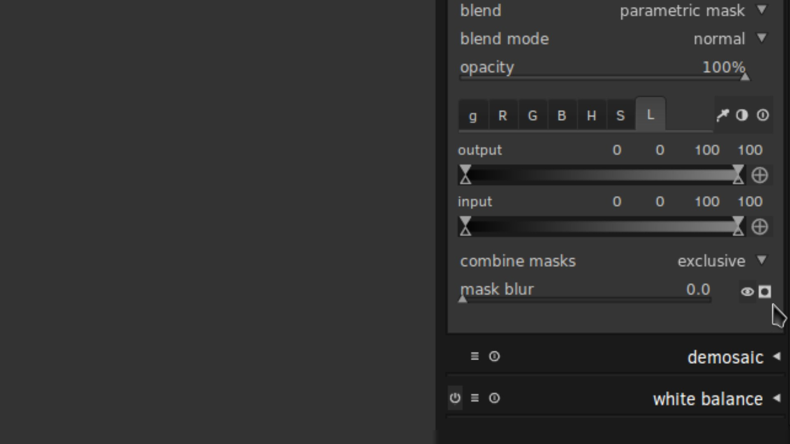
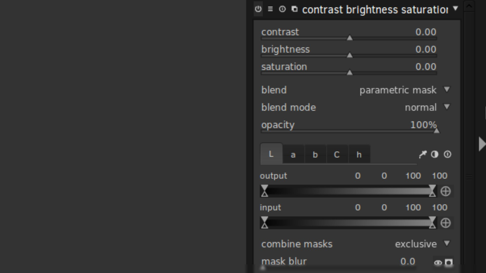

**Luminosity Masking**, the ability to create selections of your image based on its specific tones for ultra-targeted editing, is a relatively recent concept favoured by landscape photographers the world over.
In this article, we will explore how to create and use Luminosity Masks in the F/OSS RAW editor [darktable](http://www.darktable.org), so that you can make adjustments on your RAW files to isolated tones.

## What is Luminosity Masking?

Luminosity Masking is a technique developed in the last 10 years or so primarily by American Southwest landscape photographer Tony Kuyper over at [goodlight.us](http://goodlight.us/). 
Tony provides *extensive* writing and information on Luminosity Masking and how to create Luminosity Masks; in this article I’ll be primarily focusing and creating and using the masks in darktable, but if you want to really understand the basics I highly recommend giving [Tony’s guide a good read over](http://goodlight.us/writing/luminositymasks/luminositymasks-1.html) first.

In essence, Luminosity Masking is about creating highly specific selections of your photo based on the tones of the image itself. 
This enables you to have extremely fine control over what parts of the photo are selected to make adjustments on (such as contrast, saturation etc.) whilst keeping other tones of the photo *completely unaffected*. 
Let’s quickly illustrate this with some screenshots. 

<figure class='big-vid'>

</figure>

Here’s a shot I got of the Coral Beach on the Isle of Skye, Scotland, when my partner and I toured there recently in October 2014. 
It’s a pretty solid exposure. Let’s have a look at the histogram.

<figure>

</figure>

This article assumes you already have a basic understanding of histograms and how they work but I’ll give a quick summary here: the histogram represents the tonal information of your photo. 
It’s a graph of the light. 
On the left-hand side of the histogram is where all the Shadow information is, all the darker tones of the image. 
On the right-hand side you’ll find all the Highlight information, the brighter tones. 
And therefore, towards the middle of the histogram, is where all your midtones are located. 
The taller the graph is in a certain section of your histogram, the more information there is. 
So for this photo, you can see that we have a lot of shadow and highlight information, but hardly any midtones. 
We’re also not clipping (losing information) any shadows and highlights as well *i.e.* the graph isn’t flattened against either side of the histogram. 
So we’ve got plenty of room to work with here.

So let’s say that I feel the sky is a little too bright and I want to darken it. 
The day was quite overcast at this point and the sky in this image feels too washed out. 
Let’s darken it by dropping the exposure.

<figure class='big-vid'>

</figure>

Now we’re starting to see some more definition in the sky but the image overall feels too dingy and dark. 
Let’s look at the histogram.

<figure>

</figure>

As you can see, underneath the histogram I have the Exposure module open and I’ve pulled the exposure of the photo down by -1.02EV, darkening the image. 
This is reflected in the histogram. 
What was previously highlight information has been brought down so that it now resides in the midtones of the photo. 
This has brought back some definition and colour to the sky but now the rest of the photo is too dark; you can see on the histogram that the shadow information is bundling up on the left-hand side and we’re in danger of clipping the shadows, that is, losing information, which would result in blotches of pure black in the photo. 
Not good.

How do we get around this? Well, we create and use a Luminosity Mask that selects just the highlights in the photo, mostly the sky, but leaves the rest of the photo alone, keeping the shadows where they are. 
Here’s the result of using a Luminosity Mask to darken just the highlights in the photo. 

<figure class='big-vid'>

</figure>

*Much* better.
We’ve darkened the highlights, the sky, bringing back some colour and definition but have left the shadows, the beach and grass, well alone. 
Let’s see how our histogram is doing.

<figure>

</figure>

Once again, I’ve opened up the Exposure module and dropped the exposure of the photo down to -1.02EV but you can see that the module looks a little different this time.
 That’s because I’ve applied a Luminosity Mask to the Exposure change.
 We’ll come back to that in a bit.
 Look at the histogram in the top-right.
 We’ve brought the highlights down into the midtones but kept the shadows where they are.
 We can make another targeted adjustment if we want.
 Let’s say that I want to brighten the shadows a little bit as well. 

<figure class='big-vid'>

</figure>

Ah-ha! 
Now we’re bringing back some clarity and interest to the foreground, that lovely sweeping curve of the grass, beach and loch, with the hill in the distance. 
Check out the histogram.

<figure class='big-vid'>

</figure>

You can see at the bottom-right that I’ve made a new adjustment, known as “Exposure 1”, where I’ve increased the exposure of the image by 0.72EV. 
But again, I’ve applied a Luminosity Mask to this adjustment so that the brightening effect only happens to the shadows in the photo, leaving the highlights alone. 
In the histogram, you’ll note that we now have a lot of midtone information, by darkening the highlights and brightening the shadows. 
Tony Kuyper talks alot about the [“Magic Midtones”](http://goodlight.us/writing/magicmidtones/magicmidtones-1.html) and for good reason: the midtones are the real meat of the photo and applying targeted adjustments to the midtones of a photo can really take your work to the next level.

So, let’s review the changes we’ve made to this photo.

<figure class='big-vid'>

<figcaption>
*Fig. 1*: Original RAW 
*Fig. 2*: Whole photo darkened 
*Fig. 3*: Highlights darkened only 
*Fig. 4*: Shadows brightened as well 
</figcaption>
</figure>

And let’s also look at how the histogram has changed.

<figure class='big-vid'>

<figcaption>
*Fig. 5*: Original RAW 
*Fig. 6*: Whole photo darkened 
*Fig. 7*: Highlights darkened only 
*Fig. 8*: Shadows brightened as well 
</figcaption>
</figure>

## Creating Luminosity Masks in darktable

Luminosity Masking is easy to do in darktable; it’s built right in to the software since v1.4 (and now we’re on v1.6). 
Every single module in darktable, whether that’s Contrast, Vibrance, Exposure etc., can have a Luminosity Mask applied to it for targeted adjustments. 
Let’s demonstrate on a new image.

<figure class='big-vid'>

</figure>

Here’s a shot I grabbed on that same tour of Scotland in October 2014, this time of the Glenfinnan Monument. 
Pretty neat? If you look at the histogram at the top-right, you’ll see that I have a lot of shadow information (in fact it’s almost clipping) and I have a good range of highlight information that moves into the midtones as well. 
Thankfully there’s no clipping going on but the photo is too dark, with the monument and mountains appearing almost as shadowy silhouettes against the sky. 
What we want to do is to brighten up those shadows to bring back the details and colour in the monument and the mountains. 
We may also do a smidgen of highlight darkening as well. 

So, let’s open the Exposure module and I’ll walk us through it.

<figure class='big-vid'>

</figure>

You can find the Exposure module in the Basic Group, represented by the hollow white circle icon. 

The magic we’re looking for is under the “blend” dropdown:

<figure class=''>

</figure>

Simply select “parametric mask”. 
This is where the magic is. 
In my view, it should be renamed to Luminosity Mask, but that’s just me. 

This is where we can create a mask of the photo by selecting just certain tonal ranges. 
Now, we’re not going to go into detail on every aspect of this masking system; I’ll leave to you to experiment with. 
Just note that this “parametric mask” function is available in *every darktable module*, so you can apply Luminosity Masks on Exposure, Saturation, Contrast, Vibrance, Local Contrast… whatever you wish. 
This is neat and very powerful. 

So, next step: select the “L” tab for “Luminosity” -- located on the far right of the other tabs “g”, “R”, “G”, “B”, “H”, “S” — and then select the little icon that has the black circle in the white square, this will show the mask.

<figure class=''>

</figure>

This is what your photo will now look like.

<figure class='big-vid'>

</figure>

***Don’t panic!***

All this yellow is telling you is that, currently, any Exposure adjustment you make will take effect on the *whole photo*. Clearly, this isn’t what we want. 
What we’re going to do is adjust the Input slider to start narrowing down our selection to just the tones we want; in this case, we’re after the shadows so we can brighten them up whilst leaving the highlights alone. 
We can do this by bringing the sliders on the right-hand side of the Input slider down towards the left.
This will start deselecting the highlights of the photo as we narrow our mask further towards the shadows.

<figure class='big-vid'>

</figure>

As you can see, I’ve brought the Input sliders from the right-hand side down to 25, very close to the left-hand sliders. 
This is reflected in the mask, as we’re now starting to deselect some of the brighter highlights in the sky. 
But we want to narrow it down further so that we’re targeting just the darkest parts of the photo: the mountains, foreground and monument.

<figure class='big-vid'>

</figure>

*Boom!*
We’ve had to bring the sliders down all the way to 5 to cut off the highlights in the sky. 
We’ve also managed to deselect some of the brighter highlights in the foreground as well. 
Let’s just make one final adjustment to the sliders before we start brightening the Exposure.

<figure class='big-vid'>

</figure>

Here, all we’ve done is move the bottom right-hand slider back up towards the highlights a little bit. 
What this does is feather and soften the mask so that when we do our Exposure brightening it will look more natural and blend better. 

OK, we’ve got our initial mask targeted nicely towards the shadows; hide the mask by selecting that black circle in the white square icon again. 
Now it’s time to start brightening up the Exposure.

<figure class='big-vid'>

</figure>

*Boom!* 
Much better. Let’s do a side-by-side comparison.

<figure class='big-vid'>

<figcaption>
*Fig. 9*: Original RAW unedited 
*Fig. 10*: Foreground, monument and mountains (shadow areas) have been brightened through a Luminosity Mask, leaving the highlights in the sky alone.
</figcaption>
</figure>

Already, we’ve made a striking change to how the photo looks. 
There’s now a lot more interest as our subject, the monument, is much brighter with plenty of details available. 
However, we’re not quite done. 
The sky to the right of the monument looks a bit… *funky*. 
That’s because when we feathered our Luminosity Mask a bit we selected too much highlight information. 
This has resulted in part of the sky getting brighter but the rest of the sky staying the same, which looks strange. 
We can correct this by moving the bottom right-hand slide back to the left a bit, cutting off those highlights in the sky more.

<figure class='big-vid'>

</figure>

Better. 
By moving the bottom right-hand slider back down from 20 to 8 the sky looks more natural. 

Already, this photo is looking a lot better. 
Let’s take some of those bright highlights in the sky and darken them a bit, so that the eye isn’t distracted and focuses more on the monument. 
To do this, we’re going to make another Exposure adjustment.

<figure class=''>

</figure>

To the left of the Exposure module name you’ll see four little icons. 
Click the rightmost one and then select “New Instance” in the dropdown that appears.

<figure class=''>

</figure>

We now have a new module called “Exposure 1” that sits on top of our previous Exposure module. 
With this Exposure 1, we’re going to create a Luminosity Mask targeting the highlights so that we can darken the exposure in them.

Same process as before: in “Exposure 1” select the “blend” dropdown then select “parametric mask”.

<figure class=''>

</figure>

Select the “L” tab for Luminosity then make the mask visible by clicking on the black circle in the white square icon.

<figure class='big-vid'>

</figure>

This time, we’re going to take the left-hand sliders and bring them to the right, slowly deselecting the shadows until we’ve targeted the highlight tones we want to darken.

<figure class='big-vid'>

</figure>

In our example, we’ve taken the left-hand sliders of Input up to 17 and then brought the bottom left-hand Input slider back down a little to 6 so that we feather the mask out for a more seamless blend.

Let’s start decreasing the exposure to see what it looks like. 
Just click on the black circle in the white square icon again to hide the mask and starting decreasing the exposure slider.

<figure class='big-vid'>

</figure>

Nice! 
Here, we’ve brought the exposure down by -0.50EV through our Luminosity Mask, targeting the highlights and darkening them. 
We’ve also tweaked the bottom left-hand slider by bringing it down to 3 for a bit more feathering.

Here’s a before and after.

<figure class='big-vid'>

<figcaption>
*Fig 11*: Shadows brightened only via a Luminosity Mask 
*Fig 12*: Brightest highlights darkened through a Luminosity Mask in a new exposure adjustment.
</figcaption>
</figure>

*Giggedy.* So this photo is starting to look pretty sweet. 
Let’s just make one more adjustment, globally this time with no Luminosity Mask. 
I want to generally increase the overall exposure of the photo. 

<figure class='big-vid'>

</figure>

Good! 
As you can see, on the right-hand side I’ve created another Exposure module, now called “exposure 2” and have increased the overall exposure of the photo by 0.50EV. 

To round up this tutorial, let’s look into making one more adjustment through Luminosity Masks. 
Now that we’ve brightened up the shadows and darkened down the highlights, we’ve moved a lot of the tones in the photo towards the midtones. 
This is where the real meat of the image is. 
We can now really give this photo some punch and pop by applying some contrast to just the midtones of the image. 
Here’s how.

Open the Contrast, Brightness & Saturation module, select “blend” then select the “parametric mask” option in the dropdown.

<figure class=''>

</figure>

You’ll note this time round that the tabs in the module—the “L”, “a”, “b”, “C” and “h”—are different to the Exposure module. 
Don’t worry. 
Just leave the “L” for Luminosity selected. 
We’re now going to adjust the Input sliders so that we’re targeting just the *midtones* of the photo. 
We do this by deselecting *both the highlights and shadows*. 
This is done by moving the left-hand sliders up and the right-hand sliders down towards the middle.

<figure class='big-vid'>

</figure>

So here’s how my midtones Luminosity Mask looks. 
On the right, you can see that I’ve brought the sliders towards the middle and then dropped the bottom slider of the pair away so that there’s some feathering. 
This is quite a tight midtones mask but that’s OK. 
Now let’s hide the mask and start increasing the contrast. 

<figure class='big-vid'>

</figure>

*Much better*. 
Because we’re only targeting a tight selection of the midtones we can make quite an aggressive contrast adjustment (I’ve brought the contrast slider way up to 50). 
I’ve also increased the brightness of the midtones a little, pulled down the saturation to compensate for the contrast adjustment, and also increased the blurring of the mask to 100, feathering out the mask further for a more natural adjustment. 

Let’s look at the before and after.

<figure class='big-vid'>

<figcaption>
*Fig. 13*: Our RAW with the shadows brightened and the highlights darkened  
*Fig. 14*: Contrast increased in the midtones through a Luminosity Mask 
</figcaption>
</figure>

You can see the biggest difference this contrast adjustment made was to the texture in the foreground grass and the stone detail in the monument. 
You can make out the individual clumps of growth in the foreground as well as the individual tones in the stone of the monument. 
Neat. 

Finally, here’s an overview of the adjustments we’ve made to this photo

<figure class='big-vid'>

<figcaption>
*Fig. 15*: Original unedited RAW 
*Fig. 16*: Shadows brightened through a Luminosity Mask 
*Fig. 17*: Highlights darkened through a Luminosity Mask 
*Fig. 18*: Overall exposure increased a little, no mask 
*Fig. 19*: Contrast in the midtones increased through a Luminosity Mask.
</figcaption>
</figure>

## Conclusion
In this tutorial, I’ve only gone through the very basics of what is possible with darktable’s Luminosity Masks, so that one can make subtle adjustments to the shadows, highlights and midtones of their photo in order to balance the image better. 
But Luminosity Masks can be used for so much more and so I invite you to experiment! Try out the different modules available in darktable and see how you can apply various filters through different masks to achieve highly-specific adjustments to your RAWs like never before.

