There are many different approaches to blending exposures in the various [projects][], and they can range from extremely detailed and complex to quick and simple.
Today we're going to look at the latter.

[projects]: /software/


I was recently lucky enough to attend an old friends wedding in upstate NY.
Mairi got married!
(For those not familiar with her, she's the model from [An Open Source Portrait][osportrait] as well as [A Chiaroscuro Portrait][chiaroscuro] tutorials.)

[chiaroscuro]: /articles/a-chiaroscuro-portrait/
[osportrait]: /articles/an-open-source-portrait-mairi/

<figure>
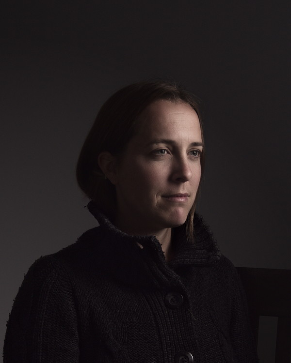
<figcaption>Mairi's chiaroscuro portrait.</figcaption>
</figure>

I had originally planned on celebrating with everyone and wrangling my two kids, so I left my camera gear at home.
Turns out Mairi was hoping that I'd be shooting photos.
Not wanting to disappoint, I quickly secured a kit from a local rental shop.
(Thank goodness for friends new and old to help wrangle a very busy 2 year old.)

During the rehearsal I was experimenting with views to get a feel for the room I'd have and how framing would work out.
One of the shots looked from the audience and right into a late afternoon sun.
My inner nerd kicked in and I thought, _"This might be a neat image to use for a tutorial!"_.


## Exposure Fusion (Mapping)

The idea behind exposure fusion (or mapping) is to extend the dynamic range represented in an image by utilizing more than one exposure of the same subject and choosing relevant bits to fit in the final output.

I say "fit" because usually you are trying to put a larger amount of data than a single image might have been able to capture.
So you choose which parts you want to use to get something that you'll like.
For example, here we have two images that will be used in this article where the image showing the foreground correctly causes the sky to blow out, while exposing for the sky causes the foreground to go almost black.
By selectively combining these two images, we can get something that might show a larger dynamic range than would have been possible in a single exposure:

<figure class="big-vid">
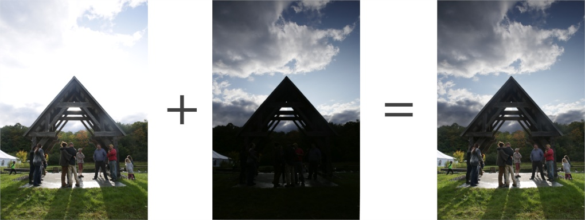
<figcaption>This porridge is too hot, this porridge is too cold, but this porridge is just right.</figcaption>
</figure>

This is one common use case scenario for creating HDR/EXR imaging (and tonemapping is the term for doing exactly what we're describing here - squishing data into the viewable range in a way that we like).
In fact, at the end of this article I'll show how [Enfuse][] handled merging these image exposures (_spoiler: pretty darn well_).

[Enfuse]: http://enblend.sourceforge.net/ "Enfuse/Enblend"


## Exposing 

In exposing for the subjects in this image, I used the structure to block the sun from direct view (though there's still a loss of contrast and flaring).
The straight out of the camera jpg looks like this:

<figure>
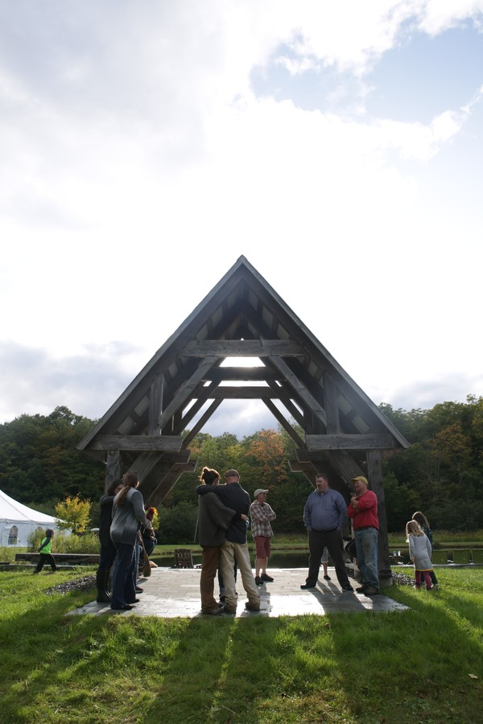
<figcaption>
Foreground exposure
</figcaption>
</figure>

This gave me a well exposed foreground and subjects.
I then gave the shutter speed a quick spin to <sup>1</sup>&frasl;<sub>1000</sub> (about 4-stops) to get the sky better exposed.
The camera jpg for the sky looked like this:

<figure>
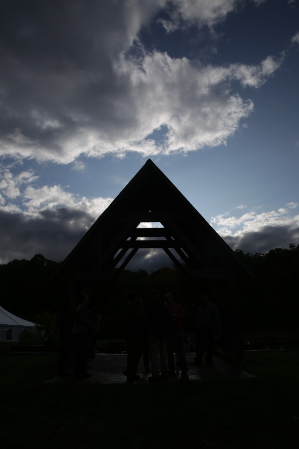
<figcaption>
Sky exposure
</figcaption>
</figure>

In retrospect I probably would have been better to shoot for 2-stops difference to keep the sky exposed higher in the histogram, but _c'est la vie_.
It also helps to avoid going too far in the extremes when exposing, so as to avoid making it look too unrealistic (yes - the example above probably skirts that pretty close, but it's exaggerated to make a good article).
This gives us a nice enough starting point to play with some simple exposure mapping.


## Alignment

For this to work properly the images do need to line up as perfectly as possible.
Imperfect alignment can be worked around to some extent, usually determined by how complex your masking will have to be, but the better aligned the images are the easier your job will be.

As usual I have had good luck using the `align_image_stack` script that's included as part of [Hugin][].
This makes short work of getting the images aligned properly for just this sort of work:

[Hugin]: http://hugin.sourceforge.net/

```
/path/to/hugin/align_image_stack -m -a OUT FILE1 FILE2
```

On Windows, this looks like:

```
c:\Program Files\Hugin\bin\align_image_stack.exe -m -a OUT FILE1 FILE2
```

Once it finishes up, you'll end up with some new files like `OUT0001.tif`.
These are your aligned images that we'll now bring into [GIMP][]!

[GIMP]: https://www.gimp.org


## Masking

The heart of fusing these exposures is going to rely entirely on masking.
This is where it usually pays off nicely to take your time and consider carefully an approach that will keep things looking clean and with a natural transition between the exposures.

If this had simple geometry it would be an easy problem to solve, but the inclusion of the trees in the background makes it slightly more complex (but not nearly as bad as hair masking can get).
The foreground and sky are very simple things to mask overall, where we know we may want 100% of the foreground to come from one image, and 100% of the sky from another.  This helps simplifies things greatly.

<figure>
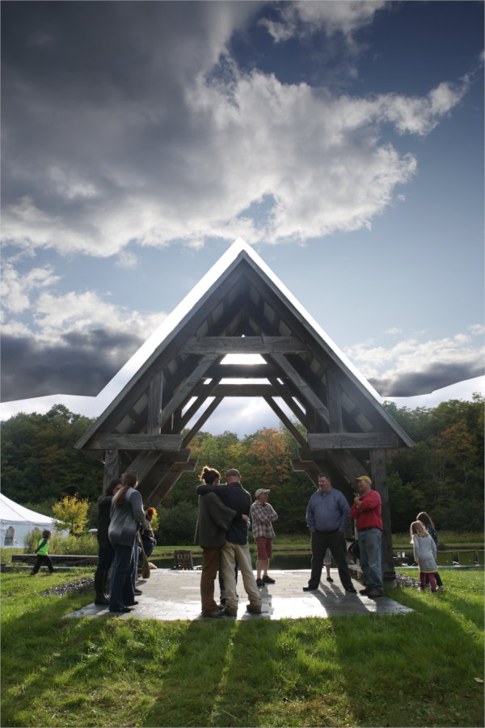
<figcaption>Rough mask (temporary - for reference only) where we can see we want all of the sky from one image, and all of the foreground from another.</figcaption>
</figure>

I tend to keep the darker sky layer on the bottom and the lighter foreground layer above that.

The hard edges of the structure make it an easy masking job there, so the main area of concern here is getting a good blend with the treeline in the background.
There are a couple of approaches we can take to try and get a good blend, so let's have a look...


### Luminosity (Grayscale) Mask

A common approach would be to apply an inverted grayscale mask to the foreground layer.
If there's a decent amount of contrast between the foreground/sky layers then this is a quick and easy way to get something to use as a base for further work:

<figure>
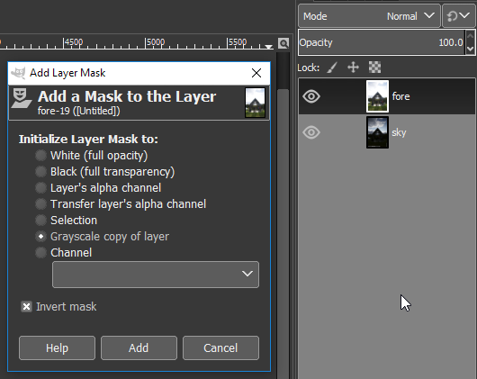
</figure>

Applying this mask yields pretty good looking results right away:

<figure>
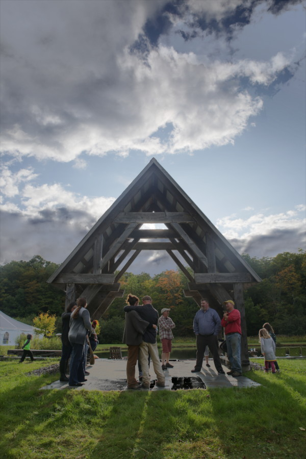
</figure>

You can also investigate some of the other color channel options to see if there might be something that works better to create a clean mask with.
In GIMP 2.9.x I also found that using `Colors > Components > Extract Component` using `CMYK Key` produced another finely separated option.

This makes a nice starting point.
As we said we wanted all of the sky from one exposure and the rest of the image from the other exposure, we can start roughing in the overall mask.

For this simple walkthrough we can make our job a bit easier by using _two_ copies of the foreground layer and selectively blending them over the sky layer.


### Why Two Layers?

If you take your foreground layer and start cleaning up the mask for the sky by painting in black, it should be relatively easy.
Until you get down to the treeline.
You can use a soft-edged brush and try to blend in smoothly, but in order to let the sky come through nicely you may find yourself getting more of the dark exposure trees showing through.
This will show as a dark halo on the tops of the trees:

<figure>
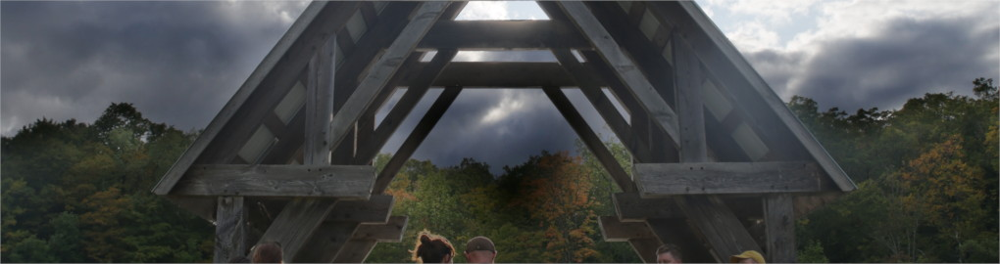
</figure>

A nice way to adjust the falloff along the tops of the trees is by using a second copy of the foreground layer, and using a gradient on the mask that will blend smoothly from full sky to full foreground along the tops of the trees.
This will ease the dark halo a bit until the transition looks good to you.
You can then modify/update the gradient on the copy until the transition is smooth or to your liking.

At this point my layers would look like this in GIMP:

<figure>
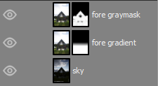
</figure>

The results of using a second fore layer with a gradient to help ease the transition:

<figure class="big-vid">
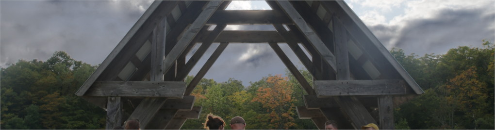

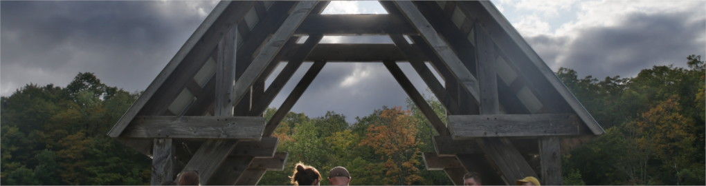
<figcaption>
Top: Original grayscale mask only<br>
Middle: Manual mask painting down to treeline<br>
Bottom: Second layer with gradient mask
</figcaption>
</figure>

When pixel-peeping it may not seem _perfect_, but in the context of the entire image it's a nice way to get an easy blend for not too much extra work.

<figure class="big-vid">
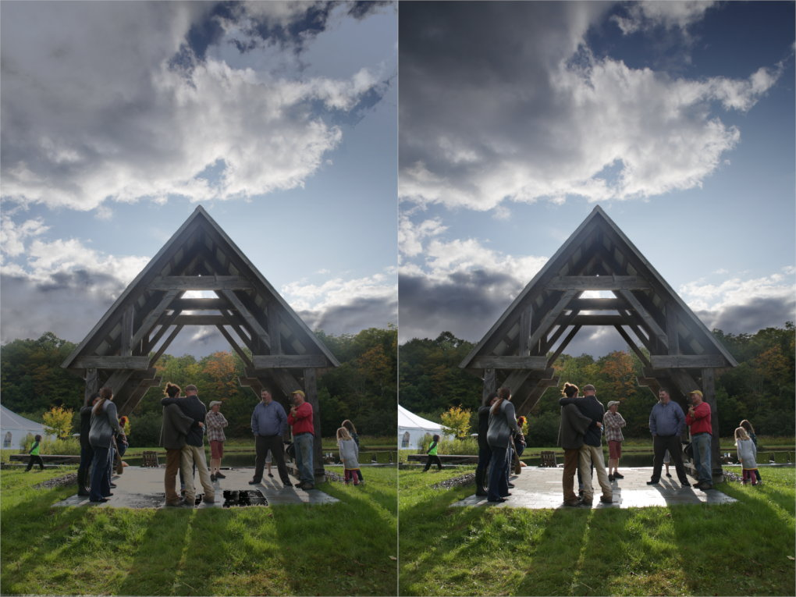
<figcaption>
Left: Grayscale mask, Right: final mask with gradient
</figcaption>
</figure>

At this point most of the exposure is blended nicely.
The only place in this particular image I would work some more would be to darken the structure a little bit to lessen the flaring and maybe bring back a little darkness.

This can be accomplished by painting over the top mask.
I used black with a smaller opacity of around 25% to paint over the structure and allow the darker version underneath to show through a bit more:

<figure class="big-vid">
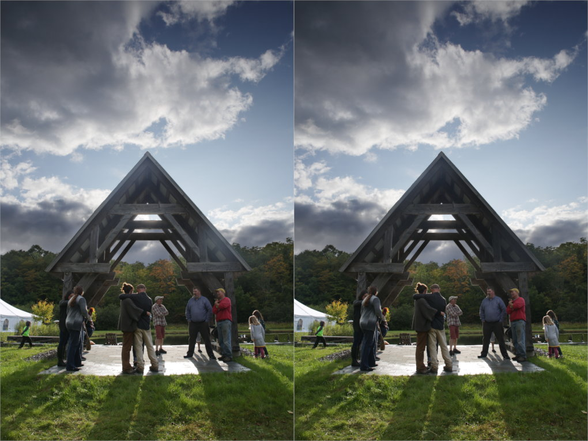
<figcaption>
Left: gradient masked, Right: structure darkened slightly to taste
</figcaption>
</figure>


## Enfuse Comparison

I have previously used [Enfuse][] and gotten great results even more quickly.
For comparison here is the result of running Enfuse against the same images:

<figure class="big-vid">
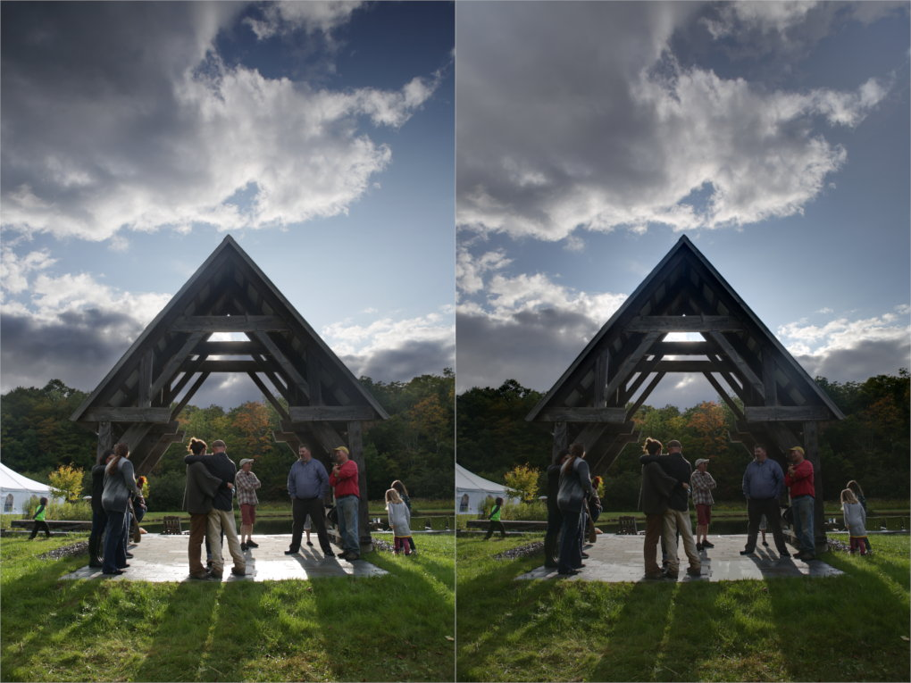
<figcaption>
Left: Manual masking result, Right: Enfuse automatic blend
</figcaption>
</figure>

I prefer our manually blended result personally, but I could see another future article or post about using the Enfuse blend for areas of complexity and _blending the Enfuse output_ into the final image to help.
Might be interesting.

(I prefer our blended result because Enfuse considered extremely bright areas as candidates for fusion with the other exposure - so the bricks and tent highlights got pushed down automatically.)


## Fin

From here any further fiddling with the image is purely for fun.
The two versions of the image have been merged nicely.
If you wanted to adjust the result to not appear quite as extreme you could modify each of the layers to taste.

For instance, you could lighten the sky layer to decrease the extreme range difference between it and the foreground layer.
Where's the fun in keeping it too realistic though? :)

For reference, here's my final version after masking with a bit of a Portra tone thrown in for good measure:

<figure>
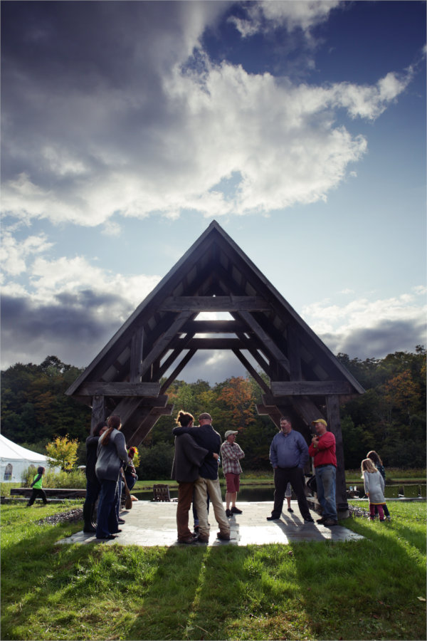
<figcaption>
Not bad for a relatively quick approach.
</figcaption>
</figure>


## Resources

This wouldn't be complete with some resources and further reading for folks!

I have saved the GIMP 2.9.x .XCF file I used to write this.
It has all of the masks and layers I used to create the final version of the image: 

* [Download the GIMP 2.9 .XCF file][download] (116MB).
* [Download the GIMP 2.9 .XCF file (half resolution)][halfres] (38MB)

[download]: https://pixls.us/files/XCF/SimpleExposureMapping.xcf
[halfres]: https://pixls.us/files/XCF/SimpleExposureMapping_half-res.xcf

### Further Reading

* [Luminosity Masking in darktable][lumdt]
* [Basic Exposure Blending with GIMP and G'MIC][blendgmic]
* [A Blended Panorama with PhotoFlow][photoflow]
* [HDR Photography with Free Software][hdr]

@McCap also [created a YouTube][mccap] video walking through how he approached exposure blending:

[mccap]: https://discuss.pixls.us/t/youtube-processing-exposure-blended-image/5254

<div>
<div class='fluid-vid'>
<iframe width="560" height="315" src="https://www.youtube.com/embed/0DnWoyOkEJk" frameborder="0" gesture="media" allow="encrypted-media" allowfullscreen></iframe>
</div>
</div>


[lumdt]: https://pixls.us/articles/luminosity-masking-in-darktable/ "Luminosity Masking in darktable on PIXLS.US"
[blendgmic]: https://pixls.us/articles/basic-landscape-exposure-blending-with-gimp-and-g-mic/
[photoflow]: https://pixls.us/articles/a-blended-panorama-with-photoflow/
[hdr]: https://pixls.us/articles/hdr-photography-with-free-software-luminancehdr/


The image <span xmlns:dct="http://purl.org/dc/terms/" href="http://purl.org/dc/dcmitype/StillImage" property="dct:title" rel="dct:type">[Wedding Rehearsal][wed]</span> by <a xmlns:cc="http://creativecommons.org/ns#" href="https://patdavid.net" property="cc:attributionName" rel="cc:attributionURL">Pat David</a> is licensed under a <a rel="license" href="http://creativecommons.org/licenses/by-sa/4.0/">Creative Commons Attribution-ShareAlike 4.0 International License</a>.<br />Permissions beyond the scope of this license may be available at <a xmlns:cc="http://creativecommons.org/ns#" href="https://patdavid.net/about" rel="cc:morePermissions">https://patdavid.net/about</a>.

[wed]: https://www.flickr.com/photos/patdavid/37164904891
