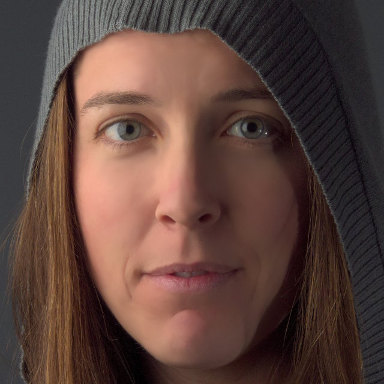
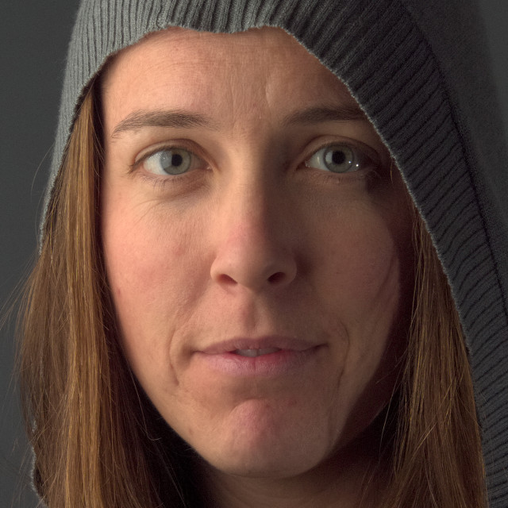
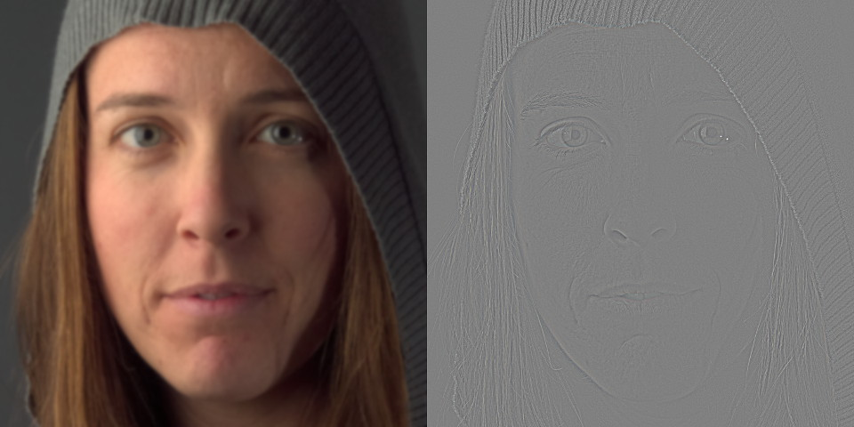
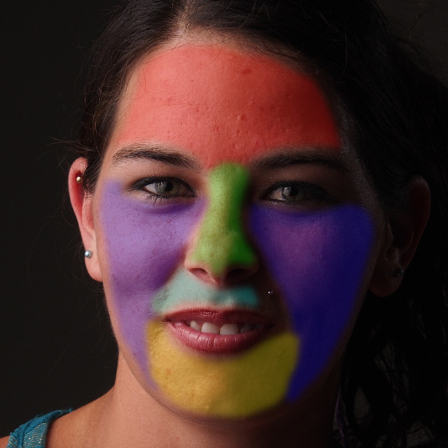
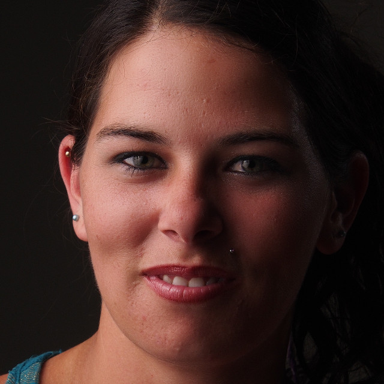

Skin retouching is a delicate art.

*Effective* skin retouching can feel like a black art.

There have been various methods detailed in the past for ways to "smooth" skin in [GIMP](http://www.gimp.org).
Those methods ranged from disappointing at best to downright ridiculous at worst.
The disappointing methods were simply a product of the best methods available at the time.
The ridiculous ones seemed to be due to a lack of subtlety.

## Subtlety 

Subtlety is a key requirement when approaching skin retouching.
There are certainly exceptions when required (high-fashion for instance) but it should always be approached from a minimalist perspective first.

Too often retouching skin is approached with a very heavy hand. 
In an attempt to *"clean"* the skin many will chase every last drop of detail out of an image, resulting in a fake and overly smoothed result (making mannequins).
**This is bad**.

<figure>

<figcaption>
To reiterate: **This is bad**.
</figcaption>
</figure>

Real skin has pores, bumps, spots, color, and other interesting things going on. 
The goal shouldn't be to remove those characteristics, but rather to make some them less pronounced *as needed*. 
A good rule of thumb is: 

> "Never do more than good makeup can achieve."

Of course, some makeup artists are magicians. 
In fact, it can be very helpful to go out and research how they work and what their process and reasons are.
This can help you understand better how to approach all manner of retouching, particularly when using techniques like dodging/burning and color theory (as it relates to makeup and skin).

Keep in mind the context as well.
Candid images may only require a very minimum of retouching (_if at all_), while a fashion shoot may desire a stronger application.
For the best results, it helps to have a clear vision of what you want to achieve.

## Tools

### Blurring
One method of smoothing skin that can be found in many old tutorials on the subject involves using some variation of blurring the base image and masking the blurred regions into the image.
In theory the idea may seem sound but fails quickly on closer inspection.

A combination of the broad effects of blurring coupled with the indiscriminate application across all the textures in the skin make this a less than ideal approach.
All of those pores, spots, bumps, and colors get lost when using an indiscriminate function such as blurring the image.
While there may be a desire to remove some of those details, visually our eyes are expecting for there to be some sort of texture and detail there.
Loss of those details is what pushes the results into "mannequin" territory.

<figure class='big-vid'>

<figcaption>
Mannequin territory 
_"White male mannequin head in storefront window"_ by <a href='https://www.flickr.com/photos/horiavarlan/4269156697'>Horia Varlan</a> (<a href='https://creativecommons.org/licenses/by/2.0/' class='cc'>cb</a>)
</figcaption>
</figure>

Overall, this method should not even be considered as an option for skin retouching.
The results are never good and are indiscriminately too destructive to the image.

### High Pass/Low Pass Frequency Separation

A slightly more advanced way to approach skin retouching is to use a "high pass/low pass" (or "high frequency/low frequency", or just "frequency separation") technique to separate the image into two layers.
One layer would contain all of the high-frequency (fine) details while the other layer would contain the low-frequency (coarse) information.

<figure>

<figcaption>
Mairi 
</figcaption>
</figure>

The resulting layers can look strange to those not accustomed to seeing them.
The important thing to notice is the ability to isolate all high frequency details on a separate layer.
This allows us to independently modify the colors/tones from the details.

<figure class='big-vid'>

<figcaption>
Low Frequency (left) and High Frequency (right) 
Created with a blur radius of 15px
</figcaption>
</figure>

#### Create Frequency Separated Layers

Creating the frequency separated layers is relatively easy in GIMP.
Starting with the base image layer:

1. Duplicate base layer 
[*Layer &rarr; Duplicate Layer*]
    - Name it "LF"
- Apply a Gaussian Blur to the "LF" layer 
[*Filters &rarr; Blur &rarr; Gaussian Blur*]
    - Choose an appropriate radius to isolate your desired high-frequency details (15px in the example)
    - The blur radius is ~1.5% of the width of the face
- Change "LF" layer blend mode to *Grain Extract*
- Create a new layer from visible 
[*Layer &rarr; New from Visible*]
    - Name it "HF"
    - Change "HF" layer blend mode to *Grain Merge*
- Change "LF" layer blend mode back to *Normal*

Visually, the result should look identical to the original base layer.
Technically the separated frequency layers now allow for much finer targeted editing.
The layers for the image will now have an HF layer (in *Grain Merge* blend mode) over a LF layer:

<figure>

<figcaption>
Layers after going through a frequency separation.
</figcaption>
</figure>

The choice of radius for the *Gaussian Blur* operation will determine the level of details that get separated from the low-frequency layer.  Smaller blur radii will isolate finer details (conversely larger radii include larger details).

#### Skin Retouching with Frequency Separation

Consider now the results from the separation.  In particular notice which types of skin features occur in each layer.

Pores, light wrinkles, crows-feet, and small details are separated into the HF layer, while larger skin tones remain on the LF layer.
Overall skin tones can be evened out out by smoothing the tones in the low frequency layer.

A note on smoothing
There are various ways of softening details on the different layers.
 
The standard *Gaussian Blur* is one method that works well and quickly.
Filters &rarr; Blur &rarr; Gaussian Blur...
 
A better method might be using a *Selective Gaussian Blur* to only blur certain areas (based on the value difference between the pixel in consideration and its neighbors).
Filters &rarr; Blur &rarr; Selective Gaussian Blur...
 
If [G'MIC](http://gmic.sourceforge.net/) is installed, there is also access to a *bilateral blur* filter (similar to *Surface Blur* in Adobe Photoshop) that is also an edge-preserving blur function.
Filters &rarr; G'MIC... 
Repair &rarr; Smooth [bilateral]

When considering a face for skin retouching it's often best to consider each general contour area of the face separately.
This is mostly due to different areas of the skin having different characteristics (*ie*: forehead wrinkles are often at a different scale than crows feet or smile lines).  

Below is one example of a good starting point for contour consideration when smoothing.
The key is to vary the smoothing intensity for each region to obtain a good result.
There may not be a change required all the time, but it's a good habit to get into for when it is needed.

<figure>

<figcaption>
Areas of smoothing consideration
</figcaption>
</figure>

A good place to start is often to address any "blotchiness" or uneven tones in the skin.
(Ideally this would be addressed through the use of foundation makeup.)
As seen above, those types of tones can be found on the Low Frequency layer.

Following the contour areas from above a *Bilateral Blur* (from G'MIC) is used to smooth the regions.
When using the *Free Select Tool* to select a region, remember to enable *Feather edges* from the tool options to make a smooth transition from the working area to the surrounding image.

Filters &rarr; G'MIC... 
Repair &rarr; Smooth [bilateral]

The defaults of *spatial variance*: 10, *value variance*: 7, and *iterations*: 2 are used.

<figure>

<figcaption>
After smoothing the LF layer with a bilateral blur 
Click to compare to original
</figcaption>
</figure>

Visually, smoothing the Low Frequency skin tones provides a marked improvement to the perceived quality.
Importantly, notice that none of the finer details have been modified (wrinkles, pores, etc...).

At this point, regular workflows could still be used such as spot healing or dodging & burning (on either LF or HF layers as needed).

#### HF/LF Summary

High/Low frequency separation is a great tool to approach skin retouching due to it's ability to allow a retoucher to approach the work in discrete layers.

If one wanted to isolate a series of frequencies, then things get a little trickier.
It would require the user to generate HF/LF separately for each size they wanted to isolate.
The workflow would be along the lines of do the separation, retouch, do the separation again for a different size, retouch.  Rinse and repeat.

It turns out that there is already a very handy way to isolate multiple frequencies at once and still have a visual means of combining them easily to see the edits as they are being made:
**Wavelet Decompose**.

### Wavelet Decompose

Wavelet Decompose allows you to generate multiple High Frequency layers (and a Low Frequency "Residual" layer) all at once.
Each of the HF layers use the **Grain Merge** layer blending mode so that the composite image is reconstituted correctly.
This allows the retoucher to make modifications to any of the scale (frequency) layers while seeing the results immediately on the canvas.

Getting Wavelet Decompose [Plugin]
The original plugin for Wavelet Decompose by the user *marcor* on the [GIMP registry](http://registry.gimp.org) can be found here:
<a href="http://registry.gimp.org/node/11742">Wavelet Decompose</a> [registry.gimp.org]
 
Once installed the command is:
Filters &rarr; Generic &rarr; Wavelet Decompose ...
 

Getting Wavelet Decompose [Script-Fu]
There is also a Script-Fu version by Christoph A. Traxler that can be downloaded from us here:
[Wavelet Decompose Script-Fu](wavelet-decompose.scm) [pixls.us]
 
Once installed the command is:
Image &rarr; Wavelet Decompose ...

The advantage to using a wavelet decomposition over a simple HF/LF separation is cases where there may be details of a different size than your HF layer that you still want to isolate.

<figure class='big-vid'>

<figcaption>
Wavelet Decomposed to 5 levels 
Click to view equalized levels and enhance details
</figcaption>
</figure>

Examining the equalized version of the previous image immediately shows the various scale features isolated through the decomposition.
In particular, the top row shows the finest details while the bottom row shows broad details with the color residual layer last.

With the various detail scales separated, the retoucher can easily make modifications on any given scale while seeing the results directly on the canvas.
This is due to the detail scale layers being set to "Grain Merge" blending mode in GIMP.

## Application

Use of wavelet scales for retouching are done similarly to using a frequency separation.
The major difference is choosing which detail scale to apply the smoothing operations to, and at what intensity.

I have found that a good workflow is to generally start at the largest detail scale.
Experiment with smoothing methods and parameters until a good result is achieved without going too far.
If needed, repeat the operations with different parameters on the next smaller detail scale (with reduced parameters).

For this example, running the *Bilateral Blur* from G'MIC with the same values as in the **Frequency Separation** example above yields:

<figure>

<figcaption>
Click to compare:
Original
Low Frequency Smooth
Wavelet Smooth
</figcaption>
</figure>

The smoothing of the largest detail scale produces pleasing skin tones without removing too many details. 

Having the detail scales separated out also allow for spot modifications without disrupting the textures of other scale layers.
For example, there is some slight skin discoloration on the models lit cheek:

<figure>

<figcaption>
A small color tone difference to repair.
</figcaption>
</figure>

By working on the color (low-frequency) **Residual** layer, the color tones can be evened out using a *Heal Brush* and sampling from nearby skin.

<figure>

<figcaption>
After healing the area on the **Residual** color layer 
Click to compare to original
</figcaption>
</figure>

Notice in particular that the fine details that make up the skin composition here are not modified.
Wrinkles, pores, and skin texture are kept intact while the underlying color tones for that region are blended smoothly into the surrounding area.

This same technique can come in very handy for lightening under eyes that might have dark circles under them, for instance.

### Spot Healing

Once the skin tones have been smoothed as desired work can continue with spot healing discrete problems as needed.
Simple skin blemishes that are discrete are best approached with a spot healing tool after the global skin tones have been modified (to avoid having to apply the healing on all of the detail layers one at a time).

## Example: Nikki

A good image to see what this approach can accomplish is the lede image to this article, [Nikki](https://www.flickr.com/photos/patdavid/14490236250/).
This is a crop from the raw image untouched:

<figure>

<figcaption>
Crop from *Nikki*, no retouching.
</figcaption>
</figure>

To follow along you can [download the full-size base image](Nikki-Base-crop-noresize.jpg) (360KB).

Running Wavelet decompose (plugin) against the image with the default of 5 scales,

Filters &rarr; Generic &rarr; Wavelet decompose ...

will leave the image with layers that look like this:

<figure>

<figcaption>
Detail scales and residual layers from Wavelet decompose
</figcaption>
</figure>

### What We're Targeting

After running a wavelet decompose on a layer there is a very simple method of exaggerating the details that will be targeted for smoothing the skin tones.
Simply toggle off the visibility of the *Wavelet residual* layer:

<figure>

<figcaption>
*Nikki* with only the detail scales visible over the base image (no residual layer).
</figcaption>
</figure>

I ***highly*** recommend that you do *not* do this with the subject in the room!
Nobody looks good when the residual scale is removed from the image stack...

But it does nicely exaggerate the types of tonal variations that are prime candidates for smoothing and suppression.

### Regions

Similar to the regions previously shown, we will walk through the retouching process based on that type of facial contour: forehead, nose, cheeks, chin, and lip.

I'll normally use the *Free Select Tool* with a feathered radius around one-half an iris length (~30px in this case).
The radius value is mostly arbitrary and serves only to smooth the transition from areas being worked on (so adjust to taste).
I will also usually select regions as I go and remember to save the selections to a channel to make it easier to come back to them later if desired: 

Select &rarr; Save to Channel

<figure>

<figcaption>
Crop from *Nikki*, no retouching.
</figcaption>
</figure>

*Wavelet Decompose* is run on the layer using the default number of wavelet detail scales: **5**.

### Forehead

With the forehead region selected a first pass can be made to smooth out the tones.
As mentioned previously, we'll start on the largest detail scale *Wavelet scale 5*.

#### Wavelet Scale 5

Due to the size of the blemishes in this area, a slightly more aggressive smoothing amount can be used and adjusted to taste.  A *Bilateral Blur* can be used again, with slightly higher values than default:

* Spatial variance: 15
* Value variance: 12
* Iterations: 2

Those parameters do a good job of initially dampening the skin tones here:

<figure>

<figcaption>
*Bilateral Blur* on Wavelet scale 5 results 
Click to compare to original
</figcaption>
</figure>

#### Wavelet Scale 4

There are still some uneven tones that were not affected by the smoothing on scale 5.
These are mostly smaller tones around blemishes.
So continuing with the same region, but now working on *Wavelet scale 4* should help dampen those even further.

Using the *bilateral blur* again with smaller parameter values than previously:

* Spatial variance: 7
* Value variance: 4
* Iterations: 1

These values are determined through experimentation on the image. They are tuned in iterations until the result is visually pleasing, then dialed back a little bit more.

<figure>

<figcaption>
*Bilateral Blur* on Wavelet scale 4 results 
Click to compare to original
</figcaption>
</figure>

At this point, most of the skin tones have been evened out and what is left is mostly discrete skin blemishes that can be cleaned up with a heal tool later.
Working on just two wavelet scales significantly decreased the prominence of the blemishes and the overall smoothness of the tones.

### Nose

There is not as much smoothing required on the nose (vs. the forehead).
An initial pass on *Wavelet scale 5* with the default *bilateral blur* values:

* Spatial variance: 10
* Value variance: 7
* Iterations: 2

helps to even the underlying tones nicely.
A second pass on *Wavelet scale 4* with much lower values on the blur help to smooth the slightly finer details as well:

* Spatial variance: 5
* Value variance: 2
* Iterations: 1

These two passes result in this for the nose:

<figure>

<figcaption>
Smoothing on scales 5 & 4 results 
Click to compare to original
</figcaption>
</figure>

### Cheeks

Similar to the first pass on the nose, the cheeks can use an initial smoothing on *Wavelet scale 5* with the default values for the *bilateral blur*.

<figure>

<figcaption>
Smoothing the cheeks on wavelet scale 5 
Click to compare to original
</figcaption>
</figure>

To finish the cheeks a slight smoothing on *scale 4* with slight values,

* Spatial variance: 5
* Value variance: 2
* Iterations: 1

This smooths just a bit more than previously usually without being too much (if it is too much, dial it back of course).

<figure>

<figcaption>
Smoothing the cheeks on wavelet scale 4 
Click to compare to previous step 
</figcaption>
</figure>

When clicking to compare in the above image, notice that the result of smoothing with low values on *scale 4* are subtle but they are there.
Combined with the previous step the overall result is a much visually smoother looking complexion without smearing details.

### Chin & Lip

Considering both the upper lip and chin, and as before a good starting point is to try the default *bilateral blur* values on the largest scale (*scale 5*).

* Spatial variance: 10
* Value variance: 7
* Iterations: 2

<figure>

<figcaption>
Smoothing the chin with default *bilateral blur* values
 
Click to compare to original 
</figcaption>
</figure>

Similar to the previous step a further refinement of the skin tones can be achieved by smoothing on the next detail scale down, *wavelet scale 4*.
As before, using slight values:

* Spatial variance: 5
* Value variance: 2
* Iterations: 2

Will produce a nice finishing to the detail tones in this area:

<figure>

<figcaption>
Further refining the chin and lip with smaller blur values on wavelet scale 4
 
Click to compare to previous step 
</figcaption>
</figure>

### Results (Wavelet Smoothing Only)

This process relied only on smoothing the tones on the largest detail scales, 4 & 5.
Without doing any targeted modifications (beyond regions) here are the final results:

<figure>

<figcaption>
End result working only on wavelet scales 4 & 5
 
Click to compare to original 
</figcaption>
</figure>

This is a fantastic base to continue working from (particularly when compared to the starting original image).
A few areas of spot healing as needed would be enough to make a great final image from here.

> The concept to keep in mind when working with Wavelet scales is to build up a series of small changes that together will produce a pleasing visual result.

At this point only a few minor spot corrections and some color toning are required to reach a pleasing final result:

<figure>

<figcaption>
Final result after spot corrections and color toning
 
Click to compare to Wavelet smoothing only 
</figcaption>
</figure>

---

## Moderation

As with many things in life, moderation is the key here.
Visually it can be helpful to occasionally check your image results zoomed far out.
If an image looks too smooth when zoomed out then dial it back.

Remember that this is an inherently *destructive* process and should be used as little as needed to get a desired result.

## Resources

You can download the sample *Mairi* and *Nikki* GIMP .XCF files used to create the examples above here:

* [Mairi](https://s3.amazonaws.com/pixls-files/Mairi-Example.xcf.bz2) [**34.4MB**]
* [Nikki](https://s3.amazonaws.com/pixls-files/Nikki-Example.xcf.bz2) [**7.7MB**]

These are compressed GIMP .xcf files (hence the .xcf.bz2 file extensions).
They should open directly in GIMP (created in 2.8.14) without problem.

## Further Reading

This tutorial is a combination of material originally posted here: 
* [Getting Around in GIMP - Skin Retouching (Wavelet Decompose)](http://blog.patdavid.net/2011/12/getting-around-in-gimp-skin-retouching.html)
* [Getting Around in GIMP - Wavelet Decompose (Again)](http://blog.patdavid.net/2014/07/wavelet-decompose-again.html)
* [The Open Source Portrait (Postprocessing)](http://blog.patdavid.net/2013/03/the-open-source-portrait-postprocessing.html#GIMP-Skin)

The original wavelet decompose plugin from user *marcor* on [registry.gimp.org](http://registry.gimp.org/) (the one I use usually):

*   [Wavelet Decompose](http://registry.gimp.org/node/11742)

A Script-Fu version of Wavelet Decompose by Christoph A. Traxler.
Place the .scm file into your scripts folder and the menu option "Wavelet Decompose ..." will be under the **Image** menu:

* [Wavelet Decompose Script-Fu](wavelet-decompose.scm)
