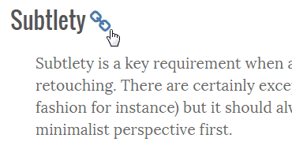
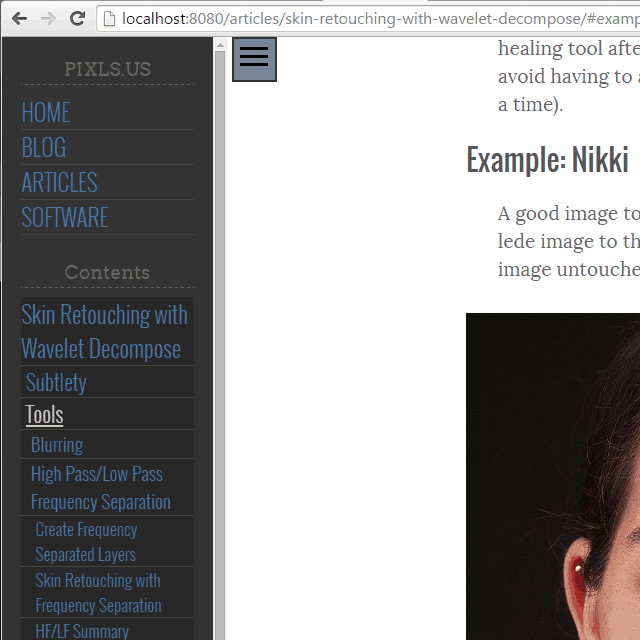

<figure>

</figure>

I tried to find a good funny reference to [Jack Handey](http://en.wikipedia.org/wiki/Jack_Handey) here but failed.
Which might be a good thing given how the reference likely shows my age...

I have been working on various bits of the site as well as finishing up a long-overdue article.
I've also been giving some thoughts in general about interesting ways to move forward with some ideas which I will bore you all with shortly.

<!-- more -->

## Deep Linking

A while back I had [some thoughts](/blog/2014/09/an-about-page-and-help/#breaking-up-long-pages) around how best to format long form articles.
I finally decided to keep articles entirely on a single page as opposed to breaking them up across multiple pages.
Mostly this was because I know I personally hate having to click through too many times just to read an article, and the technique is often used as a cheap means to show more ads to readers.

The problem with single page articles is linking/referencing content at an arbitrary location in the page.
The markdown processor I'm using in [metalsmith](http://metalsmith.io) *does* add a unique heading id to each html heading element, but doesn't expose the link easily.

So I spent some time recently writing a small metalsmith plugin to do that for me.
In the [articles](/articles/) you can now get a direct link to a heading section by hovering the mouse pointer over a heading.
The link will become visible at the end of the heading (as a link icon):

<figure style="border: solid 2px #999; padding: 1rem;">

<figcaption>
The link becomes visible when hovering over a heading.
</figcaption>
</figure>

This lets you now link directly to that section.
So I can now link directly to content deep into the page itself, [like this link](/articles/skin-retouching-with-wavelet-decompose/#example-nikki) to the Nikki example for skin retouching.

These are the same heading links that are used for the *Contents* navigation pane on the menu:

<figure>

</figure>

This method of exposing a heading link is similar to what you may find on [GitHub](http://github.com) for instance.
So, at least there's now the ability to deep-link into articles as needed! :)

## Skin Retouching with Wavelets

Also, I took a break from this other thing I'm working on to finish writing the [Skin Retouching with Wavelet Decompose](/articles/skin-retouching-with-wavelet-decompose/) article.

<figure class='big-vid'>

<figcaption>
*Nikki* is a sample image from the [Skin Retouching with Wavelets](/articles/skin-retouching-with-wavelet-decompose/) article.
</figcaption>
</figure>

This poor article has been in the queue for what feels like forever, so it's nice to finally be able to publish it.
This particular article is a combination of many of the previous things I had written around using wavelet scales for retouching work.
If you get a chance to read it, I'd love to hear what anyone has to say about it!

## Articles Index Page

I'm still experimenting with the look and feel of the [articles index page](/articles/).
If you follow that link you'll see one of the ideas I currently have for laying it out.
I'm not 100% sold on this layout yet, as it may get cumbersome with many articles at once.

I may also provide links at the top of the page for particular content (tutorials, showcases, by tag/software, etc...).

Speaking of which, I'm wondering from a content management standpoint if it makes more sense to publish every item on the site as an "article", then to handle the categorization and display as a function of tags/categories on the posts.
Not quite sure just yet.
I'll still need to fiddle with some other layout/organizational ideas.

## On Another Note

I finally also fixed the path problem when generating the blog post listing page.
I had a problem where locally referenced images for a post (relative to the post directory) didn't have their paths updated when showing them on the blog index page.
So I took some time and repaired it with a small [handlebars](http://handlebarsjs.com) helper function.

For instance, the *Deep Thoughts* image at the beginning of this post wasn't showing correctly from the blog index page before I fixed it.
