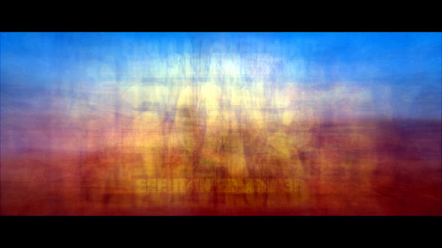

Anyone who's followed me for a while likely knows that I'm friends with [G'MIC] (GREYC's Magic for Image Computing) creator [David Tschumperlé].
I was also able to release all of my film [emulation][] [presets][] on G'MIC for everyone to use with David's help and we collaborated on a bunch of different fun processing filters for photographers in G'MIC (split details/wavelet decompose, [freaky details], [film emulation], [mean/median averaging], and more).

<!-- more -->

<figure>

<figcaption>
[David], by Me (at [LGM2014])
</figcaption>
</figure>

It's also David that helped me by writing a G'MIC script to [mean average images] for me when I started making my amalgamations 
(Thus moving me away from my previous method of using [Imagemagick]):

<figure>

<figcaption>
[Mad Max Fury Road Trailer 2 - Amalgamation](https://www.flickr.com/photos/patdavid/17247263555/in/dateposted-public/)
</figcaption>
</figure>

So when the forums here on [discuss.pixls.us] were finally up and running, it only made sense to offer G'MIC its own part of the forums.
They had previously been using a combination of [Flickr groups] and [gimpchat.com].
These are great forums, they were just a little cumbersome to use.

**You can find the new [G'MIC category here](https://discuss.pixls.us/t/release-of-gmic-1-6-5-1/284).**
Stop in and say hello!

I'll also be porting over the tutorials and articles on work we've collaborated on soon (freaky details, film emulation).

[G'MIC]: http://gmic.eu
[David Tschumperlé]: https://plus.google.com/100527311518040751439/about
[emulation]: http://blog.patdavid.net/2013/08/film-emulation-presets-in-gmic-gimp.html 
[presets]: http://blog.patdavid.net/2013/09/film-emulation-presets-in-gmic-gimp.html
[discuss.pixls.us]: https://discuss.pixls.us
[Flickr groups]: https://www.flickr.com/groups/gmic 
[gimpchat.com]: http://gimpchat.com/viewforum.php?f=28
[LGM2014]: http://libregraphicsmeeting.org/2014/
[David]: https://www.flickr.com/photos/patdavid/13898506065/in/dateposted-public/
[freaky details]: http://blog.patdavid.net/2013/02/calvin-hollywood-freaky-details-in-gimp.html 
[mean/median averaging]: http://blog.patdavid.net/2013/12/mean-averaged-music-videos-g.html
[film emulation]: http://blog.patdavid.net/2013/09/film-emulation-presets-in-gmic-gimp.html
[Imagemagick]: http://imagemagick.org/script/index.php
[mean average images]: http://blog.patdavid.net/2013/12/mean-averaged-music-videos-g.html
