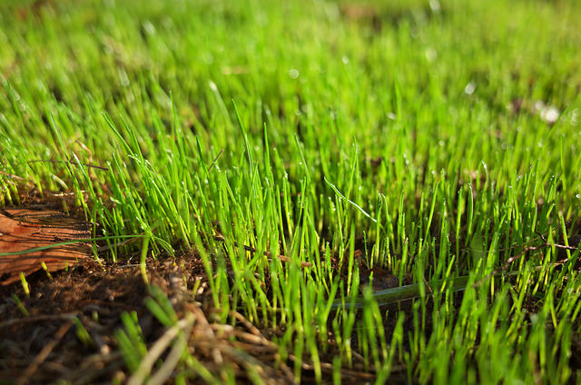
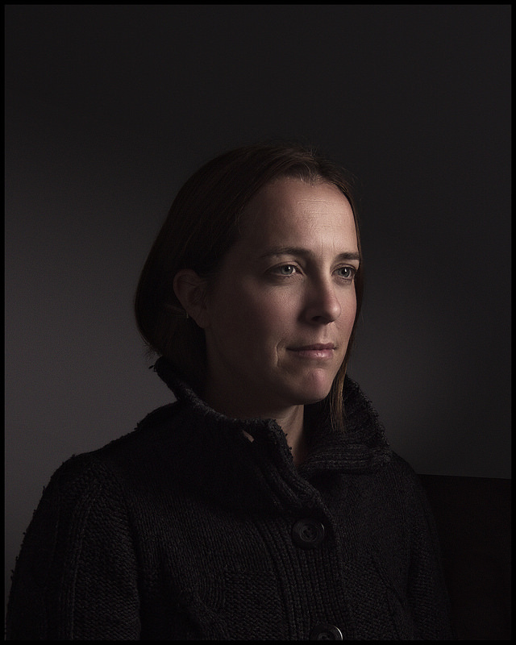
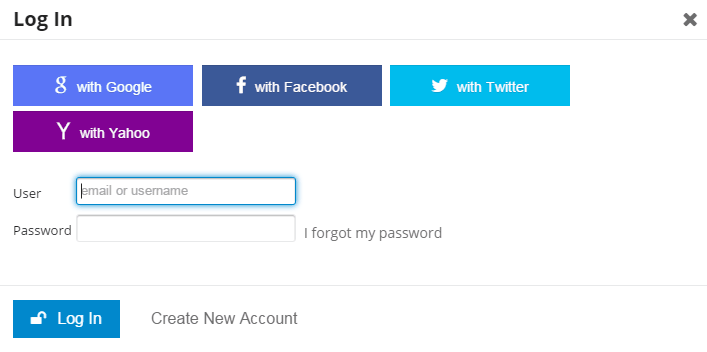

Hot on the heels of our [last post] about welcoming [G'MIC] to the forums at [discuss.pixls.us], I thought I should speak briefly about some other additions I've recently made.

These were tough for me to finally make a decision about.
I want to be careful and not get crazy with *over*-categorization.
At the same time, I *do* want to make good logical breakdowns for people that is still intuitive.

<!-- more -->
Here is what the current category breakdown looks like for discuss:

* [PIXLS.US](https://discuss.pixls.us/c/pixls-us)  
<small>The comment/posts from articles/blogposts here on the main site.</small>
* [Processing](https://discuss.pixls.us/c/processing)  
<small>Processing and managing images after they've been captured.</small>
* [Capturing](https://discuss.pixls.us/c/capturing)  
<small>Capturing an image and the ways we go about doing it.</small>
* [**Showcase**](https://discuss.pixls.us/c/showcase)  
* [**Critique**](https://discuss.pixls.us/c/critique)  
* [Meta](https://discuss.pixls.us/c/meta)  
<small>Discussions related to the website or the forum itself.</small>
 * [Help!]  
    <small>Help with the website or forums.</small>
* [Software]  
<small>Discussions about various software in general.</small>
 * [G'MIC](//discuss.pixls.us/c/software/gmic)  
    <small>Topics all about G'MIC.</small>

Along with the addition of the [Software] category (and the [G'MIC subcategory]), I decided that the [Help!] category would make more sense under the [Meta] category.
That is, the Help! section is for website/forum help, which is more of a Meta topic (hence moving it).

### [Software](https://discuss.pixls.us/c/software)

As we've already seen, there is now a [Software] category for all discussions about the various software we use.
The first sub-category to this is of course, the [G'MIC subcategory].

<figure>

</figure>

If there is enough interest in it, I am open to creating more sub-categories as needed to support particular software projects (GIMP, darktable, RawTherapee, etc...).
I will wait until there is some interest before adding more categories here.

### [Showcase](https://discuss.pixls.us/c/showcase)

This category had some interest from members and I agree that it's a good idea.
It's intended as a place for members to showcase the works they're proud of and to hopefully serve as a nice example of what we're capable of producing using F/OSS tools.

A couple of examples from the *Showcase* category so far:

<figure>

<figcaption>
*New Life*, [Filmulator Output Sample](https://discuss.pixls.us/t/new-life-how-to-get-great-colors-with-filmulator/304), by [CarVac](https://discuss.pixls.us/users/carvac/activity)
</figcaption>
</figure>

<figure>

<figcaption>
[Mairi Troisième](https://discuss.pixls.us/t/mairi-troisieme/302) by [Pat David](https://www.flickr.com/photos/patdavid) (<a href='https://creativecommons.org/licenses/by-nc-sa/2.0/' class='cc'>cbna</a>)
</figcaption>
</figure>

There may be a use of this category later for storing submissions for a [rotating lede image] on the main page of the site.

### [Critique](https://discuss.pixls.us/c/critique)

This is intended as a place for members to solicit advice and critiques on their works from others.
It took me a little work to come up with an initial take on the [overall description] for the category.

I can promise that I will do my best to give honest and constructive feedback to anyone that asks in this category.
I also promise to do my best to make sure that no post goes un-answered here (I know how beneficial feedback has been to me in the past, so it's the least I could do to help others out in return).

## Discuss Login Options

I also bit the bullet this week and _finally_ caved to sign up for a Facebook account.
The only reason was because I had to have a personal account to get an API key to allow people to log in using their FB account (with OAuth).

<figure>

<figcaption>
We can now use Google, Facebook, Twitter, and Yahoo! to Log In.
</figcaption>
</figure>

On the other hand, we now accept **four** different methods of logging in automatically along with signing up for a normal account.
I have been trying to make it as frictionless as possible to join the conversation and hopefully this most recent addition (FB) will help in some small way.

Oh, and if you want to add me on Facebook, my [profile can be found here](https://www.facebook.com/profile.php?id=100009722205862).
I also took the time to create a page for the site here: [PIXLS.US on Facebook](https://www.facebook.com/PIXLSUS).

[last post]: /blog/2015/07/welcome-g-mic/
[G'MIC]: http://gmic.eu
[discuss.pixls.us]: //discuss.pixls.us
[G'MIC subcategory]: //discuss.pixls.us/c/software/gmic
[Software]: https://discuss.pixls.us/c/software
[Help!]: https://discuss.pixls.us/c/meta/help
[Meta]: https://discuss.pixls.us/c/meta
[rotating lede image]: https://discuss.pixls.us/t/poll-main-site-frontpage-lede/244/7
[overall description]: https://discuss.pixls.us/t/about-the-critique-category/309
