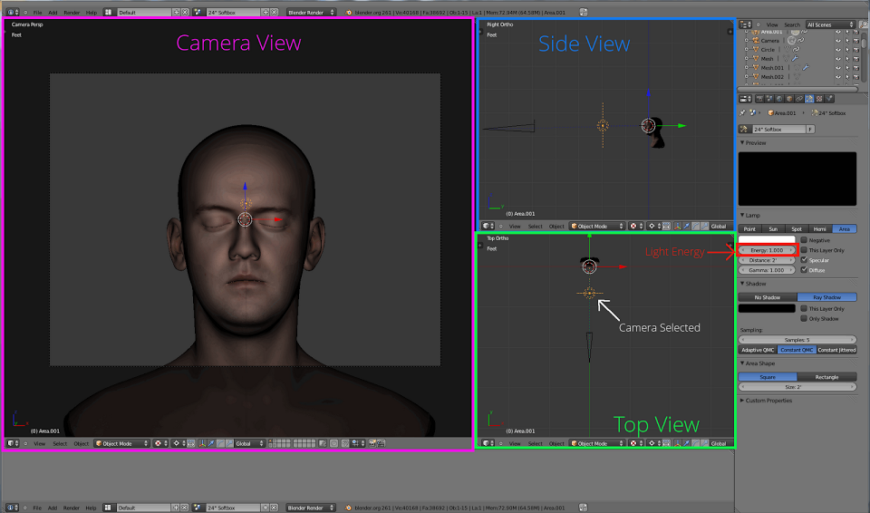
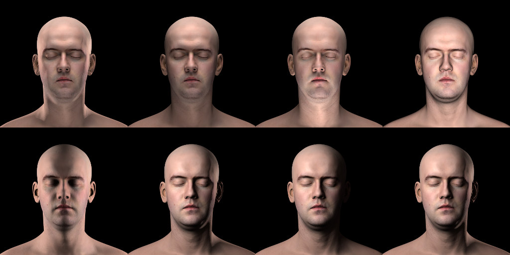
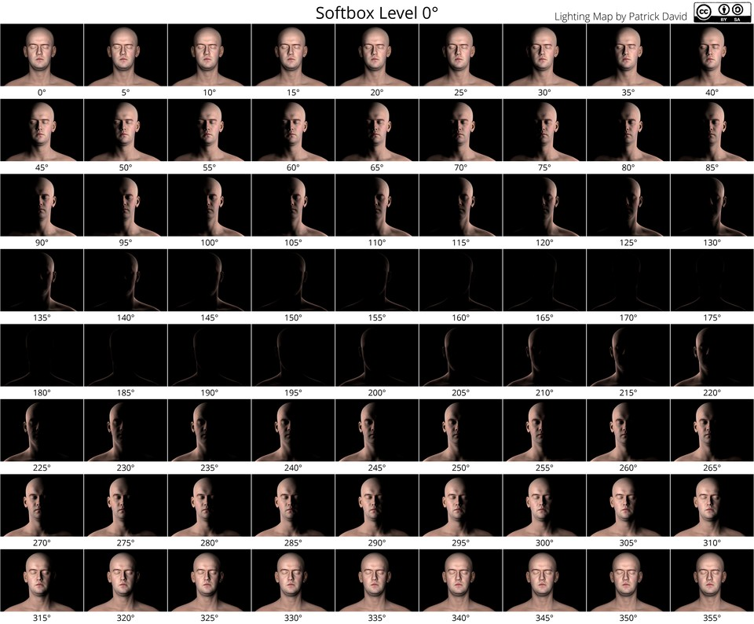
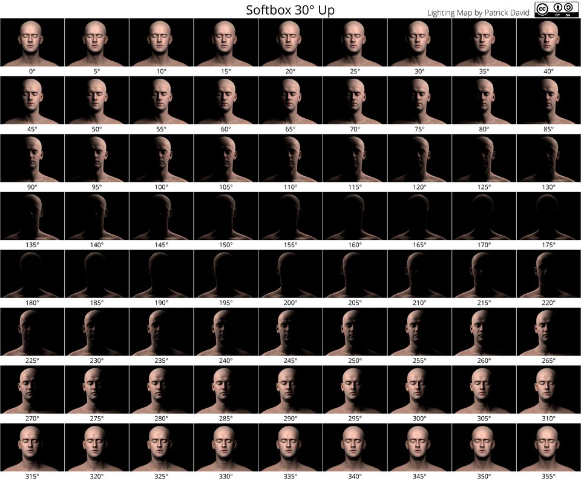
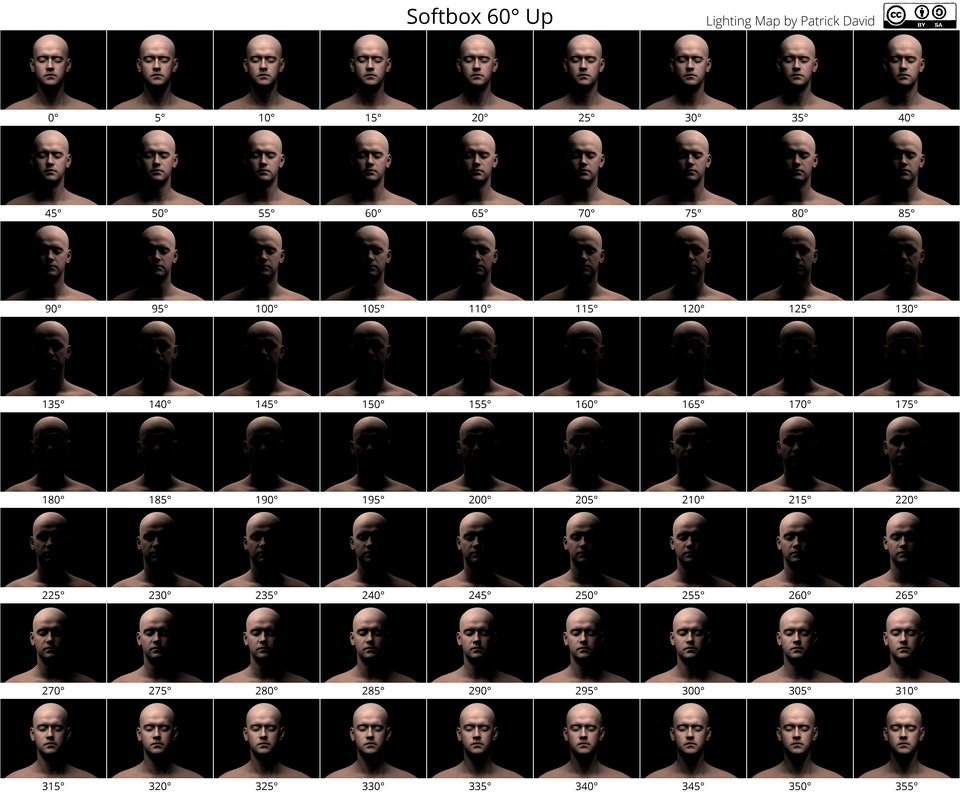

Many moons ago [I had written about][] acquiring a YN-560 speedlight for playing around with off-camera lighting.
At the time I wanted to experiment with how different modifiers might be used in a portrait setting.
Unfortunately, these were lighting modifiers that I didn't own yet.

[I had written about]: http://blog.patdavid.net/2012/03/visualize-photography-lighting-setups.html (Visualize Photography Lighting Setups in Blender)

I wasn't going to let that slow me down, though!

If you want to skip the how and why to get straight to the cheat sheets, [click here](/blog/2015/09/portrait-lighting-cheat-sheets/#the-lighting-cheat-sheets).

[Infinite Realities] had released a full 3D scan by [Lee Perry-Smith] of his head that was graciously licensed under a [Creative Commons Attribution 3.0 Unported License][].
For reference, here is a link to the [object file and textures][] (80MB) and the [displacement maps][] (65MB) from the Infinite Realities website.

[Lee Perry-Smith]: http://ir-ltd.net/tag/lee-perry-smith/ (Possibly NSFW)
[Infinite Realities]: http://ir-ltd.net/
[Creative Commons Attribution 3.0 Unported License]: http://creativecommons.org/licenses/by/3.0/ (Creative Commons Attribution 3.0)
[object file and textures]: http://www.ir-ltd.net/uploads/Infinite_Scan_Ver0.1.rar
[Displacement Maps]: http://www.ir-ltd.net/uploads/Infinite_Scan_Displacements_Ver0.1.rar

What I did was to bring the high resolution scan and displacement maps into [Blender][] and manually created my lights with modifiers in a virtual space.
Then I could simply render what a particular light/modifier would look like with a realistic person being lit in any way I wanted.

[Blender]: http://www.blender.org/

<!-- more -->

<figure class="big-vid">

</figure>

This leads to all sorts of neat freedom to experiment with things to see how they might come out.
Here's another look at the lede image:

<figure class='big-vid'>

<figcaption>
Various lighting setups test in Blender.
</figcaption>
</figure>

I had originally intended to make a nice bundled application that would allow someone to try all sorts of different lighting setups, but my skill in Blender only go so far.
My skills at convincing others to help me didn't go very far either. :)

So, if you're ok with navigating around Blender already, feel free to check out [my original blog post](http://blog.patdavid.net/2012/03/visualize-photography-lighting-setups.html "Visualize Photography Lighting Setups in Blender")
 to download the .blend file and give it try!
[Jimmy Gunawan](https://about.me/jimmygunawan/bio) even took it further and modified the .blend to work with Blender cycles rendering as well.

<iframe width="640" height="360" src="https://www.youtube-nocookie.com/embed/irLcpDdnkcM?rel=0" frameborder="0" allowfullscreen></iframe>

With the power to create a lighting visualization of any scenario I then had to see if there was something cool I could make for others to use...

## The Lighting Cheat Sheets

I couldn't help but generate some lighting cheat sheets to help others use as a reference.
I've seen some different ones around but I took advantage of having the most patient model in the world to do this with. :)

These were generated by rotating a 20" (_virtual_) softbox in a circle around the subject at 3 different elevations (0, 30&deg;, and 60&deg;).

_Click the caption title for a link to the full resolution files_:

<figure class='big-vid'>

<figcaption>
[Softbox 0&deg; Portrait Lighting Cheat Sheet Reference](0-degrees-portrait-lighting-cheat-sheet-reference-full.jpg "Click for full resolution version") 
by Pat David (<a class='cc' href='https://creativecommons.org/licenses/by-sa/2.0/'>cba</a>)
</figcaption>
</figure>

<figure class='big-vid'>

<figcaption>
[Softbox 30&deg; Portrait Lighting Cheat Sheet Reference](30-degrees-portrait-lighting-cheat-sheet-reference-full.jpg "Click for full resolution version") 
by Pat David (<a class='cc' href='https://creativecommons.org/licenses/by-sa/2.0/'>cba</a>)
</figcaption>
</figure>

<figure class='big-vid'>

<figcaption>
[Softbox 60&deg; Portrait Lighting Cheat Sheet Reference](60-degrees-portrait-lighting-cheat-sheet-reference-full.jpg "Click for full resolution version") 
by Pat David (<a class='cc' href='https://creativecommons.org/licenses/by-sa/2.0/'>cba</a>)
</figcaption>
</figure>

Hopefully these might prove useful as a reference for some folks.
Share them, print them out, tape them to your lighting setups! :)
I wonder if we could get some cool folks from the community to make something neat with them?
