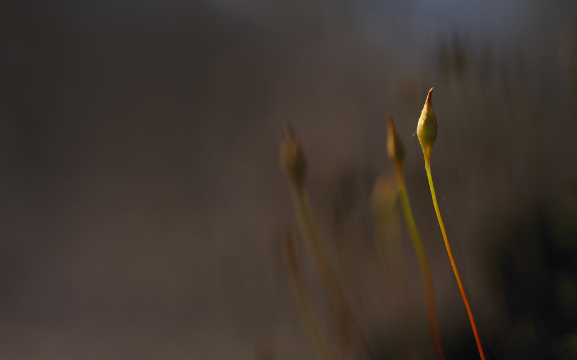
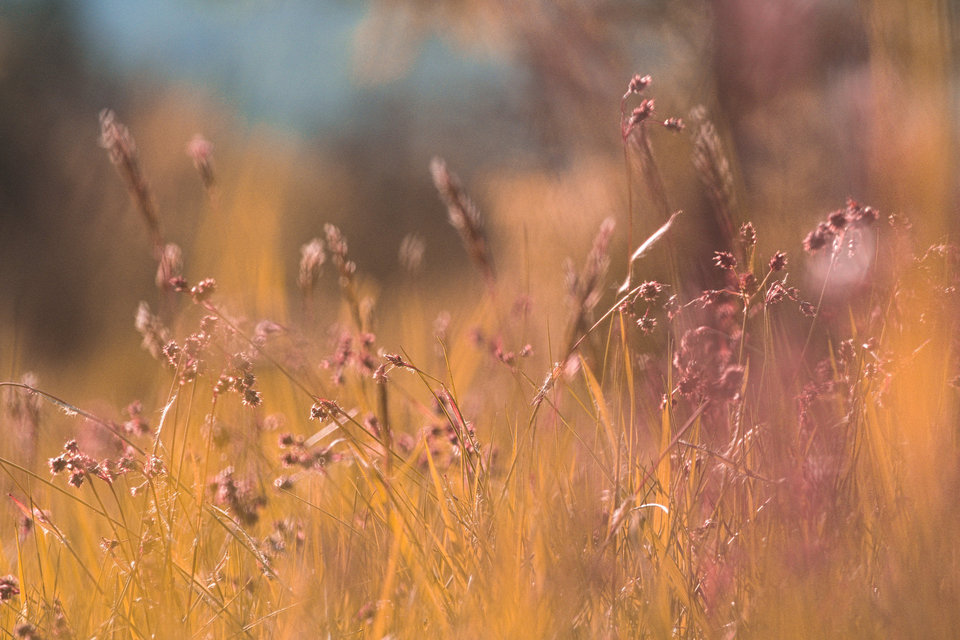
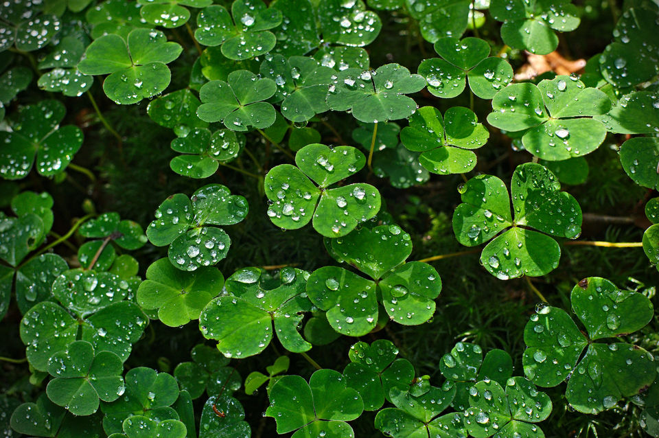
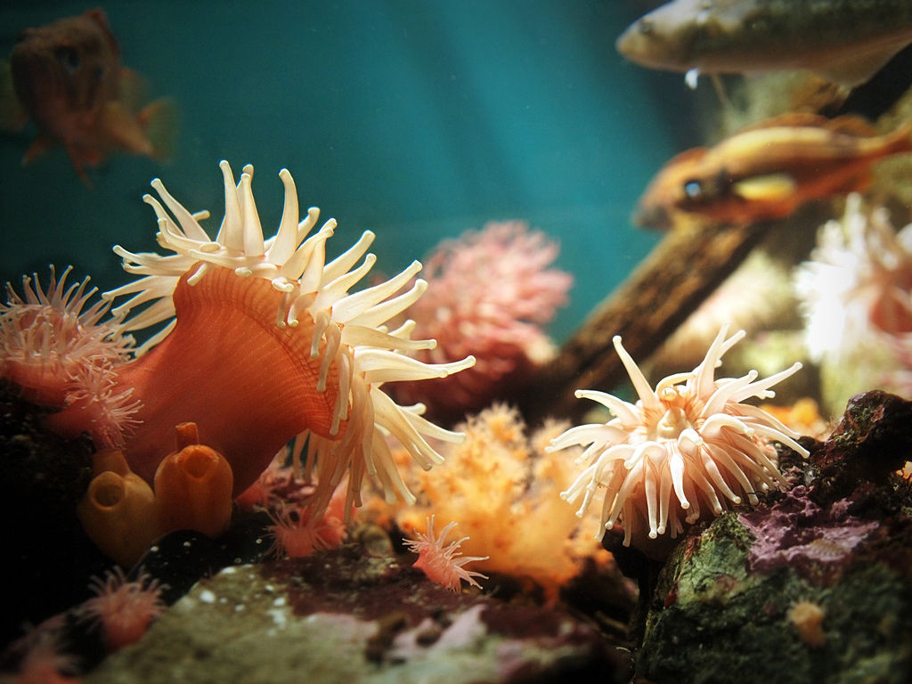

I got busy building a [birthday present for a project][GIMP] I work with and all sort of neat things happened in my absence!
The [Ubuntu][] [*Free Culture Showcase*][Ubuntu Free Culture Showcase] chose winners for it's wallpaper contest for [Ubuntu 15.10][] 'Wily Werewolf' (and quite a few community members were among those chosen).

[Ubuntu]: http://www.ubuntu.com/
[Ubuntu 15.10]: http://releases.ubuntu.com/15.10/

The [darktable][] crew is speeding along to a 2.0 release with a new [RC2 being released][].

[RC2 being released]: /blog/2015/11/happy-birthday-gimp/#darktable-2-0-rc2

Also, a great big [**HAPPY 20th BIRTHDAY GIMP**][bday]!
I made you a present.  I hope it fits and you like it! :)

[bday]: /blog/2015/11/happy-birthday-gimp/#gimp-birthday 

<!-- more -->

## Ubuntu Wallpapers

Back in early September I [posted on discuss][] about the [Ubuntu Free Culture Showcase][] that was looking for wallpaper submissions from the free software community to coincide with the release of Ubuntu 15.10 'Wily Werewolf'.
The winners were recently chosen from among the submissions and several of our community members had their images chosen!

[posted on discuss]: https://discuss.pixls.us/t/ubuntu-free-culture-showcase/382
[Ubuntu Free Culture Showcase]: https://wiki.ubuntu.com/UbuntuFreeCultureShowcase

The winning entries from our community include:

<figure class='big-vid'>

<figcaption>
[*Moss inflorescence*][1] 
The first winner is from [PhotoFlow][] creator [Andrea Ferrero][]
<figcaption>
</figure>

[1]: https://www.flickr.com/photos/carmelo75/21455138181
[PhotoFlow]: http://www.google.com
[Andrea Ferrero]: http://photoflowblog.blogspot.com

<figure class='big-vid'>

<figcaption>
[*Light my fire, evening sun*][2] 
by [Dariusz Duma][]
<figcaption>
</figure>

[2]: https://www.flickr.com/photos/40792319@N04/20651557934
[Dariusz Duma]: https://www.flickr.com/photos/40792319@N04/

<figure class='big-vid'>

<figcaption>
[*Sitting Here, Making Fun*][3] 
by [Mimir][]
<figcaption>
</figure>

[3]: https://www.flickr.com/photos/philipphaegi/21155753321
[Mimir]: https://www.flickr.com/photos/philipphaegi/

<figure class='big-vid'>

<figcaption>
[*Tranquil*][4] 
by [Pat David][]
<figcaption>
</figure>

[4]: https://www.flickr.com/photos/patdavid/4624063643
[Pat David]: https://www.flickr.com/photos/patdavid/

A big congratulations to you all for some amazing images being chosen!
If you're running Ubuntu 15.10, you can grab the `ubuntu-wallpapers` package to [get these images right here][get]!

[get]: https://launchpad.net/ubuntu/wily/+source/ubuntu-wallpapers

## darktable 2.0 RC2

Hot on the heels of the prior release candidate, [darktable][] now [has an RC2 out][rc2].
There are many minor bugfixes from the previous RC1, such as:

* high iso fix for exif data of some cameras
* various macintosh fixes (fullscreen)
* fixed a deadlock
* updated translations

The preliminary changelog from the 1.6.x series:

* darktable has been ported to gtk-3.0
* new thumbnail cache replaces mipmap cache (much improved speed, less crashiness)
* added print mode
* reworked screen color management (softproof, gamut check etc.)
* removed dependency on libraw
* removed dependency on libsquish (solves patent issues as a side effect)
* unbundled pugixml, osm-gps-map and colord-gtk
* text watermarks
* color reconstruction module
* raw black/white point module
* delete/trash feature
* addition to shadows&highlights
* more proper Kelvin temperature, fine-tuning preset interpolation in WB iop
* noiseprofiles are in external JSON file now
* monochrome raw demosaicing (not sure whether it will stay for release, like Deflicker, but hopefully it will stay)
* aspect ratios for crop&rotate can be added to conf (ae36f03)
* navigating lighttable with arrow keys and space/enter
* pdf export -- some changes might happen there still
* brush size/hardness/opacity have key accels
* the facebook login procedure is a little different now
* export can upscale
* we no longer drop history entries above the selected one when leaving dr or switching images
* text/font/color in watermarks
* image information now supports gps altitude
* allow adding tone- and basecurve nodes with ctrl-click
* new "mode" parameter in the export panel
* high quality export now downsamples before watermark and frame to guarantee consistent results
* lua scripts can now add UI elements to the lighttable view (buttons, sliders etc...)
* a new repository for external lua scripts was started.

More information and packages can be [found on the darktable github repository][rc2].

Remember, updating from the currently stable 1.6.x series is a one-way street for your edits (no downgrading from 2.0 back to 1.6.x).

[darktable]: http://www.darktable.org
[rc2]: https://github.com/darktable-org/darktable/releases/tag/release-2.0rc2

## GIMP Birthday

All together now...

*Happy Birthday to GIMP!  Happy Birthday to GIMP!*...

<figure>

<figcaption>
</figcaption>
</figure>

This past weekend [GIMP][] celebrated it's 20th anniversary!
It was twenty years ago on November 21st that Peter Mattis [announced the availability][announce] of the **"General Image Manipulation Program"** on _comp.os.linux.development.apps_.

Twenty years later and GIMP doesn't look a day older than a 1.0 release!
(Yes, there's a [double entendre][] there).

To celebrate, I've been spending the past couple of months getting a brand new website and infrastructure built for the project!
<small>*Just in case anyone was wondering where I was or why I was so quiet.*</small>
I like the way it turned out and is shaping up so go have a look if you get a moment!

There's even an [official news post][20] about it on the new site!

[GIMP]: https://www.gimp.org
[announce]: http://www.gimp.org/about/prehistory.html#november-1995-an-announcement
[double entendre]: https://en.wikipedia.org/wiki/Double_entendre
[20]: http://www.gimp.org/news/2015/11/22/20-years-of-gimp-release-of-gimp-2816/ 

### GIMP 2.8.16

To coincide with the 20th anniversary, the team also released a new stable version in the 2.8 series: [2.8.16][getGIMP].
Head over to the downloads page to pick up a copy!!

[getGIMP]: http://www.gimp.org/downloads/

## New PhotoFlow Tutorial

Still working hard and fast on [PhotoFlow][], [Andreas][Andrea Ferrero] took some time to record a new video tutorial.
He walks through some basic usage of the program, in particular opening an image, adding layers and layer masks, and saving the results.
Have a look and if you have a moment give him some feedback!

<iframe width="640" height="360" src="https://www.youtube-nocookie.com/embed/HQpyJapbxrY?rel=0" frameborder="0" allowfullscreen></iframe>

Andreas is working on PhotoFlow at a very fast pace, so expect some more news about his progress very soon!
