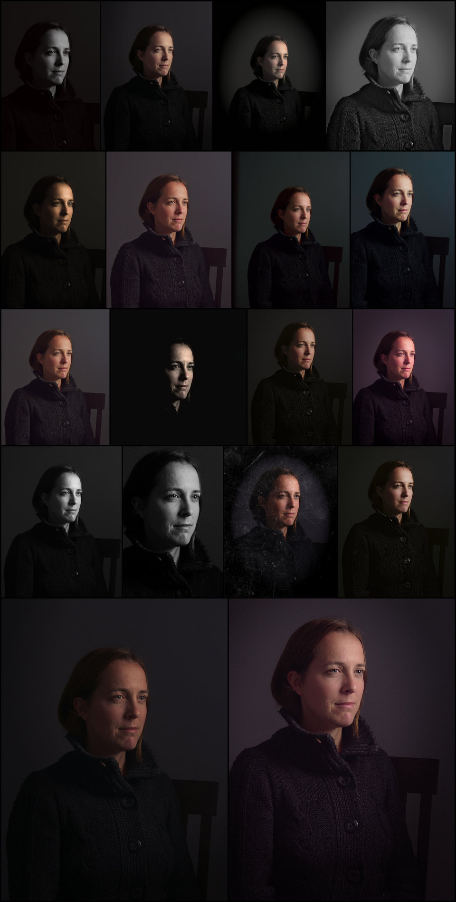

On the old [RawTherapee][] forums they used to have a contest sharing a single raw file amongst the members to see how everyone would approach processing from the same starting point.  They called it **PlayRaw**.  This seemed to really bring out some great work from the community so I thought it might be fun to start doing something similar again here.

I took a (_relatively_) recent image of [Mairi][mairi-album] and decided to see how it would be received (I'd say fairly well given the responses).  This was my result from the raw file that I called [_Mairi Troisième_][mt]:

[mairi-album]: https://www.flickr.com/photos/patdavid/albums/72157632799856846 (Mairi Album on Flickr)
[mt]: https://www.flickr.com/photos/patdavid/16259030889/in/album-72157632799856846/ (Mairi Troisieme on Flickr)

<!-- more -->

<figure>

</figure>

I made the raw file available under a [Creative Commons, By-Attribution, Non-Commercial, Share-Alike license][cc-by-sa-nc] so that anyone could freely download and process the file as they wanted to.

[cc-by-sa-nc]: https://creativecommons.org/licenses/by-nc-sa/3.0/ (Creative Commons BY-SA-NC)

The only things I asked for was to see the results and possibly the processing steps through either an XMP or PP3 sidecar file ([darktable][] and [RawTherapee][] respectively).

[darktable]: http://www.darktable.org/
[RawTherapee]: http://rawtherapee.com/

Here's a montage of the results from everyone:

<figure class='big-vid'>

</figure>

I loved being able to see what everyone's approaches looked like.  It's neat to get a feel for all the different visions out there among the users and there were some truly beautiful results!

If you haven't given it a try yourself yet, head on over to the [\[PlayRaw] Mairi Troisieme][pr-mairi] thread to get the raw file and try it out yourself!  Just don't forget to show us _your_ results in the topic.

[pr-mairi]: https://discuss.pixls.us/t/playraw-mairi-troisieme

I'll be soliciting options for a new image to kick off another round of processing again soon.

## Speaking of Mairi

Don't forget that we still have a [Pledgie Campaign][] going on to help us offset the costs of getting everyone together at the [2016 Libre Graphics Meeting in London][lgm2016] this April!

[Pledgie Campaign]: https://pledgie.com/campaigns/30905
[lgm2016]: /blog/2016/01/libre-graphics-meeting-london/

Donations go to help cover to costs of various projects to come together and meet, photograph, discuss, and hack at things.  Please consider donating as every little bit helps us immensely!  If you can't donate then please consider helping us to raise awareness of what we're trying to do!  Either link the Pledgie campaign to others or let them know we're here to help and share!

Even better is if you're in the vicinity of London this April 15&ndash;18! Come out and join us as well as many other awesome Free Software projects all focused on the graphics community!  We (PIXLS) will be conducting photowalks and meet-ups the Thursday before LGM kicks off as well!

Oh, and I finally did convince Mairi to join us through the weekend to model for us as needed.  She's super awesome and worth raising a glass to/with!  Even more reason to come out and join us!

<figure>

</figure>
