What a blast!

This trip report is long overdue, but I wanted to process some of my images to share with everyone before I posted.

It had been a couple of years since I had an opportunity to travel and meet with the [GIMP][] team again ([Leipzig][] was awesome) so I was really looking forward to this trip.  I missed the opportunity to head up to the great white North for last years meeting in Toronto.

[GIMP]: https://www.gimp.org
[Leipzig]: https://www.flickr.com/photos/patdavid/albums/72157643712169045 

<!-- more -->

## London Calling
<figure>
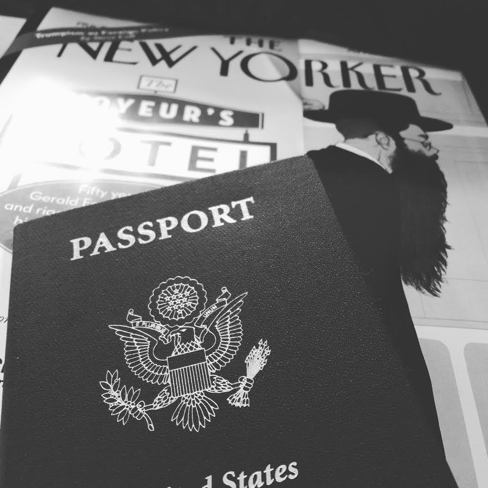
<figcaption>
Passport? Check! Magazine? Check! Ready to head to London!
</figcaption>
</figure>

I was going to attend the pre-LGM photowalk again this year so this time I decided to pack some bigger off-camera lighting modifiers for everyone to play with.  Here's a neat travelling photographer pro-tip: most airlines will let you carry on an umbrella as a "freebie" item.  They just don't specify that it _has_ to be an umbrella to keep the rain off you.  So I carried on my big Photek Softlighter II (luckily my light stands fit in my checked luggage).  Just be sure not to leave it behind somewhere (which I was paranoid about for most of my trip).  Luckily I was only changing planes in Atlanta.

<figure>
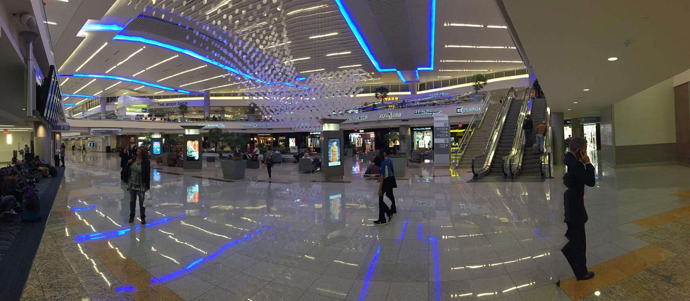
<figcaption>
The new 'futristic' looking Atlanta airport international terminal.
</figcaption>
</figure>

A couple of (_bad_) movies and hours later I was in Heathrow.  I figured it wouldn't be much trouble getting through border control.  

I may have been a little optimistic about that.  

The __Border Force__ agent was quite nice and _super_ inquisitive.  So much so that I actually began to worry at some point (I think I must have spent almost 20 minutes talking to her) that she might not let me in!

She kept asking what I was coming to London for and I kept trying to explain to her what a "_Libre Graphics Meeting_" was.  This was almost a tragic comedy.  The idea of Free Software did not seem to compute to her and I was sorry I had even made the passing mention.  Her attention then turned to my umbrella and photography.  What was I there to photograph?  Who?  Why?  (Come to think of it, I should start asking myself those same questions more often... It was an existential visit to the border control.)

In the end I think she got bored with my answers and figured that I was far too awkward to be a threat to anything.  Which pretty much sums up my entire college dating life.

## Photowalk
In what I hope will become a tradition we had our photowalk the day before LGM officially kicked off and we could not have asked for a better day of weather!  It was partly cloudy and just gorgeous (pretty much the complete _opposite_ to what I was expecting for London weather). 

### Furtherfield Commons

I want to thank [Ruth Catlow][] (http://ruthcatlow.net/) for allowing us to use the awesome space at [Furtherfield Commons][furtherfield] in Finsbury Park as a base for our photowalk!  They were amazingly accommodating and we had a wonderful time chatting in general about art and what they were up to at the gallery and space.

[Ruth Catlow]: http://ruthcatlow.net
[furtherfield]: http://www.furtherfield.org

They have some really neat things going on at the gallery and space so be sure to check them out if you can!

### Going for a Walk with Friends
This is one of my favorite things about being able to attend LGM.  I get to take a stroll and talk about photography with friends that I only usually get to interact with through an IRC window. I also feel like I can finally contribute something back to these awesome people that provide software I use every day.

<figure >

<figcaption>
Mairi between Simon and myself (I'm holding a reflector for him). 
Photo by [Michael Schumacher](https://www.flickr.com/photos/schumaml/25858162683/in/dateposted/) [cbna][]
</figcaption>
</figure>

We meandered through the park and chatted a bit about various things.  Simon had brought along his external flash and wanted to play with off-camera lighting.  So we convinced Liam to stand in front of a tree for us and Simon ended up taking one of my favorite images from the entire trip.  This was Liam standing in front of the tree under the shade with me holding the flash slightly above him and to the camera right.

<figure>
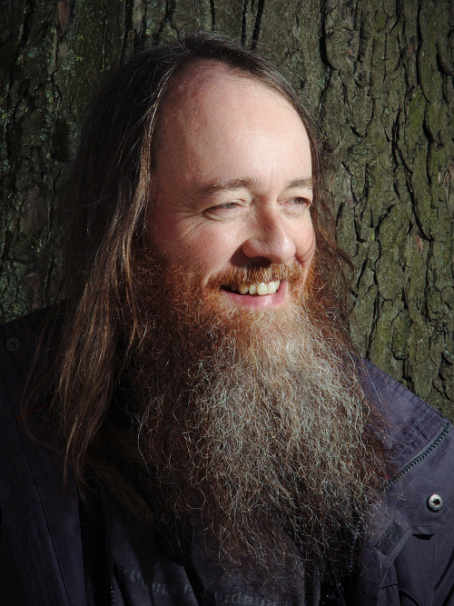
<figcaption>
Liam by Simon
</figcaption>
</figure>

We even managed to run into Barrie Minney while on our way back to the Commons building.  Aryeom and I started talking a little bit while walking when we crossed paths with some locals hanging out in the park.  One man in particular was quite outgoing and let Aryeom take his photo, leading to another fun image!

Upon returning to the Commons building we experimented with some of the pretty window light coming into the building along with some black panels and a model (Mairi).  This was quite fun as we were experimenting with various setups for the black panels and speedlights.  Everyone had a chance to try some shots out and to direct Mairi (who was _super_ patient and accommodating while we played).

<figure>

<figcaption>
I was having so much fun talking and trying things out with everyone that I didn't even take that many photos of my own!  This is one of my only images of Mairi inside the Commons. 
<i>Mairi Natural Light</i> [cba][]
</figcaption>
</figure>

Towards the end of our day I decided get my big Softlighter out and to try a few things in the lane outside the Commons building.  Luckily Michael Schumacher grabbed an image of us while we were testing some shots with Mairi outside.

<figure>

<figcaption>
A nice behind-the-scenes image from schumaml of the lighting setup used below. 
Yes, that's <a href='http://www.darktable.org'>darktable</a> developer hanatos bracing the umbrella from the wind for me! 
<i>Photo by [Michael Schumacher](https://www.flickr.com/photos/schumaml/25858162683/in/dateposted/) </i>[cbna][]
</figcaption>
</figure>

I loved the lane receding in the background and thought it might make for some fun images of Mairi.  I had two YN-560 flashes in the Softlighter both firing around &frac34; power.  I had to balance the ambient sky with the softlighter so needed the extra power of a second flash (it also helps to keep the cycle times down).

<figure>

<figcaption>
Mairi waiting patiently while we set things up. 
<i>Mairi Finsbury</i> [cba][] 
50mm <i style='font-family:serif;'>f</i>/8.0 1&frasl;200 ISO200
</figcaption>
</figure>

<figure>

<figcaption>
<i>Mairi Finsbury Park (In the Lane)</i> [cba][]
</figcaption>
</figure>

The day was awesome and I really enjoyed being able to just hang out with everyone and take some neat photos.  The evening at the pub was pretty great also (I got to hang out with Barrie and his friend and have a couple of pints - _thanks again Barrie_!).

## LGM
It never fails to amaze me how every year the LGM organizers manage to put together such a great meeting for everyone.  The venue was great and the people were just fantastic at the University of Westminster.

<figure class='big-vid'>
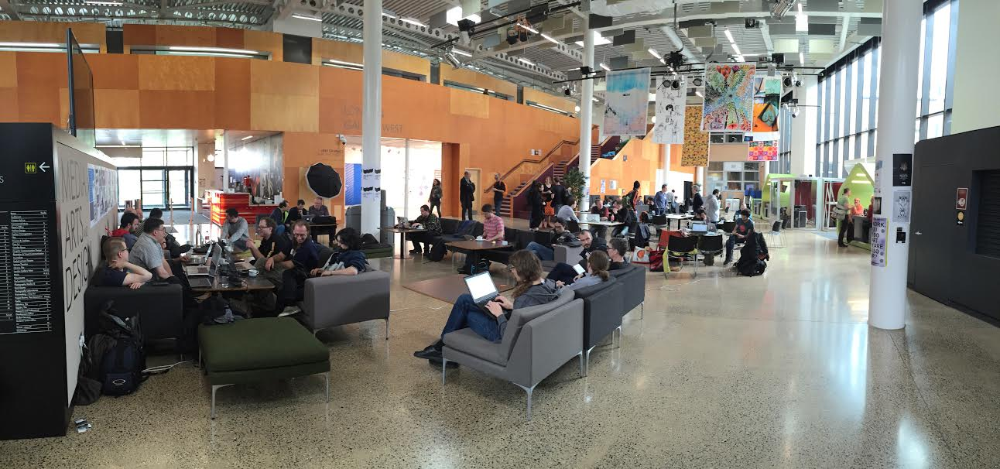
<figcaption>
View of the lobby and meeting rooms (on the second floor).
</figcaption>
</figure>

<figure class='big-vid'>
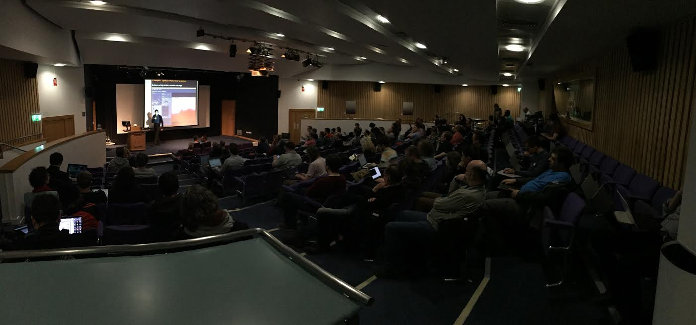
<figcaption>
Andrea Ferrero ([@Carmelo_DrRaw][]) presenting <a href='http://aferrero2707.github.io/PhotoFlow/' title='PhotoFlow website'>PhotoFlow</a> in the auditorium!
</figcaption>
</figure>

The opening "_State of the Libre Graphics_" presentation was done by our (the GIMP teams) very own João Bueno who did a fantastic job! João will also be the local organizer for the 2017 LGM in Rio.

Thanks to contributions from community members [Kees Guequierre][], [Jonas Wagner][], and [Philipp Haegi][] I had some great images to use for the PIXLS.US community slides for the "_State of the Libre Graphics_".  If anyone is curious, here is what I submitted:

[Kees Guequierre]: https://www.flickr.com/photos/andabata 
[Jonas Wagner]: https://29a.ch/ 
[Philipp Haegi]: https://www.flickr.com/photos/philipphaegi 

<figure>
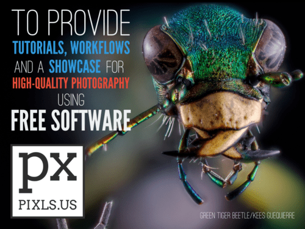
<figcaption>
</figcaption>
</figure>

<figure>
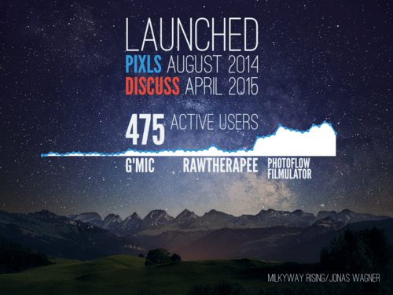
<figcaption>
</figcaption>
</figure>

<figure>
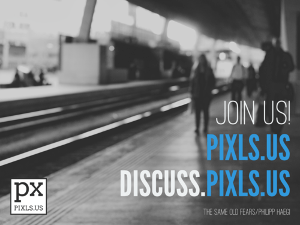
<figcaption>
</figcaption>
</figure>

These slides can be found on our [Github PIXLS.US Presentations][gh] page (along with all of our other presentations that relate to PIXLS.US and promoting the community).  

[gh]: https://github.com/pixlsus/Presentations

Speaking of presentations...

### Presentation
I was given some time to talk about and present our community to everyone at the meeting. (See embedded slides below):

<figure>

</figure>

I started by looking at what my primary motivation was to begin the site and what the state of free software photography was like at that time (or not like).  Mainly that the majority of resources online for photographers that were high quality (and focused on high-quality results) were usually aimed at proprietary software users.  Worse still, in some cases these websites locked away their best tutorials and learning content behind paywalls and subscriptions.  I finished by looking at what was done to build this site and forum as a community for everyone to learn and share with each other freely.

I think the presentation went well and people seemed to be interested in what we were doing!  Nate Willis even published an article about the presentation at [LWN.net][], [_"Refactoring the open-source photography community"_][lwn]:

[LWN.net]: http://lwn.net
[lwn]: http://lwn.net/Articles/684279/

<figure>
<a href='http://lwn.net/Articles/684279/' title='Refactoring the open-source photography community on LWN.net'>
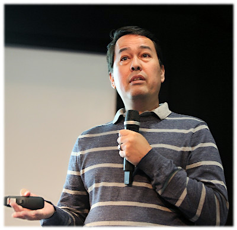
</a>
<figcaption>
A photo of me I <i>don't</i> hate! :)
</figcaption>
</figure>

### Exhibition
A nice change this year was the inclusion of an exhibition space to display works by LGM members and artists.  We even got an opportunity to hang a couple of prints (for some reason they really wanted my quad-print of pippin).  I was particularly happy that we were able to print and display the [_Green Tiger Beetle_][gtb] by community member [Kees Guequierre][]:

[gtb]: https://www.flickr.com/photos/andabata/20025243436

<figure>
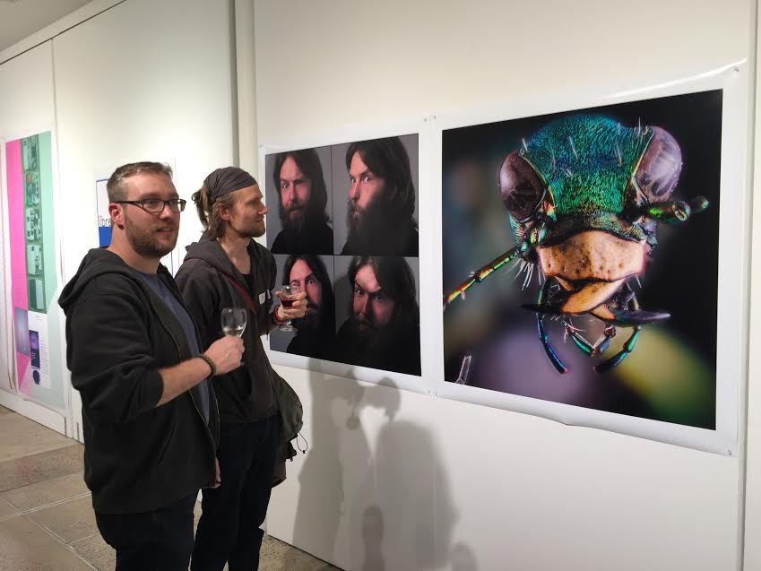
<figcaption>
Hanatos and houz inspecting the prints at the exhibition.
</figcaption>
</figure>

<figure>
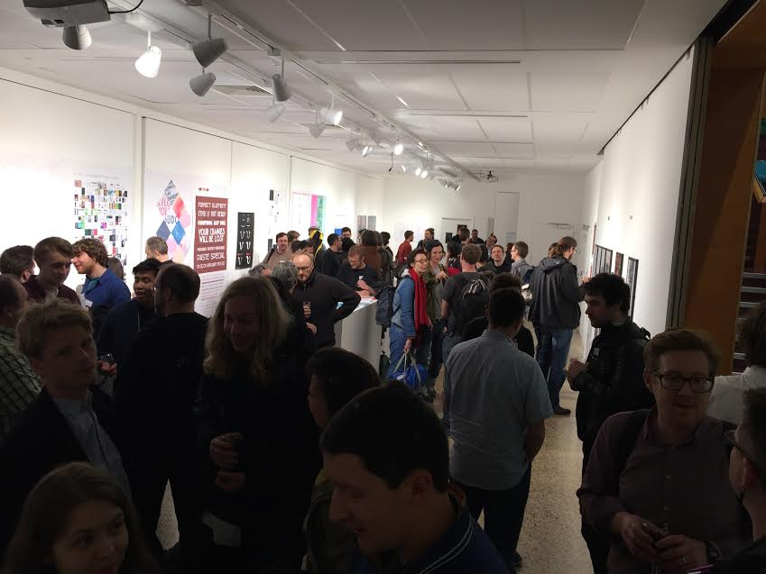
<figcaption>
View of the Exhibition.  Well attended!
</figcaption>
</figure>

<figure>
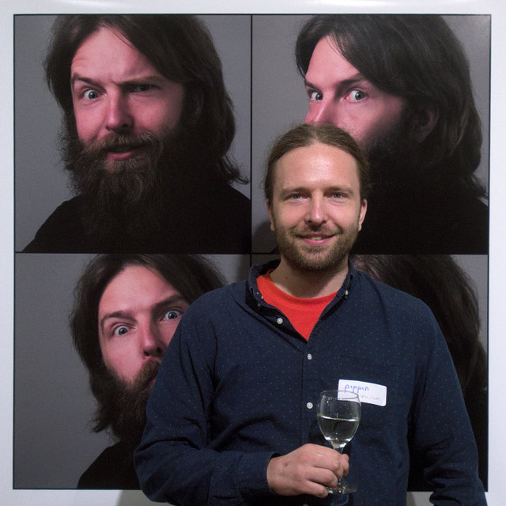
<figcaption>
pippin x5
</figcaption>
</figure>

### Portraits
In Leipzig I thought it would be nice to offer portraits/headshots of folks that attended the meeting.  I think it's a great opportunity to get a (hopefully) nice photograph that people can use in social media, avatars, websites, etc.  Here's a sample of portraits from LGM2014 of the GIMP team that sat for me:

In 2014 I was lucky that houz had brought along an umbrella and stand to use, so this time I figured it was only fair that I bring along some gear myself.  I had the Softlighter setup on the last couple of days for anyone that was interested in sitting for us.  I say us because Marek Kubica ([@Leonidas][]) from the community was right there to shoot with me along with the very famous [@Ofnuts][] (well - famous to me - I've lost count of the neat things I've picked up from his advice)!  Marek took quite a few portraits and managed the subjects very well - he was conversational, engaged, and managed to get some great personality from them.

<figure>

<figcaption>
A sample portrait by [Marek Kubica][marek] [cba][]
</figcaption>
</figure>

<figure>

<figcaption>
[Better with glasses](https://www.flickr.com/photos/103724284@N02/26526017851) by [Marek Kubica][marek] [cba][]
</figcaption>
</figure>

A couple of samples from the images that I got are here as well, and they are the local organizer Lara with students from the University!  I simply can't thank them enough for the efforts and generosity in making us feel so welcome.

<figure>
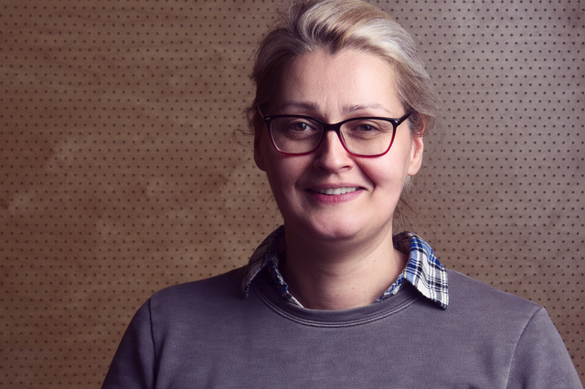
</figure>

<figure>
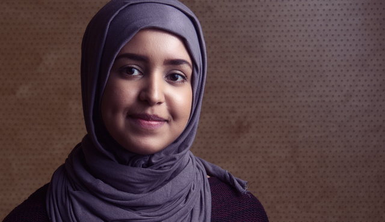
</figure>

<figure>
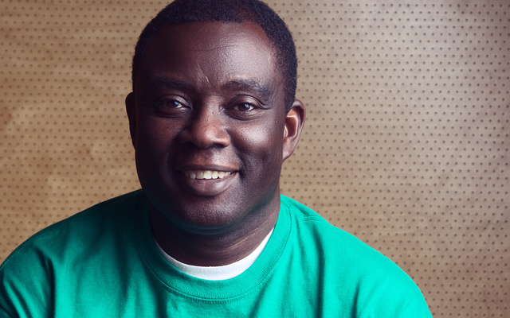
</figure>

I'm still working through the portraits I took, but I'll have them uploaded to [my Flickr][] soon to share with everyone!

## GIMPers

One of the best parts of attendance is getting to spend some time with the rest of the GIMP crew.  Here's an action shot during the GIMP meeting over lunch with a neat, glitchy schumaml:

<figure class='big-vid'>
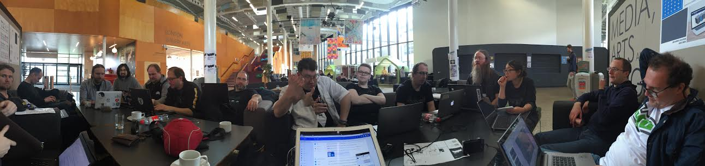
<figcaption>
There's even some [darktable][] nerds thrown in there!
</figcaption>
</figure>

It was great to see everyone at the flat on our last evening there as well...

<figure>
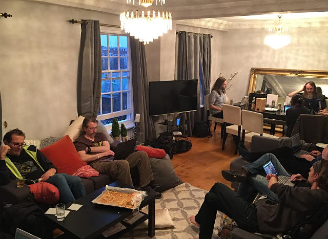
<figcaption>
Everyone spending the evening together!  Mitch is missing from his seat in this shot (back there by pippin).
</figcaption>
</figure>

## Wrap up
Overall this was another incredible meeting bringing together great folks who are building and supporting Free Software and Libre Graphics.  Just my kind of crowd!

I even got a chance to speak a bit with the wonderful [Susan Spencer][] of the [Valentina][] project and we roughed out some thoughts about getting together at some point.  It turns out she lives just up the same state as me (Alabama)!  This is simply too great to not take advantage of - Free Software Fashion + Photography?!  That will have to be a fun story (and photos) for another day...

Keep watching the blog for some more images from the trip - up next are the portraits of everyone and some more shots of the venue and exhibition!

[marek]: https://www.flickr.com/photos/103724284@N02/
[lgm2016]: http://www.libregraphicsmeeting.org/2016/
[cba]: https://creativecommons.org/licenses/by-sa/2.0/
[cbna]: https://www.flickr.com/photos/103724284@N02/26526017851 
[my Flickr]: https://flickr.com/photos/patdavid
[@Ofnuts]: https://discuss.pixls.us/users/ofnuts/activity
[@Leonidas]: https://discuss.pixls.us/users/leonidas/activity
[Valentina]: http://valentinaproject.bitbucket.org/
[Susan Spencer]: https://github.com/tusuzu
[@Carmelo_DrRaw]: https://discuss.pixls.us/users/carmelo_drraw/activity
[darktable]: https://www.darktable.org
