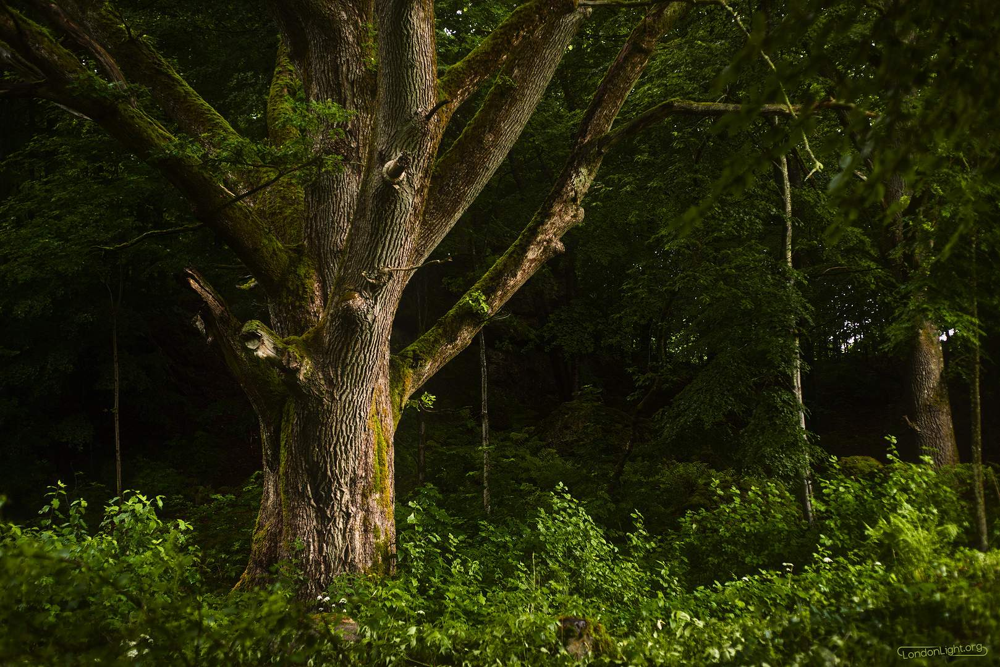
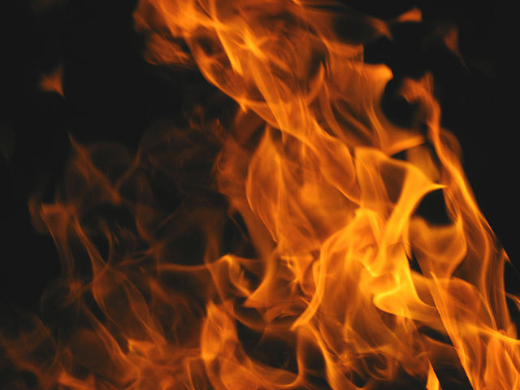

Community member and [RawTherapee][] hacker Morgan Hardwood brings us a great tutorial + assets from one of his strolls near the [Söderåsen National Park][] (Sweden!). [Ofnuts][] is apparently trying to get me to burn the forum down by sharing his raw file of a questionable subject.  After bugging [David Tschumperlé][] he managed to find a neat solution to generating a median (pixel) blend of a large number of images without making your computer throw itself out a window.

[RawTherapee]: http://www.rawtherapee.com
[Ofnuts]: https://discuss.pixls.us/users/ofnuts/activity
[Söderåsen National Park]: https://en.wikipedia.org/wiki/S%C3%B6der%C3%A5sen_National_Park
[David Tschumperlé]: http://opensource.graphics/
[discuss]: https://discuss.pixls.us
[darktable]: http://www.darktable.org
[made available on Github]: https://github.com/pixlsus/website

So much neat content being shared for everyone to play with and learn from!  Come see what everyone is doing!

<!-- more -->

## Old Oak - A Tutorial

Sometimes you're just hanging out minding your own business and talking photography with friends and other Free Software nuts when someone comes running by and drops a great tutorial in your lap.  Just as Morgan Hardwood [did on the forums][1] a few days ago!

[1]: https://discuss.pixls.us/t/old-oak-a-tutorial/1627

<figure class='big-vid'>

<figcaption>
_Old Oak by Morgan Hardwood_ <a href='https://creativecommons.org/licenses/by-sa/4.0/' class='cc'>cbsa</a>
</figcaption>
</figure>

He introduces the image and post:

> There is an old oak by the southern entrance to the [Söderåsen National Park](https://en.wikipedia.org/wiki/S%C3%B6der%C3%A5sen_National_Park). Rumor has it that this is the oak under which Gandalf sat as he smoked his pipe and penned the famous saga about J.R.R. Tolkien. I don't know about that, but the valley [rabbits](http://lotr.wikia.com/wiki/Rhosgobel_Rabbits) sure love it.

The image itself is a treat.  I personally love images where the lighting does interesting things and there are some gorgeous things going on in this image.  The diffused light flooding in under the canopy on the right with the edge highlights from the light filtering down make this a pleasure to look at.

Of course, Morgan doesn't stop there.  You should absolutely [go read his entire post][1].  He not only walks through his entire thought process and workflow starting at his rationale for lens selection (50mm f/2.8) all the way through his corrections and post-processing choices. To top it all off, he has graciously shared his assets for anyone to follow along! He provides the raw file, the [flat-field][], a shot of his color target + [DCP][], and finally his RawTherapee .PP3 file with all of his settings!  Whew!

[flat-field]: http://50.87.144.65/~rt/w/index.php?title=Flat_Field
[DCP]: http://www.ludd.ltu.se/~torger/dcamprof.html

If you're interested I urge you to go check out (and participate!) in his topic on the forums: [**Old Oak - A Tutorial**][1].

## I Will Burn This Place to the Ground

Speaking of sharing material, [Ofnuts][] has decided that he apparently wants me to burn the forums to the ground, put the ashes in a spaceship, fly the spaceship into the sun, and to detonate the entire solar system into a singularity.  Why do I say this?

<figure>

<figcaption>
Kill it with fire!
</figcaption>
</figure>

Because he started a topic appropriately entitled: [_"NSFPAOA (Not Suitable for Pat and Other Arachnophobes)"_][NSFPAOA], in which he shares his raw .CR2 file for everyone to try their hand at processing that cute little spider above. There have already been quite a few awesome interpretations from folks in the community like:

[Ofnuts]: https://discuss.pixls.us/users/ofnuts/
[NSFPAOA]: https://discuss.pixls.us/t/nsfpaoa-not-suitable-for-pat-and-other-arachnophobes/1644

<figure>

<figcaption>
A version by CarVac
</figcaption>
</figure>

<figure>

<figcaption>
By MLC/Morgin
</figcaption>
</figure>

<figure>

<figcaption>
By Jonas Wagner
</figcaption>
</figure>

<figure>

<figcaption>
By iarga
</figcaption>
</figure>

<figure>

<figcaption>
By PkmX
</figcaption>
</figure>

<figure>

<figcaption>
By Kees Guequierre
</figcaption>
</figure>

Of course, I had a chance to try processing it as well.  Here's what I ended up with:

<figure>
</figure>

Ahhhh, just writing this post is a giant bag of **NOPE***. If you'd like to join in on the fun(?) and share your processing as well - go [check out the topic][NSFPAOA]! 

Now let's move on to something more cute and fuzzy, like an ALOT...

<small>* I kid, I'm not really an arachnophobe (_within reason_), but I can totally see why someone would be.</small>

## Median Blending ALOT of Images with G'MIC

<figure>

<figcaption>
The ALOT. Borrowed from <a href='http://hyperboleandahalf.blogspot.com/2010/04/alot-is-better-than-you-at-everything.html'>Allie Brosh</a> and here because I really wanted an excuse to include it.
</figcaption>
</figure>

I count myself lucky to have so many smart friends that I can lean on to figure out or help me do things (more on that in the next post).  One of those friends is [G'MIC][] creator and community member [David Tschumperlé][dtschump].

A few years back he helped me with some artwork I was generating with [imagemagick][] at the time.  I was averaging images together to see what an amalgamation would look like.  For instance, here is what all of the [Sports Illustrated swimsuit edition][si] <small>(NSFW)</small> covers (through 2000) look like, all at once:

[G'MIC]: http://gmic.eu
[dtschump]: http://opensource.graphics
[imagemagick]: http://www.imagemagick.org
[si]: http://www.si.com/sports-illustrated/photo/2016/02/13/every-cover-si-swimsuit-edition

A natural progression of this idea was to consider doing a median blend vs. mean.  The problem is that a mean average is very easy and fast to calculate as you advance through the image stack, but the median is not.  This is relevant because I began to look at these for videos (in particular music videos), where the image stack was 5,000+ images for a video easily (that is ALOT of frames!).

It's relatively easy to generate a running average for a series of numbers, but generating the median value requires that the entire stack of numbers be loaded and sorted.  This makes it prohibitive to do on a huge number of images, particularly at HD resolutions.

So it's awesome that, yet again, David has found a solution to the problem!  He explains it in greater detail on his topic:

[A guide about computing the temporal average/median of video frames with G’MIC](https://discuss.pixls.us/t/a-guide-about-computing-the-temporal-average-median-of-video-frames-with-gmic/1566)

He basically chops up the image frame into regions, then computes the pixel-median value for those regions.  Here's an example of his result:

<figure>

<figcaption>
Mean/Median samples from P!nk - Try music video.
</figcaption>
</figure>

Now I can start utilizing median blends more often in my experiments, and I'm quite sure folks will find other interesting uses for this type of blending!
