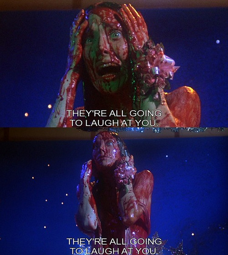

It was always my intention to make the entire PIXLS.US website available under a permissive license.  The content is already all licensed [Creative Commons, By Attribution, Share-Alike][cc] (unless otherwise noted).  I just hadn't gotten around to actually posting the site source.

Until now(_ish_).  I say "_ish_" because I apparently released the code back in April and am just now getting around to talking about it.

Also, we finally have a category specifically for all those [darktable][] weenies on [discuss][]!

[cc]: http://creativecommons.org/licenses/by-sa/4.0/
[darktable]: http://www.darktable.org
[discuss]: https://discuss.pixls.us

<!-- more -->

## Don't Laugh

I finally got around to pushing my code for this site up to [Github][] on April 27 (I'm basing this off git logs because my memory is likely suspect).  It took a while, but better late than never?  I think part of the delay was a bit of minor embarrassment on my part for being so sloppy with the site code.  In fact, I'm still embarrassed - so don't laugh at me too hard (and if you do, at least don't point while laughing too).

[Github]: https://github.com/pixlsus/

<figure>

<figcaption>
Brian De Palma's [interpretation of my fears...][carrie]</figcaption>
</figure>

[carrie]: http://www.imdb.com/title/tt0074285/

So really this post is just a reminder to anyone that was interested that this site is available on Github:  

https://github.com/pixlsus/

In fact, we've got a couple of other repositories under the [Github Organization PIXLS.US](https://github.com/pixlsus) including this website, presentation assets, lighting diagram SVG's, and more. If you've got a Github account or wanted to join in with hacking at things, by all means send me a note and we'll get you added to the organization asap.

_Note_: you don't need to do anything special if you just want to grab the site code.  You can do this quickly and easily with:

`git clone https://github.com/pixlsus/website.git`

You actually don't even need a Github account to clone the repo, but you will need one if you want to fork it on Github itself, or to send pull-requests.  You can also feel free to simply email/post patches to us as well:

`git format-patch testing --stdout > your_awesome_work.patch`

Being on Github means that we also now have [an issue tracker][issues] to report any bugs or enhancements you'd like to see for the site.

[issues]: https://github.com/pixlsus/website/issues

So no more excuses - if you'd like to lend a hand just dive right in!  We're all here to help! :)

### Speaking of Helping

Speaking of which, I wanted to give a special shout-out to community member [@paperdigits][] ([Mica][]), who has been active in sharing presentation materials in the [Presentations repo][] and has been actively hacking at the website. Mica's recommendations and pull requests are helping to make the site code cleaner and better for everyone, and I really appreciate all the help (even if I _am_ scared of change).

_Thank you, Mica!_  You **rock**!

[@paperdigits]: https://discuss.pixls.us/users/paperdigits/activity
[Mica]: http://silentumbrella.com/
[Presentations repo]: https://github.com/pixlsus/Presentations

## Those Stinky darktable People

Yes, after member Claes [asked the question on discuss][] about why we didn't have a [darktable][] category on the forums, I relented and [created one][dt].  Normally I want to make sure that any category is going to have active people to maintain and monitor the topics there.  I feel like having an empty forum can sometimes be detrimental to the perception of a project/community.

<figure>

</figure>

In this case, any topics in the [darktable category][dt] will _also_ show up in the more general [Software][] category as well.  This way the visibility and interactions are still there, but with the added benefit that we can now choose to see _only_ darktable posts, ignore them, or let all those [stinky users][] do what they want in there.

Besides, now we can say that we've sufficiently appeased [Morgan Hardwood][]'s organizational needs...

So, come on by and say hello in the brand new [**darktable category**][dt]!

[asked the question on discuss]: https://discuss.pixls.us/t/why-no-darktable-section/1575
[Software]: https://discuss.pixls.us/c/software/
[dt]: https://discuss.pixls.us/c/software/darktable
[stinky users]: https://discuss.pixls.us/t/why-no-darktable-section/1575/4
[Morgan Hardwood]: https://discuss.pixls.us/users/morgan_hardwood/activity
