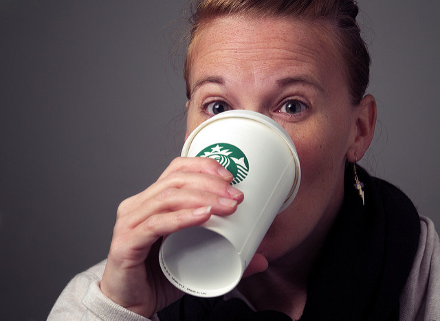

While in London this past April I got a chance to hang out a bit with [LWN.net][] editor and fellow countryman, [Nathan Willis][].  (It sounds like the setup for a bad joke: _"An Alabamian and Texan meet in a London pub..."_). Which was awesome because even though we were both at LGM2014, we never got a chance to sit down and chat.

<!-- more -->

So it was super-exciting for me to hear from Nate about possibly doing a photowalk and Free Software photo workshop at the [2016 Texas Linux Fest][txlf], and as soon as I cleared it with my boss, I agreed!

<figure>

<figcaption>
My Boss</figcaption>
</figure>

_**So...** mosey on down_ to Austin, Texas on July 8-9 for [Texas Linux Fest][txlf] and join [Akkana Peck][] and myself for a photowalk first thing of the morning on Friday (July 8) to be immediately followed by workshops from both of us.  I'll be talking about Free Software photography workflows and projects and Akkana will be focusing on a GIMP workshop.

This is part of a larger "Open Graphics" track on the entire first day that also includes [Ted Gould][] creating technical diagrams using [Inkscape][], [Brian Beck][] doing a [Blender][] tutorial, and [Jonathon Thomas][] showing off [OpenShot 2.0][].  You can find the [full schedule on their website][sch].

I hope to see some of you there!

[Nathan Willis]: https://plus.google.com/110044519468273778141
[LWN.net]: https://lwn.net/
[txlf]: http://2016.texaslinuxfest.org/ 
[Akkana Peck]: http://www.shallowsky.com/
[Ted Gould]: http://gould.cx/ted/
[Inkscape]: https://inkscape.org/ 
[Brian Beck]: http://2016.texaslinuxfest.org/node/103 
[Blender]: http://www.blender.org
[Jonathon Thomas]: http://2016.texaslinuxfest.org/node/55
[OpenShot 2.0]: http://www.openshot.org/
[sch]: http://2016.texaslinuxfest.org/content/schedule
