While I was out at [Texas Linux Fest][txlf] this past weekend I got to watch a fun presentation from the one and only [Brian Beck][].  He walked through an introduction to [Blender][], including an overview of creating his great _The Lady in the Roses_ image that was a part of the [2015 Libre Calendar][] project.

Coincidentally, during my trip home community member [@Fotonut][] asked about software to create an HD slideshow with images.  The first answer that jumped into my mind was to consider using [Blender][] (a very close second was [OpenShot][OpenShot 2.0] because I had just spent some time talking with Jon Thomas about it).

<!-- more -->

<figure>
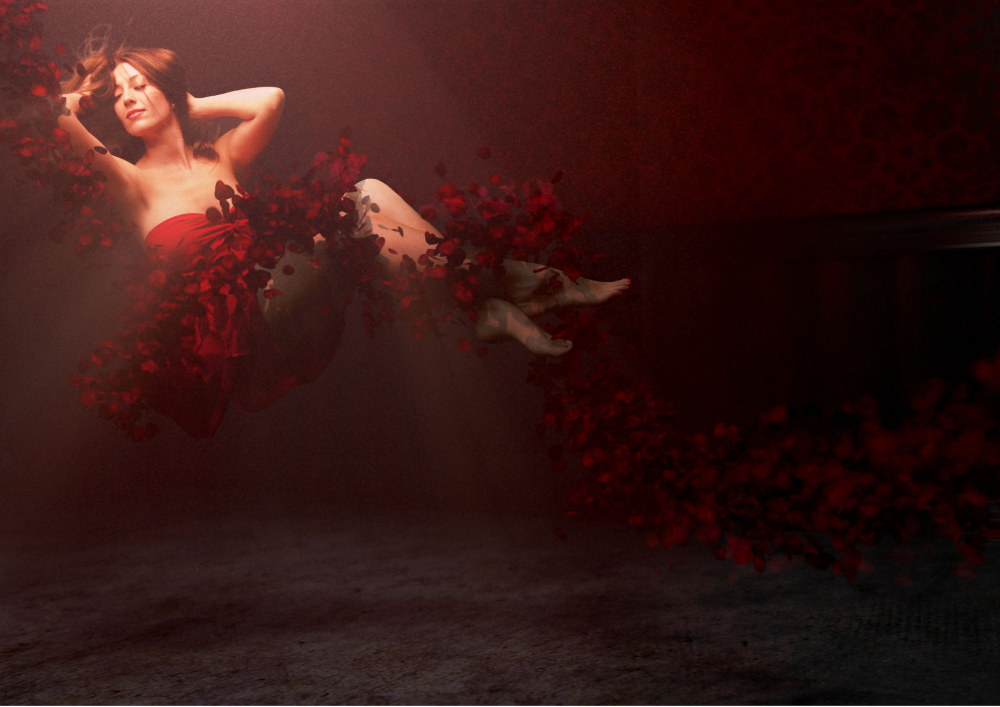
<figcaption>
_The Lady in the Roses_ by Brian Beck <a class='cc' href='https://creativecommons.org/licenses/by/4.0/' title='Creative Commons By-Attribution 4.0'>cba</a>
</figcaption>
</figure>

I figured this much Blender being talked about deserved at least a post to answer [@Fotonut][]'s question in greater detail.  I know that many community members likely abuse Blender in various ways as well &ndash; so please let me know if I get something way off!

## Enter Blender
The reason that Blender was the first thing that popped into many folks minds when the question was posed is likely because it has been a go-to swiss-army knife of image and video creation for a long, long time.  For some it was the only viable video editing application for heavy use (not that there weren't other projects out there as well).  This is partly due to to the fact that it integrates so much capability into a single project.

The part that we're interested in for the context of Fotonut's original question is the [Video Sequence Editor][vse] (VSE).  This is a very powerful (though often neglected) part of Blender that lets you arrange audio and video (and image!) assets along a timeline for rendering and some simple effects.  Which is actually perfect for creating a simple HD slideshow of images, as we'll see.

### The Plan
Blenders interface is likely to take some getting used to for newcomers (right-click!) but we'll be focusing on a _very_ small subset of the overall program&mdash;so hopefully nobody gets lost.  The overall plan will be:

1. Setup the environment for video sequence editing
2. Include assets (images) and how to manipulate them on the timeline
3. Add effects such as cross-fades between images
4. Setup exporting options

There's also an option of using a very helpful add-on for automatically resizing images to the correct size to maintain their aspect ratios. Luckily, Blender's add-on system makes it trivially easy to set up.

### Setup
On opening Blender for the first time we're presented with the comforting view of the default cube in 3D space.  Don't get too cozy, though.  We're about to switch up to a different screen layout that's already been created for us by default for Video Editing.

<figure class='big-vid'>
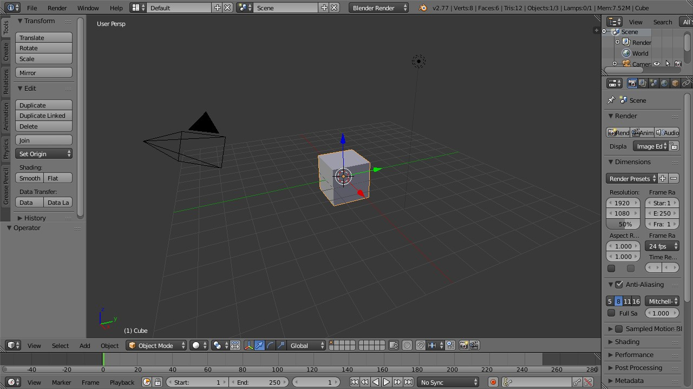
<figcaption>
The main blender default view.
</figcaption>
</figure>

The developers were nice enough to include various default "Screen Layout" options for different tasks, and one of them happens to be for _Video Editing_.  We can click on the screen layout option on the top menu bar and choose the one we want from the list (_Video Editing_):

<figure class='big-vid'>
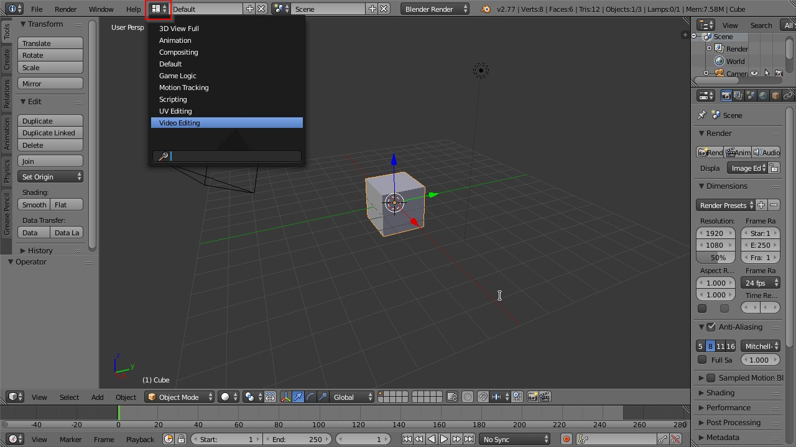
<figcaption>
Choosing a new Screen Layout option.
</figcaption>
</figure>

Our screen will then change to the new layout where the top left pane is the F-curve window, the top right is the video preview, the large center section is the sequencer, and the very bottom is a timeline.  Blender will let you arrange, combine, and collapse all the various panes into just about any layout that you might want, including changing what each of them are showing.  For our example we will _mostly_ leave it all as-is with the exception of the F-curve pane, which we won't be using and don't need.

<figure class='big-vid'>
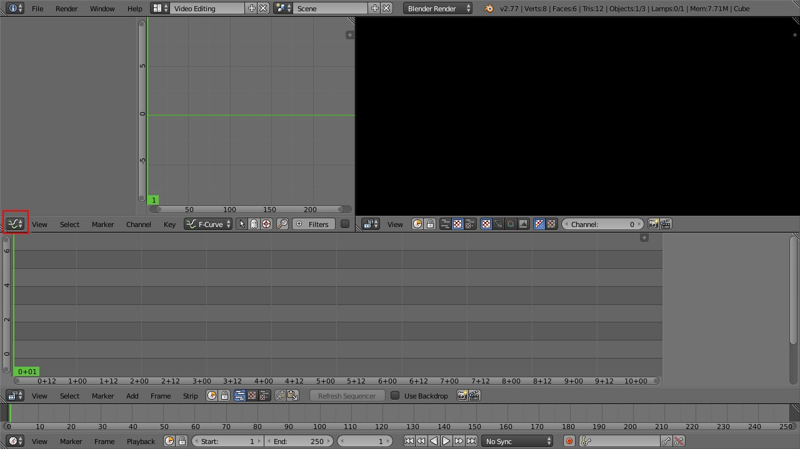
<figcaption>
The Video Editing default layout.
</figcaption>
</figure>

What we can do now is to define what the resolution and framerate of our project should be.  This is done in the __Properties__ pane, which isn't shown right now.  So we will change the __F-Curve__ pane into the __Properties__ pane by clicking on the button shown in red above to change the panel type.  We want to choose __Properties__ from the options in the list:

<figure>
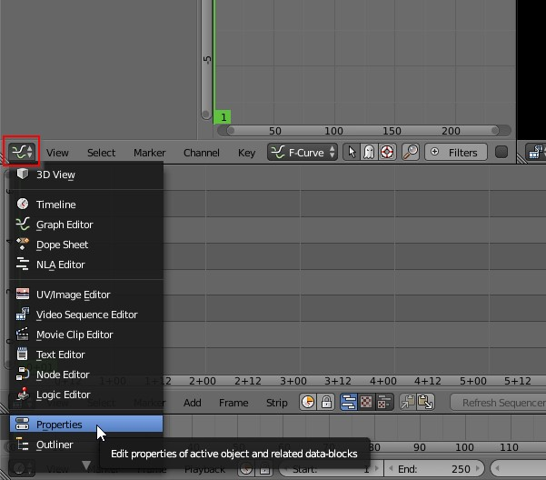
</figure>

Which will turn the old F-Curve pane into the __Properties__ pane:

<figure>
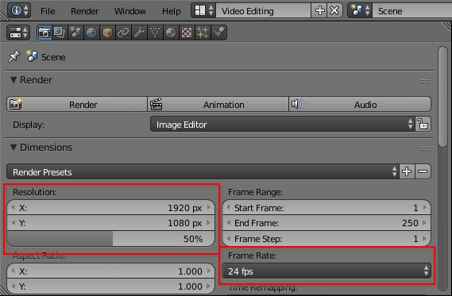
</figure>

You'll want to set the appropriate X and Y resolution for your intended output (don't forget to set the scaling from the default 50% to 100% now as well) as well as your intended framerate.  Common rates might be 23.976 (23.98), 25, 30, or even 60 frames per second.  If your intended target is something like YouTube or an HD television you can probably safely use 30 or 60 (just remember that a higher frame rate means a longer render time!).

For our example I'm going to set the output resolution to 1920&nbsp;&times;&nbsp;1080 at 30fps.

#### One Extra Thing
Blender does need a little bit of help when it comes to using images on the sequence editor.  It has a habit of scaling images to whatever the output resolution is set to (ignoring the original aspect ratios). This can be fixed by simply applying a transform to the images but normally requires us to manually compute and enter the correct scaling factors to get the images back to their original aspect ratios.

I did find a nice small add-on [on this thread](http://blenderartists.org/forum/showthread.php?280731-VSE-Transform-tool) at [blenderartists.org][] that binds some handy shortcuts onto the VSE for us. The author kgeogeo has the add-on [hosted on Github](https://github.com/kgeogeo/VSE_Transform_Tools), and you can download the [Python](http://www.python.org) file directly from here: [VSE Transform Tool](https://raw.githubusercontent.com/kgeogeo/VSE_Transform_Tools/master/VSE_Transform_Tool.py) (you can __Right-Click__ and save the link).  Save the .py file somewhere easy to find.

To load the add-on manually we're going to change the __Properties__ panel to __User Preferences__:

<figure>
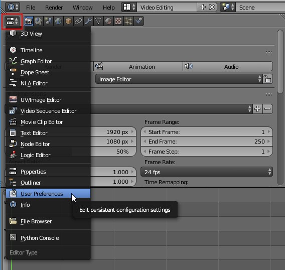
</figure>

Click on the __Add-ons__ tab to open that window and at the bottom of the panel is an option to "Install from File...".  Click that and navigate to the `VSE_Transform_Tool.py` file that you downloaded previously.

<figure>
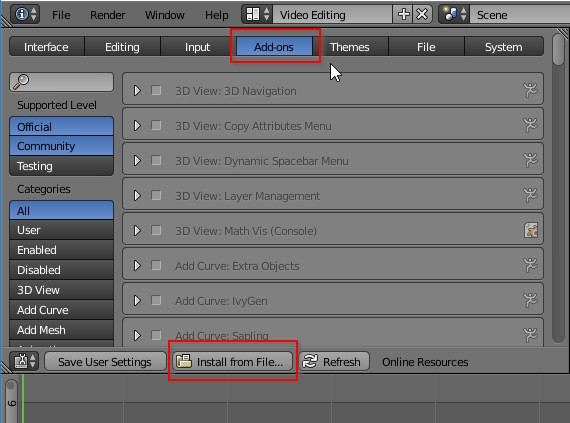
</figure>

Once loaded, you'll still need to _Activate_ the plugin by clicking on the box:

<figure>
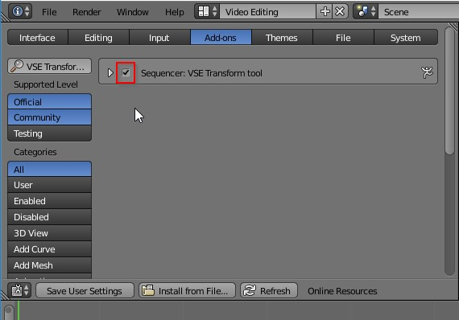
</figure>

That's it!  You're now all set up to begin adding images and creating a slideshow.  You can set the __User Preferences__ pane back to __Properties__ if you want to.

### Adding Images
Let's have a look at adding images onto the sequencer.

You can add images by either choosing __Add &rarr; Image__ from the VSE menu and navigating to your images location, choosing them:

<figure>
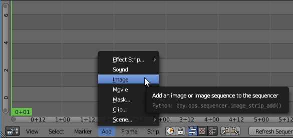
</figure>

Or by drag-and-dropping your images onto the sequencer timeline from Nautilus, Finder, Explorer, etc...

When you do, you'll find that a strip now appears on the VSE window (purple in my case) that represents your image.  You should also see a preview of your video in the top-right preview window (sorry for the subject).

<figure class='big-vid'>
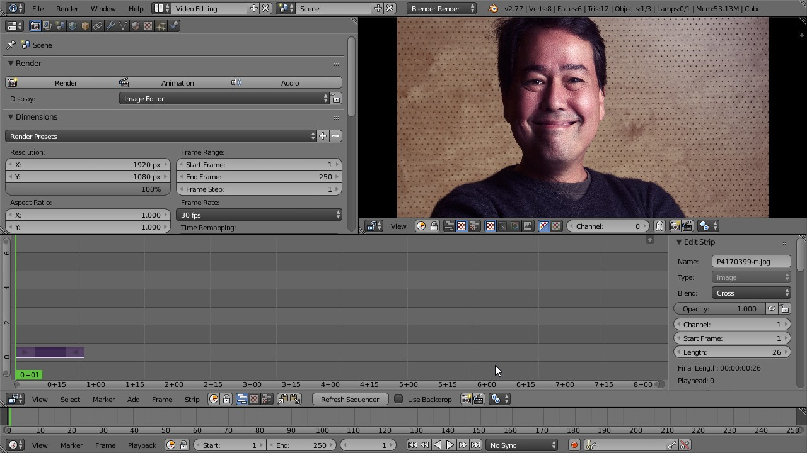
</figure>

At this point we can use the handy add-on we installed previously by **Right-Clicking** on the purple strip to make sure it's activated and then hitting the "T" key on the keyboard.  This will automatically add a transform to the image that scales it to the correct aspect ratio for you.  A small green _Transform_ strip will appear above your purple image strip now:

<figure>
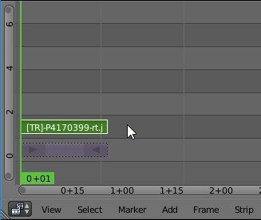
</figure>

Your image should now also be scaled to fit at the correct aspect ratio.

#### Adjusting the Image
If you scroll your mouse wheel in the VSE window, you will zoom in and out of time editor based on time (the x-axis in the sequencer window). You'll notice that the time compresses or expands as you scroll the mouse wheel.

The middle-mouse button will let you pan around the sequencer.

The right-mouse button will select things.  You can try this now by extending how long your image is displayed in the video. **Right-Click** on the small arrow on the end of the purple strip to activate it.  A small number will appear above it indicating which frame it is currently on (26 in my example):

<figure>
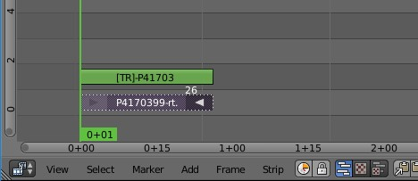
</figure>

With the right handle active you can now either press "G" on the keyboard and drag the mouse to re-position the end of the strip, or **Right-Click** and drag to do the same thing. The timeline in seconds is shown along the bottom of the window for reference.  If we wanted to let the image be visible for 5 seconds total, we could drag the end to the 5+00 mark on the sequencer window.

Since I set the framerate to 30 frames per second, I can also drag the end to frame 150 (30fps * 5s = 150 frames).

<figure>
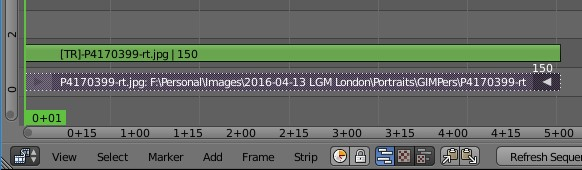
</figure>

When you drag the image strip, the transform strip will automatically adjust to fit (so you don't have to worry about it).

If you had selected the center of the image strip instead of the handle on one end and tried to move it, you would find that you can move the entire strip around instead of one end.  This is how you can re-position image strips, which you may want to do when you add a second image to your sequencer.

Add a new image to your sequencer now following the same steps as above.

When I do, it adds a new strip back at the beginning of the timeline (basically where the current time is set):

<figure>
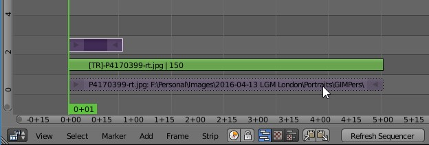
</figure>

I want to move this new strip so that it overlaps my first image by about half a second (or 15 frames).  Then I will pull the right handle to resize the display time to about 5 seconds also.

Click on the new strip (center, not the ends), and press the "G" key to move it.  Drag it right until the left side overlaps the previous image strip by a little bit:

<figure>
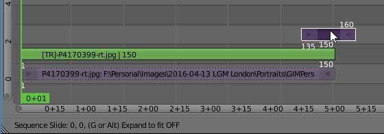
</figure>

When you click on the strip right handle to modify it's length, notice the window on the far right of the VSE.  The **Edit Strip** window should also show the strip "Length" parameter in case you want to change it by manually inputting a value (like 150):

<figure>
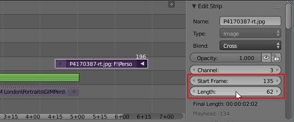
</figure>

I forgot to use the add-on to automatically fix the aspect ratio.  With the strip selected I can press "T" at any time to invoke the add-on and fix the aspect ratio.

### Adding a Transition Effect
With the two image strips slightly overlapping, we now want to define a simple cross fade between the two images as a transition effect.  This is actually something alreayd built into the Blender VSE for us, and is easy to add.  We _do_ need to be careful to select the right things to get the transition working correctly, though.

Once you've added a transform effect to a strip, you'll need to make sure that subsequent operations use the _transform_ strip as opposed to the original image strip.

For instance, to add a cross fade transition between these two images, click the first image strip transform (green), then **Shift-Click** on the second image transform strip (green). Now they are both selected, so add a _Gamma Cross_ by using the **Add** menu in the VSE (Add &rarr; Effect Strip... &rarr; Gamma Cross):

<figure>
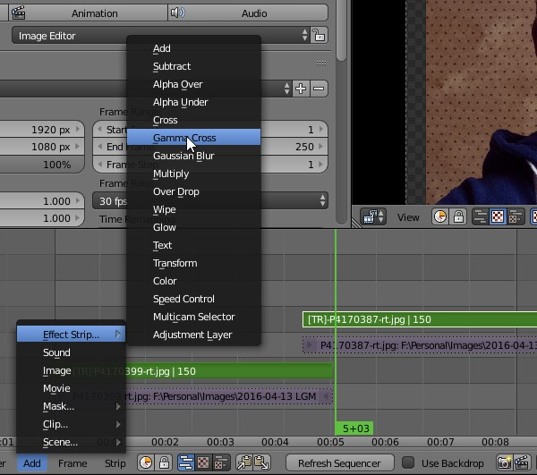
</figure>

This will add a _Gamma Cross_ effect as a new strip that is locked to the two images overlap.  It will do a cross-fade between the two images for the duration of the overlap.  You can **Left-Click** now and scrub over the cross-fade strip to see it rendered in the preview window if you'd like:

<figure>
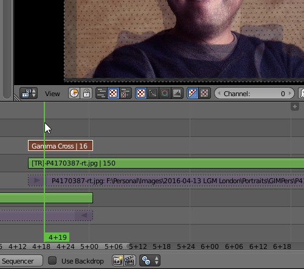
</figure>

At any time you can also use the hotkey "Alt-A" to view a render preview.  This may run slow if your machine is not super-fast, but it should run enough to give you a general sense of what you'll get.

If you want to modify the transition effect by changing its length, you can just increase the overlap between the strips as desired (using the original image strip &mdash; if you try to drag the transform strip you'll find it locked to the original image strip and won't move).

#### Repeat Repeat
You can basically follow these same steps for as many images as you'd like to include.

### Exporting
To generate your output you'll still need to change a couple of things to get what you want...

#### Render Length
You may notice on the VSE that there are vertical lines outside of which things will appear slightly grayed out.  This is a visual indicator of the total start/end of the output.  This is controlled via the **Start** and **End** frame settings on the timeline (bottom pane):

<figure>
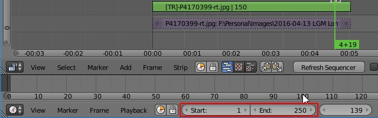
</figure>

You'll need to set the **End** value to match your last output frame from your video sequence.  You can find this value by selecting the last strip in your sequence and pressing the "G" key: the start/end frame numbers of that last strip will be visible (you'll want the last frame value, of course).

<figure>
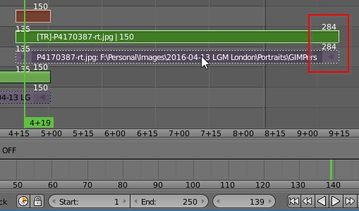
<figcaption>
Current last frame of my video is 284
</figcaption>
</figure>

In my example above, my anticipated last frame should be 284, but the last render frame is currently set to 250.  I would need to update that **End** frame to match my video to get output as expected.

#### Render Format
Back on the **Properties** panel (assuming you set the top-left panel back to **Properties** earlier&mdash;if not do so now), if we scroll down a bit we should see a section dedicated to _Output_.

<figure>
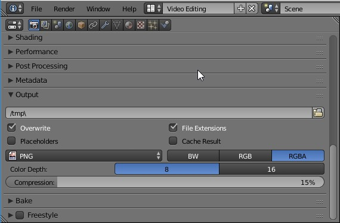
</figure>

You can change the various output options here to do frame-by-frame dumps or to encode everything into a video container of some sort. You can set the output directory to be something different if you don't want it rendered into /tmp here.

For my example I will encode the video with [H.264][]:

<figure>
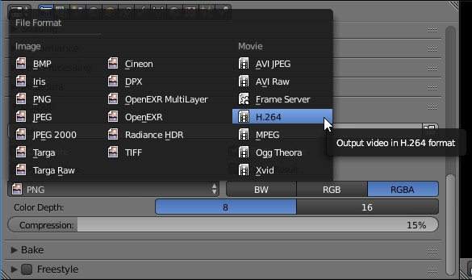
</figure>

By choosing this option, Blender will then expose a new section of the **Properties** panel for setting the _Encoding_ options:

<figure>
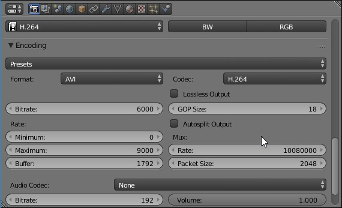
</figure>

I will often use the H264 preset and will enable the _Lossless Output_ checkbox option. If I don't have the disk space to spare I can also set different options to shrink the resulting filesize down further.  The _Bitrate_ option will have the largest effect on final file size and image quality.

When everything is ready (or you just want to test it out), you can render your output by scrolling back to the top of the **Properties** window and pressing the _Animation_ button, or by hitting **Ctrl-F12**.

<figure>
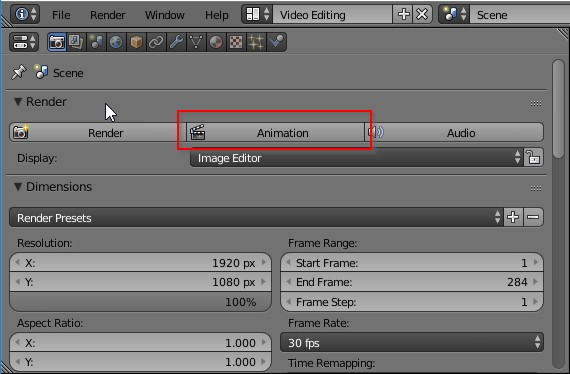
</figure>

### The Results

After adding portraits of all of the GIMP team from LGM London and adding gamma cross fade transitions, here are my results:

<iframe width="853" height="480" src="https://www.youtube-nocookie.com/embed/i56iRHp9mkk?rel=0" frameborder="0" allowfullscreen></iframe>

 

## In Summary
This may seem overly complicated, but in reality much of what I covered here is the setup to get started and the settings for output.  Once you've done this successfully it becomes pretty quick to use.  One thing you can do is set up the environment the way you like it and then save the .blend file to use as a template for further work like this in the future.  The next time you need to generate a slideshow you'll have everything all ready to go and will only need to start adding images to the editor.

While looking for information on some VSE shortcuts I _did_ run across a really interesting looking set of functions that I want to try out: [the Blender Velvets](http://blendervelvets.org/). I'm going to go off and give it a good look when I get a chance as there's quite a few interesting additions available. 

For Blender users: did I miss anything?

[txlf]: http://2016.texaslinuxfest.org/ 
[Blender]: http://www.blender.org
[Brian Beck]: https://twitter.com/designbybeck
[2015 Libre Calendar]: http://librecal2015.libreart.info/en/

[OpenShot 2.0]: http://www.openshot.org/
[@Fotonut]: https://discuss.pixls.us/users/Fotonut/
[vse]: https://www.blender.org/manual/de/editors/sequencer/
[blenderartists.org]: http://blenderartists.org
[H.264]: https://en.wikipedia.org/wiki/H.264/MPEG-4_AVC
