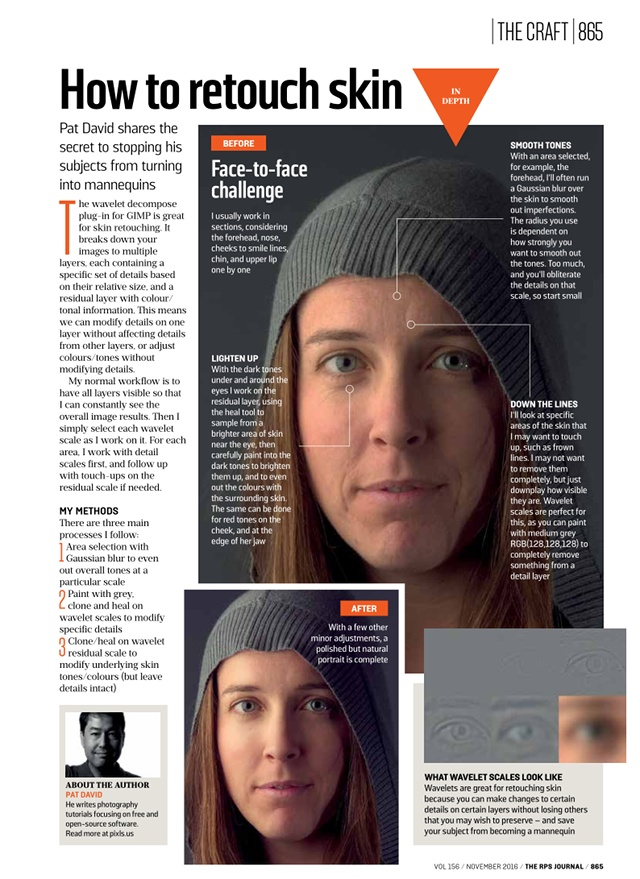

The [_Journal of the Photographic Society_][jps] is the journal for one of oldest photographic societies in the world: the [Royal Photographic Society][rps]. First published in 1853, the [_RPS Journal_][jps] is the oldest photographic periodical in the world (just edging out the [_British Journal of Photography_][bjp] by about a year).

So you can imagine my doubt when confronted with an email about using some material from [pixls.us](pixls.us) for their latest issue...

<!-- more -->

* * *

If the name sounds familiar to anyone it may be from a recent post by [Joe McNally][joemc] who is featured prominently in the September 2016 issue.  He [was also just inducted][joemcind] as a fellow into the society!

<figure>

</figure>

* * *

It turns out my initial doubts were completely unfounded, and they really wanted to run a page based off one of our tutorials.
The editors liked the [Open Source Portrait][osp] tutorial.  In particular, the section on using [_Wavelet Decompose_][wd] to touch up the skin tones:

<figure>

<figcaption>
Yay Mairi!
</figcaption>
</figure>

How cool is that?  I actually searched the archive and the only other mention I can find of [GIMP][] (or any other F/OSS) is from a ["Step By Step" article written by Peter Gawthrop][gawthrop] (Vol. 149, February 2009).  I think it's pretty awesome that we can promote a little more exposure for Free Software alternatives.  Especially in more mainstream publications and to a broader audience!

[jps]: http://www.rps.org/rps-journals/about
[rps]: http://www.rps.org/ 
[bjp]: http://www.bjp-online.com/about-british-journal-of-photography/
[joemc]: http://blog.joemcnally.com/
[joemcind]: http://blog.joemcnally.com/2016/10/13/royal-photographic-society/
[osp]: /articles/an-open-source-portrait-mairi/
[wd]: /articles/an-open-source-portrait-mairi/#skin-retouching-with-wavelet-decompose
[GIMP]: https://www.gimp.org
[gawthrop]: http://archive.rps.org/archive/volume-149/755209?q=GIMP#page/125
