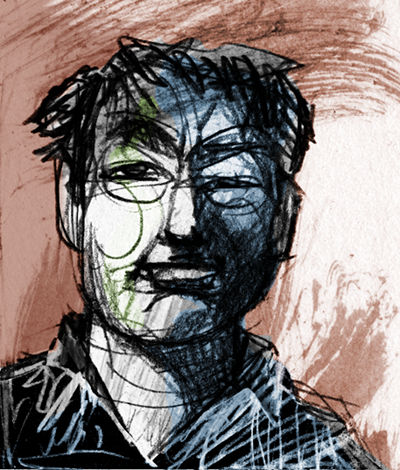

Yes, there really is art outside photography. :)

The history and evolution of painting has undergone a similar transformation as most things adapting to a digital age. As photographers, we adapted techniques and tools commonly used in the darkroom to software, and found new ways to extend what was possible to help us achieve a vision.  Just as we tried to adapt skills to a new environment, so too did traditional artists, like painters. 

<!-- more -->

<figure>

<figcaption>
[My headshot][], as painted by [Gustavo Deveze][deveze-web]
</figcaption>
</figure>

[deveze-web]: http://www.deveze.com.ar/ "Gustavo Deveze's website"
[My headshot]: https://pixls.us/images/Pat-David-Headshot-Crop-2048-Q60.jpg "Pat David's Headshot"

These artists adapted by not only emulating the results of various techniques, but by pushing forward the boundaries of what was possible through these new (_Free Software_) tools.

## Impetus

Digital painting discussions with Free Software lacks a good outlet for collaboration that can open the discussion for others to learn from and participate in.  This is a similar situation the Free Software + photography world was in that prompted the creation of [pixls.us][].

Due to this, both [Americo Gobbo][] and [Elle Stone][] reached out to us to see if we could create a new category in the community about Digital Painting with a focus on promoting serious discussion around techniques, processes, and associated tools.

Both of them have been working hard on advancing the capabilities and quality of various Free Software tools for years now.  Americo brings with him the interest of other painters who want to help accelerate the growth and adoption of Free Software projects for painting (and more) in a high-quality and professional capacity. A little background about them:

**[Americo Gobbo][]** studied Fine Arts in Bologna, Italy. Today he lives and works in Brazil, where he continues to develop studies and create experimentation with painting and drawing mainly within the digital medium in which he tries to replicate the traditional effects and techniques from the real world to the virtual.

<figure>

<figcaption>
Imaginary Landscape - Wet sketches, experiments on GIMP 2.9.+  
[Americo Gobbo][], 2016. 
</figcaption>
</figure>

**[Elle Stone][]** is an amateur photographer with a long-standing interest in the history of photography and print making, and in combining painting and photography. She's been contributing to GIMP development since 2012, mostly in the areas of color management and proper color mixing and blending.

<figure>

<figcaption>
Leaves in May, GIMP-2.9 (GIMP-CCE)  
[Elle Stone][], 2016.
</figcaption>
</figure>

[Americo Gobbo]: http://americogobbo.com.br
[Elle Stone]: http://ninedegreesbelow.com/ 
[pixls.us]: https://pixls.us

## Artists

With this introductory post to the new Digital painting category forum we feature Gustavo Deveze, who is a Visual Artist using free software. Deveze's work is characterized by mixing different medias and techniques. With future posts we want to continue featuring artists using free software.

### Gustavo Deveze

Gustavo Deveze is a visual artist and lives in Buenos Aires. He trained as a draftsman at the National School of Fine Arts "Manuel Belgrano", and filmmaker at [IDAC - Instituto de Arte Cinematográfica](http://idac.edu.ar/) in Avellaneda, Argentina.

His works utilize different materials and supports and he is published by different publishers. Although in the last years he works mainly in digital format and with free software.
He has participated in national and international shows and exhibitions of graphics and cinema with many awards. His last exposition can be seen on issuu.com:
https://issuu.com/gustavodeveze/docs/inadecuado2edicion

Website: http://www.deveze.com.ar
 * Blog: http://jeneverito.blogspot.com.ar/
 * Google+: https://plus.google.com/107589083968107443043
 * Facebook: https://www.facebook.com/gustavo.deveze

<figure>

<figcaption>Cudgels and Bootlickers: The Emperor's happiness - [Gustavo Deveze][deveze-web].
</figcaption>
</figure>

<figure>

<figcaption>Let's be clear: the village's idiot is not tall... - [Gustavo Deveze][deveze-web].
</figcaption>
</figure>

## Digital Painting Category

The new Digital Painting category is for discussing painting techniques, processes, and associated tools in a digital environment using Free/Libre software. Some relevant topics might include:

* Emulating non-digital art, drawing on diverse historical and cultural genres and styles of art.

* Emulating traditional "wet darkroom" photography, drawing on the rich history of photographic and printmaking techniques.

* Exploring ways of making images that were difficult or impossible before the advent of new algorithms and fast computers to run them on, including averaging over large collections of images.

* Discussion of topics that transcend "just photography" or "just painting", such as composition, creating a sense of volume or distance, depicting or emphasizing light and shadow, color mixing, color management, and so forth.

* Combining painting and photography: Long before digital image editing artists already used photographs as aids to and part of making paintings and illustrations, and photographers incorporated painting techniques into their photographic processing and printmaking.

* An important goal is also to encourage artists to submit tutorials and videos about Digital Painting with Free Software and to also submit high-quality finished works.

## Say Hello!
Please feel free to stop into the new [Digital Painting category][dp-forum], introduce yourself, and say hello! I look forward to seeing what our fellow artists are up to.

<small>All images not otherwise specified are licensed [CC-BY-NC-SA][]</small>
[CC-BY-NC-SA]: https://creativecommons.org/licenses/by-nc-sa/4.0/ 
[dp-forum]: https://discuss.pixls.us/c/digital-painting
