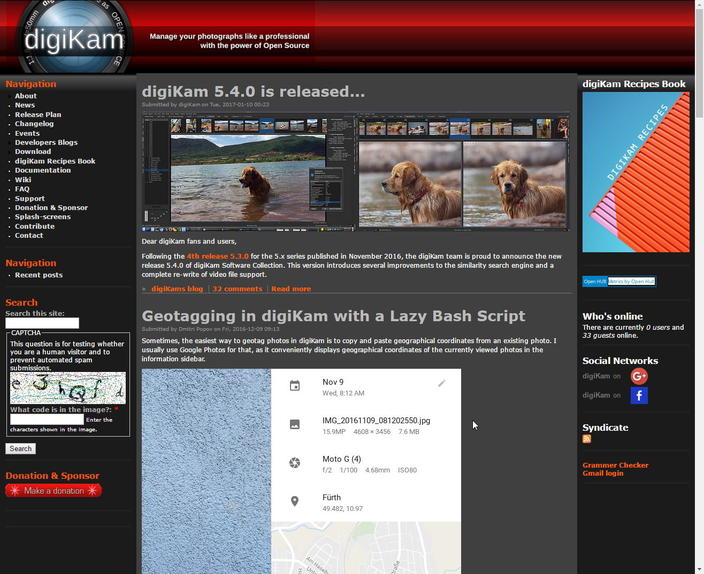
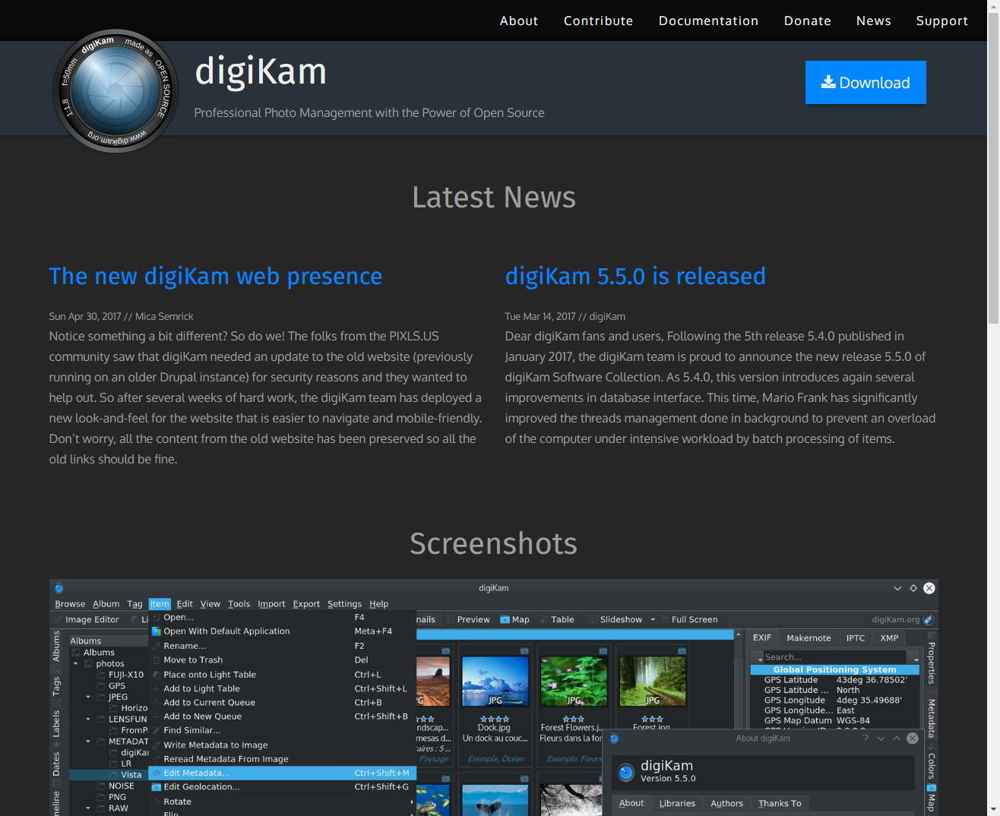
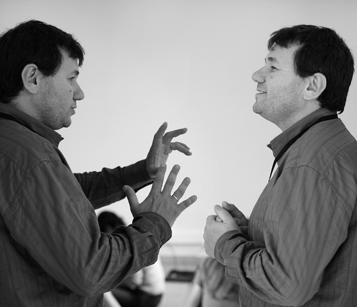

One of the goals we have here at PIXLS.US is to help Free Software projects however we can, and one of those ways is to focus on things that we can do well that might help make things easier for the projects.
It may not be much fun for project developers to deal with websites or community outreach necessarily.
This is something I think we can help with, and recently we had an opportunity to do just that with the awesome folks over at the photo management project [digiKam][].

<!-- more -->

As part of a [post announcing the release of digiKam 5.5.0][] on [discuss][]. we learned that  they were [in need of a new webmaster][], and they needed something soon to migrate away from [Drupal][] 6 for security reasons.
They had a rudimentary Drupal 7 theme setup, but it was severely lacking (non-responsive and not adapted to the existing content).

[in need of a new webmaster]: http://digikam.1695700.n4.nabble.com/digikam-org-Webmaster-wanted-td4694408.html
[post announcing the release of digiKam 5.5.0]: https://discuss.pixls.us/t/digikam-5-5-0-released/3486
[digiKam]: https://www.digikam.org
[Drupal]: https://www.drupal.org/

<figure class='big-vid'>

<figcaption>
The previous digiKam website, running on Drupal 6.
</figcaption>
</figure>

<figure class='big-vid'>

<figcaption>
The new digiKam website!  Great work Mica!
</figcaption>
</figure>

Mica (@paperdigits) reached out to Gilles Caulier and the digiKam community and offered our help, which they accepted!
At that point Mica gathered requirements from them and found in the end that a static website would be more than sufficient for their needs.
We coordinated with the [KDE][] folks to get a git repo setup for the new website, and rolled up our sleeves to start building!

[KDE]: https://www.kde.org/

<figure>

<figcaption>
<a href="https://www.flickr.com/photos/prokoudine/3371163363" title="Gilles Caulier by Alexandre Prokoudine on Flickr">Gilles Caulier</a> by <a href="http://libregraphicsworld.org">Alexandre Prokoudine</a> (<a href="https://creativecommons.org/licenses/by-nc-sa/2.0/" title="Creative Commons By-Attributions, Non-commerical, ShareAlike"><small>CC BY NC SA 2.0</small></a>)
</figcaption>
</figure>

Mica chose to use the [Hugo][] static-site generator to build the site with.
This was something new for us, but turned out to be quite fast and fun to work with (it generates the entire digiKam site in just about 5 seconds).
Coupled with a version of the Foundation 6 blog theme we were able to get a base site framework up and running fairly quickly.
We scraped all of the old site content to make sure that we could port everything as well as make sure we didn't [break any urls][] along the way.

[Hugo]: http://gohugo.io/
[break any urls]: https://www.w3.org/Provider/Style/URI "Cool URIs don't change"

We iterated some design stuff along the way, ported all of the old posts to markdown files, hacked at the theme a bit, and finally included comments that are now hosted on [discuss][].
What's wild is that we managed to pull the entire thing together in about 6 weeks total (of part-time working on it).
The digiKam team seems happy with the results so far, and we're looking forward to continue helping them by managing this infrastructure for them.

A big **kudos** to Mica for driving the new site and getting everything up and running.
This was really all due to his hard work and drive.

[discuss]: https://discuss.pixls.us

Also, speaking of discuss, we also have a new category created specifically for digiKam users and hackers: https://discuss.pixls.us/c/software/digikam.

This is the same category that news posts from the website will post in, so feel free to drop in and say hello or share some neat things you may be working on with digiKam!
