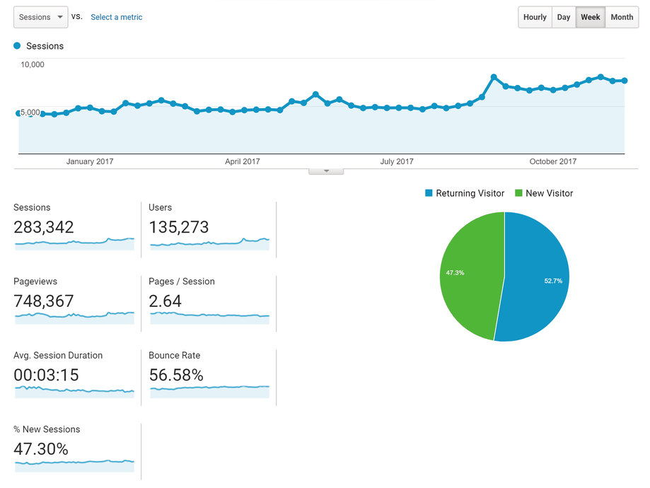

This is becoming [a sort of tradition][ty] for me to post something giving thanks around this holiday.
I think it's because this community has become such a large part of my life (even if I don't have nearly as much time to spend on it as I'd like).
Also, I think it helps to remind ourselves once in a while of the good things that happen to us. So in that spirit...

[ty]: https://pixls.us/blog/2016/11/giving-thanks/

<!-- more -->

## Financial Supporters

I want to start things off by acknowledging those that go the extra mile and help offset the costs of the infrastructure to keep this crazy ship afloat (sorry, I'm an ocean engineer by training and a sailor - so nautical metaphors abound!).

### Holy Benefactors, Batman!
Once again the amazing [**Dimitrios Psychogios**][dp] has graciously covered our server expenses (_and then some_) **for another full year**.
On behalf of the community, and particularly myself, thank you so much!
Your generosity will cover infrastructure costs for the year and give us room to grow as the community does.

[dp]: https://plus.google.com/+DimitriosPsychogios "Dimitrios Psychogios on Google+"

We also have some awesome folks who support us through monthly donations (which are nice because we can plan better if we need to). Together they cover the costs of data storage + transfer in/out of Amazon AWS S3 storage (basically the storage and transfer of all of the attachments and files in the forums).
So **thank you**, you cool froods, you really know where your towels are:

* [Mica][] (@paperdigits - https://silentumbrella.com)
* Luka S.
* [Barrie][] (@bminney)

[Barrie]: https://discuss.pixls.us/u/bminney/
[Mica]: https://discuss.pixls.us/u/paperdigits/

Thank you all!
If you happen to see any of these great folks around the forum consider taking a moment to thank them for their generosity!
If you'd like to join them in supporting the site financially, check out the [support page](/support).

## Growth 

The community has just been amazing, and we've seen nice growth this past year.
Since the end of August we've seen about a 50% increase in weekly sessions on discuss.
We're currently hovering around 2,500 daily pageviews on the forums:

<figure>

</figure>

We've added almost 950 new users, or almost 3 new users every day!

There have been quite a few [interesting discussions happening][] on the forums as well.
The [RawTherapee][] folks have some neat conversations going on ([Local Lab build][], [New Windows builds][], and [Pixel Shift!][]), and @Carmelo_DrRaw (creator of the [PhotoFlow][] editor) has been packaging a [GIMP 2.9.X AppImage][] as well!

[interesting discussions happening]: https://discuss.pixls.us/latest?order=views
[RawTherapee]: http://rawtherapee.com/
[Local Lab build]: https://discuss.pixls.us/t/local-lab-build/1430
[New Windows builds]: https://discuss.pixls.us/t/new-windows-builds/615/423
[Pixel Shift!]: https://discuss.pixls.us/t/support-for-pentax-pixel-shift-files-3489/2560
[PhotoFlow]: http://photoflowblog.blogspot.com/ "PhotoFlow Image Editor"
[GIMP 2.9.X AppImage]: https://discuss.pixls.us/t/gimp-2-9-5-appimage/1959 "GIMP 2.9.5 AppImages"

Of course, the fun news for many was @houz finally pushing out a [Windows version of darktable][] that was made possible through the help of Peter Budai.

[Windows version of darktable]: https://discuss.pixls.us/t/darktable-for-windows/4966

## raw.pixls.us

I figure @LebedevRI will yell at me if I forget to mention [raw.pixls.us](https://raw.pixls.us) (RPU) again.
Back in January @andabata built a new site to help pick up the work of the old rawsamples.ch website to collect raw sample files for testing.

So thank you @andabata and @LebedevRI for your work on this!
A big thank you to everyone who has taken the time to check the site and upload missing (or non-freely licensed) raw files to include!

While we're talking about RPU, please consider having a look at [this post about it on discuss](https://discuss.pixls.us/t/raw-samples-wanted/5420) and take a few minutes to see if you might be able to contribute by providing raw samples that we are missing or need (see the post for more details).
If you don't have something we need, please consider sharing the post on social media to help us raise awareness of RPU!
Thank you!

## digiKam

If you're not aware of it, one of the things we try to do here beside run the site and forum is to assist projects with websites and design work if they want it.
Earlier this year the [digiKam][] team needed to migrate their old Drupal website to something more modern (and secure) and @paperdigits figured, _"why not"_?

[digiKam]: https://www.digikam.org/

<figure>

</figure>

So we rolled up our sleeves and got them setup with a newly designed static website built using [Hugo][] (which was completely new to me).
We were also able to manage their comments on the website for them by embedding topics from right here on discuss.
This way their users can still own their comments and we can manage spam and moderate things for them.

[Hugo]: https://gohugo.io/

The best part, though, is the addition of their users and knowledge to the community!

## darix

I want to personally take a moment to thank @darix for all the work he does keeping things running smoothly here.
If you don't see him, it means all the work he's doing is paying off.

I speak with him daily and see firsthand the great work he's doing to make sure all of us have a nice place to call home.
Thank you so much, @darix!

## Mica

As usual @paperdigits (https://silentumbrella.com) also has a great attitude and pro-active approach to the community which I am super thankful for.
He also does things that aren't always visible, but are essential to keeping things running smoothly, like moderating the forum, checking the health of sites we are helping to manage, and writing/editing posts.

I can't stress enough how much it helps to keep your interest and spirits engaged in the community when you have someone else around who's so positive and helpful.  Thank you so much, @paperdigits!

## All of You

At the end of the day this is a community, and it's vibrancy and health is a direct result of all of you, its members.
So above all else this is by far the thing I am most thankful for - getting to meet, learn, and interact with all of _you_.
