The [IMAGE team](https://www.greyc.fr/?page_id=443&lang=en) of the [GREYC](https://www.greyc.fr) laboratory (UMR [CNRS](http://www.cnrs.fr) 6072, Caen, France) is pleased to announce the release of a new **2.2** version of [_G'MIC_](http://gmic.eu), its open-source, generic, and extensible framework for [image processing](https://en.wikipedia.org/wiki/Image_processing). As [we already did in the past](https://pixls.us/blog/2017/06/g-mic-2-0/), we take this opportunity to look at the latest notable features added since the previous major release (**2.0**, last June).
<!--more-->

----
- [The G'MIC project](http://gmic.eu)
- [Twitter feed](https://twitter.com/gmic_ip)
- [The G'MIC Online Web Service](https://gmicol.greyc.fr)
----

_Note 1: click on a picture to view a larger version._
_Note 2: This is a translation of an original article, in French, published on [Linuxfr](http://linuxfr.org/news/g-mic-2-2-v-la-les-filtres)_.

# 1. Context and recent evolutions

_G'MIC_ is a free and open-source software developed since August 2008 (distributed under the [CeCILL](http://www.cecill.info/) license), by folks in the [IMAGE](https://www.greyc.fr/image) team at the [GREYC](https://www.greyc.fr/), a French public research laboratory located in Caen and supervised by three institutions: the [CNRS](http://www.cnrs.fr), the [University of Caen](http://www.unicaen.fr/), and the [ENSICAEN](http://www.ensicaen.fr/) engineering school. This team is made up of researchers and lecturers specialized in the fields of algorithms and mathematics for image processing.
As one of the main developer of _G'MIC_, I wanted to sum up the work we've made on this software during these last months.

<figure>

<figcaption>Fig. 1.1: The G'MIC project logo, and its cute little mascot "Gmicky" (designed by [David Revoy](http://www.davidrevoy.com/)).
</figcaption></figure>

_G'MIC_ is multi-platform (GNU/Linux, MacOS, Windows ...) and provides many ways of manipulating _generic_ image data, i.e. still images or image sequences acquired as hyperspectral 2D or 3D floating-point arrays (including usual color images). More than [950 different image processing functions](http://gmic.eu/reference.shtml) are already available in the _G'MIC_ framework, this number being expandable through the use of the _G'MIC_ scripting capabilities.

<figure>
[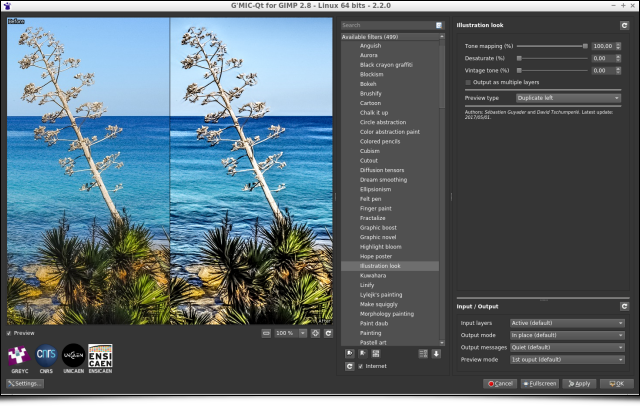](http://gmic.eu/gmic220/fullsize/gmic_220.png)
<figcaption>Fig.1.2: The G'MIC-Qt plugin for GIMP, currently the most popular G'MIC interface.
</figcaption></figure>

Since the last major version release there have been two important events in the project life:

## 1.1. Port of the _G'MIC-Qt_ plugin to [_Krita_](http://www.krita.org)

When we released version **2.0** of _G'MIC_ a few months ago, we were happy to announce a complete rewrite (in _[Qt](https://en.wikipedia.org/wiki/Qt)_) of the plugin code for [_GIMP_](http://www.gimp.org). An extra step has been taken, since this plugin has been extended to fit into the open-source digital painting software [_Krita_](http://www.krita.org).
This has been made possible thanks to the development work of [_Boudewijn Rempt_](https://twitter.com/boudewijnrempt) (maintainer of _Krita_) and [_Sébastien Fourey_](https://foureys.users.greyc.fr) (developer of the plugin). The _G'MIC-Qt_ plugin is now available for _Krita_ versions **3.3+** and, although it does not yet implement all the I/O functionality of its _GIMP_ counterpart, the feedback we've had so far is rather positive.
This new port replaces the old _G'MIC_ plugin for _Krita_ which has not been maintained for some time. The good news for _Krita_ users (and developers) is that they now have an up-to-date plugin whose code is common with the one running in _GIMP_ and for which we will be able to ensure the maintenance and further developments.
Note this port required the writing of a source file [`host_krita.cpp`](https://github.com/c-koi/gmic-qt/blob/master/src/Host/Krita/host_krita.cpp) (in _C++_) implementing the communication between the host software and the plugin, and it is reasonable to think that a similar effort would allow other programs to get their own version of the _G'MIC_ plugin (and the _500_ image filters that come with it!).

<figure>
[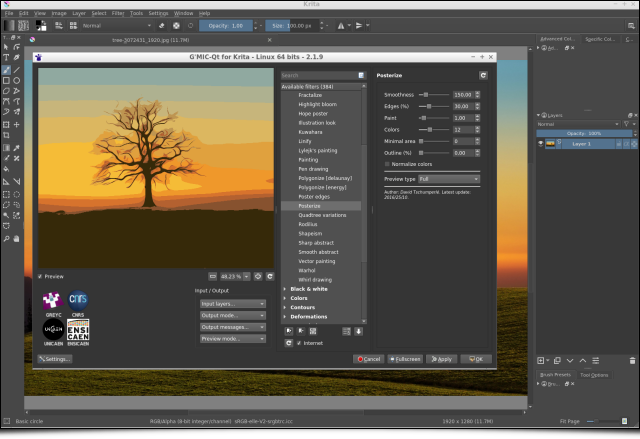](http://gmic.eu/gmic220/fullsize/gmic_krita.png)
<figcaption>Fig. 1.3: Overview of the G'MIC-Qt plugin running on Krita.
</figcaption></figure>

## 1.2. CeCILL-C, a more permissive license

Another major event concerns the new license of use :  The [_CeCILL-C_](http://www.cecill.info/licences/Licence_CeCILL-C_V1-en.html) license (that is in the spirit of the [_LGPL_](https://en.wikipedia.org/wiki/GNU_Lesser_General_Public_License)) is now available for some components of the _G'MIC_ framework. This license is more permissive than the previously proposed [_CeCILL_](http://www.cecill.info/licences/Licence_CeCILL_V2.1-en.html) license (which is [_GPL_](https://en.wikipedia.org/wiki/GNU_General_Public_License)-compatible) and is more suitable for the distribution of software libraries. This license extension (now _double licensing_) applies precisely to the core files of _G'MIC_, i.e. its _C++_ library `libgmic`. Thus, the integration of the `libgmic` features (therefore, all G'MIC image filters) is now allowed in software that are not themselves licensed under _GPL/CeCILL_ (including closed source products).
The source code of the _G'MIC-Qt_ plugin, meanwhile, remains distributed under the single _CeCILL_ license (_GPL_-like).

# 2. Fruitful collaboration with David Revoy

If you've followed us for a while, you may have noticed that we very often refer to the work of illustrator [_David Revoy_](http://www.davidrevoy.com) for his multiple contributions to _G'MIC_: mascot design, ideas of filters, articles or video tutorials, tests of all kinds, etc. More generally, _David_ is a major contributor to the world of free  digital art, as much with the comic [_Pepper & Carrot_](https://www.peppercarrot.com/) he produces (distributed under free license _CC -BY_), as with his suggestions and ongoing bug reports for the open-source software he uses.
Therefore, it seems quite natural to devote a special section to him in this article, summarizing the different ideas, contributions and experiments he has brought to _G'MIC_ just recently. A **big thank you**, _David_ for your availability, the sharing of your ideas, and for all your work in general!

## 2.1. Improving the lineart colorization filter

Let's first mention the progress made on the [**Black & White / Colorize lineart (smart-coloring)**](https://pixls.us/blog/2017/06/g-mic-2-0/#3-easing-the-work-of-cartoonists-) filter  that had appeared at the time of the **2.0** _G'MIC_ release. 
This filter is basically a _lineart_ colorization assistant which was developed in collaboration with _David_. It tries to automatically generate a colorization layer for a given _lineart_, from the analysis of the contours and the geometry of that _lineart_. Following _David_'s suggestions, we were able to add a new colorization mode, named "_Autoclean_". The idea is to try to automatically "clean" a coloring layer (made roughly by the user) provided in addition to the _lineart_ layer, using the same geometric analysis as for the previous colorization modes. 
The use of this new mode is illustrated below, where a given _lineart_ (_left_) has been colorized approximately by the user. From the two layers _line art_ + _color layer_, our "_Autoclean_" algorithm generates an image (_right_), where the colors do not overflow the _lineart_ contours (even for "virtual" contours that are not closed). The result is not always perfect, but nevertheless reduces the time spent in the tedious process of colorization.

<figure>
[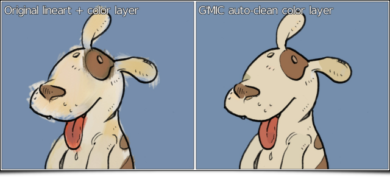](http://gmic.eu/gmic220/fullsize/gmic_autoclean.png)
<figcaption>Fig. 2.1: The new "Autoclean" mode of the lineart colorization filter can automatically "clean" a rough colorization layer.
</figcaption></figure>

Note that this filter is also equipped with a new hatch detection module, which makes it possible to avoid generating too many small areas when using the previously available random colorization mode, particularly when the input _lineart_ contains a large number of hatches (see figure below). 

<figure>
[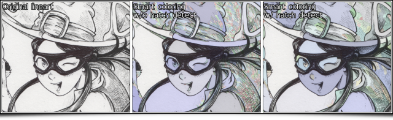](http://gmic.eu/gmic220/fullsize/gmic_hatch_detection2.png)
<figcaption>Fig. 2.2: The new hatching detection module limits the number of small colored areas generated by the automatic random coloring mode.
</figcaption></figure>

## 2.2. Color equalizer in HSI, HSL and HSV spaces

More recently, _David_ suggested the idea of a filter to separately vary the hue and saturation of colors having certain levels of luminosity. The underlying idea is to give the artist the ability to draw or paint digitally using only grayscale, then colorize his masterpiece afterwards by re-assigning specific colors to the different gray values of the image. The obtained result has of course a limited color range, but the overall color mood is already in place. The artist only has to retouch the colors locally rather than having to colorize the entire painting by hand.
The figure below illustrates the use of this new filter **Colors/Equalize HSI/HSL/HSV** available in the _G'MIC_ plugin : each category of values can be finely adjusted, resulting in preliminary colorizations of black and white paintings.

<figure>
[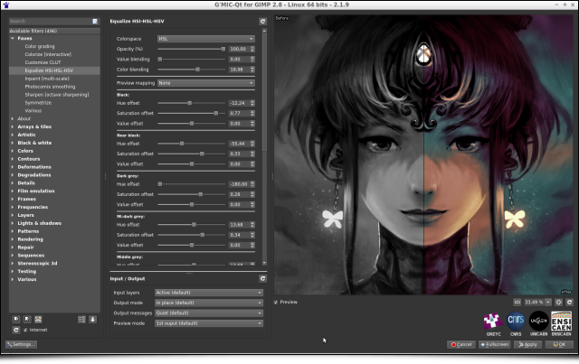](http://gmic.eu/gmic220/fullsize/gmic_equalize_hsi.png)
[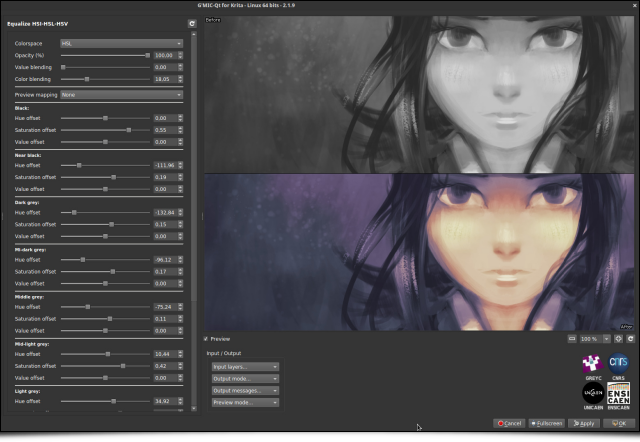](http://gmic.eu/gmic220/fullsize/gmic_equalize_hsi5.png)
[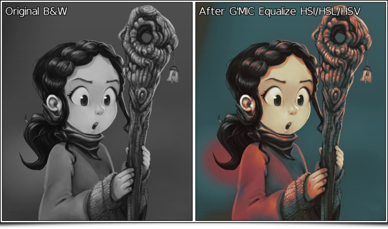](http://gmic.eu/gmic220/fullsize/gmic_equalize_hsi2.png)
<figcaption>Fig. 2.3: Equalization in HSI/HSL/HSV colorspaces allows to easily set the global color mood for B&W paintings.
</figcaption></figure>

Note that the effect is equivalent to applying a color gradient to the different gray values of the image. This is something that could already be done quite easily in GIMP. But the main interest here is we can ensure that the pixel brightness remains unchanged during the color transformation, which is not an obvious property to preserve when using a gradient map.
What is nice about this filter is that it can apply to color photographs as well. You can change the hue and saturation of colors with a certain brightness, with an effect that can sometimes be surprising, like with the landscape photography shown below.

<figure>
[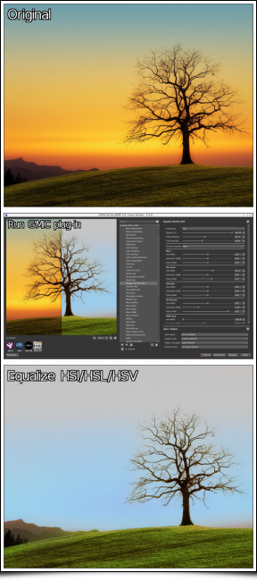](http://gmic.eu/gmic220/fullsize/gmic_eqhsi_tree_all.png)
<figcaption>Fig. 2.4: The filter "Equalize HSI/HSL/HSV" applied on a color photograph makes it possible to change the colorimetric environment, here in a rather extreme way.
</figcaption></figure>

## 2.3. Angular deformations

Another one of the _David_'s ideas concerned the development of a random local deformation filter, having the ability to generate _angular_ deformations. From an algorithmic point of view, it seemed relatively simple to achieve.
Note that once the implementation has been done (in concise style: [12 lines!](https://pastebin.com/VurLncvs)) and pushed into the official filter updates, _David_ just had to press the "_Update Filters_" button of his _G'MIC-Qt_ plug-in, and the new effect **Deformations/Crease** was there immediately for testing. This is one of the practical side of developing new filters using the _G'MIC_ script language!

<figure>
[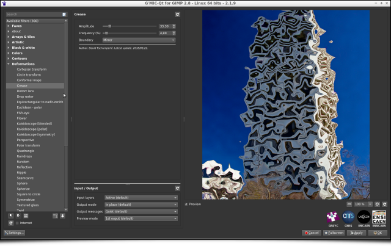](http://gmic.eu/gmic220/fullsize/gmic_crease.png)
<figcaption>Fig. 2.5: New effect "Crease" for local angular deformations.
</figcaption></figure>

However, I must admit I didn't really have an idea on what this could be useful for in practice. But the good thing about cooperating with _David_ is that HE knows exactly what he's going to do with it! For instance, to give a crispy look to the edges of his comics, or for improving the render of his alien death ray.

<figure>
[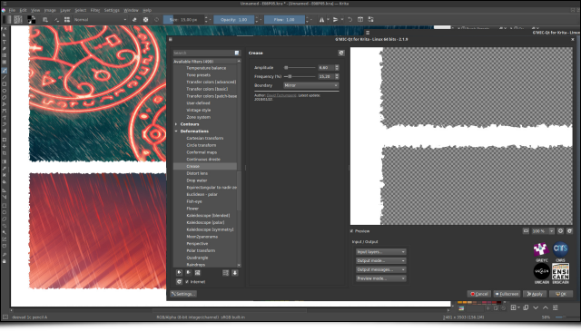](http://gmic.eu/gmic220/fullsize/gmic_crease2.png)
[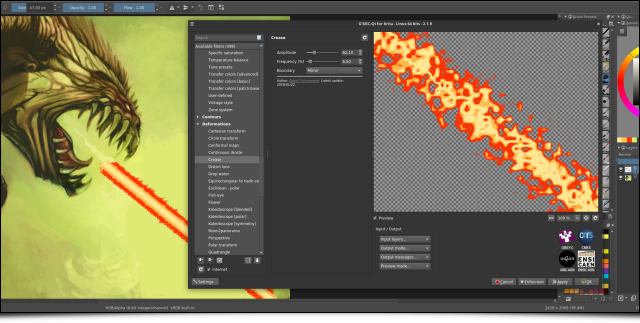](http://gmic.eu/gmic220/fullsize/gmic_crease3.png)
<figcaption>Fig. 2.6: Using the G'MIC "Crease" filter for two real cases of artistic creation.
</figcaption></figure>

# 3. Filters, filters, filters...

_David Revoy_ is not the only user of _G'MIC_: we sometimes count up to 900 daily downloads from the main project website. So it happens, of course, that other enthusiastic users inspire us new effects, especially during those lovely discussions that take place on our [forum](https://discuss.pixls.us/c/software/gmic), kindly made available by the [_PIXLS.US_](https://pixls.us/) community.

## 3.1. Bring out the details without creating "halos"

Many photographers will tell you that it is not always easy to enhance the details in digital photographs without creating naughty [artifacts](https://en.wikipedia.org/wiki/Visual_artifact) that often have to be masked manually afterwards. Conventional contrast enhancement algorithms are most often based on increasing the local variance of pixel lightness, or on the equalization of their local histograms. Unfortunately, these operations are generally done by considering neighborhoods with a fixed size and geometry, where each pixel of a neighborhood is always considered with the same weight in the statistical calculations related to these algorithms.
It is simpler and faster, but from a qualitative point of view it is not an excellent idea: we often get "halos" around contours that were already very contrasted in the image. This classic phenomenon is illustrated below with the application of the _Unsharp mask_ filter (the one present by default in GIMP) on a part of a landscape image. This generates an undesirable "halo" effect at the frontier between the mountain and the sky (this is particularly visible in full resolution images).

<figure>
[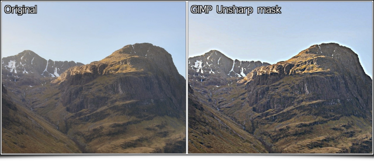](http://gmic.eu/gmic220/fullsize/gmic_highland01.png)
<figcaption>Fig. 3.1: Unwanted "halo" effects often occur with conventional contrast enhancement filters.
</figcaption></figure>

The challenge of the detail enhancement algorithms is to be able to analyze the geometry of the local image structures in a more fine way, to take into account geometry-adaptive local weights for each pixel of a given neighborhood. To make it simple, we want to create [anisotropic](https://en.wikipedia.org/wiki/Anisotropy) versions of the usual enhancement methods, orienting them by the edges detected in the images.
Following this logic, we have added two new _G'MIC_ filters recently, namely **Details/Magic details** and **Details/Equalize local histograms**, which try to better take the geometric content of the image into account for local detail enhancement (e.g. using the [bilateral filter](https://en.wikipedia.org/wiki/Bilateral_filter)).

<figure>
[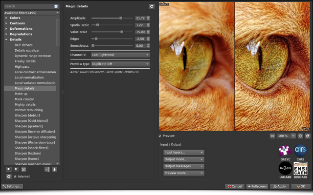](http://gmic.eu/gmic220/fullsize/gmic_magic_details.png)
[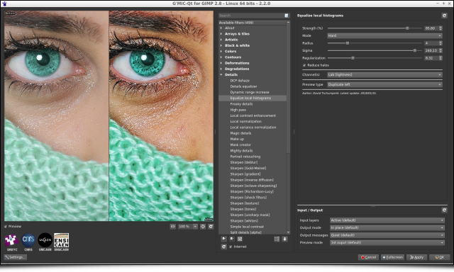](http://gmic.eu/gmic220/fullsize/gmic_eqdetails1.png)
[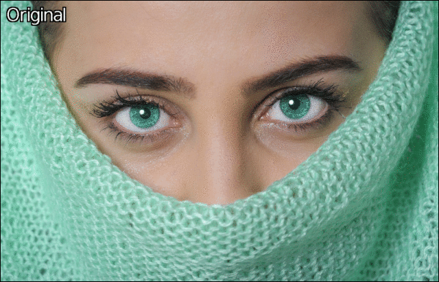](http://gmic.eu/gmic220/fullsize/gmic_eqdetails.gif)
<figcaption>Fig. 3.2: The new G'MIC detail enhancement filters.
</figcaption></figure>

Thus, the application of the new _G'MIC_ local histogram equalization on the landscape image shown before gives something slightly different : a more contrasted result both in geometric details and colors, and reduced halos.

<figure>
[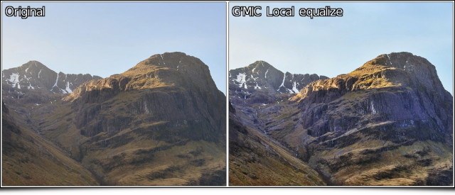](http://gmic.eu/gmic220/fullsize/gmic_highland02.png)
[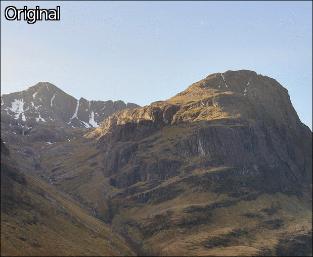](http://gmic.eu/gmic220/fullsize/gmic_highland.gif)
<figcaption>Fig. 3.3: Differences of results between the standard GIMP Unsharp Mask filter and the local histogram equalization of G'MIC, for details enhancement.
</figcaption></figure>

## 3.2. Different types of image deformations

New filters to apply geometric deformations on images are added to _G'MIC_ on a regular basis, and this new major version **2.2** offers therefore a bunch of new deformation filters.
So let's start with **Deformations/Spherize**, a filter which allows to locally distort an image to give the impression that it is projected on a 3D sphere or ellipsoid. This is the perfect filter to turn your obnoxious office colleague into a [Mr. Potato Head](https://en.wikipedia.org/wiki/Mr._Potato_Head)!

<figure>
[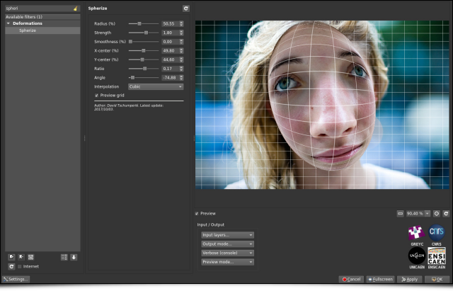](http://gmic.eu/gmic220/fullsize/gmic_spherize.png)
[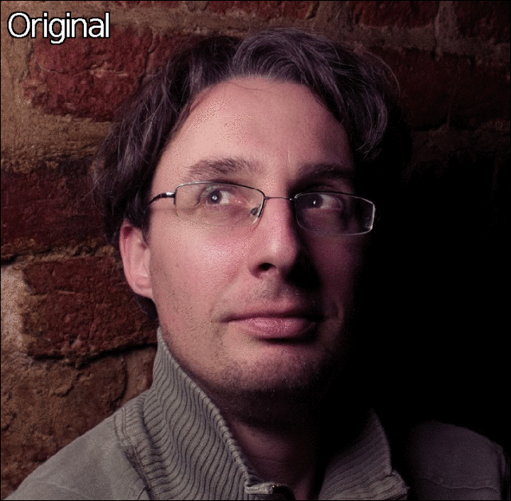](http://gmic.eu/gmic220/fullsize/gmic_spherize.gif)
<figcaption>Fig .3.4: Two examples of 3D spherical deformations obtained with the G'MIC "Spherize" filter.
</figcaption></figure>

On the other hand, the filter **Deformations/Square to circle** implements the direct and inverse transformations from a square domain (or rectangle) to a disk (as mathematically described on [_this page_](http://squircular.blogspot.fr/2015/09/mapping-circle-to-square.html)), which makes it possible to generate this type of deformations.

<figure>
[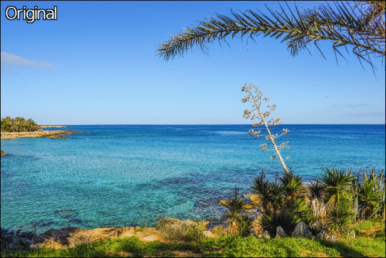](http://gmic.eu/gmic220/fullsize/gmic_sqtoci.gif)
<figcaption>Fig. 3.5: Direct and inverse transformations from a square domain to a disk.
</figcaption></figure>

The effect **Degradations/Streak** replaces an image area masked by the user (filled with a constant color) with one or more copies of a neighboring area. It works mainly as the _GIMP_ clone tool but prevents the user to fill the entire mask manually.

<figure>
[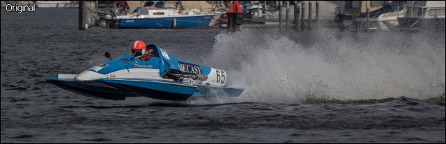](http://gmic.eu/gmic220/fullsize/gmic_streak.gif)
<figcaption>Fig. 3.6: The "Streak" filter clones parts of the image into a user-defined color mask.
</figcaption></figure>

## 3.3. Artistic Abstractions

You might say that image deformations are nice, but sometimes you want to transform an image in a more radical way. Let's introduce now the new effects that turn an image into a more abstract version (simplification and re-rendering). These filters have in common the analysis of the local image geometry, followed by a step of image synthesis.

For example, _G'MIC_ filter **Contours/Super-pixels**  locally gathers the image pixels with the same color to form a partitioned image, like a puzzle, with geometric shapes that stick to the contours. This partition is obtained using the [_SLIC_ method](https://ivrl.epfl.ch/research/superpixels) (_Simple Linear Iterative Clustering_), a classic image partitioning algorithm, which has the advantage of being relatively fast to compute.

<figure>
[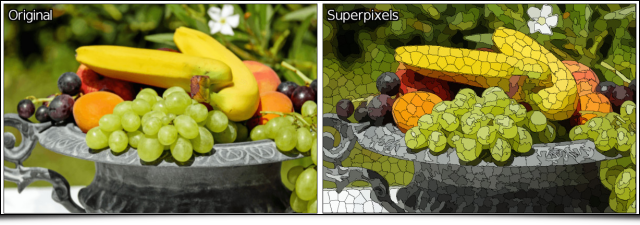](http://gmic.eu/gmic220/fullsize/gmic_slic.png)
[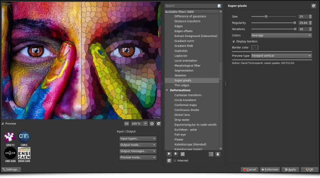](http://gmic.eu/gmic220/fullsize/gmic_slic2.png)
<figcaption>Fig. 3.7: Decomposition of an image in super-pixels by the Simple Linear Iterative Clustering algorithm (SLIC).
</figcaption></figure>

The filter **Artistic/Linify** tries to redraw an input image by superimposing semi-transparent colored lines on an initially white canvas, as shown in the figure below. This effect is the re-implementation of the smart algorithm initially proposed on the site http://linify.me (initially implemented in JavaScript).

<figure>
[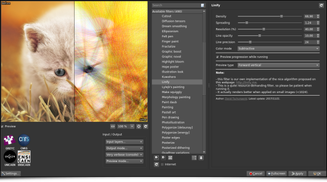](http://gmic.eu/gmic220/fullsize/gmic_linify.png)
[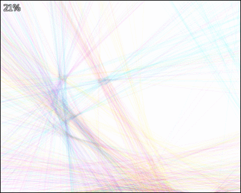](http://gmic.eu/gmic220/fullsize/gmic_linify.gif)
<figcaption>Fig. 3.8: The "Linify" effect tries to redraw an image by superimposing only semi-transparent colored lines on a white canvas.
</figcaption></figure>

The effect **Artistic/Quadtree variations** first decomposes an image as a [_quadtree_](https://en.wikipedia.org/wiki/Quadtree), then re-synthesize it by drawing oriented and plain ellipses on a canvas, one ellipse for each _quadtree_ leaf. This renders a rather interesting "painting" effect. It is likely that with more complex shapes, even more attractive renderings could be synthesized. Surely an idea to keep in mind for the next filters update :)

<figure>
[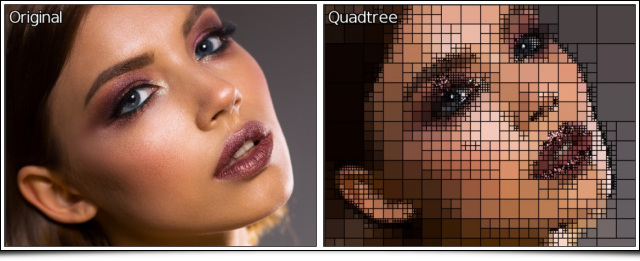](http://gmic.eu/gmic220/fullsize/gmic_quadtree.png)
[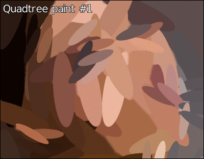](http://gmic.eu/gmic220/fullsize/gmic_qdellipse.gif)
<figcaption>Fig. 3.9: Decomposing an image as a quadtree allows to re-synthesize it by superimposing only plain colored ellipses.
</figcaption></figure>

## 3.4. "Are there any more?"

And now that you have processed so many beautiful pictures, why not arrange them in the form of a superb photo montage? This is precisely the role of the filter **Arrays & tiles/Drawn montage**, which allows to create a juxtaposition of photographs very quickly, for any kind of shapes.
The idea is to provide the filter with a colored template in addition to the serie of photographs (_Fig.3.10a_), and then to associate each photograph with a different color of the template (_Fig.3.10b_). Next, the arrangement is done automatically by _G'MIC_, by resizing the images so that they appear best framed within the shapes defined in the given montage template (_Fig.3.10c_).
We made [a video tutorial](https://www.youtube.com/watch?v=CxopG_DqQj4) illustrating the use of this specific filter.

<figure>
[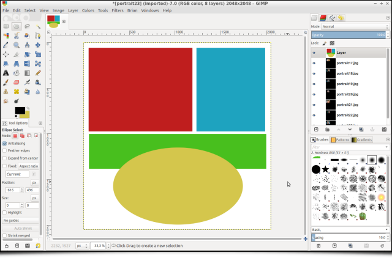](http://gmic.eu/gmic220/fullsize/gmic_drawn_montage0.png)
<figcaption>Fig. 3.10a: Step 1: The user draws the desired organization of the montage with shapes of different colors.
</figcaption></figure>

<figure>
[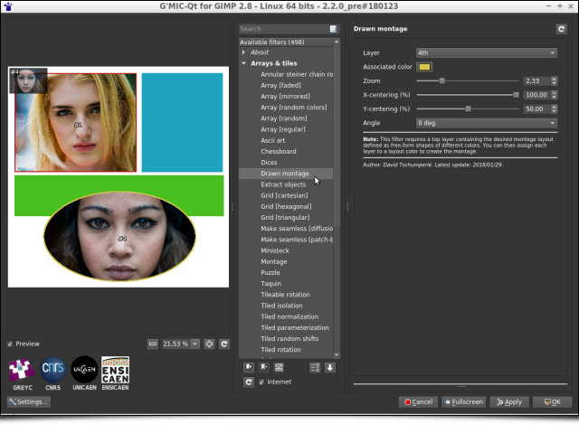](http://gmic.eu/gmic220/fullsize/gmic_drawn_montage.png)
<figcaption>Fig. 3.10b: Step 2: G'MIC's "Drawn Montage" filter allows you to associate a photograph for each template color.
</figcaption></figure>

<figure>
[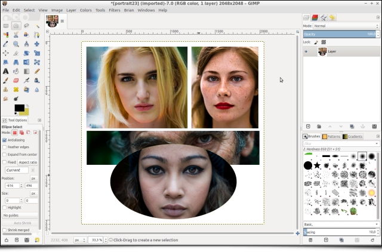](http://gmic.eu/gmic220/fullsize/gmic_drawn_montage2.png)
<figcaption>Fig. 3.10c: Step 3: The photo montage is then automatically synthetized by the filter.
</figcaption></figure>

But let's go back to more essential questions: have you ever needed to draw gears? No?! It's quite normal, that's not something we do everyday! But just in case, the new _G'MIC_ filter **Rendering/Gear** will be glad to help, with different settings to adjust gear size, colors and number of teeth. Perfectly useless, so totally indispensable!

<figure>
[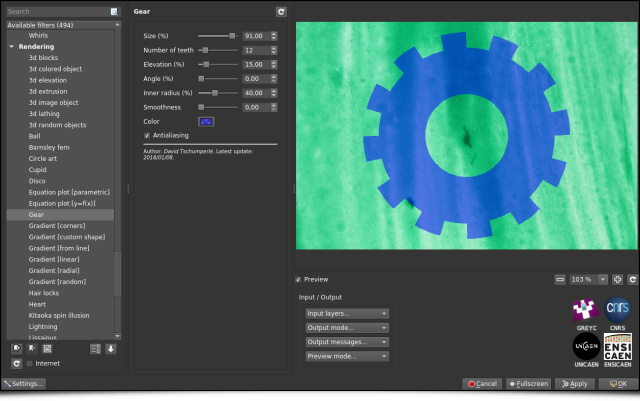](http://gmic.eu/gmic220/fullsize/gmic_gears.png)
<figcaption>Fig. 3.11: The Gear filter, running at full speed.
</figcaption></figure>

Need a satin texture right now? No?! Too bad, the filter **Patterns / Satin** could have been of a great help!

<figure>
[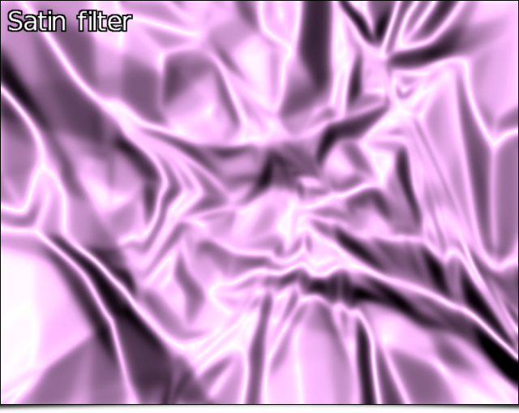](http://gmic.eu/gmic220/fullsize/gmic_satin.png)
<figcaption>Fig. 3.12: G'MIC's satin filter will make your life more silky.
</figcaption></figure>

And finally, to end up with the series of these _"effects that are useless until we need them"_, note the apparition of the new filter **Degradations/JPEG artifacts** which simulates the appearance of _JPEG_ compression artifacts due to the quantization of the [DCT](https://en.wikipedia.org/wiki/Discrete_cosine_transform "Discrete cosine transform") coefficients encoding 8×8 image blocks (yes, you will get almost the same result saving your image as a _JPEG_ file with the desired quality).

<figure>
[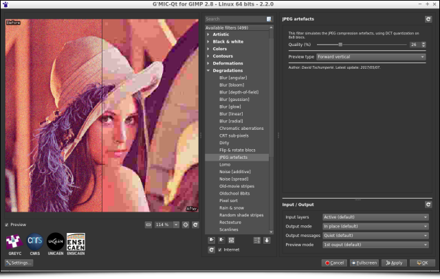](http://gmic.eu/gmic220/fullsize/gmic_dct.png)
[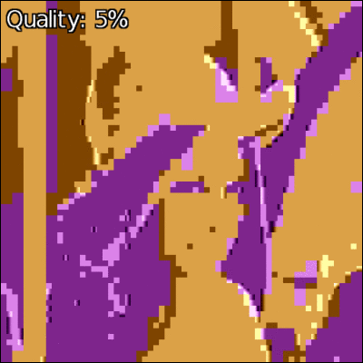](http://gmic.eu/gmic220/fullsize/gmic_dct.gif)
<figcaption>Fig. 3.13: The "JPEG artifacts" filter simulates the image degradation due to 8×8 block DCT compression.
</figcaption></figure>

# 4. Other notable improvements

This review of these new available _G'MIC_ filters should not overshadow the various improvements that have been made "under the hood" and that are equally important, even if they are less visible in practice for the user.

## 4.1. A better _G'MIC-Qt_ plugin interface

A big effort of cleaning and restructuring the _G'MIC-Qt_ plugin code has been realized, with a lot of little inconsistencies fixed in the [_GUI_](https://en.wikipedia.org/wiki/Graphical_user_interface). Let's also mention in bulk order some new interesting features that have appeared in the plugin: 

* The ability to set a [_timeout_](https://en.wikipedia.org/wiki/Timeout_(computing)) when trying to preview some computationnaly intensive filters.
* A better management of the input-output parameters for each filter (with persistence, better menu location, and a reset button).
* Maximizing the size of the preview area is now easier. Editing its zoom level manually is now possible, as well as chosing the language of the interface (regardless of the language used for the system), etc. 

All these little things gathered together globally improves the user experience.

<figure>
[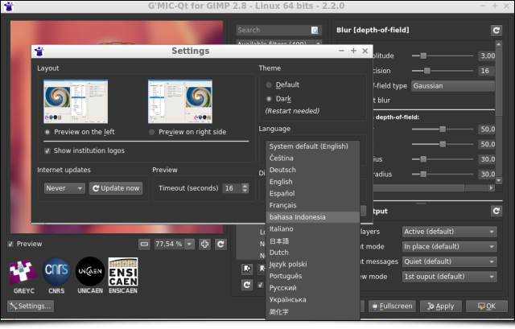](http://gmic.eu/gmic220/fullsize/gmic_prefs.png)
<figcaption>Fig. 4.1: Overview of the G'MIC-Qt plugin interface in its latest version 2.2.
</figcaption></figure>

## 4.2. Improvements in the _G'MIC_ core

Even less visible, but just as important, many improvements have appeared in the _G'MIC_ computational core and its associated _G'MIC_ script language interpreter. You have to know that all of the available filters are actually written in the form of scripts in the _G'MIC_ language, and each small improvement brought to the interpreter may have a beneficial consequence for all filters at once. Without going too much into the technical details of these internal improvements, we can highlight those points:

* The notable improvement in the syntax of the language itself, which goes along with better performances for the analysis of the language syntax (therefore for the script executions), all this with a smaller memory footprint.
* The _G'MIC_ built-in mathematical expression evaluator is also experiencing various optimizations and new features, to consider even more possibilities for performing non-trivial operations at the pixel level.

* A better support of raw video input/outputs (`.yuv` format) with support for` 4:2:2` and `4:4:4` formats, in addition to` 4:2:0` which was the only mode supported before.

* Finally, two new animations have been added to the _G'MIC_ demos menu (which is displayed e.g. when invoking `gmic` without arguments from the command-line):

  * First, a 3D starfield animation:
  
  <figure>
  [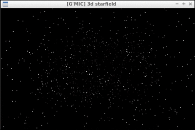](http://gmic.eu/gmic220/fullsize/gmic_starfield.gif)
  <figcaption>Fig.4.2: New 3D starfield animation added to the G'MIC demo menu.
  </figcaption>  </figure>
  
  * Second, a playable 3D version of the [_Tower of Hanoi_](https://en.wikipedia.org/wiki/Tower_of_Hanoi):
  
  <figure>
  
  <figcaption>Fig. 4.3: The playable 3D version of the "Tower of Hanoi", available in G'MIC.
  </figcaption>  </figure>
  
* Finally, let us mention the introduction of the command `tensors3d` dedicated to the 3D representation of second order [tensor fields](https://en.wikipedia.org/wiki/Tensor_field). In practice, it does not only serve to make you want to eat _Smarties®_! It can be used for example to visualize certain regions of [MRI volumes of diffusion tensors](https://en.wikipedia.org/wiki/Diffusion_MRI#Diffusion_tensor_imaging):

    <figure>
    [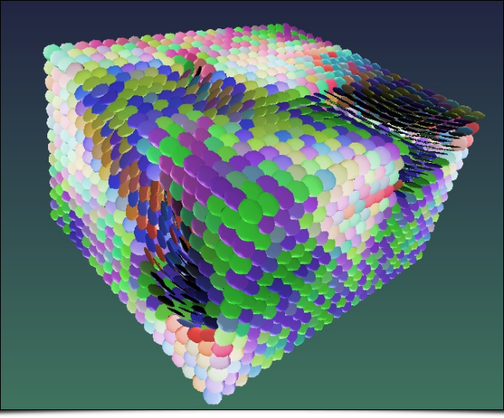](http://gmic.eu/gmic220/fullsize/gmic_tensors3d.png)
    <figcaption>Fig. 4.4: G'MIC rendering of a 3D tensor field, with command `tensors3d`.
    </figcaption>    </figure>

## 4.3. New design for _G'MIC Online_

To finish this tour, let us also mention the complete redesign of [_G'MIC Online_](https://gmicol.greyc.fr/) during the year 2017, done by _Christophe Couronne_ and _Véronique Robert_ from the development departement of the _GREYC_ laboratory.
_G'MIC Online_ is a web service allowing you to apply a subset of _G'MIC_ filters on your images, directly inside a web browser. These web pages now have a [responsive design](https://en.wikipedia.org/wiki/Responsive_web_design), which makes them more enjoyable than before on mobile devices (smartphones and tablets). Shown below is a screenshot of this service running in _Chrome_/_Android_, on a 10'' tablet.

<figure>
[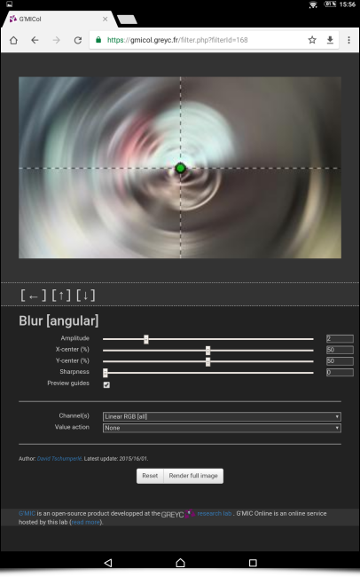](http://gmic.eu/gmic220/fullsize/gmicol.png)
<figcaption>Fig. 4.5: New responsive design of the G'MIC Online web service, running here on a 10" tablet.
</figcaption></figure>

# 5. Conclusion and perspectives

The overview of this new version **2.2** of _G'MIC_ is now over. 
One possible conclusion could be: "_There are plenty of perspectives!_". 

_G'MIC_ is a free project that can be considered as mature: the first lines of code were composed almost ten years ago, and today we have a good idea of the possibilities (and limits) of the beast. We hope to see more and more interest from [FOSS](https://en.wikipedia.org/wiki/Free_and_open-source_software) users and developers, for example for integrating the _G'MIC-Qt_ generic plugin in various software focused on image or video processing.

The possibility of using the _G'MIC_ core under a more permissive _CeCILL-C_ license can also be a source of interesting collaborations in the future (some companies have already approached us about this). While waiting for potential collaborations, we will do our best to continue developping _G'MIC_ and feed it with new filters and effects, according to the suggestions of our enthusiastic users. A big thanks to them for their help and constant encouragement (the motivation to write code or articles, past 11pm, would not be the same without them!).

_"Long live open-source image processing and artistic creation!"_

