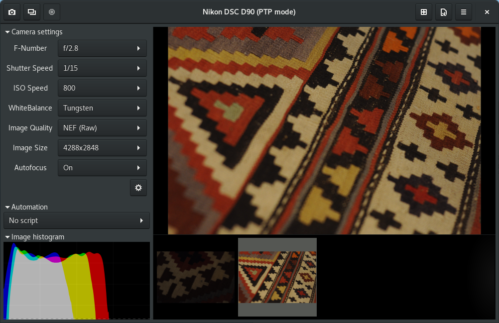

A major goal of the PIXLS.US effort is to do whatever we can do to help developers of projects unburden themselves from administrating their project. We do this, in part, by providing forum hosting, participating in support, providing web design, and doing community outreach. With that in mind, we are excited to welcome the [gPhoto Projects](http://gphoto.org/) to our [discuss forum](https://discuss.pixls.us/c/software/gphoto)!
<!--more-->

*The Entangle interface, which makes use of `libgphoto`.*

You may not have heard of gPhoto, but there is a high chance that you've used the project's software. At the heart of the project is `libgphoto2`, a portable library that gives application access to [hundreds of digital cameras](http://www.gphoto.org/proj/libgphoto2/support.php). On top of the foundational library is `gphoto2`, a command line interface to your camera that supports almost everything that the library can do. The library is used in a bunch of awesome photography applications, such as [digiKam](https://digikam.org), [darktable](https://darktable.org), [entangle](https://entangle-photo.org/), and [GIMP](https://gimp.org). There is even a [FUSE module](http://www.gphoto.org/proj/gphotofs/), so you can mount your camera storage as a normal filesystem.

gPhoto was recruited to the PIXLS.US community when [@darix](https://discuss.pixls.us/u/darix/summary) was sitting next to gPhoto developer Marcus. Marcus was using darix's Fuji camera to test integration into `libgphoto`, then the magic happened! Not only will some Fuji models be supported, but our community is growing larger. This is also a reminder that one person can make a huge difference. Thanks darix!

Welcome, gPhoto, and thank you for the years and years of development! 
