The [IMAGE](https://www.greyc.fr/?page_id=443&lang=en) team of the [GREYC](https://www.greyc.fr/?page_id=27&lang=en) laboratory is happy to celebrate the 10th anniversary of [_G’MIC_](http://gmic.eu) with you, an open-source ([CeCILL](http://www.cecill.info/)), generic and extensible framework for [image processing](https://en.wikipedia.org/wiki/Digital_image_processing).
GREYC is a public research laboratory on digital technology located in Caen, Normandy/France, under the supervision of 3 research institutions: the [CNRS](http://www.cnrs.fr) (UMR 6072), the [University of Caen Normandy](http://www.unicaen.fr/home-578581.kjsp?RH=1291198060074&RF=UNIV-EN) and the [ENSICAEN](http://www.ensicaen.fr/)  engineering school.

<!--more-->

<figure>
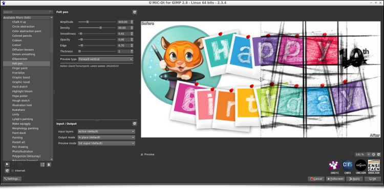
<figcaption>
G’MIC-Qt, the main user interface of the G'MIC project. 
</figcaption>
</figure>

This celebration gives us the perfect opportunity to announce the release of a new version ([**2.3.6**](https://gmic.eu/download.shtml)) of this free software and to share with you a summary of the latest notable changes since our [last G'MIC report](https://pixls.us/blog/2018/02/g-mic-2-2/), published on [_PIXLS.US_ in February 2018][].

[_PIXLS.US_ in February 2018]: /blog/2018/02/g-mic-2-2/


----

**Related links:**
* [The G’MIC project](https://gmic.eu)
* [Twitter feed](https://twitter.com/gmic_ip)
* [Announcement of the first version of G’MIC on LinuxFr.org ](https://linuxfr.org/news/gmic-un-nouvel-outil-libre-de-manipulation-dimages) [fr]
* [Previous article about G'MIC on PIXLS.US](https://pixls.us/blog/2018/02/g-mic-2-2/)

----

(_Click on the images of the report to display them in full resolution_)

## 1. Looking back at 10 years of development

_G’MIC_ is a multiplatform framework (GNU/Linux, macOS, Windows…) providing various user interfaces for manipulating _generic_ image data, such as 2D or 3D hyperspectral images or image sequences with float values (thus including "normal" color images). More than [1000 different operators](http://gmic.eu/reference.shtml) for image processing are included, a number that is extensible at will since users can add their own functions by using the embedded script language.

It was at the end of July 2008 that the first lines of _G'MIC_ code were created (in _C++_).
At that time, I was the main developer involved in [_CImg_](http://cimg.eu), a lightweight _open source_ _C++_ library for image processing, when I made the following observation:

- The initial goal of _CImg_, which was to propose a "minimal" library of functions to help _C++_ developers to develop image processing algorithms, was broadly achieved; most of the algorithms I considered as _essential_ in image processing were integrated. _CImg_ was initially meant to stay lightweight, so I didn't want to include new algorithms _ad vitam æternam_, which would be too heavy or too specific, thus betraying the initial concept of the library.
- However, this would only cater to a rather small community of people with both _C++_ knowledge **and** image processing knowledge! One of the natural evolutions of the project, creating [_bindings_](https://en.wikipedia.org/wiki/Language_binding) of _CImg_ to other programming languages, didn’t appeal much to me given the lack of interest I had in writing the code. And these potential _bindings_ still only concerned an audience with some development expertise.

My ideas were starting to take shape: I needed to find a way to provide _CImg_ processing features for **non-programmers**. Why not attempt to build a tool that could be used on the command line (like the famous [_convert_](https://www.imagemagick.org/script/convert.php) command from [_Imagemagick_](https://www.imagemagick.org))? A first attempt in June 2008 (_inrcast_, presented on the French news site [LinuxFR](https://linuxfr.org/users/dtschump/journaux/inrcast-un-autre-outil-de-manipulation-dimages)), while unsuccessful, allowed me to better understand what would be required for this type of tool to  easily process images from the command line.

In particular, it occurred to me that **conciseness** and **coherence** of the command syntax were the two most important things to build upon. These were the aspects that required the most effort in research and development (the actual image processing features were already implemented in _CImg_). In the end, the focus on conciseness and coherence took me much further than originally planned as G'MIC got an [interpreter](https://en.wikipedia.org/wiki/Interpreter_(computing)) of [its own scripting language](https://gmic.eu/tutorial/basics.shtml), and then a [_JIT_ compiler](https://en.wikipedia.org/wiki/Just-in-time_compilation) for the evaluation of mathematical expressions and image processing algorithms working at the pixel level.

With these ideas, by the end of July 2008, I was happy to announce the [first draft of _G'MIC_](https://linuxfr.org/news/gmic-un-nouvel-outil-libre-de-manipulation-dimages). The project was officially up and running!

<figure>
<a href="http://gmic.eu/gmic220/fullsize/logo_gmic.png">

</a>
<figcaption>
Fig. 1.1: Logo of the G’MIC project, libre framework for image processing, and its cute mascot &ldquo;Gmicky&rdquo; (illustrated by [David Revoy](http://www.davidrevoy.com/)).
</figcaption>
</figure>

A few months later, in January 2009, enriched by my previous development experience on [_GREYCstoration_](http://cimg.eu/greycstoration) (a free tool for nonlinear image denoising and interpolation, from which a plug-in was made for [_GIMP_](http://www.gimp.org)), and in the hopes of reaching an even larger public, I published a [_G'MIC_ _GTK_ plug-in for _GIMP_](https://linuxfr.org/news/traitement-dimages-quand-gmic-130-sinvite-dans-gimp).
This step proved to be a defining moment for the _G'MIC_ project, giving it a significant boost in popularity as seen below (the project was hosted on [_Sourceforge_](https://sourceforge.net/projects/gmic/) at the time).

<figure>
<a href="http://gmic.eu/gmic234/fullsize/stats_plugin.png">
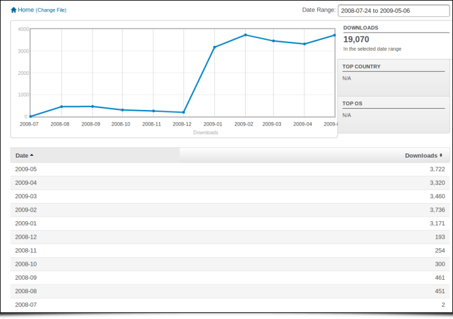
</a>
<figcaption>
Fig.1.2: Monthly downloads statistics of G'MIC, between July 2008 and May 2009 (release of the GIMP plug-in happened in January 2009).
</figcaption>
</figure>

The sudden interest in the plugin from different users of _GIMP_ (photographers, illustrators and other types of artists) was indeed a real launchpad for the project, with the rapid appearance of various contributions and external suggestions (for the code, management of the forums, web pages, writing of tutorials and realization of videos, etc.). The often idealized community effect of free software finally began to take off! Users and developers began to take a closer look at the operation of the original _command-line interface_ and its associated scripting language (which admittedly did not interest many people until that moment!). From there, many of them [took the plunge](https://github.com/dtschump/gmic-community) and began to implement new image processing filters in the _G'MIC_ language, continuously integrated them into the _GIMP_ plugin. Today, these contributions represent almost half of the filters available in the plugin.

Meanwhile, the important and repeated contributions of [_Sébastien Fourey_](https://foureys.users.greyc.fr/Fr/index.php), colleague of the _GREYC IMAGE_ team (and experienced C++ developer) significantly improved the user experience of _G'MIC_. _Sébastien_ is indeed at the heart of the main graphical interface development of the project, namely:

- The [_G'MIC Online_](https://gmicol.greyc.fr/) web service (which was later re-organised by _GREYC's_ Development Department).
- Free Software [_ZArt_](https://github.com/c-koi/zart), a graphical interface - based on the [_Qt_](https://www.qt.io/) library - for the application of _G'MIC_ filters to video sequences (from files or digital camera streams).
- And above all, at the end of 2016, Sébastien tackled a complete rewrite of the _G'MIC_ plugin for _GIMP_ in a more **generic** form called [_G'MIC-Qt_](https://github.com/c-koi/gmic-qt). This component, also based on the _Qt_ library (as the name suggests), is a single plugin that works equally well with both [_GIMP_](http://www.gimp.org) and [_Krita_](http://krita.org), two of the leading free applications for photo retouching/editing and digital painting. _G'MIC-Qt_ has now completely supplanted the original _GTK_ plugin thanks to its many features: built-in filter search engine, better preview, superior interactivity, etc. Today it is the most successful interface of the _G'MIC_ project and we hope to be able to offer it in the future for other host applications (contact us if you are interested in this subject!).

<figure>
<a href="http://gmic.eu/gmic234/fullsize/gui_seb.png">
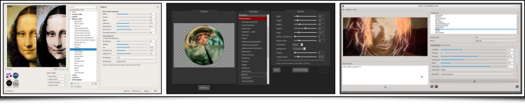
</a>
<figcaption>
Fig.1.3: Different graphical interfaces of the G'MIC project, developed by Sébastien Fourey: G'MIC-Qt, G'MIC Online and ZArt.
</figcaption>
</figure>

The purpose of this article is not to go into too much detail about the history of the project. Suffice it to say that we have not really had time to become bored in the last ten years!

Today, _Sébastien_ and I are the two primary maintainers of the _G'MIC_ project (_Sébastien_ mainly for the interface aspects, myself for the development and improvement of filters and the core development), in addition to our main professional activity (research and teaching/supervision).

Let's face it, managing a free project like _G'MIC_ takes a considerable amount of time, despite its modest size (~120k lines of code). But the original goal has been achieved: thousands of non-programming users have the opportunity to freely and easily use our image processing algorithms in many different areas: [image editing](https://en.wikipedia.org/wiki/Image_editing), [photo manipulation](https://en.wikipedia.org/wiki/Photo_manipulation), illustration and [digital painting](https://en.wikipedia.org/wiki/Digital_painting), [video processing](https://en.wikipedia.org/wiki/Video_editing_software), scientific illustration, [procedural generation](https://en.wikipedia.org/wiki/Procedural_generation), [glitch art](https://en.wikipedia.org/wiki/Glitch_art)...

The milestone of _3.5 million total downloads_ was exceeded last year, with a current average of about 400 daily downloads from the official website (figures have been steadily declining in recent years as _G'MIC_ is becoming more commonly downloaded and installed via alternative external sources).

It is sometimes difficult to keep a steady pace of development and the motivation that has to go with it, but we persisted, thinking back to the happy users who from time to time share their enthusiasm for the project!

Obviously we can't name all the individual contributors to _G'MIC_ whom we would like to thank, and with whom we've enjoyed exchanging during these ten years, but our heart is with them! Let's also thank the _GREYC_ laboratory and [_INS2I_ institute of _CNRS_](http://www.cnrs.fr/ins2i/) for their strong support for this free project. A big thank you also to all the community of _PIXLS.US_ who did a great job supporting the project (hosting the forum and  publishing our [articles on _G'MIC_](https://pixls.us/blog/)).

But let's stop reminiscing and get down to business: new features since our last article about the release of version 2.2!


## 2. Automatic illumination of flat-colored drawings

_G'MIC_ recently gained a quite impressive new filter named « **Illuminate 2D shape** », the objective of which is to automatically add lit zones and clean shadows to flat-colored 2D drawings, in order to give a 3D appearance.

First, the user provides an object to illuminate, in the form of an image on a transparent background (typically a drawing of a character or animal). By analyzing the shape and content of the image, G'MIC then tries to deduce a concordant 3D elevation map (" bumpmap "). The map of elevations obtained is obviously not exact, since a 2D drawing colored in solid areas does not contain explicit information about an associated 3D structure! From the estimated 3D elevations it is easy to deduce a map of normals (" normalmap ") which is used in turn to generate an illumination layer associated with the drawing (following a [Phong Shading model](https://en.wikipedia.org/wiki/Phong_shading)).

<figure>
<a href="http://gmic.eu/gmic234/fullsize/gmic_illuminate2d.png">

</a>
<figcaption>
Fig. 2.1: G'MIC's "**Illuminate 2D shape**" filter in action, demonstrating automatic shading of a beetle drawing (shaded result on the right).
</figcaption>
</figure>

This new filter is very flexible and allows the user to have a fairly fine control over the lighting parameters (position and light source rendering type) and estimation of the 3D elevation. In addition the filter gives the artist the opportunity to rework the generated illumination layer, or even directly modify the elevation maps and estimated 3D normals. The figure below illustrates the process as a whole; using the solid colored beetle image (_top left_), the filter fully automatically estimates an associated 3D normal map (_top right_). This allows it to generate renditions based on the drawing (_bottom row_) with two different rendering styles: smooth and quantized.

<figure>
<a href="http://gmic.eu/gmic234/fullsize/bug_all.png">
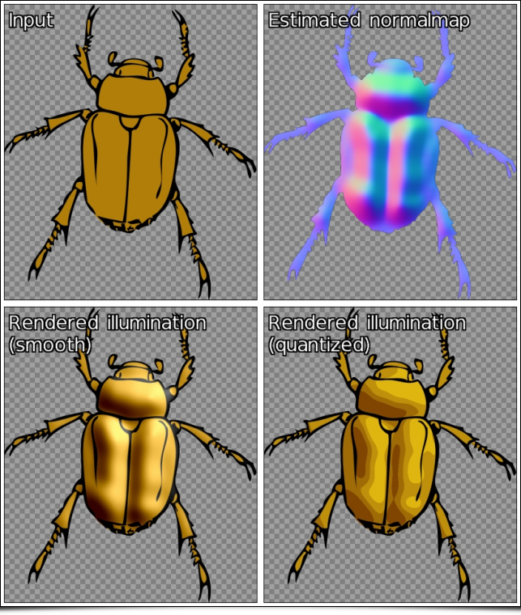
</a>
<figcaption>
Fig. 2.2: The process pipeline of the G'MIC "**Illuminate 2D shape**" filter involves the estimation of a 3D normal map to generate the automatic illumination of a drawing.
</figcaption>
</figure>

Despite the difficulty inherent in the problem of converting a 2D image into 3D elevation information, the algorithm used is surprisingly effective in a good many cases. The estimation of the 3D elevation map obtained is sufficiently consistent to automatically generate plausible 2D drawing illuminations, as illustrated by the two examples below - obtained in just a few clicks!

<figure>
<a href="http://gmic.eu/gmic234/fullsize/gmic_snake.png">
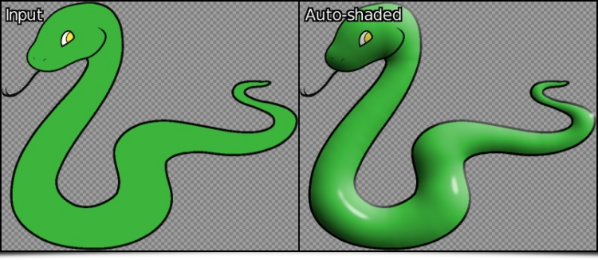
</a>
<a href="http://gmic.eu/gmic234/fullsize/gmic_tiger.png">
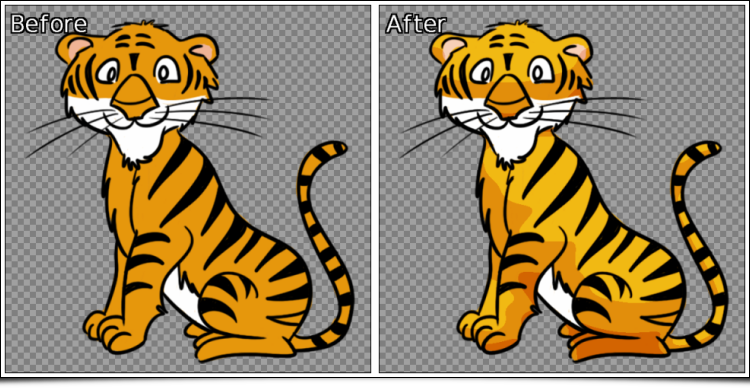
</a>
<figcaption>
Fig. 2.3: Two examples of completely automatic shading of 2D drawings, generated by G'MIC
</figcaption>
</figure>

It occurs, of course, that the estimated 3D elevation map does not always match what one might want. Fear not, the filter allows the user to provide "guides" in the form of an additional layer composed of colored lines, giving more precise information to the algorithm about the structure of the drawing to be analyzed. The figure below illustrates the usefulness of these guides for illuminating a drawing of a hand (_top left_); the automatic illumination (_top right_) does not account for information in the lines of the hand. Including these few lines in an additional layer of "guides" (_in red, bottom left_) helps the algorithm to illuminate the drawing more satisfactorily.

<figure>
<a href="http://gmic.eu/gmic234/fullsize/gmic_hand4.png">
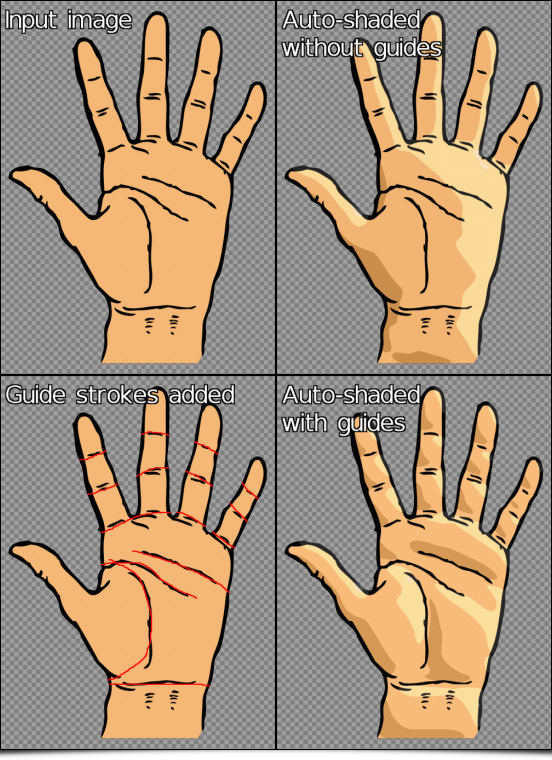
</a>
<figcaption>
Fig. 2.4: Using a layer of "guides" to improve the automatic illumination rendering generated by G'MIC.
</figcaption>
</figure>

If we analyze more precisely the differences obtained between estimated 3D elevation maps with and without guides (illustrated below as symmetrical 3D objects), there is no comparison: we go from a very round boxing glove to a much more detailed 3D hand estimation!

<figure>
<a href="http://gmic.eu/gmic234/fullsize/gmic_hand3d_anim_all.gif">
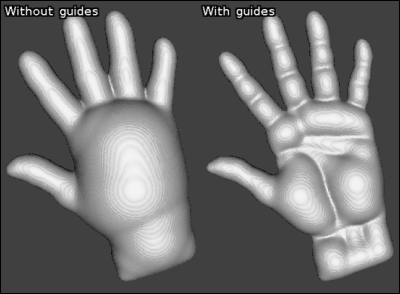
</a>
<figcaption>
Fig. 2.5: Estimated 3D elevations for the preceding drawing of a hand, with and without the use of "guides".
</figcaption>
</figure>

Finally, note that this filter also has an interactive preview mode, allowing the user to move the light source (with the mouse) and have a preview of the drawing illuminated in real time. By modifying the position parameters of the light source, it is thus possible to obtain the type of animations below in a very short time, which gives a fairly accurate idea of the 3D structure estimated by the algorithm from the original drawing.

<figure>
<a href="http://gmic.eu/gmic234/fullsize/gmic_hand.gif">

</a>
<figcaption>
Fig. 2.6: Modification of the position of the light source and associated illumination renderings, calculated automatically by G'MIC.
</figcaption>
</figure>

A video showing the various possible ways to edit the illumination allowed by this filter is [visible here](https://www.youtube.com/watch?v=G1wYSJTsVtI). The hope is this new feature of G'MIC allows artists to accelerate the illumation and shading stage of their future drawings!

## 3. Stereographic projection

In a completely different genre, we have also added a filter implementing [stereographic projection](https://en.wikipedia.org/wiki/Stereographic_projection), suitably named "**Stereographic projection**". This type of cartographic projection makes it possible to project planar defined image data onto a sphere. It should be noted that this is the usual projection used to generate images of "mini-planets" from equirectangular panoramas, like the one illustrated in the figure below.

<figure>
<a href="http://gmic.eu/gmic234/fullsize/gmic_stereographic0.png">
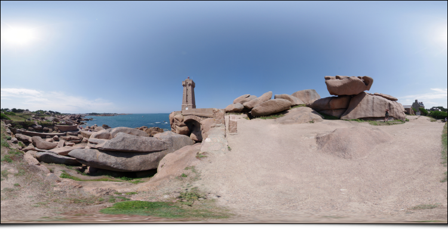
</a>
<figcaption>
Fig. 3.1: Example of equirectangular panorama (created by [Alexandre Duret-Lutz](https://www.flickr.com/photos/gadl)).
</figcaption>
</figure>

If we launch the _G'MIC_ plugin with this panorama and select the filter "**Stereographic projection**", we get:

<figure>
<a href="http://gmic.eu/gmic234/fullsize/gmic_stereographic.png">
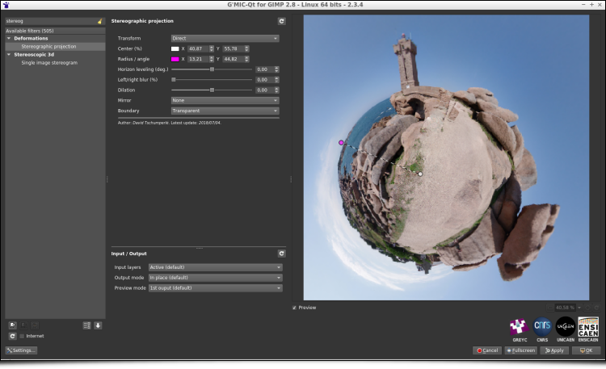
</a>
<figcaption>
Fig. 3.2: The "**Stereographic projection**" filter of G'MIC in action using the plugin for GIMP or Krita.
</figcaption>
</figure>

The filter allows precise adjustments of the projection center, the rotation angle, and the radius of the sphere, all interactively displayed directly on the preview window (we will come back to this later). In a few clicks, and after applying the filter, we get the desired "mini-planet":

<figure>
<a href="http://gmic.eu/gmic234/fullsize/gmic_stereographic3.png">
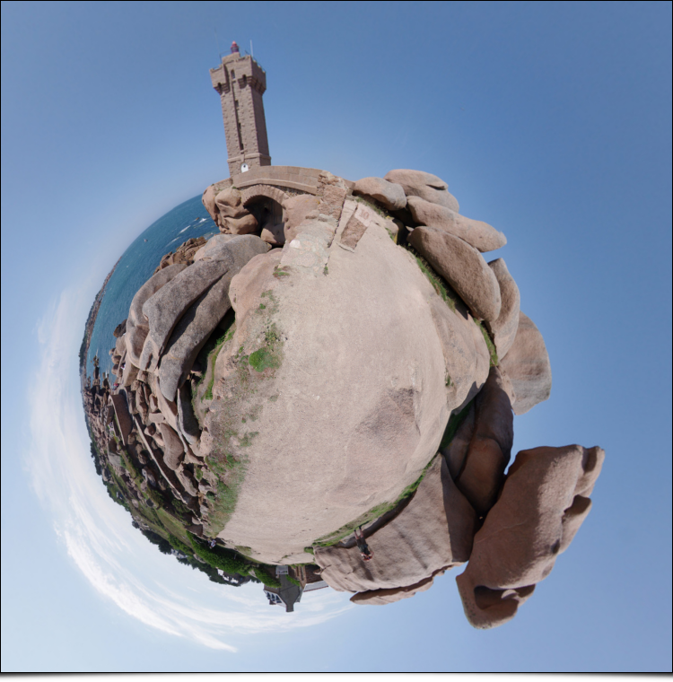
</a>
<figcaption>
Fig. 3.3: "Mini-planet" obtained after stereographic projection.
</figcaption>
</figure>

It is also intruiging to note that simply by reversing the vertical axis of the images, we transform a "mini-planet" into a "max-tunnel"!

<figure>
<a href="http://gmic.eu/gmic234/fullsize/gmic_tunnel.png">
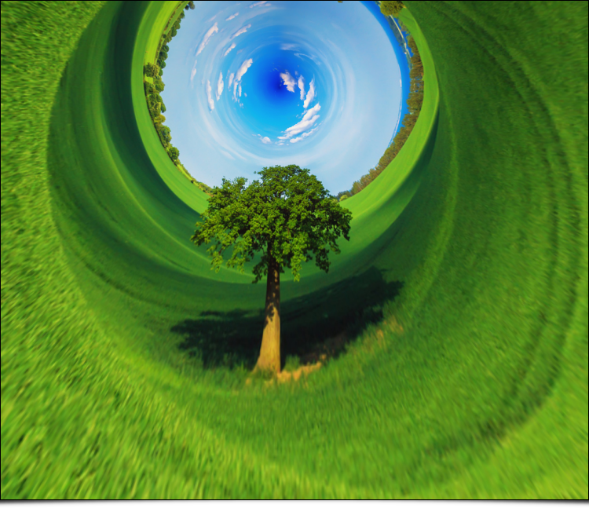
</a>
<figcaption>
Fig. 3.4: "Maxi-tunnel" obtained by inversion of the vertical axis then stereographic projection.
</figcaption>
</figure>

Again, we made [this short video](https://www.youtube.com/watch?v=5BYV1lwuF3w) which shows this filter used in practice. Note that _G'MIC_ already had a similar filter (called "**Sphere**"), which could be used for the creation of "mini-planets", but with a type of projection less suitable than the stereographic projection now available.

## 4. Even more possibilities for color manipulation

Manipulating the colors of images is a recurring occupation among photographers and illustrators, and _G'MIC_ already had several dozen filters for this particular activity - grouped in a dedicated category (the originally named "**Colors**" category!). This category is still growing, with two new filters having recently appeared:

- The "**CLUT from after-before layers**" filter tries to model the color transformation performed between two images. For example, suppose we have the following pair of images:

<figure>
<a href="http://gmic.eu/gmic234/fullsize/wc_trophy01.png">

</a>
<figcaption>
Fig. 4.1: Pair of images where an unknown colorimetric transformation has been applied to the top image to obtain the bottom one.
</figcaption>
</figure>

**Problem**: we do not remember at all how we went from the the original image to the modified image, but we would like to apply the same process to another image. Well, no more worries, call _G'MIC_ to the rescue! The filter in question will seek to better model the modification of the colors in the form of a [_HaldCLUT_](http://www.quelsolaar.com/technology/clut.html), which happens to be a classic way to represent any colorimetric transformation.

<figure>
<a href="http://gmic.eu/gmic234/fullsize/gmic_clut_from_ab.png">
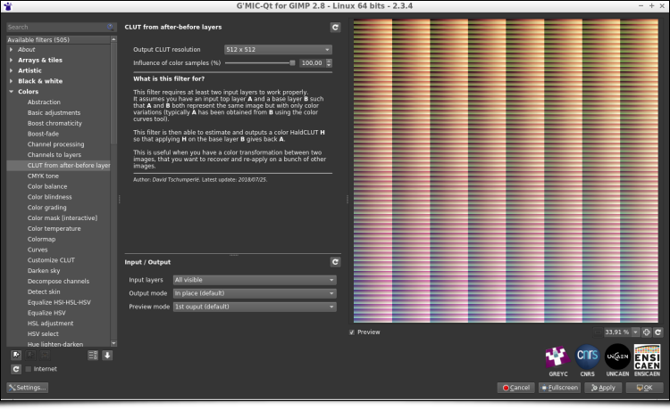
</a>
<figcaption>
Fig. 4.2: The filter models the color transformation between two images as a HaldCLUT.
</figcaption>
</figure>

The _HaldCLUT_ generated by the filter can be saved and re-applied on other images, with the desired property that the application of the _HaldCLUT_ on the original image produces the target model image originally used to learn the transformation.
From there, we are able to apply an equivalent color change to any other image:

<figure>
<a href="http://gmic.eu/gmic234/fullsize/pink_car_all.png">
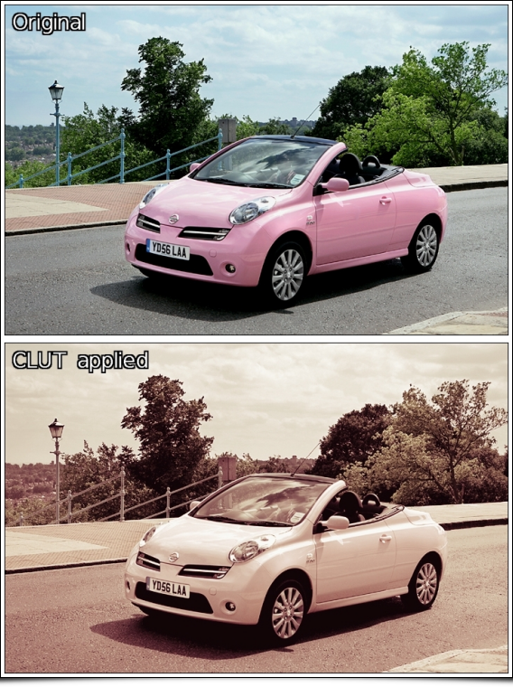
</a>
<figcaption>
Fig. 4.3: The estimated color transformation in the form of HaldCLUT is re-applied to another image.
</figcaption>
</figure>

This filter makes it possible in the end to create _HaldCLUT_ "by example", and could therefore interest many photographers (in particular those who distribute compilations of _HaldCLUT_ files, [freely](https://rawpedia.rawtherapee.com/Film_Simulation) or otherwise!).

- A second color manipulation filter, named "**Mixer [PCA]**" was also recently integrated into _G'MIC_. It acts as a classic [color channel mixer](https://docs.gimp.org/en/plug-in-colors-channel-mixer.html), but rather than working in a predefined color space (like sRGB, HSV, Lab...), it acts on the "natural" color space of the input image, obtained by [principal component analysis](https://en.wikipedia.org/wiki/Principal_component_analysis) (PCA) of its _RGB_ colors. Thus each image will be associated with a different color space. For example, if we take the "lion" image below and look at the distribution of its colors in the _RGB_ cube (_right image_), we see that the main axis of color variation is defined by a straight line from dark orange to light beige (axis symbolized by the _red arrow_ in the figure).

<figure>
<a href="http://gmic.eu/gmic234/fullsize/gmic_mix_pca2.png">
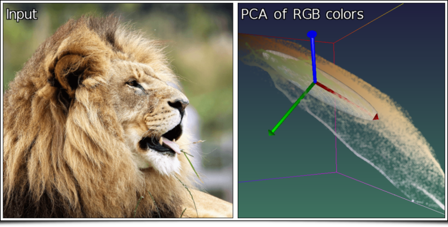
</a>
<figcaption>
Fig. 4.4: Distribution of colors from the "lion" image in the RGB cube, and associated main axes (colorized in red, green and blue).
</figcaption>
</figure>

The secondary axis of variation (_green arrow_) goes from blue to orange, and the tertiary axis (_blue arrow_) from green to pink. It is these axes of variation (rather than the _RGB_ axes) that will define the color basis used in this channel mix filter.

<figure>
<a href="http://gmic.eu/gmic234/fullsize/gmic_mix_pca.png">
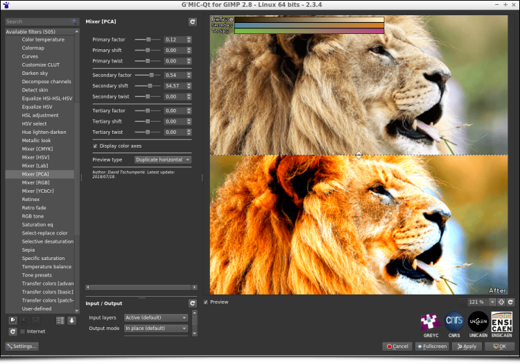
</a>
<figcaption>
Fig. 4.5: The "**Mixer [PCA]**" filter is a channel mixer acting on the axes of "natural" color variations of the image.
</figcaption>
</figure>

It would be wrong to suggest that it is always better to consider the color basis obtained by _PCA_ for the mixing of channels, and this new filter is obviously not intended to be the "ultimate" mixer that would replace all others. It simply exists as an alternative to the usual tools for mixing color channels, an alternative whose results proved to be quite interesting in tests of several images used during the development of this filter. It does no harm to try in any case...

## 5. Filter mishmash

This section is about a few other filters improved or included lately in _G'MIC_ which deserve to be talked about, without dwelling too much on them.

- Filter &ldquo;**Local processing**&rdquo; applies a color normalization or equalization process on the local image neighborhoods (with possible overlapping). This is an additional filter to make details pop up from under or over-exposed photographs, but it may create strong and unpleasant halo artefacts with non-optimal parameters.

  <figure>
  <a href="http://gmic.eu/gmic234/fullsize/gmic_local_processing.png">
  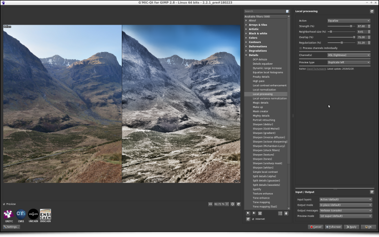
  </a>
  <figcaption>
  Fig. 5.1: The new filter &ldquo;**Local processing**&rdquo; enhances details and contrast in under or over-exposed photographs.
  </figcaption>
  </figure>

- If you think that the number of layer blending modes available in _GIMP_ or _Krita_ is not enough, and dream about defining your own blending mode formula, then the recent improvement of the _G'MIC_ filter « **Blend [standard]** » will please you! This filter now gets a new option « _Custom formula_ » allowing the user to specify their own [mathematical formula](http://www.pegtop.net/delphi/articles/blendmodes/) when blending two layers together. All of your blending wishes become possible!

  <figure>
  <a href="http://gmic.eu/gmic234/fullsize/gmic_blend_custom.png">
  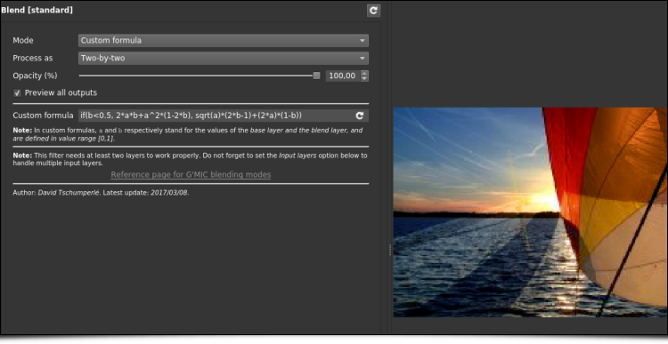
  </a>
  <figcaption>
  Fig. 5.2: The "**Blend [standard]**" filter now allows definition of mathematical formulas for layer merging.
  </figcaption>
  </figure>

- Also note the complete re-implementation of the nice "**Sketch**" filter, which had existed for several years but could be a little slow on large images. The new implementation is much faster, taking advantage of multi-core processing when possible.

  <figure>
  <a href="http://gmic.eu/gmic234/fullsize/gmic_sketch.png">
  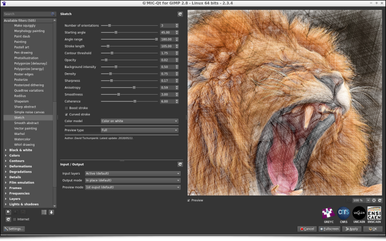
  </a>
  <figcaption>
  Fig. 5.3: The "**Sketch**" filter has been re-implemented and now exploits all available compute cores.
  </figcaption>
  </figure>

- A large amount of work has also gone into the re-implementation of the "**Mandelbrot - Julia sets**" filter, since the navigation interface has been entirely redesigned, making exploration of the [Mandelbrot set](https://en.wikipedia.org/wiki/Mandelbrot_set) much more comfortable (as illustrated by this [video](https://youtu.be/wZv3BQF00gA)). New options for choosing colors have also appeared.

  <figure>
  <a href="http://gmic.eu/gmic234/fullsize/gmic_mandelbrot.png">
  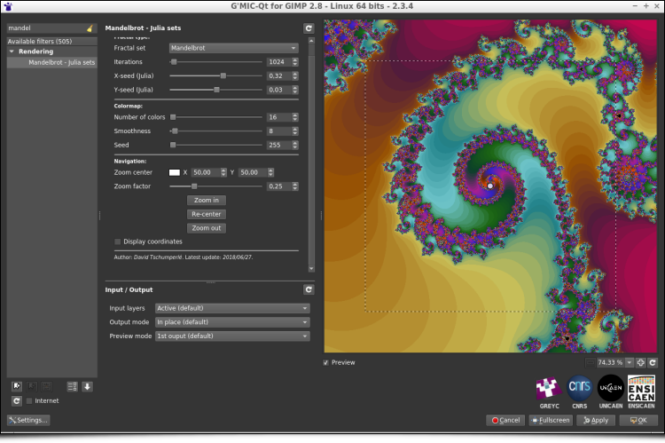
  </a>
  <figcaption>
  Fig. 5.4: The "**Mandelbrot - Julia sets**" filter and its new navigation interface in the complex space.
  </figcaption>
  </figure>

- In addition, the "**Polygonize [Delaunay]**" filter that generates polygonized renderings of color images has a new rendering mode, using linearly interpolated colors in the [Delaunay triangles](https://en.wikipedia.org/wiki/Delaunay_triangulation) produced.

  <figure>
  <a href="http://gmic.eu/gmic234/fullsize/delaunay_all.png">
  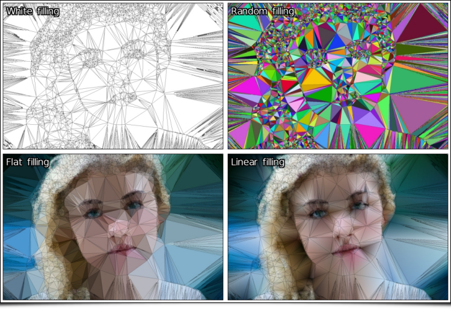
  </a>
  <figcaption>
  Fig. 5.5: The different rendering modes of the "**Polygonize [Delaunay]**" filter.
  </figcaption>
  </figure>

## 6. Other important highlights

### 6.1. Improvements of the plug-in

Of course, the new features in _G'MIC_ are not limited to just image processing filters! For instance, a lot of work has been done on the graphical interface of the plug-in _G'MIC-Qt_ for _GIMP_ and _Krita_:

- Filters of the plug-in are now allowed to define a new parameter type `point()`, which displays as a small colored circle over the preview window. The user can drag this circle and move it with the mouse. As a result this can give the preview widget a completely new type of user interaction, which is no small thing! A lot of filters now use this feature, making them more pleasant to use and intuitive (look at [this video](https://www.youtube.com/watch?v=iQ0ZEmsDErY) for some examples). The animation below shows for instance how these new interactive points has been used in the filter « **Stereographic projection** » described in previous sections.

<figure>
<a href="http://gmic.eu/gmic234/fullsize/gmic_point_anim.gif">
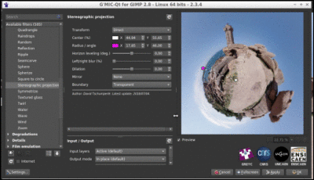
</a>
<figcaption>
Fig. 6.1: The preview window of the G'MIC-Qt plug-in gets new user interaction abilities.
</figcaption>
</figure>

- In addition, introducing these interactive points has allowed improving the split preview modes, available in many filters to display the « _before/ after_ » views side by side when setting the filter parameters in the plug-in. It is now possible to move this « _before/ after_ » separator, as illustrated by the animation below. Two new splitting modes (« _Checkered_ » and « _Inverse checkered_ » ) have been also included alongside it.

<figure>
<a href="http://gmic.eu/gmic234/fullsize/gmic_preview_anim.gif">
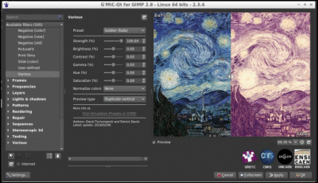
</a>
<figcaption>
Fig. 6.2: The division modes of the preview now have a moveable "before / after" boundary.
</figcaption>
</figure>

A lot of other improvements have been made to the plug-in: the support of the most recent version of _GIMP_ (**2.10**), of _Qt 5.11_, improved handling of the error messages displayed over the preview widget, a cleaner designed interface, and other small changes have been made under the hood, which are not necessarily visible but slightly improve the user experience (e.g. an image cache mechanism for the preview widget). In short, that's pretty good!

### 6.2. Improvements in the software core

Some new refinements of the _G'MIC_ computational core have been done recently:

- The &ldquo;standard library&rdquo; of the _G'MIC_ script language was given new commands for computing the inverse hyperbolic functions (`acoss`, `asinh` and `atanh`), as well as a command `tsp` (_**t**ravelling **s**alesman **p**roblem_) which estimates an acceptable solution to the well-known [Travelling salesman problem](https://en.wikipedia.org/wiki/Travelling_salesman_problem), and this, for a point cloud of any size and dimension.

  <figure>
  <a href="http://gmic.eu/gmic234/fullsize/tsp_lena.png">
  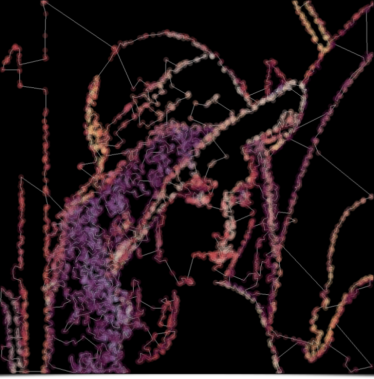
  </a>
  <figcaption>
  Fig. 6.3: Estimating the shortest route between hundreds of 2D points, with the G'MIC command `tsp`.
  </figcaption>
  </figure>
  
  <figure>
  <a href="http://gmic.eu/gmic234/fullsize/tsp3d.gif">
  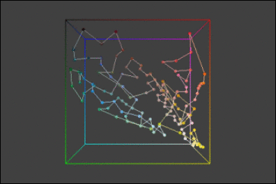
  </a>
  <figcaption>
  Fig. 6.4: Estimating the shortest route between several colors in the RGB cube (thus in 3D), with the G'MIC command `tsp`.
  </figcaption>
  </figure>

- The demonstration window, which appears when `gmic` is run without any arguments from the command line, has been also redesigned from scratch.

<figure>
<a href="http://gmic.eu/gmic234/fullsize/gmic_demo.gif">
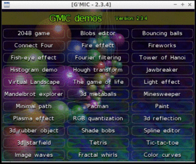
</a>
<figcaption>
Fig. 6.5: The new demonstration window of `gmic`, the command line interface of G'MIC.
</figcaption>
</figure>

- The embedded _JIT_ compiler used for the evaluation of mathematical expressions has not been left out and was given new functions to draw polygons (function `polygon()`) and ellipses (function `ellipse()`) in images. These mathematical expressions can in fact define small programs (with local variables, user-defined functions and control flow). One can for instance easily generate synthetic images from the command line, as shown by the two examples below.

#### Example 1
```sh
$ gmic 400,400,1,3 eval "for (k = 0, k<300, ++k, polygon(3,u([vector10(0),[w,h,w,h,w,h,0.5,255,255,255])))"
```


**Result**:
<figure>
<a href="http://gmic.eu/gmic234/fullsize/gmic_polygon.png">

</a>
<figcaption>
Fig. 6.6: Using the new function `polygon()` from the G'MIC JIT compiler, to render a synthetic image made of random triangles.
</figcaption>
</figure>

#### Example 2

```sh
$ gmic 400,400,1,3 eval "for (k=0, k<20, ++k, ellipse(w/2,h/2,w/2,w/8,k*360/20,0.1,255))"
```

**Result**:

<figure>
<a href="http://gmic.eu/gmic234/fullsize/gmic_ellipse.png">
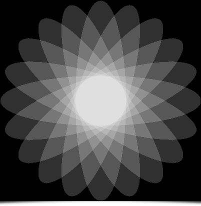
</a>
<figcaption>
Fig. 6.7: Using the new function `ellipse()` from the G'MIC JIT compiler, to render a synthetic flower image.
</figcaption>
</figure>

- Note also that [`NaN values`](https://en.wikipedia.org/wiki/NaN) are now better managed when doing calculus in the core, meaning _G'MIC_ maintains coherent behavior even when it has been compiled with the optimisation `-ffast-math`. Thus, _G'MIC_ can be flawlessly compiled now the maximum optimization level `-Ofast` supported by the compiler `g++`, whereas we were restricted to the use of `-O3` before. The improvement in computation speed is clearly visible for some of the offered filters !

### 6.3. Distribution channels

A lot of changes have also been made to the distribution channels used by the project:

- First of all, the project web pages (which are now using secured `https` connections by default) have a new [image gallery](http://gmic.eu/gallery). This gallery shows both filtered image results from _G'MIC_ and the way to reproduce them (from the command line). Note that these gallery pages are automatically generated by a dedicated _G'MIC_ script, which ensures the displayed command syntax is correct.

  <figure>
  <a href="https://gmic.eu/gallery">
  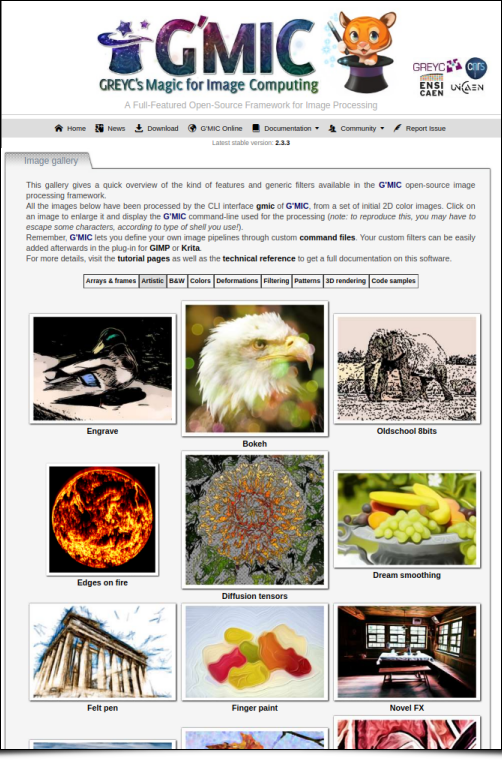
  </a>
  <figcaption>
  Fig. 6.8: The new image gallery on the G'MIC web site.
  </figcaption>
  </figure>

This gallery is split into several sections, depending on the type of processing done (_Artistic, Black & White, Deformations, Filtering, etc._). The last section [« **Code sample** »](https://gmic.eu/gallery/codesamples.shtml) is my personal favorite, as it exhibits small animations (shown as looping animated _GIFs_) which have been completely generated from scratch by short scripts, written in the _G'MIC_ language. Quite a surprising use of _G'MIC_ that shows its potential for [generative art](https://en.wikipedia.org/wiki/Generative_art).

<figure>
<a href="https://gmic.eu/gallery/codesamples_full_3.gif">
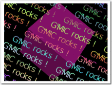
</a>
<a href="https://gmic.eu/gallery/codesamples_full_4.gif">
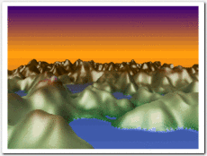
</a>
<figcaption>
Fig. 6.9: Two small GIF animations generated by G'MIC_ scripts that are visible in the new image gallery._
</figcaption>
</figure>

- We have also moved the main _git_ source repository of the project to [Framagit](https://framagit.org/dtschump/gmic), still keeping one synchronized mirror on _Github_ at the same place as before (to benefit from the fact that a lot of developers have already an account on _Github_ which makes it easier for them to fork the project and write bug reports).

## 7. Conclusions and Perspectives

Voilà! Our tour of news (and the last six months of work) on the G'MIC project comes to an end.

We are happy to be celebrating 10 years with the creation and evolution of this Free Software project, and to be able to share with everyone all of these advanced image processing techniques. We hope to continue doing so for many years to come!

Note that next year, we will also be celebrating the _20th anniversary_ of [_CImg_](http://cimg.eu), the _C++_ image processing library (started in November 1999) on which the _G'MIC_ project is based, proof that interest in free software is enduring.

As we wait for the next release of _G'MIC_, don't hesitate to test the current version. Freely and creatively play with and manipulate your images to your heart's content!


**Thank you, Translators:** (ChameleonScales, Pat David)
