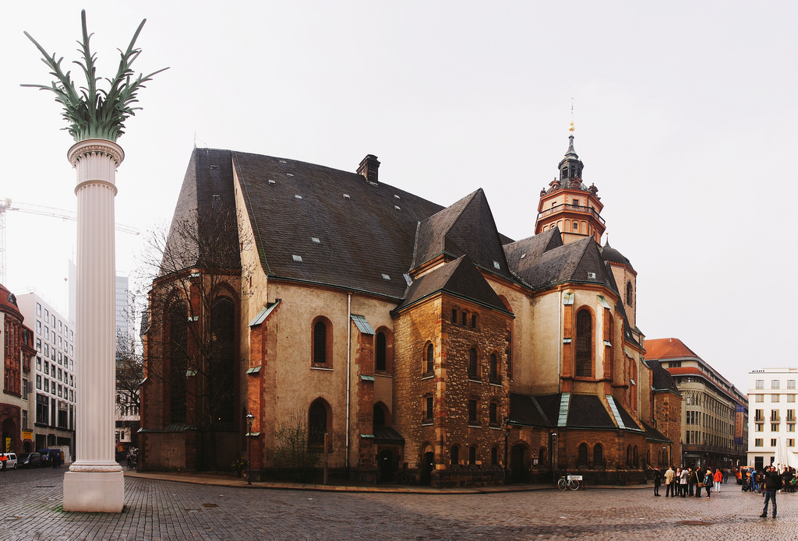

It's that time of year again: [Libre Graphics Meeting 2019][] is fast approaching!

This year the meeting will be May 29 to June 2 in [Saarbrücken, Germany][].
This is extra exciting because Saarbrücken is centrally located enough that we should have a nice representation from projects and community members.
Members of both [RawTherapee][] and [darktable][] live nearby and will be in attendance (along with others from those projects and many others).

<!--more-->

## Participate!

I'm hoping to have a good representation this year, so first and foremost - _please_, _please_ consider participating by giving a presentation, leading a workshop, or even a quick lightning talk!
The [Call for Participation][] page is here:

https://libregraphicsmeeting.org/2019/call-for-participation/

I will make myself available to help in any way I can. If you want a hand with the presentation, design, graphics or whatever please feel free to ping me (also - remember that we try to archive all of our presentations and material [in our Github repo](https://github.com/pixlsus/Presentations) so you can grab any of the assets from there as well)!
This is a great opportunity to spread the word about what we're up to and the many, many awesome projects everyone has created, maintained, and contributed to for Free Software photography.

**The deadline for submittal is coming up on January 15th!**  
If you think you'd like to present or host a workshop please submit as soon as possible.

## Cheers!

<iframe width="560" height="315" src="https://www.youtube-nocookie.com/embed/7KtAgAMzaeg" frameborder="0" allow="accelerometer; autoplay; encrypted-media; gyroscope;" allowfullscreen></iframe>

I am particularly excited about this meeting because a) I don't get to attend every year so this is the first time I'm able to make it in a few years, and b) this is a great opportunity to really get a bunch of community members to come together!
Saarbrücken is on the high-speed rail network so it's readily accessible from many places (now you have less excuses to not make it).

<figure>

<figcaption>
GIMP, darktable, and others all getting together in LGM/London!
</figcaption>
</figure>

I love hanging out with y'all.
It's great to nerd out about photography and catch up.
Sometimes it really helps to be able to speak face-to-face and this is the perfect opportunity to also be exposed to all manner of other Free Software projects (or to expose ourselves to others?).

Besides, how else am I going to capture some fun photos of y'all?

<figure>

<figcaption>
Notice a tiny houz in the bottom right!
</figcaption>
</figure>

## What's Going On

We have a few things planned for sure at the meeting and you're going to be really sad if you miss them by not coming!

1. PIXLS.US BoF (Birds of a Feather)  
    This is a special session set aside for a couple of hours for the entire community to get together and chat about what's going on, what we'd like to do, and what's coming up.
2. Photowalk  
    I've been doing photowalks every year that I've been because this is almost the ultimate way for me to spend time with folks (unless we can do a beer drinking photowalk all at the same time...).
3. PIXLS.US Presentation/Update  
    I'll (We'll?  Anyone from the community is more than welcome to help me present on this) present on the community and what we've done so far and what we'd like to accomplish moving forward.
    This is our primary way of reporting out to the wider community who we are and what we're doing.
4. State of the LGM  
    This is a couple of slides that are included at the beginning of the program giving an overview of the state of the entire libre graphics ecosystem.

I really, _really_, **really** want to be able to add to this list with other presentations (or lightning talks, etc) that the community will give!  I may even submit a couple of presentations to talk not just about the community but maybe about our technical work coordinating the forum and providing services for the projects (as well as invite other related projects to come join us).

We can make this an incredible and memorable meeting with a fantastic opportunity to meet friends in person and have a wonderful time!

[Libre Graphics Meeting 2019]: https://libregraphicsmeeting.org/2019/ "Libre Graphics Meeting 2019"
[Saarbrücken, Germany]: https://libregraphicsmeeting.org/2019/travel/ "LGM Travel"
[RawTherapee]: https://www.rawtherapee.com "RawTherapee Website"
[darktable]: https://www.darktable.org "darktable Website"
[Call for Participation]: https://libregraphicsmeeting.org/2019/call-for-participation/ "LGM 2019 Call for Participation"
