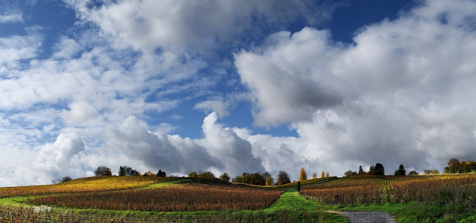

A little while back I had attempted to document a shoot with my friend and model, Mairi.
In particular I wanted to capture a start-to-finish workflow for processing a portrait using free software.
There are often many tutorials for individual portions of a retouching process but rarely do they get seen in the context of a full workflow.

The results became a [two][]-[part][] post on my blog.
For posterity (as well as for those who may have missed it the first time around) I am republishing the second part of the tutorial [*Postprocessing*](/articles/an-open-source-portrait-mairi/) here.

<!-- more -->

Though the post was originally published in 2013 the process it describes is still quite current (and mostly still my same personal workflow).
This tutorial covers the retouching in post while the [original article][two] about setting up and conducting the shoot is still over on my personal blog.

<figure>

<figcaption>
The finished result from the tutorial.  
by Pat David (<a class='cc' href='https://creativecommons.org/licenses/by-sa/2.0/'>cba</a>).
</figcaption>
</figure>

The tutorial may read a little long but the process is relatively quick once it's been done a few times.
Hopefully it proves to be helpful to others as a workflow to use or tweak for their own process!

## Coming Soon
I am still working on getting some sample shots to demonstrate the previously mentioned [noise free shadows][noise] idea using dual exposures.
I just need to find some sample shots that will be instructive while still at least being something nice to look at...

Also, another guest post is coming down the pipes from the creator of [PhotoFlow][], Andrea Ferrero!
He'll be talking about creating blended panorama images using [Hugin][] and PhotoFlow.
Judging by the results on his sample image, this will be a fun tutorial to look out for!

<figure class="big-vid">

</figure>

[two]: http://blog.patdavid.net/2013/03/the-open-source-portrait-equipment.html "An Open Source Portrait (Equipment)"
[part]: http://blog.patdavid.net/2013/03/the-open-source-portrait-postprocessing.html "An Open Source Portrait (Postprocessing)"
[noise]: https://discuss.pixls.us/t/noise-free-shadows-dual-exposure/204
[PhotoFlow]: http://photoflowblog.blogspot.com/
[Hugin]: http://hugin.sourceforge.net/
