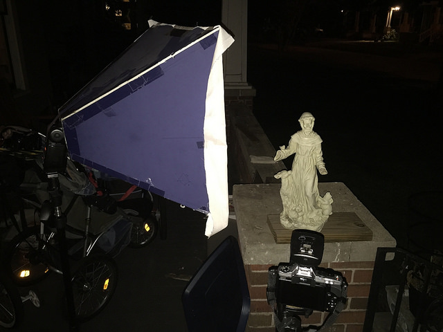
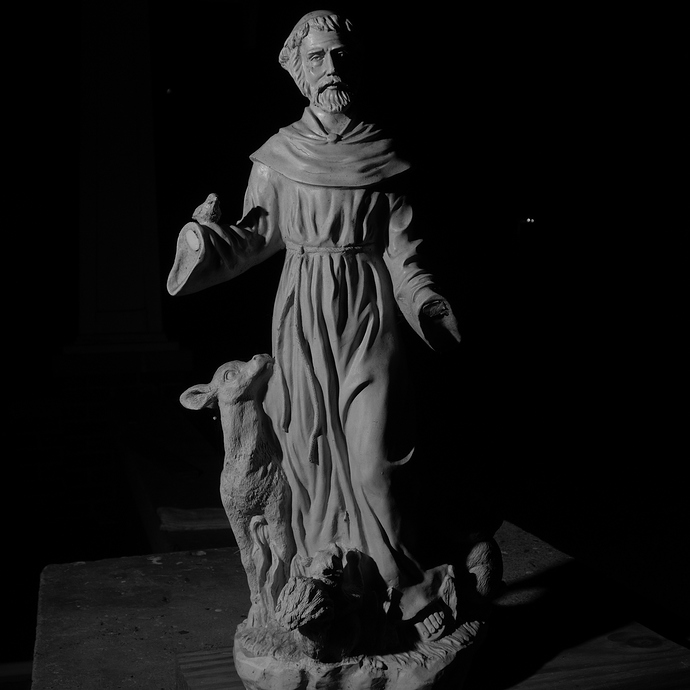
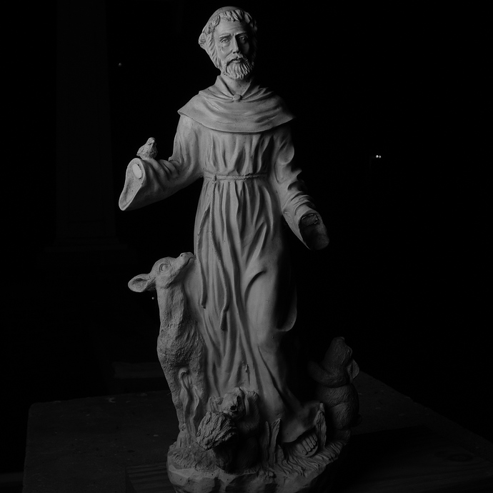
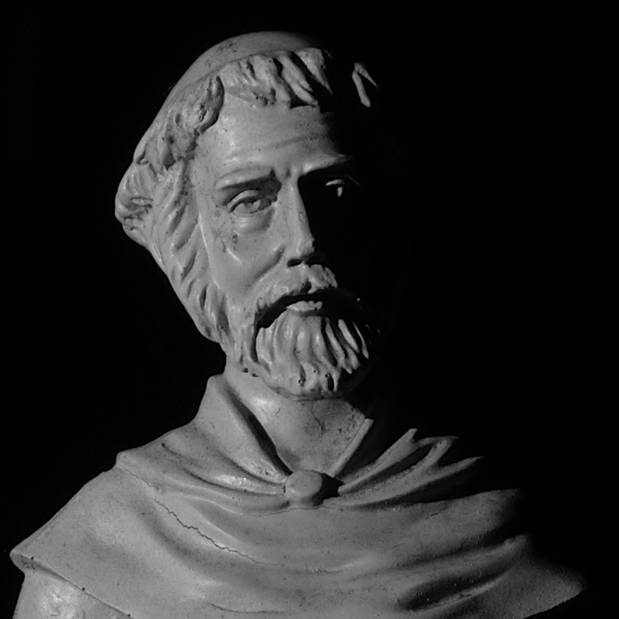
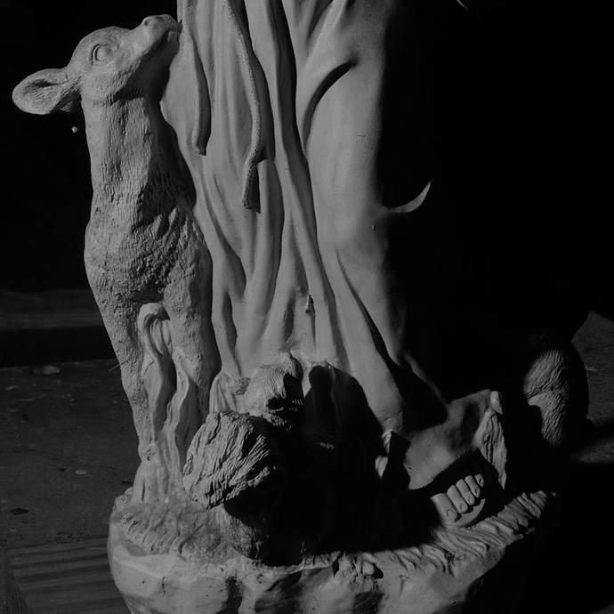
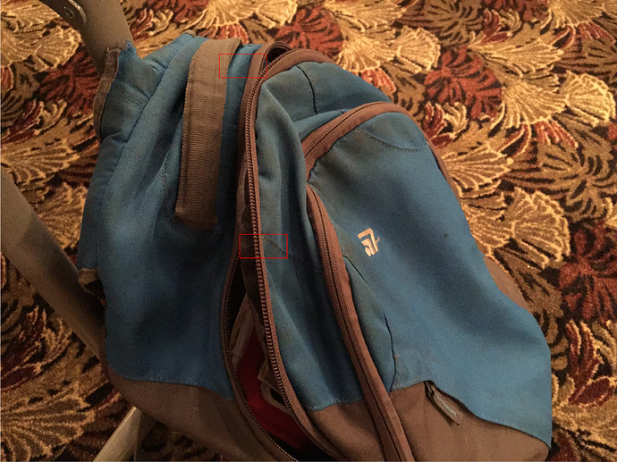
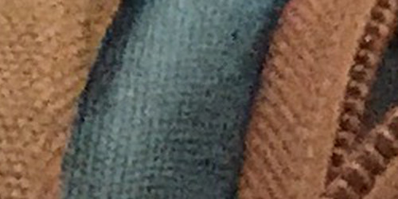
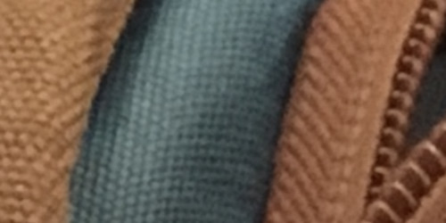
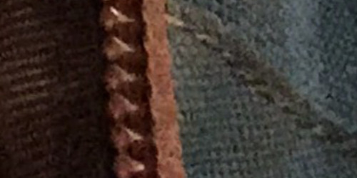
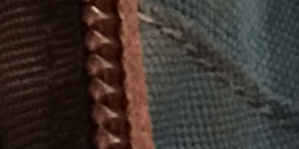

A small update on how things are progressing (hint: well!) and some neat things the community is playing with.

I have been quiet these past few weeks because I decided I didn't have enough to do and thought a rebuild/redesign of the [GIMP website](http://static.gimp.org) would be fun, apparently.
Well, it _is_ fun and something that couldn't hurt to do.
So I stepped up to help out.

<!-- more -->

## A Question of Softness

There was [a thread][] recently on a certain large social network in a group dedicated to off-camera flash.
The thread was started by someone with the comment:

> The most important thing you can do with your speed light is to put some rib <small>[sic]</small> stop sail cloth over the speed light to soften the light.

Which just about gave me an aneurysm (those that know me and lighting can probably understand why).
Despite some sound explanations about why this won't work to "soften" the light, there was a bit of back and forth about it.
To make matters worse, even after over 100 comments, _nobody_ bothered to just go out and shoot some sample images to see it for themselves.

So I finally went out and shot some to illustrate and I figured they would be more fun if they were shared 
(I did actually post these [on our forum](https://discuss.pixls.us/t/light-source-softness/384)).

I quickly set a lightstand up with a YN560 on it pointed at my garden statue.
I then took a shot with bare flash, one with diffusion material pulled over the flash head, and one with a 20" diy softbox attached.

Here's what the setup looked like with the softbox in place:

<figure>

<figcaption>
Simple light test setup (with a DIY softbox in place).
</figcaption>
</figure>

Remember, this was done to demonstrate that simply placing some diffusion fabric over the head of a speedlight does nothing to "soften" the resulting light:

<figure>

<figcaption>
Bare flash result.  Click to compare with diffusion material.
</figcaption>
</figure>

This shows clearly that diffusion material over the flash head does _nothing_ to affect the "softness" of the resulting light.

For a comparison, here is the same shot with the softbox being used:

<figure>

<figcaption>
Same image with the softbox in place.  Click to compare with diffusion material.
</figcaption>
</figure>

I also created some crops to help illustrate the difference up close:

<figure>

<figcaption>
Click to compare: 
Bare Flash
With Diffusion
With Softbox
</figcaption>
</figure>

<figure>

<figcaption>
Click to compare: 
Bare Flash
With Diffusion
With Softbox
</figcaption>
</figure>

Hopefully this demonstration can help put to rest any notion of softening a light through close-set diffusion material (at not-close flash-to-subject distances).  At the end of the day, the "softness" quality of a light is a function of the *apparent size* of the light source *relative to the subject*. (The sun is the biggest light source I know of, but it's so far it's quality is quite harsh.)

## A Question of Scaling

On [discuss][], member [Mica][] [asked an awesome question][] about what our workflows are for adding resolution (upsizing) to an image.
There were a bunch of great suggestions from the community.

One I wanted to talk about briefly I thought was interesting from a technical perspective.

Both Hasselblad and Olympus announced not too long ago the ability to drastically increase the resolution of images in their cameras that used a "sensor-shift" technology to shift the sensor by a pixel or so while shooting multiple frames, then combing the results into a much larger megapixel image (200MP in the case of Hasselblad, and 40MP in the Olympus).

It turns out we can do the same thing manually by burst shooting a series of images while handholding the camera (the subtle movement of our hand while shooting provides the requisite "shift" to the sensor).
Then we simply combine the images, upscale, and average the results to get a higher resolution result.

The basic workflow uses [Hugin] `align_image_stack`, [Imagemagick] `mogrify`, and [G'MIC] `mean blend script` to achieve the results.

1. Shoot a bunch of handheld images in burst mode (if available).
2. Develop raw files if that's what you shot.
3. Scale images up to 4x resolution (200% in width and height).  Straight nearest-neighbor type of upscale is fine.
    * In your directory of images, create a new sub-directory called *resized*.
    * In your directory of images, run `mogrify -scale 200% -format tif -path ./resized *.jpg` if you use jpg's, otherwise change as needed.
This will create a directory full of upscaled images.
4. Align the images using Hugin's `align_image_stack` script.
    * In the *resized* directory, run `/path/to/align_image_stack -a OUT file1.tif file2.tif ... fileX.tif`
The `-a OUT` option will prefix all your new images with `OUT`.
    * I move all of the `OUT*` files to a new sub-directory called `aligned`.
5. In the `aligned` directory, you now only need to mean average all of the images together.
    * Using Imagemagick: `convert OUTfile*.tif -evaluate-sequence mean output.bmp`
    * Using G'MIC: `gmic video-avg.gmic -avg \" *.tif \" -o output.bmp`

I used 7 burst capture images from an iPhone 6+ (default resolution 3264x2448).
This is the test image:

<figure>

<figcaption>
Sample image, red boxes show 100% crop areas.
</figcaption>
</figure>

Here is a 100% crop of the first area:
<figure>

<figcaption>
100% crop of the base image, straight upscale.
</figcaption>
</figure>

<figure>

<figcaption>
100% crop, super resolution process result.
</figcaption>
</figure>

The second area crop:
<figure>

<figcaption>
100% crop, super resolution process result.
</figcaption>
</figure>

<figure>

<figcaption>
100% crop, super resolution process result.
</figcaption>
</figure>

Obviously this doesn't replace the ability to have that many raw pixels available in a single exposure, but if the subject is relatively static this method can do quite well to help increase the resolution.
As with any mean/median blending technique, a nice side-effect of the process is great noise reduction as well...

Not sure if this warrants a full article post, but may consider it for later.

[a thread]: https://www.facebook.com/groups/speedlightfundamentals/permalink/1627843414142335/
[asked an awesome question]: https://discuss.pixls.us/t/whats-your-workflow-for-up-scaling-images/375/7
[discuss]: https://discuss.pixls.us
[Mica]: https://discuss.pixls.us/users/paperdigits
[Hugin]: http://hugin.sourceforge.net/
[Imagemagick]: http://imagemagick.org/script/index.php
[G'MIC]: http://gmic.eu/
