The goal of this tutorial is to show how to create a sort-of-HDR panoramic image using only Free and Open Source tools.
To explain my workflow I will use the image below as an example.

This panorama was obtained from the combination of six views, each consisting of three bracketed shots at -1EV, 0EV and +1EV exposure.
The three exposures are stitched together with the [Hugin](http://hugin.sourceforge.net/) suite, and then exposure-blended with [enfuse]().
The [PhotoFlow RAW editor](https://github.com/aferrero2707/PhotoFlow) is used to prepare the initial images and to finalize the processing of the assembled panorama.
The final result of the post-processing is below:

<figure class='big-vid'>
 
<figcaption>
Final result of the panorama editing (click to compare to simple +1EV exposure) 
</figcaption>
</figure>

In this case I have used the brightest image for the foreground, the darkest one for the sky and clouds, and and exposure-fused one for a seamless transition between the two.

The rest of the post will show how to get there...

Before we continue, let me advise you that I'm not a pro, and that the tips and "recommendations" that I'll be giving in this post are mostly derived from trial-and-error and common sense.
Feel free to correct/add/suggest anything... **we are all here to learn**! 

## Taking the shots

Shooting a panorama requires a bit of preparation and planning to make sure that one can get the best out of Hugin when stitching the shots together. Here is my personal "checklist":

* **Manual Focus** - set the camera to manual focus, so that the focus plane is the same for all shots
* **Overlap Shots** - make sure that each frame has sufficient overlap with the previous one (something between 1/2 and 1/3 of the total area), so that hugin can find enough control points to align the images and determine the lens correction parameters
* **Follow A Straight Line** - when taking the shots, try to follow as much as possible a straight line (keeping for example the horizon at the same height in your viewfinder); if you have a tripod, use it!
* **Frame Appropriately** - to maximize the angle of view, frame vertically for an horizontal panorama (and vice-versa for a vertical one)
* **Leave Some Room** - frame the shots a bit wider than needed, to avoid bad surprises when cropping the stitched panorama
* **Fixed Exposure** - take all shots with a fixed exposure (manual or locked) to avoid luminance variations that might not be fully compensated by hugin
* **Bracket if Needed** - if you shoot during a sunny day, the brightness might vary significantly across the whole panorama; in this case, take three or more bracketed exposures for each view (we will see later how to blend them in the post-processing)

## Processing the RAW files

If you plan to create the panorama starting from the in-camera Jpeg images, you can safely skip this section. On the other hand, if you are shooting RAW you will need to process and prepare all the input images for Hugin. In this case it is important to make sure that the RAW processing parameters are exactly the same for all the shots. The best is to adjust the parameters on one reference image, and then batch-process the rest of the images using those settings.

### Using PhotoFlow

Loading and processing a RAW file is rather easy:

1. Click the "Open" button and choose the appropriate RAW file from your hard disk; the image preview area will show at this point a grey and rather dark image

2. Add a "RAW developer" layer; a configuration dialog will show up which allows to access and modify all the typical RAW processing parameters (white balance, exposure, color conversion, etc... see screenshots below).

<figure>
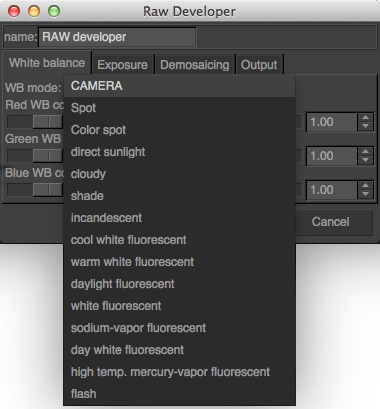
</figure>

<figure>
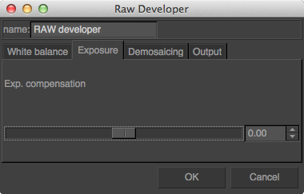 
</figure>

<figure>
 
</figure>

<figure>
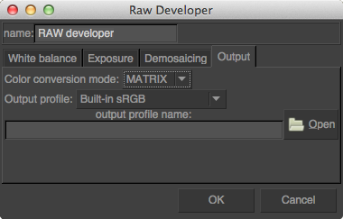 
</figure>

More details on the RAW processing in PhotoFlow can be found in [this tutorial](http://photoflowblog.blogspot.fr/2014/09/tutorial-how-to-process-raw-image-in.html).

Once the result is ok the RAW processing parameters need to be saved into a preset. This can be done following a couple of simple steps:

1. Select the "RAW developer" layer and click on the "Save" button below the layers list widget (at the bottom-right of the photoflow's window)

2. A file chooser dialog chooser dialog will pop-up, where one has to choose an appropriate file name and location for the preset and then click "Save";  
**the preset file name must have a ".pfp" extension**

The saved preset needs then to be applied to all the RAW files in the set. Under Linux, PhotoFlow comes with an handy script that automates the process. The script is called *pfconv* and can be found [here](https://github.com/aferrero2707/PhotoFlow/blob/master/tools/pfconv). It is a wrapper around the *pfbatch* and *exiftool* commands, and is used to process and convert a bunch of files to TIFF format. Save the script in one of the folders included in your `PATH` environment variable (for example `/usr/local/bin`) and make it executable:

    sudo chmod u+x /usr/local/bin/pfconv

Processing all RAW files of a given folder is quite easy. Assuming that the RAW processing preset is stored in the same folder under the name `raw_params.pfp`, run this commands in your preferred terminal application:

    cd panorama_dir
    pfconv -p raw_params.pfp *.NEF

Of course, you have to change `panorama_dir` to your actual folder and the `.NEF` extension to the one of your RAW fles.

Now go for a cup of coffee, and be patient... a panorama with three or five bracketed shots for each view can easily have more than 50 files, and the processing can take half an hour or more. Once the processing completed, there will be one tiff file for each RAW image, an the fun with Hugin can start!

## Assembling the shots
Hugin is a powerful and free software suite for stitching multiple shots into a seamless panorama, and more. Under Linux, Hugin can be usually installed through the package manager of your distribution. In the case of Ubuntu-based distros it can be usually installed with:

    sudo apt-get install hugin

If you are running Hugin for the first time, I suggest to switch the interface type to **Advanced** in order to have full control over the available parameters. 

The first steps have to be done in the *Photos* tab:

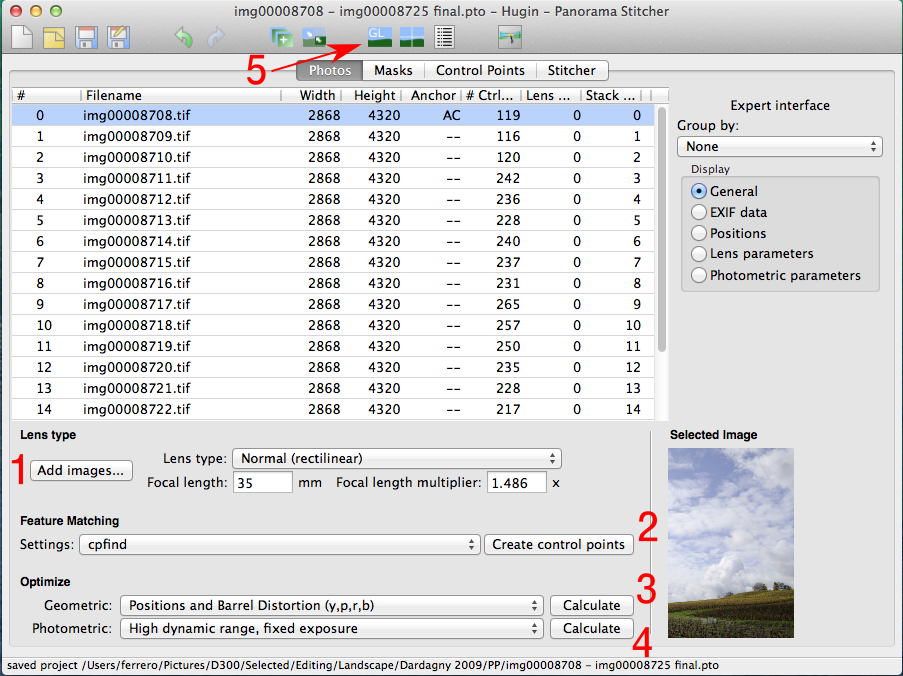 

1. Click on *Add images* and load all the tiff files included in your panorama. Hugin should automatically determine the lens focal length and the exposure values from the EXIF data embedded in the tiff files. 

2. Click on *Create control points* to let hugin determine the anchor points that will be used to align the images and to determine the lens correction parameters so that all shots overlap perfectly. If the scene contains a large amount of clouds that have likely moved during the shooting, you can try setting the feature matching algorithm to *cpfind+celeste* to automatically exclude non-reliable control points in the clouds.

3. Set the geometric parameters to *Positions and Barrel Distortion* and hit the *Calculate* button.

4. Set the photometric parameters to *High dynamic range, fixed exposure* (since we are going to stitch bracketed shots that have been taken with fixed exposures), and hit the *Calculate* button again.

At this point we can have a first look at the assembled panorama. Hugin provides an OpenGL-based previewer that can be opened by clicking on the on the *GL* icon in the top toolbar (marked with the arrow in the above screenshot). This will open a window like this:

 

If the shots have been taken handheld and are not perfectly aligned, the panorama will probably look a bit "wavy" like in my example. This can be easily fixed by clicking on the *Straighten* button (at the top of the *Move/Drag* tab). Next, the image can be centered in the preview area with the *Center* and *Fit* buttons.

If the horizon is still not straight, you can further correct it by dragging the center of the image up or down:

 

At this point, one can switch to the *Projection* tab and play with the different options. I usually find the *Cylindrical* projection better than the *Equirectangular* that is proposed by default (the vertical dimension is less "compressed"). For architectural panoramas that are not too wide, the *Rectilinear* projection can be a good option since vertical lines are kept straight.

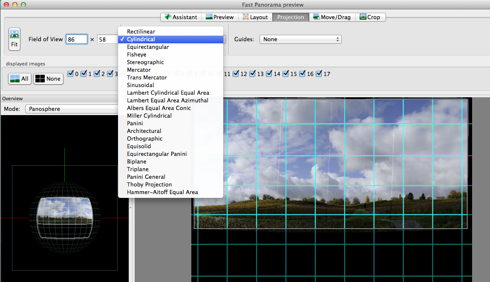 

If the projection type is changed, one has to click once more on the *Center* and *Fit* buttons.

Finally, you can switch to the *Crop* tab and click on the *HDR Autocrop* button to determine the limits of the area containing only valid pixels.

We are now done with the preview window; it can be closed and we can go back to the main window, in the *Stitcher* tab. Here we have to set the options to produce the output images the way we want. The idea is to blend each bracketed exposure into a separate panorama, and then use **enfuse** to create the final exposure-blended version. The intermediate panoramas, which will be saved along with the enfuse output, are already aligned with respect to each other and can be combined using different type of masks (luminosity, gradients, freehand, etc...).

The *Stitcher* tab has to be configured as in the image below, selecting *Exposure fused from any arrangement* and *Blended layers of similar exposure, without exposure correction*. I usually set the output format to *TIFF* to avoid compression artifacts.

 

The final act starts by clicking on the *Stitch!* button. The input images will be distorted, corrected for the lens vignetting and blended into seamless panoramas. The whole process is likely to take quite long, so it is probably a good opportunity for taking a pause...

At the end of the processing, few new images should appear in the output directory: one with an "_blended_fused.tif" suffix containing the output of the final enfuse step, and few with an "_exposure_????.tif" suffix that contain intermediate panoramas for each exposure value.

## Blending the exposures

> *Very often, photo editing is all about getting **what your eyes have seen** out of **what your camera has captured**.* 

The image that will be edited through this tutorial is no exception: the human vision system can "compensate" large luminosity variations and can "record" scenes with a wider dynamic range than your camera sensor. In the following I will attempt to restore such large dynamics by combining under- and over-exposed shots together, in a way that does not produce unpleasing halos or artifacts. Nevertheless, I have intentionally pushed the edit a bit "over the top" in order to better show how far one can go with such a technique. 

This second part introduces a certain number of quite general editing ideas, mixed with details specific to their realization in PhotoFlow. Most of what is described here can be reproduced in GIMP with little extra effort, but without the ease of non-destructive editing.

The steps that I followed to go from one to the other can be more or less outlined like that:

1. take the foreground from the +1EV version and the clouds from the -1EV version; use the exposure-blended Hugin output to improve the transition between the two exposures

2. apply an S-shaped tonal curve to increase the overall brightness and add contrast. 

3. apply a combination of the *a* and *b* channels of the CIE-Lab colorspace in **overlay** blend mode to give more "pop" to the green and yellow regions in the foreground

The image below shows side-by-side three of the output images produced with Hugin at the end of the first part. The left part contains the brightest panorama, obtained by blending the shots taken at +1EV. The right part contains the darkest version, obtained from the shots taken at -1EV. Finally, the central part shows the result of running the **enfuse** program to combine the -1EV, 0EV and +1EV panoramas. 

<figure>

<figcaption> Comparison between the +1EV exposure (left), the enfuse output (center) and the -1EV exposure (right) 
</figcaption> </figure>

### Exposure blending in general
In scenes that exhibit strong brightness variations, one often needs to combine different exposures in order to compress the dynamic range so that the overall contrast can be further tweaked without the risk of losing details in the shadows or highlights.

In this case, the name of the game is "seamless blending", i.e. combining the exposures in a way that looks natural, without visible transitions or halos.
In our specific case, the easiest thing would be to simply combine the +1EV and -1EV images through some smooth transition, like in the example below.

<figure class='big-vid'>
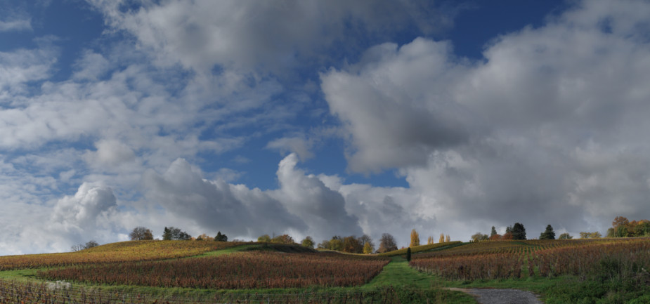 
<figcaption>
Simple blending of the +1EV and -1EV exposures 
</figcaption>
</figure>

The result is not too bad, however it is very difficult to avoid some brightening of the bottom part of the clouds (or alternatively some darkening of the hills), something that will most likely look artificial even if the effect is subtle (our brain will recognize that something is wrong, even if one cannot clearly explain the reason...). We need something to "bridge" the two images, so that the transition looks more natural. 

At this point it is good to recall that the last step performed by Hugin was to call the **enfuse** program to blend the three bracketed exposures. The enfuse output is somehow intermediate between the -1EV and +1EV versions, however a side-by-side comparison with the 0EV image reveals the subtle and sophisticated work done by the program: the foreground hill is brighter and the clouds are darker than in the 0EV version. And even more importantly, this job is done without triggering any alarm in your brain! Hence, the enfuse output is a perfect candidate to improve the transition between the hill and the sky.

<figure class='big-vid'>
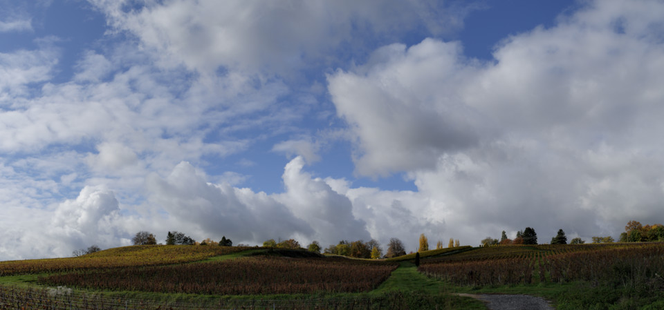 
<figcaption> Enfuse output (click to see 0EV version) 
</figcaption> </figure>

### Exposure blending in PhotoFlow
It is time to put all the stuff together.
First of all, we should open **PhotoFlow** and load the +1EV image.
Next we need to add the enfuse output on top of it: for that you first need to add a new layer (**1**) and choose the *Open image* tool from the dialog that will open up (**2**)(see below).

<figure class='big-vid'>
 
<figcaption> Inserting as image from disk as a layer
</figcaption> </figure>

After clicking the "OK" button, a new layer will be added and the corresponding configuration dialog will be shown. There you can choose the name of the file to be added; in this case, choose the one ending with "_blended_fused.tif" among those created by Hugin:

<figure>
 
<figcaption> "Open image" tool dialog
</figcaption> </figure>

#### Layer masks: theory (a bit) and practice (a lot)

For the moment, the new layer completely replaces the background image. This is not the desired result: instead, we want to keep the hills from the background layer and only take the clouds from the "_blended_fused.tif" version. In other words, we need a **layer mask**.

To access the mask associated to the "enfuse" layer, double-click on the small gradient icon next to the name of the layer itself. This will open a new tab with an initially empty stack, where we can start adding layers to generate the desired mask.

<figure class='big-vid'>
 
<figcaption>
How to access the grayscale mask associated to a layer
</figcaption>
</figure>

In PhotoFlow, masks are edited the same way as the rest of the image: through a stack of layers that can be associated to most of the available tools. In this specific case, we are going to use a combination of gradients and curves to create a smooth transition that follows the shape of the edge between the hills and the clouds. The technique is explained in detail in [this screencast](https://www.youtube.com/watch?v=kapppq-PbTk).

<iframe width="960" height="540" src="//www.youtube.com/embed/kapppq-PbTk?rel=0" frameborder="0" allowfullscreen></iframe>

To avoid the boring and lengthy procedure of creating all the necessary layers, you can download  [this preset file](http://aferrero2707.github.io/PhotoFlow/data/presets/gradient_modulation.pfp) and load it as shown below:

<figure class='big-vid'>
 
</figure>

The mask is initially a simple vertical linear gradient. At the bottom (where the mask is black) the associated layer is completely transparent and therefore hidden, while at the top (where the mask is white) the layer is completely opaque and therefore replaces anything below it. Everywhere in between, the layer has a degree of transparency equal to the shade of gray in the mask.

In order to show the mask, activate the "show active layer" radio button below the preview area, and then select the layer that has to be visualized. In the example above, I am showing the output of the topmost layer in the mask, the one called "transition". Double-clicking on the name of the "transition layer allows to open the corresponding configuration dialog, where the parameters of the layer (a [**curves** adjustment](http://photoflowblog.blogspot.fr/2014/09/tutorial-using-curves-tool-in-photoflow.html) in this case) can be modified. The curve is initially a simple diagonal: output values exactly match input ones.

If the rightmost point in the curve is moved to the left, and the leftmost to the right, it is possible to modify the vertical gradient and the reduce the size of the transition between pure black and pure white, as shown below:

<figure class='big-vid'>
 
</figure>

We are getting closer to our goal of revealing the hills from the background layer, by making the corresponding portion of the mask purely black. However, the transition we have obtained so far is straight, while the contour of the hills has a quite complex curvy shape... this is where the second **curves** adjustment, associated to the "modulation" layer, comes into play.

As one can see from the screenshot above, between the bottom gradient and the "transition" curve there is a group of three layers: an **horizontal** gradient, a modulation curve and **invert** operation. Moreover, the group itself is combined with the bottom vertical gradient in [**grain merge**](http://docs.gimp.org/en/gimp-concepts-layer-modes.html) blending mode.

Double-clicking on the "modulation" layer reveals a tone curve which is initially flat: output values are always 50% independently of the input. Since the output of this "modulation" curve is combined with the bottom gradient in **grain merge** mode, nothing happens for the moment. However, something interesting happens when a new point is added and dragged in the curve: the shape of the mask matches exactly the curve, like in the example below.

<figure class='big-vid'>
 
</figure>

### The sky/hills transition
The technique introduced above is used here to create a precise and smooth transition between the sky and the hills. As you can see, with a sufficiently large number of points in the modulation curve one can precisely follow the shape of the hills:

<figure class='big-vid'>
 
</figure>

The result of the blending looks like that (click the image to see the initial +1EV version):

<figure class='big-vid'>
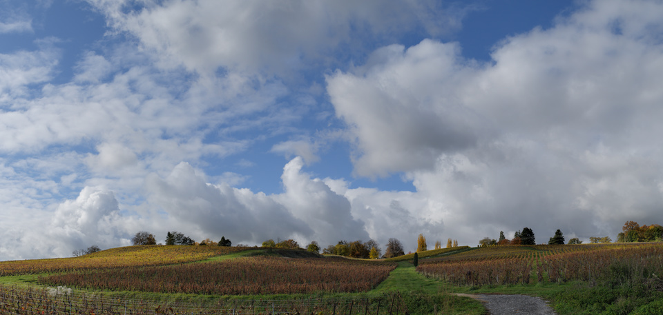 
<figcaption>
Enfuse output blended with the +1EV image (click to see the initial +1EV version) 
</figcaption>
</figure>

The sky looks already much denser and saturated in this version, and the clouds have gained in volume and tonal variations. However, the -1EV image looks even better, therefore we are going to take the sky and clouds from it. 

To include the -1EV image we are going to follow the same procedure done already in the case of the enfuse output:

1. add a new layer of type "Open image" and load the -1EV Hugin output (I've named this new layer "sky")

2. open the mask of the newly created layer and add a transition that reveals only the upper portion of the image

Fortunately we are not obliged to recreate the mask from scratch. PhotoFlow includes a feature called **layer cloning**, which allows to **dynamically** copy the content of one layer into another one. Dynamically in the sense that the pixel data gets copied *on the fly*, such that the destination always reflects the most recent state of the source layer.

After activating the mask of the "sky" layer, add a new layer inside it and choose the "clone layer" tool (see screenshot below).

<figure>
 
<figcaption>
Cloning a layer from one mask to another
</figcaption>
</figure>

In the tool configuration dialog that will pop-up, one has to choose the desired source layer among those proposed in the list under the label "Layer name". The generic naming scheme of the layers in the list is "[root group name]/root layer name/OMap/[mask group name]/[maks layer name]", where the items inside square brackets are optional. 

<figure>
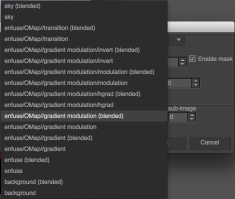 
<figcaption>
Choice of the clone source layer 
</figcaption>
</figure>

In this specific case, I want to apply a smoother transition curve to the same base gradient already used in the mask of the "enfuse" layer. For that we need to choose "enfuse/OMap/gradient modulation (blended)" in order to clone the output of the "gradient modulation" group **after the *grain merge* blend**, and then add a new **curves** tool above the cloned layer:

<figure class='big-vid'>
 
<figcaption>The final transition mask between the hills and the sky
</figcaption>
</figure>

The result of all the efforts done up to now is shown below; it can be compared with the initial starting point by clicking on the image itself:

<figure class='big-vid'>
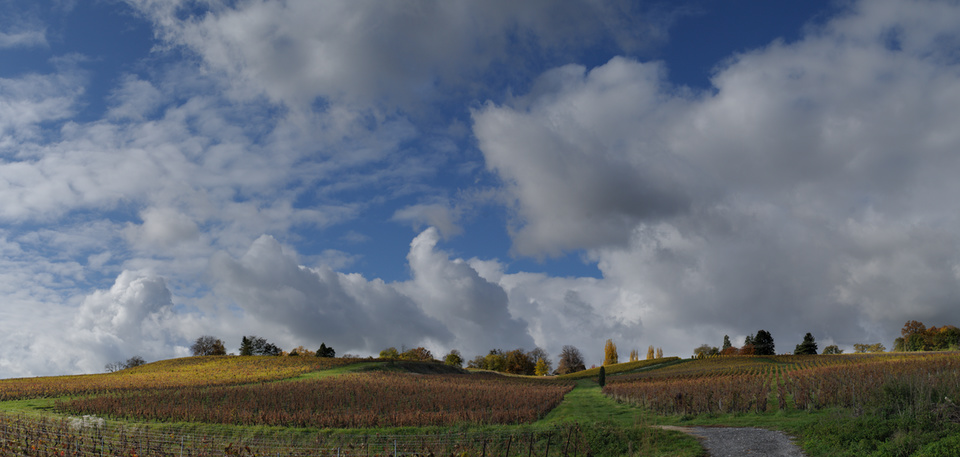 
<figcaption>
Edited image after blending the upper portion of the -1EV version through a layer mask. Click to see the initial +1EV image.
</figcaption>
</figure>

## Contrast and saturation
We are not quite done yet, as the image is still a bit too dark and flat, however this version will "tolerate" some contrast and luminance boost much better than a single exposure. In this case I've added a **curves** adjustment at the top of the layer's stack, and I've drawn an S-shaped RGB tone curve as shown below:

<figure>
 
</figure>

The effect of this tone curve is to increase the overall brightness of the image (the middle point is moved to the left) and to compress the shadows and highlights without modifying the black and white points (i.e. the extremes of the curve). This curve definitely gives "pop" to the image (click to see the version before the tone adjustment):

<figure class='big-vid'>
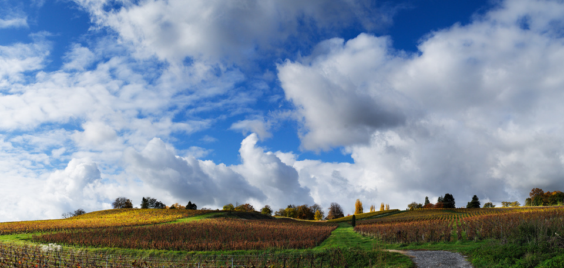 
<figcaption>
Result of the S-shaped tonal adjustment (click the image to see the version before the adjustment).
</figcaption>
</figure>

However, this comes at the expense of an overall increase in the color saturation, which is a typical side effect of RGB curves.
While this saturation boost looks quite nice in the hills, the effect is rather disastrous in the sky.
The blue as turned electric, and is far from what a nice, saturated blue sky should look like!

However, there is a simple fix to this problem: change the blend mode of the **curves** layer from **Normal** to **Luminosity**. 
The tone curve in this case only modified the luminosity of the image, but preserves as much as possible the original colors.
The difference between normal and lumnosity blending is shown below (click to see the **Normal** blending).
As one can see, the **Luminosity** blend tends to produce a duller image, therefore we will need to fix the overall saturation in the next step.

<figure class='big-vid'>
 
<figcaption>
S-shaped tonal adjustment with **Luminosity** blend mode (click the image to see the version with **Normal** blend mode).
</figcaption>
</figure>

To adjust the overall saturation of the image, let's now add an **Hue/Saturation** layer above the tone curve and set the saturation value to **+50**.
The result is shown below (click to see the **Luminosity** blend output).

<figure class='big-vid'>
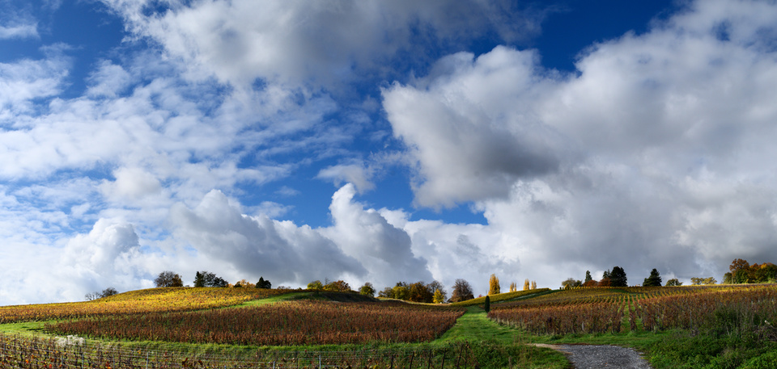 
<figcaption>
Saturation set to **+50** (click the image to see the **Luminosity** blend output).
</figcaption>
</figure>

This definitely looks better on the hills, however the sky is again "too blue".
The solution is to decrease the saturation of the top part through an opacity mask.
In this case I have followed the same steps as for the mask of the [sky blend](#sky_blend), but I've changed the transition curve to the one shown here:

<figure class='big-vid'>

</figure>

In the bottom part the mask is perfectly white, and therefore a **+50** saturation boost is applied. On the top the mask is instead just about 30%, and therefore the saturation is increased of only about **+15**. This gives a better overall color balance to the whole image:

<figure class='big-vid'>
 
<figcaption>Saturation set to **+50** through a transition mask (click the image to see the **Luminosity** blend output).
</figcaption>
</figure>

###Lab blending
The image is already quite ok, but I still would like to add some more tonal variations in the hills.
This could be done with lots of different techniques, but in this case I will use one that is very simple and straightforward, and that does not require any complex curve or mask since it uses the image data itself.
The basic idea is to take the **a** and/or **b** channels of the [**Lab**](https://en.wikipedia.org/wiki/Lab_color_space) colorspace, and combine them with the image itself in **Overlay** blend mode.
This will introduce **tonal** variations depending on the **color** of the pixels (since the **a** and **b** channels only encode the color information).
Here I will assume you are quite familiar wit the Lab colorspace.
Otherwise, [here](https://en.wikipedia.org/wiki/Lab_color_space) is the link to the Wikipedia page that should give you enough informations to follow the rest of the tutorial.

Looking at the image, one can already guess that most of the areas in the hills have a yellow component, and will therefore be positive in the **b** channel, while the sky and clouds are neutral or strongly blue, and therefore have **b** values that are negative or close to zero. The grass is obviously green and therefore **negative** in the **a** channel, while the wineyards are brownish and therefore most likely with positive **a** values. In PhotoFlow the **a** and **b** values are re-mapped to a range between 0 and 100%, so that for example **a=0** corresponds to 50%. You will see that this is very convenient for channel blending.

My goal is to lighten the green and the yellow tones, to create a better contrast around the wineyards and add some "volume" to the grass and trees. Let's first of all inspect the **a** channel: for that, we'll need to add a group layer on top of everything (I've called it "ab overlay") and then added a **clone** layer inside this group. The source of the clone layer is set to the **a** channel of the "backgroud" layer, as shown in this screenshot:

<figure>
 
<figcaption>
Cloning of the Lab "a" channel of the background layer
</figcaption>
</figure>

A copy of the **a** channel is shown below, with the contrast enhanced to better see the tonal variations (click to see the original versions):

<figure class='big-vid'>
 
<figcaption>
The Lab **a** channel (boosted contrast)
</figcaption>
</figure>

As we have already seen, in the **a** channel the grass is negative and therefore looks dark in the image above. If we want to lighten the grass we therefore need to invert it, to obtain this:

<figure class='big-vid'>
 
<figcaption> The inverted Lab **a** channel (boosted contrast)
</figcaption> </figure>

Let's now consider the **b** channel: as sursprising as it might seem, the grass is actually more yellow than green, or at least the **b** channel values in the grass are higher than the inverted **a** values. In addition, the trees at the top of the hill stick nicely out of the clouds, much more than in the **a** channel. All in all, a combination of the two Lab channels seems to be the best for what we want to achieve.

With one exception: the blue sky is very dark in the **b** channel, while the goal is to leave the sky almost unchanged. The solution is to blend the **b** channel into the **a** channel in **Lighten** mode, so that only the **b** pixels that are lighter than the corresponding **a** ones end up in the blended image. The result is shown below (click on the image to see the **b** channel).

<figure class='big-vid'>
 
<figcaption>
**b** channel blended in **Lighten** mode (boosted contrast, click the image to see the **b** channel itself).
</figcaption>
</figure>

And this are the blended **a** and **b** channels with the original contrast:

<figure class='big-vid'>
 
<figcaption>
The final **a** and **b** mask, without contrast correction
</figcaption>
</figure>

The last act is to change the blending mode of the "ab overlay" group to **Overlay**: the grass and trees get some nice "pop", while the sky remains basically unchanged:

<figure class='big-vid'>
 
<figcaption> Lab channels overlay (click to see the image after the saturation adjustment).
</figcaption> </figure>

I'm now almost satisfied with the result, except for one thing: the Lab overlay makes the yellow area on the left of the image way too bright. The solution is a gradient mask (horizontal this time) associated to the "ab overlay group", to exclude the left part of the image as shown below:

<figure class='big-vid'>

</figure>

The final, masked image is shown here, to be compared with the initial starting point:

<figure class='big-vid'>
 
<figcaption> The image after the masked Lab overlay blend (click to see the initial +1EV version).
</figcaption> </figure>

## The Final Touch

Through the tutorial I have intentionally pushed the editing quite above what I would personally find acceptable. The idea was to show how far one can go with the techniques I have described; fortunatey, the non-destructive editing allows us to go back on our steps and reduce the strength of the various effects until the result looks really ok.

In this specific case, I have lowered the opacity of the **"contrast"** layer to **90%**, the one of the **"saturation"** layer to **80%** and the one of the **"ab overlay"** group to **40%**. Then, feeling that the **"b channel"** blend was still brightening the yellow areas too much, I have reduced the opacity of the **"b channel"** layer to **70%**.

<figure class='big-vid'>
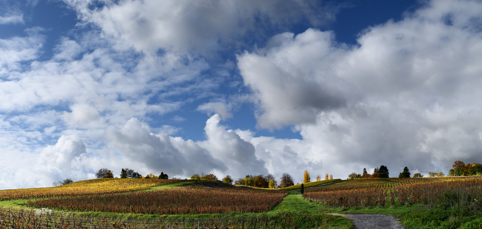 
<figcaption> Opacities adjusted for a "softer" edit (click on the image to see the previous version).
</figcaption> </figure>

Another thing I still did not like in the image was the overall color balance: the grass in the foreground looked a bit too **"emerald"** instead of **"yellowish green"**, therefore I thought that the image could profit of a general warming up of the colors. For that I have added a curves layer at the top of the editing stack, and brought down the middle of the curve in both the **green** and **blue** channels. The move needs to be quite subtle: I brought the middle point down from **50%** to **47%** in the greens and **45%** in the blues, and then I further reduced the opacity of the adjustment to **50%**. Here comes the warmed-up version, compared with the image before:

<figure class='big-vid'>
 
<figcaption> "Warmer" version (click to see the previous version)
</figcaption> </figure>

At this point I was almost satisfied. However, I still found that the green stuff at the bottom-right of the image attracted too much my attention and distracted the eye. Therefore I darkened the bottom of the image with a slightly curved gradient applied in **"soft light"** blend mode. The gradient was created with the same technique used for blending the various exposures. The transition curve is shown below: in this case, the top part was set to **50% gray** (remember that we blend the gradient in **"soft light"** mode) and the bottom part was moved a bit below 50% to obtain a slightly darkening effect:

<figure class='big-vid'>
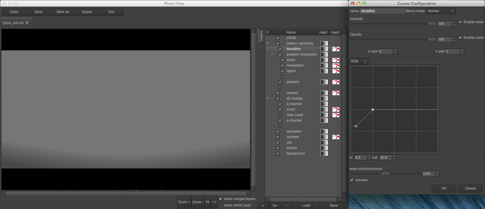 
<figcaption>
Gradient used for darkening the bottom of the image.
</figcaption>
</figure>

**It's done!** If you managed to follow me 'till the end, you are now rewarded with the final image in all its glory, that you can again compare with the initial starting point.

<figure class='big-vid'>
 
<figcaption> 
The final image (click to see the initial +1EV version).
</figcaption>
</figure>

It has been a quite long journey to arrive here... and I hope not to have lost too many followers on the way!

