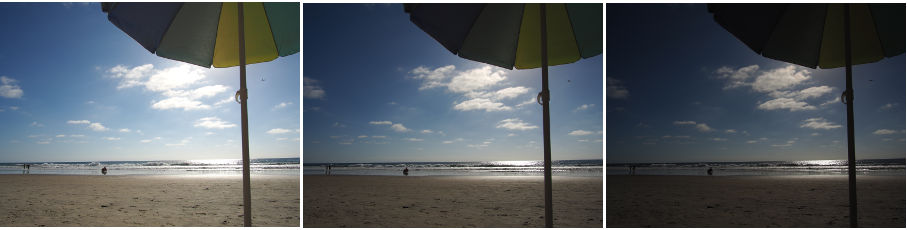
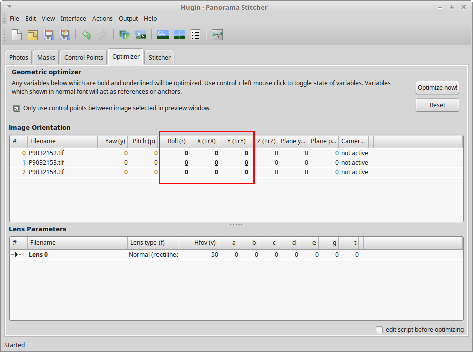
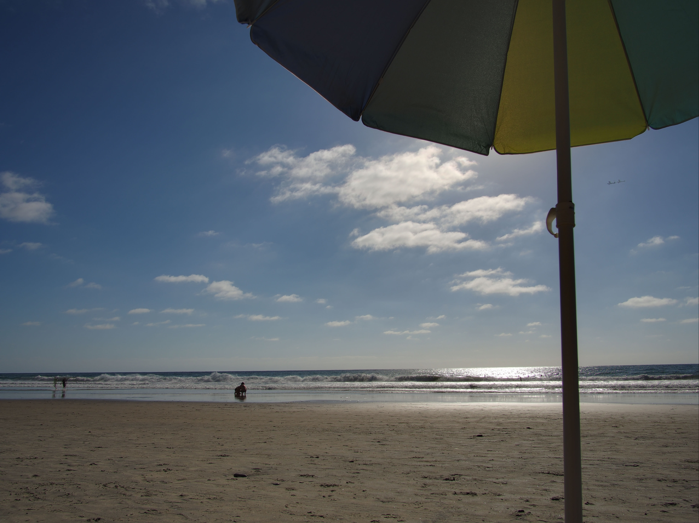

[Hugin](http://hugin.sourceforge.net/) is an excellent tool for for aligning and stitching images. In this article, we'll focus on aligning a stack of images. Aligning a stack of images can be useful for achieving several results, such as:
- bracketed exposures to make an HDR or fused exposure (using enfuse/enblend), or manually blending the images together in an image editor
- photographs taken at different focal distances to extend the depth of field, which can be very useful when taking macros
- photographs taken over a period of time to make a time-lapse movie

For the example images included with this tutorial, the *focal length* is **12mm** and the *focal length multiplier* is **1**. A big thank you to [@isaac](https://discuss.pixls.us/users/isaac/activity) for providing these images.

You can download a zip file of all of the sample _Beach Umbrellas_ images here:

[Download **Outdoor_Beach_Umbrella.zip**](/articles/aligning-images-with-hugin/Outdoor_Beach_Umbrella.zip) (62MB)

Other sample images to try with this tutorial can be [found at the end of the post](#image-files).

These instructions were adapted from the [original forum post](https://discuss.pixls.us/t/only-a-small-testimony/2130/5) by [@Carmelo_DrRaw](https://discuss.pixls.us/users/Carmelo_DrRaw/activity); many thanks to him as well.

We're going to align these bracked exposures so we can blend them:

<figure class="big-vid">
    
</figure>

1. Select **Interface** → **Expert** to set the  interface to **Expert** mode. This will expose all of the options offered by Hugin.

1. Select the **Add images...** button to load your bracketed images. Select your images from the file chooser dialog and click **Open**.

1. Set the optimal setting for aligning images:

  - Feature Matching Settings: Align image stack
  - Optimize Geometric: Custom parameters
  - Optimize Photometric: Low dynamic range

1. Select the **Optimizer** tab.

1. In the **Image Orientation** section, select the following variables for each image:
  - Roll
  - X (TrX) [horizontal translation]
  - Y (TrY) [vertical translation]

  You can `Ctrl` + left mouse click to enable or disable the variables.

  <figure class="big-vid">
    
  </figure>

  Note that you do not need to select the parameters for the anchor image:

  <figure class="big-vid">
    
  </figure>

1. Select **Optimize now!** and wait for the software to finish the calculations. Select **Yes** to apply the changes.

1. Select the **Stitcher** tab.

1. Select the **Calculate Field of View** button.

1. Select the **Calculate Optimal Size** button.

1. Select the **Fit Crop to Images** button.

1. To have the maximum number of post-processing options, select the following image outputs:
  - Panorama Outputs: Exposure fused from any arrangement
    - Format: TIFF
	- Compression: LZW
  - Panorama Outputs: High dynamic range
    - Format: EXR
  - Remapped Images: No exposure correction, low dynamic range

	<figure class="big-vid">
      
    </figure>

1. Select the **Stitch!** button and choose a place to save the files. Since Hugin generates quite a few temporary images, save the PTO file in it's own folder.

Hugin will output the following images:
- a tif file blended by enfuse/enblend
- an HDR image in the EXR format
- the individual images after remapping and without any exposure correction that you can import into the GIMP as layers and blend manually.

You can see the result of the image blended with enblend/enfuse:

  <figure class="big-vid">
    
  </figure>

With the output images, you can:
- edit the enfuse/enblend tif file further in the GIMP or RawTherapee
- tone map the EXR file in LuminanceHDR
- manually blend the remapped tif files in the GIMP or PhotoFlow

* * *

## Image files 

- Camera: Olympus E-M10 mark ii
- Lens: Samyang 12mm F2.0

### Indoor_Guitars 
[**Download Indoor_Guitars.zip**](https://s3.amazonaws.com/pixls-files/Indoor_Guitars.zip) (75MB)

- 5 brackets
- &plusmn;0.3 EV increments
- f5.6
- focus at about 1m
- center priority metering
- exposed for guitars, bracketed for the sky, outdoor area, and indoor area
- manual mode (shutter speed recorded in EXIF)
- shot in burst mode, handheld

### Outdoor_Beach_Umbrella
[**Download Outdoor_Beach_Umbrella.zip**](https://s3.amazonaws.com/pixls-files/Outdoor_Beach_Umbrella.zip) (62MB)

- 3 brackets
- &plusmn;1 EV increments
- f11
- focus at infinity
- center priority metering
- exposed for the water, bracketed for umbrella and sky
- manual mode (shutter speed recorded in EXIF)
- shot in burst mode, handheld

### Outdoor_Sunset_Over_Ocean
[**Download Outdoor_Sunset_Over_Ocean.zip**](https://s3.amazonaws.com/pixls-files/Outdoor_Sunset_Over_Ocean.zip) (60MB)

- 3 brackets
- &plusmn;1 EV increments
- f11
- focus at infinity
- center priority metering
- exposed for the darker clouds, bracketed for darker water and lighter sky areas and sun
- manual mode (shutter speed recorded in EXIF)
- shot in burst mode, handheld

#### Licencing Information

- Images created by [Isaac I. Ullah](https://discuss.pixls.us/users/isaac/activity), 2016, and released under the [Creative Commons Attribution-ShareAlike 4.0](http://creativecommons.org/licenses/by-sa/4.0/) licence (<a class='cc' href='http://creativecommons.org/licenses/by-sa/4.0/'>cba</a>).

