This is an article I had written long ago ([originally published](http://blog.patdavid.net/2013/03/the-open-source-portrait-postprocessing.html) in 2013).
The material is still quite relevant and the workflow hasn't really changed, so I am republishing it here for posterity and those that may have missed it the first time around.

[The previous post](http://blog.patdavid.net/2013/03/the-open-source-portrait-equipment.html) for this article went over the shoot that led to this image.

* [Picking Your Image](#picking-your-image)
* [RAW Processing](#raw-processing)
 * [Adjust Exposure](#adjust-exposure)
      * [Exposure Compensation](#exposure-compensation)
      * [Black Point](#black-point)
 * [White Balance](#white-balance)
 * [Noise Reduction](#noise-reduction-amp-sharpening)
 * [In Summary](#in-summary)
* [GIMP Retouching](#gimp-retouching)
 * [Touchup Hair](#touchup-flyaway-hairs)
 * [Fixing the Background/Cropping](#fixing-the-background-amp-cropping)
 * [Skin Retouching & Wavelet Decompose](#skin-retouching-with-wavelet-decompose)
 * [Contour Painting Highlights](#contour-painting-highlights)
 * [Color Curves](#color-curves)
 * [Sharpening](#sharpening)
* [The End](#finally-at-the-end)

If you'd like to follow along with the image of Mairi, you can download the files from the links below.

[Download the .ORF RAW file [Google Drive]](https://docs.google.com/uc?export=download&amp;id=0B21lPI7Ov4CVNUk1Y01HQUNPckk)  
[Download the full resolution .JPG output from RawTherapee.](Mairi-RAW-Final.jpg)  
[Download the Full Resolution .XCF file [.7zip - 265MB]](https://docs.google.com/uc?export=download&amp;id=0B21lPI7Ov4CVMl9lZFJWb1Rxa3c)  
If you want to use the .XCF file just to see what I did, I recommend the ½ resolution file, as it's smaller: 
[Download the ½ Resolution .XCF file [.7zip - 60MB]](https://docs.google.com/uc?export=download&amp;id=0B21lPI7Ov4CVaXA4bkNJdDhGRkU)  
<small>*These files are being made available under a [Creative Commons Attribution, Non-Commercial, Share Alike](http://creativecommons.org/licenses/by-nc-sa/3.0/us/) license (<a href="http://creativecommons.org/licenses/by-nc-sa/3.0/us/">CC-BY-SA-NC</a>).*</small>

To whet your appetite, here is the final result of all of the postprocessing done in this tutorial (click to compare it to no retouching):

<figure>

<figcaption>
The final result I'm aiming for.  
Click to compare to original.
</figcaption>
</figure>

---

## Picking Your Image

This is a hard thing to quantify, as each of us is driven by our own vision and style.
In my case, I wanted something a little more somber looking with a focus on her eyes (*they are the window to the soul,* right?).
There's just something I like about big, bright eyes in a portrait, particularly in women.

I also personally liked the grey sweater against the grey background as well.
I felt that it put more focus on the colors of her skin, hair, and eyes.
So that pretty much narrowed me down to this contact sheet:

<figure class="big-vid">

<figcaption>
    Narrowing it down to this set.
</figcaption>
</figure>

Looking over the shots, I decided I liked the images with the hood up, but her hair down and flowing around her.
This puts me in the top two rows, with only a few left to decide upon.
At this point I narrowed it down to one that I liked best - grey sweater, hood up but not pulled back against her head, hair flowing out of it, and big eyes.

This is pretty common, I'd imagine.
You can grab several frames, but in the end hopefully just the right amount of small details will come together and you'll find something that you really like.
In my case it was this one:

<figure>
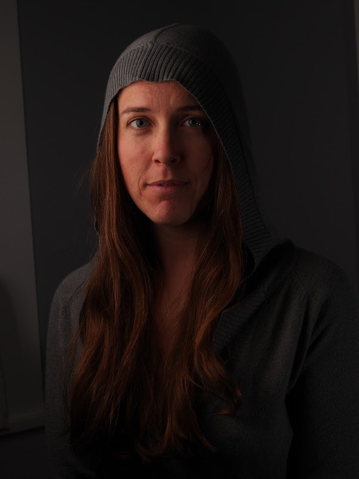
<figcaption>
    I finally decided on this shot based on the color, hair, eyes, and slight smile.
</figcaption>
</figure>

**Now hold on a minute**. The image above is the JPG straight out of the camera.
As you can see, I've underexposed this one a little bit, and the colors are not anywhere near where I'd like them to be.
If you're following along *don't download this version of the image*.
I'll have a much better starting JPG after we run it through some RAW development first!

If you're impatient, <a href="#raw-summary">jump to that section</a> and get the image there.

## Raw Processing

There are a few RAW conversion options out there in the land of F/OSS.
Here's a small list of popular ones to peruse:

* [RawTherapee](http://www.rawtherapee.com)
* [darktable](http://www.darktable.org/)
* [UFRaw](http://ufraw.sourceforge.net/)
* [Photivo](http://photivo.org/)
* [PhotoFlow](http://aferrero2707.github.io/PhotoFlow/)

One of the reasons I love using F/OSS is the availability (usually) of the software across my OS's.
In my case I went with RawTherapee a while back and liked it, so I've stuck with it so far (even though I had to build my own OSX versions).

So, my workflow includes RawTherapee at this point.
You should be able to follow along in other converters, but I'm going to focus on RT because that's what I'm using.
If you shoot only in JPG (seriously, use RAW if you can), you can skip this section and head directly down to <a href="#GIMP">GIMP Retouching</a>.

### Load it up

After starting up RawTherapee, you'll be in the **File Browser** interface, waiting for you to select a folder of images.
You can navigate to your folder of images through the file browser on the left side of the window.
It may take a bit while RawTherapee generates thumbnails of all the images in your directory.

<figure>

<figcaption>
RawTherapee file browser view.  
(Navigate folders on the left pane)
</figcaption>
</figure>

Once you've located your image, double clicking it in the main window will open it up for editing.
If you're using a default install/options on RT, chances are a "Default" profile will be applied to your image that has **Auto Levels** turned on.

<figure>

<figcaption>
The base image with "Default" profile applied (auto levels).
</figcaption>
</figure>

Chances are that **Auto Levels** will not look very good.
My **Default** processing profile usually does not look so hot (no noise reduction, auto levels, etc.).
That's ok, because we are going to fix this right up in the next few sections.

### Adjust Exposure

I like to control the exposure and processing on my RAW images.
Auto Levels may work for some, but once you get used to some basic corrections and how to use them it's relatively quick and painless to dial-in something you like quickly.

Again - much of what I'm going to describe is subjective, and will depend on personal taste and vision.
This just happens to be how I work, adjust as needed for you own workflow. :)

To give me a good starting point I will usually remove all adjustments to the image, and reset everything back to zero.
This is easy to do as my **Default** profile has nothing done to it other than **Auto Levels**.

<figure>

<figcaption>
Auto Levels values on the Exposure panel.
</figcaption>
</figure>

A quick and easy way to reset the **Exposure** values on the **Exposure** panel is to use the <b style="color:#20a020;">Neutral button</b> on that panel (I've outlined it in <b style="color:#20A020;">green</b> above).
You can also hit the small "undo" arrows next to each slider to set that slider back to zero as well.

At this point the image exposure is set to a baseline we can begin working on.
For reference, here is my image after zeroing out all of the exposure sliders and the saturation:

<figure>

<figcaption>
With all exposure adjustments (and saturation) set to zero.
</figcaption>
</figure>

#### Exposure Compensation

The first thing I'll begin adjusting is the *Exposure Compensation* for the image.
You want to be paying careful attention to the histogram for the image to know what your adjustments to *Exposure Compensation* are doing, and to keep from blowing things out.

I personally begin pushing the *Exposure Compensation* until one of the RGB channels just begins butting up against the right side of the histogram.
Here is what the histogram looks like for the neutral exposure:

<figure>
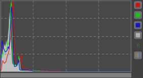
<figcaption>
Neutral exposure histogram.
</figcaption>
</figure>

After adjusting *Exposure Compensation* I get the Red channel snug up against the right side of the histogram:

<figure>

<figcaption>
*Exposure Compensation* until the values just touch the right side.
</figcaption>
</figure>

If you go a little too far, you'll notice one of the channels will spike against the side, and if you really go too far, you'll get a small colored box in the upper right corner indicating that channel has gone out of range (is blown out).

So here is what my image looks like now with only the *Exposure Compensation* adjusted to a better range:

<figure>

<figcaption>
*Exposure Compensation* adjusted to 2.40.
</figcaption>
</figure>

The **Exposure** panel in RT now looks like this (only the *Exposure Compensation* has been adjusted):

<figure>

<figcaption>
*Exposure Compensation* set to 2.40 for this image.
</figcaption>
</figure>

If the highlights in your image begin to get slightly out of range, you may need to make adjustments to the **Highlight recovery amount/threshold**, but in my case the image was slightly under-exposed, so I kept it zero.

There is also a great visual method of seeing where your exposures for each channel are at, and to avoid hightlight/shadow clipping.
Along the top of your main image window, to the right, there are some icons that look like this:

<figure>

<figcaption>
<i style="color:rgb(0,255,255); background-color: gray;">Channel previews</i>, <i style="color:rgb(255,0,255); background-color: gray;">Highlight</i> &amp; <i style="color:rgb(255,255,0); background-color: gray;">Shadow</i> clipping indicators
</figcaption>
</figure>

The <i style="color:rgb(0,255,255); background-color: gray;">Channel previews</i> let's you individually toggle each of the R,G,B, and Luminosity previews for the image.
You can use these with the <i style="color:rgb(255,0,255); background-color: gray;">Highlight</i> and <i style="color:rgb(255,255,0); background-color: gray;">Shadow</i> clipping indicators to see which channels are clipping and where.

<i style="color:rgb(255,0,255); background-color: gray;">Highlight</i> and <i style="color:rgb(255,255,0); background-color: gray;">Shadow</i> clipping indicators will visually show you on your image where the values go beyond the threshold for each.
For highlights, it's any values that are greater than **253**, and for shadows it's any values that are lower than 8.

To illustrate, here is what my image looks like in RT with the *Exposure Compensation* set to 2.40 from above:

<figure>

<figcaption>
With Highlight & Shadow clipping turned on.
</figcaption>
</figure>

I don't mind the shadows clipping in the dark regions of the image, though I can make adjustments to the **Black Point** (below) to modify that.
The highlight clipping on her face is of more concern to me.
I certainly don't want that!

At this point I can dial in my *Exposure Compensation* for the highlights by backing it down slightly.
As I ease off it I should be seeing the dark patch for *Highlight Clipping* growing smaller.
I'll stop when it's either all gone, or just about all gone.

I wasn't too far off in my initial adjustment, and only had to back the *Exposure Compensation* off to **2.30** to remove most of the highlight clipping.

Settings so far (everything else zero)...

|   |   |
|---|---|
|Exposure Compensation|2.30|

---

#### Black Point

At this point I will usually zoom a bit into a shadow area of my image that might include dark/black tones.
The blacks feel a little flat to me, and I'm going to increase the black level just a bit to darken them up.

I want to be zoomed in a bit so I can determine at which point the black point crushes any details that I want to be visible still.
You want your blacks to be dark if possible, but you want to keep details in the shadows if possible (it's really, really subjective where this point is, but I'll err on the conservative side since I am still going to process colors a little bit in GIMP later).

Starting with a **Black** point of zero:

<figure>

</figure>

I will increase the **Black** point while keeping an eye on those shadow details, increasing it until I like how the blacks look and I haven't destroyed detail in the dark tones.
I finally settled on a **Black** value of 150 as seen here:

<figure>

<figcaption>
Black value set at 150 (still keeping sweater details in the shadows).  
Click to compare to previous.
</figcaption>
</figure>

Watch out for *Shadow Recovery* when you first start adjusting the *Black Point*.
It's default might be a different value than zero (mine is at 50), and the **Neutral** button won't set it back to zero (resetting it will give it back to it's default value of 50).
You may want to push it manually to zero, and if you feel you want to bump shadow details a bit, *then* start pushing it up.

I know things look noisy at the moment, but we'll deal with that in the next section (there is no noise reduction being applied at this point).

Settings so far (everything else zero)...

|   |   |
|---|---|
|Exposure Compensation|2.30|
|Black|150|

---

#### Brightness, Contrast, and Saturation

For this image I didn't feel the need to modify these values, but this is purely subjective (*again*).
If you do modify these values, keep an eye on the histogram and what it's doing to keep things from getting out of range/whack again.

### White Balance

Hopefully you had the right **White Balance** set during your shoot in camera.
If not, it's ok - we're shooting in RAW so we can just set it as needed now.

I happen to have had my in-camera WB set to *Flash*, so the embedded WB settings in my RAW file metadata are pretty close.
In my shot, however, you'll notice that there is a bit of a white window visible in the left of the frame.
I happen to know that the window is quite white, and should be rendered as such in my image.

As a side note, what I *really* should have done was to get myself a good reference for balancing the white balance, and to shoot it as part of my setup.
Something like the <a href="http://www.amazon.com/gp/product/B000JLO31C/ref=as_li_ss_tl?ie=UTF8&amp;camp=1789&amp;creative=390957&amp;creativeASIN=B000JLO31C&amp;linkCode=as2&amp;tag=httpblogpatda-20">X-Rite MSCCC ColorChecker Classic</a>, or even a <a href="http://www.amazon.com/gp/product/B000ARHJPW/ref=as_li_ss_tl?ie=UTF8&amp;camp=1789&amp;creative=390957&amp;creativeASIN=B000ARHJPW&amp;linkCode=as2&amp;tag=httpblogpatda-20">WhiBal G7 Certified Neutral White Balance Card</a>.
These are a little pricey, but any good 18% grey card will do, really.
I just happen to know that my window borders are a pure white, so I'm cheating a bit here...

So here is what our image looks like at the moment:

<figure>
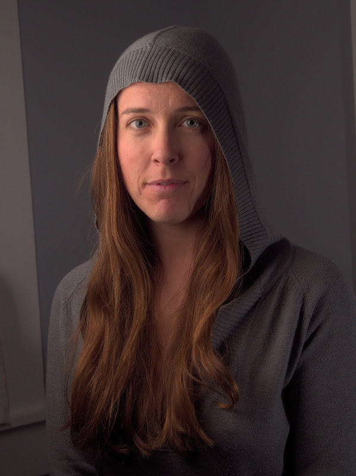
<figcaption>
Image so far, with **White Balance** set to *Camera* (Default).
</figcaption>
</figure>

The **White Balance** for your image can be adjusted from the **Color** panel:

<figure>
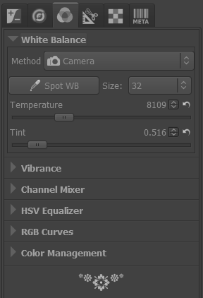
<figcaption>
Default Color panel showing *Camera* white balance.
</figcaption>
</figure>

You can try out some of the presets in the *Method* drop-down - there are the typical settings there for Sunny, Shade, Flashes, etc...
In my case I am going to use the **Spot WB** option.
Clicking that button will let me pick a section of my image that should be color neutral.

In my case, I know that the window border should be white (and color neutral), so I will pick from that area on my image.
Doing so will shift my WB, and will produce a result that looks like this:

<figure>

<figcaption>
WB based on white window border.  
Click to compare *Camera* based
</figcaption>
</figure>

I also happen to know that the grey colored walls in the background are close to neutral, but with the slightest hint of blue in them.
If I used the grey wall instead of the white window, I would introduce the slightest warm cast to the image.
I tried it (choosing a section of the grey wall on the right side of the background), and actually prefer the slightly warmer color, personally:

<figure>

<figcaption>
WB based on the grey wall background (right side of image). 
Click to compare to window WB.
</figcaption>
</figure>

The difference is ever so slight, but it is there.
In my original final image, I went with the balance pulled from the wall, so I will continue with that version here.
If you're curious, here is what my WB values look like:

<figure>
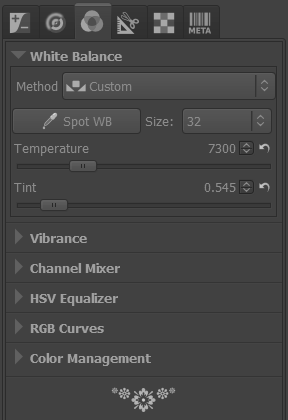
<figcaption>
After setting **Spot WB** to the window.
</figcaption>
</figure>

Seriously, though, don't rely on luck.
Get a grey/color card to correct color casts if you can...

Settings so far (everything else zero)...

|   |   |
|---|---|
|Exposure Compensation|2.30|
|Black|150|
|WB Temperature|7300|
|WB Tint|0.545|

---

### Noise Reduction &amp; Sharpening

Chances are the RAW image is going to look pretty noisy zoomed in a bit.
This isn't unusual since we are dealing with RAW data.
There are two noise reduction (NR) options in RT, and we are going to want to use both.

#### Impulse Noise Reduction

This NR will remove pixels that have a high impulse deviation from surrounding pixels.
Basically the "salt and pepper" noise you may notice in your images where individual pixels are oddly brighter/darker than the surrounding pixels.

If I zoom into a portion of my image (not far from where I was looking at shadows for setting a black point), I'll see this:

<figure>

<figcaption>
Closeup crop with no **Impulse Noise Reduction**.
</figcaption>
</figure>

I'll normally play a bit with the **Impulse NR** to alleviate the specks while still retaining details.
As with most NR methods - going a bit too far will obliterate some details with the noise.
The trick is to find a happy medium between the two.
In my case, I settled on a value of 55 (the default is 50):

<figure>
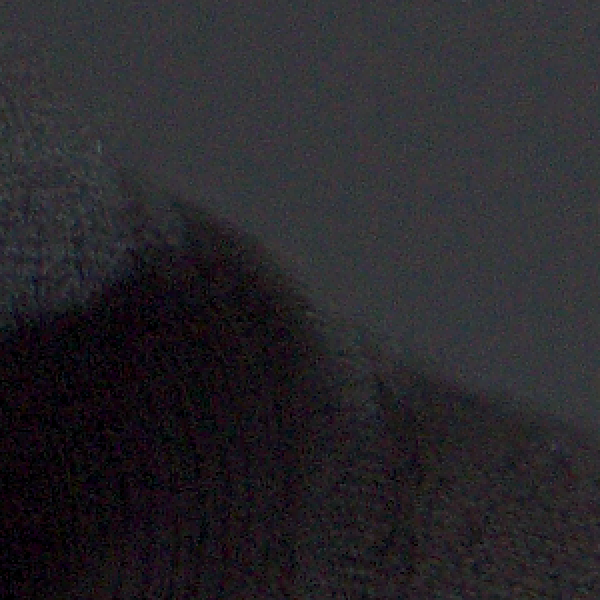
<figcaption>
**Impulse NR** set to a value of 55.  
Click to compare to no NR.
</figcaption>
</figure>

I could have gone a bit further (and have in others from this series), and pushed it up to the 60-70 range, but it's a matter of taste and weighing the tradeoffs.

#### Luminance/Chrominance Noise Reduction

These two NR methods will suppress noise in the luminance channel (brightness), and the blue/red chrominances.

I will use a light hand with these NR values.
The defaults are 5 for each, and it should make a noticeable difference just with the default values.
If you push the **Luminance** NR too far, you'll smear fine details right off your image.
If you push the **Chrominance** NR too far, you'll suck the life out of the colors in your image.

Not surprisingly, it's another trade off.
In my case, I pushed the L/C NR just a tiny bit past the default to 6 and 6 respectively.

You'll be able to see the effect of chrominance NR by looking at the flat colored grey wall in the background.
Just don't forget to check other areas of your image with the settings you choose.
For me it was a close look at her iris, where pushing the chrominance NR too far lost some of the beautiful colors in her eye.

Compare the same crop from above with and without Luminance/Chrominance noise reduction applied:

<figure>

<figcaption>
With Luminance & Chrominance NR set to 6.  
Click to compare without. 
</figcaption>
</figure>

If you've read my previous article on B&W conversion, you'll know that I don't mind a little noise/grain in my images at all, so this level doesn't bother me in the least.
I could chase the noise even further if I really wanted to, but always remember that doing so is going to be at the expense of detail/color in your final result.
As with most things in life, moderation is key!

#### Sharpening

If you are going to sharpen your image a bit, this is probably the best time to do so.
The problem is that *usually* sharpening is the last bit of post-processing you should do to your image, due to it's destructive nature.
Plus, lately I've grown accustomed to sharpening by using an extra wavelet scale during my skin retouching in GIMP (you'll see below in a bit).

So, I'll avoid sharpening at this stage.
If I was going to use it here at all, it would be just very, very light.
Also, if you do any sharpening at this stage, try to make sure that it happens *after* any noise reduction in the pipeline.

Settings so far (everything else zero)...

|   |   |
|---|---|
|Exposure Compensation|2.30|
|Black|150|
|WB Temperature|7300|
|WB Tint|0.545|
|Impulse NR|55|
|Luminance NR|6|
|Chrominance NR|6|

---

### Lens Correction

This is actually a section that deserves its own post, detailing methods for correcting for lens barrel distortion with Hugin.
RawTherapee actually has an "Automatic Distortion Correction" that will effect pincushion distortion in your images.

In my case, I was shooting at the long end of the lens at 50mm, and the distortion is minimal.
So I didn't bother with correcting this (it might have been needed at a shorter focal length, and being closer to the subject, though).

### In Summary

That about wraps up the RAW "development" I'm going to do on this image.
I try to keep things minimal where possible, though I could have gone further and adjusted color tones and LAB adjustments here as well.
In fact, with the exception of Wavelet Decompose for skin retouching, and some other masking/painting operations, I could do most of what I want for this portrait entirely in RawTherapee.

I know that this reads really long, but the truth is that once I am accustomed to a workflow, this takes less than 5 minutes from start to finish (faster if I've already fiddled with other images from the same set).
All I really modified here was **Exposure**, **White Balance**, and **Noise Reduction**.

Finally, as I hinted at earlier, here is the final version after doing all of these RAW edits, as we get ready to bring the image into GIMP for further processing:

<figure>

<figcaption>
**This** is the one to download if you want to follow along in GIMP below.  
Just click the image to open in a new window, then save it from there.
</figcaption>
</figure>

## GIMP Retouching

Well, here we are.
Finally.
It's the home stretch now, so don't give up just yet!

If you didn't follow along with the RAW processing earlier, you can download the full resolution JPG output from RawTherapee by clicking here:

[Download the full resolution JPG output from RawTherapee](Mairi-RAW-Final.jpg)

Armed with our final results from RawTherapee, we're now ready to do a little retouching to the image.

The overall workflow and the order in which I approach them is dependent on my mood mostly.
Most times, I enjoy doing skin retouching, so I'll often jump right in with **Wavelet Decompose** and play around.
Really, though, I should start shifting Wavelet Decompose to a later part of my workflow, and fix other things like removing objects from the background and fixing flyaway hairs first.

This way, I can directly re-use wavelet scales for a slight wavelet sharpening while I have them.

Looking at this image so far, I can spot a few broad things that I want to correct, and I'm going to address them in this order:

1. Touchup flyaway hairs
2. Crop &amp; remove distracting background elements
3. Skin retouching with Wavelet Decompose
4. Contour paint highlights
5. Apply some color curves

---

### Touchup Flyaway Hairs

If you can have the model bring a hairbrush with them to a shoot - DO IT.
Seriously.
Your eyes and carpal tunnel will thank me later.

Even with a brush or hairstylist/make-up artist the occasional hair will decide to rebel and do its own thing.
This will require us to get down to the details and fix those hairs up.

Luckily for me, Mairis hair mostly cooperated with us during the shoot (and where it didn't I kind of liked it).
To illustrate this step, though, I'm going to clean up some of the stray hairs on the left side of the image (the right side of her face).

Luckily for me, the background is a consistent color/texture.
This means cloning out these hairs shouldn't be too much of a problem, but there are still some things you should keep in mind while doing this.

Here is the area that I'd like to clean up a little bit:

<figure>

<figcaption>
Sometimes you just have to work one strand of hair at a time...
</figcaption>
</figure>

<figure style="float:right; margin: 0 0 1rem 1rem;">

</figure>

I will usually use a hard-edged brush because a soft-edge will smear details on its edges, and can often be spotted pretty easily by the eye.
This works because the background is relatively constant in grain and color.

I'll sample from an area near the hair I want to remove, and set the brush to be **"Aligned"**.
I also try to keep the brush size as small as I can and still remove the hair.

The thing to keep in mind is how the hair is actually *flowing*, and to follow that.
I will often follow outlying strands of hair back to where they start from the head, and begin cloning them out from there.

I also try not to get too ambitious (some stray hairs are sometimes fine).
Removing too many at once can lead to unrealistic results, so I try to be conservative, and to constantly zoom out and check my work visually.

Try not to leave hairs prematurely cut off in space if possible, it tends to look a bit distracting.
If you want to remove a hair that crosses over another strand that you may want to keep, make sure to adjust the source of the clone brush so you can do it without leaving a gap in the leftover strand.

Here is a quick 5 minute touchup of some of the stray hairs (click to compare to the original):

<figure>

<figcaption>
Click to compare.
</figcaption>
</figure>

Occasionally, you'll need to fix hairs that are crossing over other hair (sort of like a virtual "brushing" of the hair).
In these cases, you really have to pay careful attention to *how the hair flows* and to use that as a guide when choosing a sample point with either the clone or heal brush.

If this sounds like a lot of work - it is.
Thankfully, once you've become accustomed to doing it, and doing it well, you'll find yourself picking up a lot of speed.
It's one of those things that's worth learning to do right, and to let practice speed it up for you.

I actually like the cascading hair around her face opening up to a pretty color, so that's about as far as I'm going to go with stray hairs on this image.

### Fixing the Background &amp; Cropping

With the limited space I had to shoot this portrait, it's no surprise that I had gotten some undesirable background elements, like the window edges.

There's a couple of ways I could go about fixing these - I could fix the background in place, or I can crop out the elements I don't want.

In my final version shown in the previous post, I wanted to crop tighter, so it worked out well to remove the window on the left.
To illustrate how we can remove the window, I'm going to leave the aspect ratio as it is, and walk through removing the distracting background elements.

#### Removing Background Elements

Because most of the background is already a (relatively) solid color, this isn't too hard.
There's just a couple of simple things to keep in mind.

The way I'm going to approach this is to make a duplicate of my current layer, and to move the duplicate into place such that the background will cover up parts of the window I want to remove.
Then I'll mask the duplicate layer to hide the window.

I start by choosing an area of the background that's similar in color/tone:

<figure>
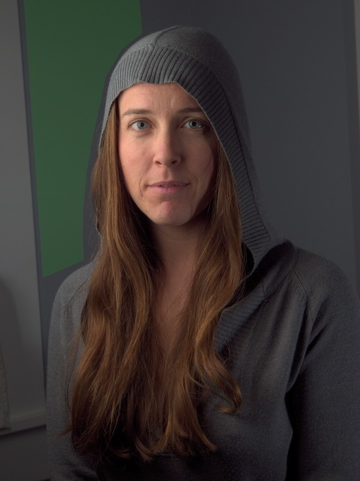
<figcaption>
Thankfully the background is relatively consistent.
</figcaption>
</figure>

I'll then move the duplicate layer so that the green area covers up the window to the left:

<figure>

<figcaption>
Position the duplicate layer so the green area now covers up the window.
</figcaption>
</figure>

Here is what this looks like in GIMP, with the duplicate layer set to 90% opacity over the base layer (so you can see where the window edge is):

<figure>
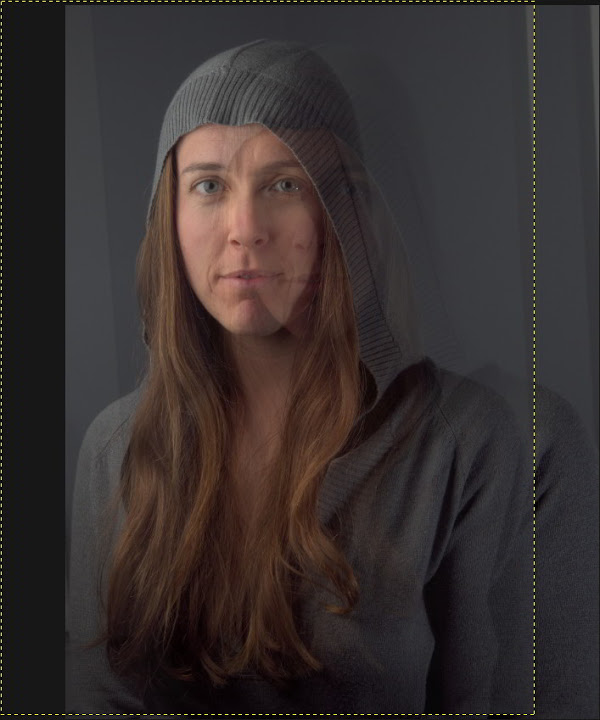
<figcaption>
Moving the duplicate layer over to cover the window.
</figcaption>
</figure>

Now I'll add a black (fully transparent) layer mask over the duplicate layer, and I'll paint white on the mask to cover up the window edge (with a soft-edged brush).
This give me results that look like this:

<figure>

<figcaption>
After applying a transparent mask, and painting white over the window edge.
</figcaption>
</figure>

The problem is that the background area from the duplicate is a bit darker than the base layer background, and the seam is visible where they are masked.
To fix this, I can just adjust the lightness of the duplicate layer until I get a good match.

I used Hue-Saturation to adjust the lightness (because I wasn't sure if I would need to adjust the hue slightly as well - turns out I didn't).
I found that increasing the *Lightness* value to 3 got me reasonably close:

<figure>
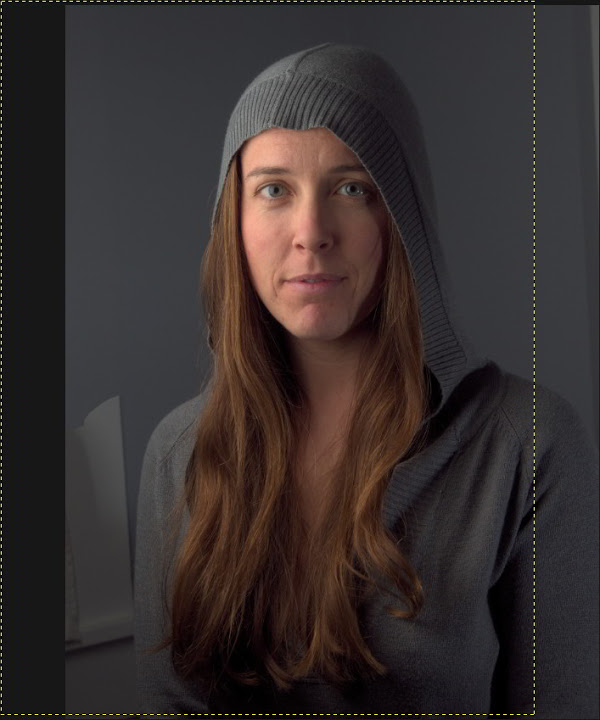
<figcaption>
After increasing duplicate layer *Lightness* to 3.
</figcaption>
</figure>

To further fix the lower part of the window, I just repeated all the steps above with another duplicate of the base layer, just shifted to cover the lower part of the window.
I had to mask along her sweater.
Here is the result after repeating the above steps:

<figure>
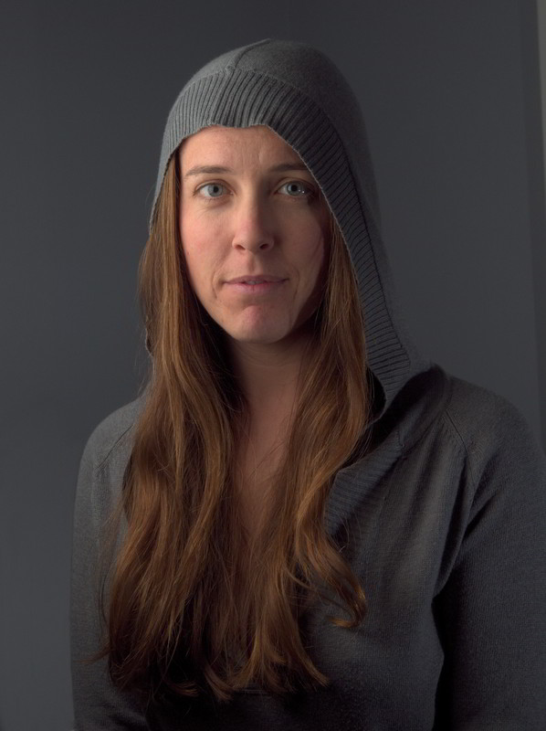
<figcaption>
After repeating above steps for the lower left corner.
</figcaption>
</figure>

The results are ok, but could be just a little bit better.
Visually, the falloff of light on the background doesn't match what's happening on her body, so I added a small gradient to the lower left corner to give it a more natural looking light falloff:

<figure>

<figcaption>
Adding a gradient to the lower left background helps it look more natural.
</figcaption>
</figure>

Fixing the slight window/shadow on the right is easily done with a clone/heal tool combination.
The final result of quickly cleaning up the background is this:

<figure>

<figcaption>
Finished cleaning up the background.
</figcaption>
</figure>

I could have spent a little more with this, but I'm happy with the results for the purpose of this post.
If your cloning efforts leave obvious transitions between tones, the Heal tool can be helpful for alleviating this (especially when used with large brush radii, just be prepared to wait a bit).

With the background squared away, we can move on to one of my favorite things to play with, skin retouching!

### Skin Retouching with Wavelet Decompose

I had <a href="http://blog.patdavid.net/2011/12/getting-around-in-gimp-skin-retouching.html">previously written about using Wavelet Decompose</a> as a means for touching up skin.
As I said in that post, and will repeat here:

> The best way to utilize this tool is **with a light touch**.

Re-read that sentence and keep it in mind as we move forward.

Don't make mannequins.

Ok, with a layer that contains all of the changes we've made so far rolled up, we can now decompose the image to wavelet scales.
In my case I almost always use the default of 5 scales unless there's a good reason to increase/decrease that number.

For anyone new to this method, the basic idea of Wavelet Decompose is that it will break down your images to multiple layers, each containing a specific set of details based on their relative size, and a residual layer with color/tonal information.
For instance, Wavelet scale 1 will contain only the finest details in your image, while each successive scale will contain larger and larger details.

The benefit to us is that these details are isolated on each layer, meaning we can modify details on one layer without affecting other details from other layers (or adjust the colors/tones on the residual layer without modifying the details).

Here is an example of the resulting layers we get when running Wavelet Decompose:

<figure>

<figcaption>
Wavelet scales from 1 (finest) to the Residual
</figcaption>
</figure>

After running Wavelet Decompose, we'll find ourselves with 6 new layers: Residual + 5 Wavelet scales.
I am going to start on Wavelet scale 5.

If you hold down **Shift** and click on a layer visibility icon, you'll isolate just that single layer as visible.
Do this now to *Wavelet scale 5*, and let's have a look at what we're dealing with.

I usually work on skin retouching in sections.
Usually I'll consider the forehead, nose, cheeks to smile lines, chin, and upper lip all as separate sections (trying to follow normal facial contours).
Something like this:

<figure>

<figcaption>
Rough breakdown of each area I'll work on separately
</figcaption>
</figure>

I'm going to start with the forehead.
I'll work with detail scales first, and follow up with touchups on the residual scale if needed to even out color tones.
Here is what Wavelet scale 5 looks like isolated:

<figure>

<figcaption>
Forehead, Wavelet scale 5
</figcaption>
</figure>

It may not seem obvious, especially if you don't use wavelet scales much, but there's a lot of large scale tonal imperfections here.
Look at the same image, but with the levels normalized:

<figure>

<figcaption>
These are the tones we want to smooth out
</figcaption>
</figure>

Normalizing the wavelet scale lets you see the tones that we want to smooth out.

My normal workflow is to have all of the wavelet scales and residual visible (each of the wavelet scales has a layer blending mode of **Grain Merge**).
This way I'm visually seeing the overall image results.
Then I will select each wavelet scale as I work on it.

I'll normally use the **Free Select Tool** to select the forehead.
I'll usually have the **Feather edges** option turned on, with a large radius (maybe 1% of the smallest image dimensions roughly - so ~35 pixels here).
Remember to have your layer selected that you want to work on.

With my area selected, I'll often run a **Gaussian Blur** (IIR) over the skin to smooth out those imperfections.
The radius you use is dependent on how strong you want to smooth the tones out.
Too much, and you'll obliterate the details on that scale, so start small.

Here is my selection I'll work with (remember - my active layer is Wavelet scale 5):

<figure>

<figcaption>
Forehead with selection (feather turned on to 35px)
</figcaption>
</figure>

Now I'll experiment with different **Gaussian Blur** radii to get a feel for how it will effect my entire image.
I settled on a high-ish value of 35px radius, which gave me this as a result (click to compare to original):

<figure>

<figcaption>
Forehead, Wavelet scale 5 after **Gaussian Blur (IIR)** 35px radius.  
Click to compare.
</figcaption>
</figure>

Just with this small change to a single wavelet scale, we can already see a remarkable improvement to the underlying skin tones, and we haven't hurt any of the fine details in the skin!

In some cases, this may be all that is required for a particular area of skin.
I could push things just a tiny bit further if I wanted by working globally again on a finer wavelet scale, but I've learned the hard way to back off early if possible.

Instead, I'll look at specific areas of the skin that I may want to touch up.
For instance, the two frown lines in the center of the forehead.
I may not want to remove them completely, but I may want to downplay how visible they are.
Wavelet scales are perfect for this.

<figure>

<figcaption>
Small frown lines I want to reduce
</figcaption>
</figure>

Because each of the Wavelet scales are set to a layer blend mode of **Grain Merge**, this means that any area that has a completely grey color will not effect the final image.
This means that you can paint with medium grey RGB(128,128,128) to completely remove a detail from a layer.

You can also use the Blur/Sharpen brush to selectively blur an area of the image as well.
(I've found that the Blur tool works best at smaller wavelet scales - it doesn't appear to make a big difference on larger scales).

So, if we look at Wavelet scale 5 where the frown lines are, we'll see there's not much there - it was already smoothed earlier.
If we look at Wavelet scale 4 though, we'll see them prominently.

I'll use the **Heal Tool** to sample from the same wavelet scale in a different location, and paint over just the frown lines.
I'll work on Wavelet scale 4 first.
If needed, I can also move down to Wavelet scale 3 and repeat the same procedure there.

A couple of quick passes just over the frown lines, and the results look like this:

<figure>

<figcaption>
Cloning over frown line on scale 4 & 3.  
Click to compare. 
</figcaption>
</figure>

I could continue over any other blemishes I may want to correct, but small individual blemishes can usually be fixed with a little spot healing quickly.

Moving on to the nose, the tones have different requirements.
Overall, the tones on Wavelet scale 5 are similar to the forehead.
In this case, a similar amount of blurring as the forehead on scale 5 will nicely smooth out the tones.
Here is the nose after a slight blurring (click to see original):

<figure>
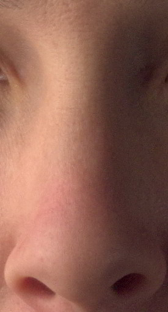
<figcaption>
Nose with 35px Gaussian blur on Wavelet scale 5.   
Click to compare.
</figcaption>
</figure>

There is a bit of color in the nose that is slightly uneven that I'd like to fix.
This is relatively easy to do with wavelet scales, because I can modify the underlying color tones of the nose without destroying the details on the other scale layers.

In this case, I'll work on the Wavelet residual layer.

I'll use a **Heal Tool** with a large, soft brush.
I'll sample from about the middle of the nose, and clean up the slightly redder skin by healing new tones into that area.
I'll follow the contours of the nose and the way that the light is hitting it in order to match the underlying tones to what is already there.

After a little work these are the results (click to compare to original):

<figure>

<figcaption>
Healing on the Wavelet residual scale to even tones.  
Click to compare.
</figcaption>
</figure>

Next I'll take a look at the eyes and cheek on the brighter side of her face.

<figure>

<figcaption>
Overall tones are good here, just some slight retouching required
</figcaption>
</figure>

The tones here are not bad, particularly on scale 5.
After making my selection, I've applied a blur at 25px just to smooth things a bit.

<figure>

<figcaption>
A slight 25px blur to smooth overall tones.  
Click to compare. 
</figcaption>
</figure>

The dark tones under/around the eyes is a bit different to deal with.
As before, I'll turn to working on the Wavelet residual layer to brighten up the color tones under the eyes.

I use the **Heal Tool** to sample from a brighter area of skin near the eye.
Then I'll carefully paint into the dark tones to brighten them up, and to even the colors out with the surrounding skin.

<figure>
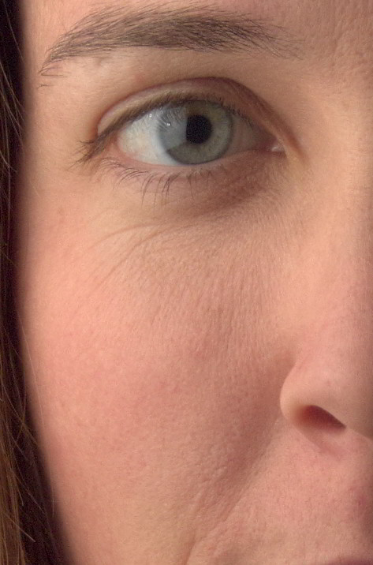
<figcaption>
Carefully cloning/healing brighter skin tones under the eyes.  
Click to compare to original.
</figcaption>
</figure>

Wavelets are amazing for this type of adjustment, because I can brighten up/change the skin tones under the eyes without effecting the fine skin details here like small wrinkles and pores.
The textual character remains unchanged, but the underlying skin tones can be modified easily.

The same can be done for the slightly red tones on the cheek, and at the edge of her jaw.
Which I did.

I'm purposefully not going to modify the fine wrinkles under the eyes, either.
These small imperfections will often bring great character to a face, and unless they are very distracting or bad, I find it best to leave them be.

A good tip is that even though these small imperfections may seem large when you're pixel peeping, get into the habit of zooming out to a sane zoom level and evaluate the image then.
Sometimes you'll find you've gone too far, and things begin to creep into mannequin territory.

Don't make mannequins!

#### In Summary Again

This entire post is getting a little long, so I'm going to stop here with the skin retouching breakdown.

Also, that's honestly about it as far as the process goes.
Just repeat on the areas that are left (right cheek, chin, and upper lip).
You can just apply the processes I described above to those other areas, in the same way.

To summarize, here are the tools/steps I'll use with Wavelet Decompose to retouch skin:

* Area selection with Gaussian blur to even out overall tones at a particular scale
* Paint with grey, Clone, Heal on wavelet scales to modify specific details
* Clone/Heal on wavelet residual scale to modify underlying skin tones/colors (but leave details intact)

Here are the final results after using only Wavelet Decompose (click to compare to original):

<figure>
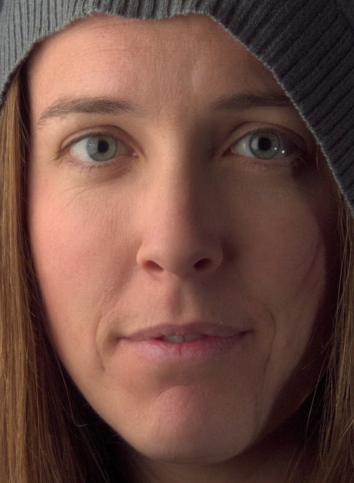
<figcaption>
After retouching in Wavelet Scales only.  
Click to compare to original.
</figcaption>
</figure>

### Spot Touchups

There may be a few things that still need a little spot touchup that I didn't bother to mess with in Wavelet scales.

In my case, I'll clone/heal out some small hairs along the jaw line, and touch up some small spots of skin individually.
This is really just a light cleaning, and I usually do this at the pixel level (obnoxiously zoomed in, and small brush sizes).

I also use a method for checking the skin for areas that I may want to touchup, but might not be immediately visible or noticeable.
It uses the fact that the Blue channel of an image can show you just how scary skin can look (seriously, color decompose any image of skin, and look at the blue channel).

### Contour Painting Highlights

One of the downsides of using Wavelet scales for modifying skin is that if you're blurring on some of the scales, you'll sometimes decrease the local contrast in your image.
This isn't so bad, but you may want to bring back some of the contrast in areas you've touched up.

What I'm going to do is basically add some transparent layers over my image, and set their layer blend modes to **"Overlay"**.

Then I'll paint white over contours I want to enhance, and adjust the opacity of the layer to taste.
(This is highly subjective, so I'm going to just show a quick idea of how I might approach it - you can get as nuts with this as you like...).

Here I've added a new transparent layer on top of my image, and set the Layer Blend Mode to *Overlay*.
Then I painted white onto contours that I want to highlight:

<figure>

<figcaption>
Painting on the *Overlay* layer along contours to highlight
</figcaption>
</figure>

It looks strange right now, but I'll add a large radius Gaussian Blur to smooth these tones out.
I used a blur radius of **111 pixels**.
Here is what it looks like after the blur:

<figure>

<figcaption>
Blurring the *Overlay* layer with Gaussian Blur (111 pixel radius)
</figcaption>
</figure>

Finally, I'll adjust the opacity of the *Overlay* layer to taste.
I'll usually dial this way, way down so that it's not so obvious.
Here, I've dialed the opacity back to about 20%, which leaves us with this (click to compare):

<figure>

<figcaption>
After setting the *Overlay* layer to 20% opacity (still a little high for me, but it's good for illustration).  
Click to compare.
</figcaption>
</figure>

I will sometimes add a few more of these layers to enhance other parts of the image as well.
I'll use it (very lightly!!!) to enhance the eyes a bit, and in this case, I used an even larger layer to add some volume and highlights to her hair as well.

Here is the results after adding some eye and hair highlight layers as well (click to compare no highlights):

<figure>

<figcaption>
Face, eyes, and hair contour painting result.  
Click to compare. 
</figcaption>
</figure>

### Color Curves

Finally, I like to apply some color curves that I have around and use often.
I've been heavily favoring a Portra emulation curve from <a href="http://www.prime-junta.net/pont/How_to/100_Curves_and_Films/_Curves_and_films.html">Petteri Sulonen</a> that he calls *Portra-esque*, especially for skin.
It has a very pretty rolloff in the highlights that really renders pretty colors.

If I feel it's too much, I can always apply it on a duplicate of my image so far, and adjust opacity to suit.
Here is the same image with only the *Potra-esque* curve applied:

<figure>
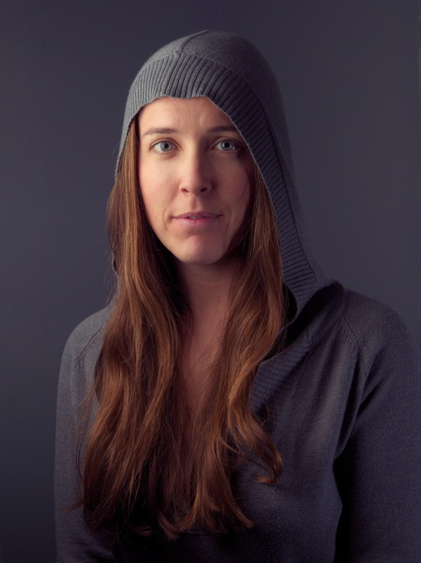
<figcaption>
Image so far, with a *Portra-esque* color curve applied.  
Click to compare.
</figcaption>
</figure>

If you're curious, I had written up a much more in-depth look at color curves for skin here: <a href="http://blog.patdavid.net/2012/07/getting-around-in-gimp-more-color.html">Getting Around in GIMP - More Color Curves (Skin)</a>.
You can actually download the curves for Portra, Velvia, Provia emulation on that page.

### Final Sharpening

Finally.
The last step before saving out our image!

For sharpening, I actually like to use one of the Wavelet scales that I generated earlier.
I'll just duplicate a low scale, like 2 or 3, and drag it on top of my layer stack to sharpen the details from that scale.

In this case, I liked the details from Wavelet scale 2, so I duplicated that layer, and dragged it on top of my layer stack.
The blend mode is already set to *Grain Merge*, so I don't have to do anything else:

<figure>

<figcaption>
Wavelet scale 2 copied to the top of the layer stack for sharpening.  
Click to compare.
</figcaption>
</figure>

## Finally at the End

If you're still with me - you really deserve a medal.
I'm sorry this has run as long as it has, but I wanted to try to be as complete as I could.

So, for a final comparison, here is the image we finished with (click to compare to what we started with before retouching in GIMP):

<figure>

<figcaption>
Our final result.  
Click to compare.
</figcaption>
</figure>

Not too bad for a little bit of fiddling, I think!  I know that this tutorial reads really, really long, but I promise that once you've understood the processes being used, it's actually very quick in practice.

I hope that this has been helpful to you in some way!  If you happen to use anything from this tutorial please share it.
I'd love to see what others do with these techniques.

