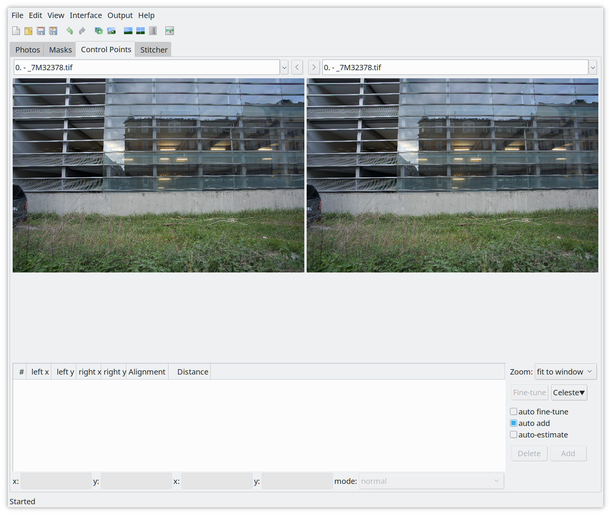
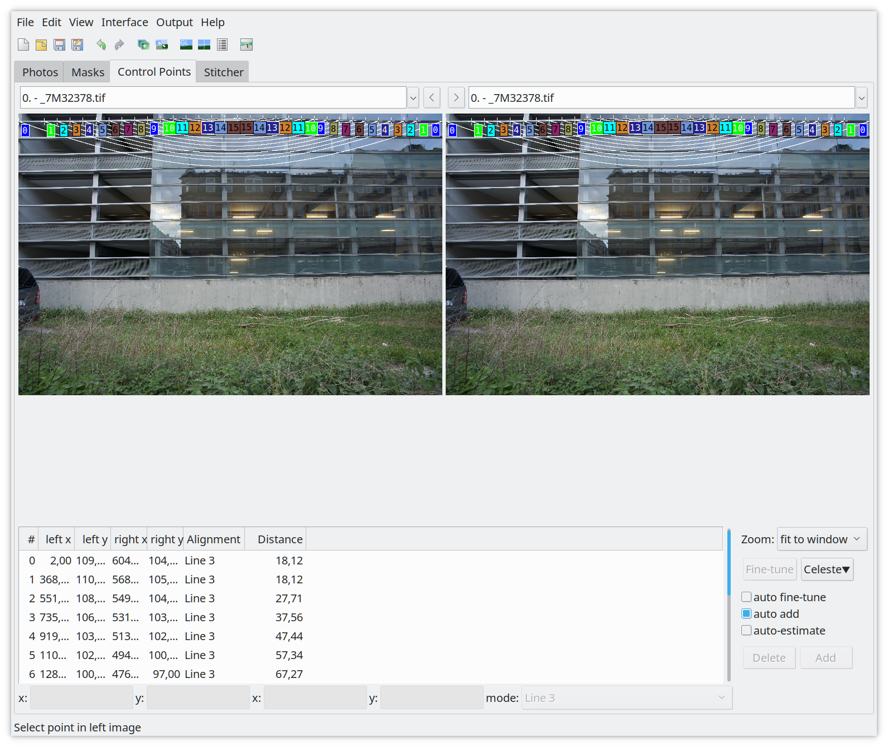

Introduction
------------

All photographic lenses have several types of errors. Three of them can be
corrected by software almost losslessly:
[distortion](http://en.wikipedia.org/wiki/Distortion_&#40;optics&#41;), [transverse
chromatic aberration (TCA)](http://en.wikipedia.org/wiki/Chromatic_aberration),
and [vignetting](http://en.wikipedia.org/wiki/Vignetting). The
[Lensfun](http://lensfun.sourceforge.net/) library provides code to do these
corrections. Lensfun is not used by the photographer directly. Instead, it is
used by a photo raw development software such as darktable or RawTherapee. For
example, if you import a RAW into darktable, darktable detects the lens model,
focal length, aperture and focal distance used for the picture, and it then
calls Lensfun to automatically correct the photograph.

<figure>

<figcaption>
<b>Figure 1:</b> 16mm lens showing distortion (**click on the image to show the distortion corrected image**)
</figcaption>
</figure>

Lensfun uses a database to know all the parameters needed to do the lens
corrections. This database is filled by photographers like you, who took time
to calibrate their lenses and to submit their findings back to the Lensfun
project. If you’re lucky, your lens models are already included. If not, please
use this tutorial to do the calibration and contribute your results.

Let us assume your lens isn’t covered by Lensfun yet, or the corrections are
either not good enough or incomplete. The following sections will explain how
to take pictures for calibration. It will also show you how to create an entry
of your own. The best is to provide information for all three errors but maybe
you only need distortion then this is fine too.

Checking if your lens is already supported
------------------------------------------

Before you start to calibrate new lenses or report missing cameras please check
the [lens database](https://wilson.bronger.org/lensfun_coverage.html) first!
The list is updated daily. If your lens is already support then everything is
fine and you just have to update your database.

If the lens is not supported or doesn't provide all corrections you could add
the missing data following this tutorial.

Taking pictures
---------------

Before we start you need to take a lot of images for the three errors we are
able to correct. This section will explain how to take them and what you need
to pay attention to.

### Distortion

For distortion you can to take pictures of a building with several parallel
straight lines. You need at least two lines, one should be at the top of the
image (Nearly touching the top of frame) and the other line at about a third
down from the first line. The following example demonstrates this.

<figure>

<figcaption>
<b>Figure 2:</b> Parking house with straight lines
</figcaption>
</figure>

<!--
<figure>
<figcaption>
<b>Figure 3:</b> Another example taken for distortion corrections
</figcaption>
-->

The lines must be *perfectly* straight and aligned. You can twist and rotate
the camera, but the lines must have no imperfections. Common mistakes are using
tiles or bricks: to your eye they may be "straight", but it will cause
calibration defects. The best buildings turn out to be parking houses (US:
parking lot, EN: garages, car parks) or modern glass buildings like
fruit-technology stores.

For a fixed focal length lens, you only will require one image. For a zoom lens
it is recommended to take 5 to N pictures where N is max focal length minus min
focal length. You must take an image at the minimum focal length, and the
maximum focal length. You can move (step backward on forward) between shots to
keep the 1/3rd rule above consistent.

You should shoot at your lenses sharpest aperture - this is often f/8 to f/11.
Setup your camera on a tripod. Shoot at the lowest ISO (without extended
values). This will be 100 or 200. Disable any inbody lens corrections.  Every
vendor has a different name for this process (Fuji is modular lens optimization
for example). Check your camera manual and menus.

### Chromatic aberrations (TCA)

For TCA images look for a large object with sharp high-contrast edges
throughout the image. Preferably, the edges should be black–white but anything
close to that is sufficient. Make sure that you have hard edges from the center
throughout to one of the edges. The best buildings, for taking photos, have dark
windows with white or gray frames.

Here are some example pictures:

<figure>

<figcaption>
<b>Figure 4:</b> Building with gray framed windows
</figcaption>
</figure>

<!--
<figure>
<figcaption>
<b>Figure 5:</b> Another example taken for distortion corrections
</figcaption>
-->

You should take your pictures being at least 8 meters away. For zoom lenses,
take pictures at the same focal lengths as for distortion (5 to N). Make sure
to capture really sharp photos using at least f/8. The best is to use aperture
control, f/8 and ISO 100 on a tripod to avoid any color noise.

You can use e.g. a streetview service to find the right building in your town
(big buildings, dark windows with white or grey frames).

### Vignetting

To create pictures for vignetting you need a diffuser in front of the lens. This
may be translucent milk glass, or white plastic foil on glass. Whatever, as
long as it is opaque enough so that nothing can be seen through it, yet
transparent enough so that light can pass through it. It must not be thicker
than 3 mm and shouldn’t have a noticeable texture. It must be perfectly flush
with the lens front, and it mustn’t be bent. It must be illuminated
_homogeneously_.

I ordered a piece of acryl glass, opal white (milky), smoothly polished, 78%
translucency, 3mm thick, 20 x 20 cm, which is about 8 Euro on Amazon.

However white plastic foil taped on a piece of ordinary glass for stability
might be enough, if the plastic doesn't have any texture.

I normally wait for a cloudy day with no sun, then the sky is  _homogeneously_
lit. Put the camera on a tripod and point it to the sky. Put the glass directly
on the lens (remove any filters). In some places where sunlight is different
you may need to shoot indoors. You should experiment to make sure your images
are evenly lit (except for vignetting obviously). 

<figure>

<figcaption>
<b>Figure 6:</b> Camera setup to take pictures for vignetting correction
</figcaption>
</figure>

<figure>

<figcaption>
<b>Figure 6:</b> Image showing vignetting of a wide angle lens at 16mm
</figcaption>
</figure>

Make sure that **no corrections** are applied by the camera (some models do
this even for RAWs). Set the camera to *aperture priority* and the
lowest real ISO (this is normally 100 or 200, don't use extended ISO values). 

Switch to manual focus and focus to infinity. This is the most critical step!

For zoom lenses, you need to take pictures at five different focal lengths. You
only need pictures for five focal lengths because for the other steps it gets
interpolated. For a prime lens you need to take only pictures for the single
focal length.

Take the pictures as RAW at maximal aperture and at three smaller apertures in
1 stop distance, and also at the minimal aperture. These are often marked on
your lens' aperture ring, or on your electronic display.

If you have for example a 16-35mm lens with f/2.8 - f/22, you need to take
pictures at 16mm, 20mm, 24mm, 28mm and 35mm focal length (Remember you require
the min and max zoom values). For each for those focal lengths you need to take
five pictures at f/22, f/16, f/11, f/8 and f/2.8. This makes 25 pictures in
total.

For a 50mm prime lens with f/1.8 - f/32 you need to take 5 pictures at f/32,
f/22, f/16, f/11 and f/1.8.

#### Vignetting correction for the professionals

The following steps are to get really fine grained vignetting corrections. The
gain in accuracy is really very small! I probably only makes sense for prime
lenses used for portrait or macro photography. However this is not required,
the above it absolutely enough.

Lensfun is able to can correct vignetting depending on focal distance. Thus,
you can achieve a bit more accuracy by shooting at different focal distances.
This means you will have to take pictures at 4 different focal distances.

The first focus on the near point (The near point is the closest distance that
can be brought in focus). The next focal distances are the near point
multiplied by 2 and by 6 and finally focus at infinity.

Example: For a 85mm prime lens with the near point at 0.8 m. You have to take
pictures at 0.8 m, 1.6 m, 4.8 m and infinity.

Create calibration data
-----------------------

There are two ways to perform the calibration.

Lensfun allows an upload of data to the project, and they'll do the program
work for you. They'll also review your images to make sure they are correctly
taken.

Or you can do it yourself with the lens calibration script from the lensfun
project.

The script needs the following dependencies to be installed on your system:

* python3
* python3-exiv2 ([py3exiv2](http://py3exiv2.tuxfamily.org/) >= 0.2.1)
* python3-numpy
* python3-scipy
* darktable-cli ([darktable](https://darktable.org) >= 2.4.0)
* tca_correct ([hugin](http://hugin.sourceforge.net) >= 2018)
* convert ([ImageMagick](https://www.imagemagick.org/script/index.php))

You can download the lens calibration script here:

https://gitlab.com/cryptomilk/lens_calibrate

Once you have downloaded the tool create a folder for your lens calibration
data, change to the directory and run:

    $ lens_calibrate.py init
    The following directory structure has been created in the local directory

    1. distortion - Put RAW file created for distortion in here
    2. tca        - Put chromatic abbreviation RAW files in here
    3. vignetting - Put RAW files to calculate vignetting in here

Follow the instructions and copy your raw files in the corresponding
directories.

#### Vignetting correction for the professionals

For each focal distance you captures pictures you have to create a folder.

Lets pick up the example from above. For a 85mm prime lens we took pictures at
0.8 m, 1.6 m, 4.8 m and infinity. For this lens you would have to create the
following folder structure in the vignetting directory:

    vignetting/0.8
    vignetting/1.6
    vignetting/4.8
    vignetting/inf

The folder `inf` is for the focal distance at infinity.

### Distortion

Once you copied the files in place it is time to generate the pictures (tif
files) for distortion calculations. You can do this with the
'distortion' option:

    $ lens_calibrate.py distortion
    Running distortion corrections ...
    Converting distortion/_7M32376.ARW to distortion/exported/_7M32376.tif ... DONE
    A template has been created for distortion corrections as lenses.conf.

Once the tif files has been created, you can start Hugin.

Torsten Bronger created a screen cast to give an overview about the distortion
process in Hugin. He uses an old Hugin version in the video. The following
section of this tutorial explains how to do it with Hugin 2018. You can watch
the screen cast first if you want, you can do it
[here (Vimeo)](https://vimeo.com/51999287/).

If you start Hugin the first time, the windows you will get should look like in
Figure 8.

<figure>

<figcaption>
<b>Figure 8:</b> Hugin start screen
</figcaption>
</figure>

First select on the menu bar *Interface -> Expert* to switch to the **Expert
mode**. You will get a windows which should look like as in Figure 9.

<figure>

<figcaption>
<b>Figure 9:</b> Hugin expert mode
</figcaption>
</figure>

Once in the export mode click on *Add images* (Figure 10) and load the first
tiff from the *distortion/exported* folder.

<figure>

<figcaption>
<b>Figure 10:</b> Adding images and setting the focal length and crop factor
</figcaption>
</figure>

By default the lens type should be set to *Normal (rectiliniar)* for normal
standard lenses. Make sure that the focal length is correct and set the *Focal
length multiplier*, which is the crop factor of your camera. For full frame
bodies this value should be *1*. If you have a crop camera you need to set the
correct crop value you can find in the specifications. Next click on the
*Control Points* tab (Figure 11).

<figure>

<figcaption>
<b>Figure 11:</b> The control points tab
</figcaption>
</figure>

This is the tab to set the control points so that we can tell the software what
are our straight lines we are interested in. In this tab you have to make sure
that *auto fine-tune* is disabled, *auto add* is enabled and *auto-estimate* is
disabled! If this is the case zoom the image to 200% (you can also do this by
pressing '2' on the keyboard).

In the zoomed images you have start at the top edges. On the left go to the top
left corner and to the top right corner on the right. The first straight line,
from left to right, should be visible. Select the first control point on
the left edge of the picture on the left page and the right edge on the
right (Figure 12).

<figure>

<figcaption>
<b>Figure 12:</b> Setting the first two control points for the line to add
</figcaption>
</figure>

**IMPORTANT**: Once you have the first control point selected in both images.
Select *Add new Line* in the *mode* dropdown menu! This will add the two
control points as *line 3*! Now continue adding corresponding control points in
both pictures till you're in the middle on both sides.

**Tip**: The easiest and fasted is to set control points in the middle at the
tiling line. This reduces the required mouse movements.

Now zoom out by pressing '0' and check it if everything has been added
correctly (Figure 13).

<figure>

<figcaption>
<b>Figure 13:</b> Control points for line3
</figcaption>
</figure>

While you are zoomed out, find a line which is about 3rd into the image from
the top to repeat adding a line. Zoom to 200% again, select the first control
points and again *Add a new line* which will result in *line4* (Figure 14)!

<figure>

<figcaption>
<b>Figure 14:</b> Control points for line 3 and line 4
</figcaption>
</figure>

Zoom out by pressing '0' and check that you have two lines, line3 and line4. Now move on to the *Stitcher* tab (Figure 14).

<figure>

<figcaption>
<b>Figure 15:</b> The stitcher tab, select the correct projection here.
</figcaption>
</figure>

In the *Stitcher* tab you need to select the correct *Projection* for your
lens. This is **Rectilinear** for standard lenses. Once done switch to the
*Photos* tab (Figure 16).

<figure>

<figcaption>
<b>Figure 16:</b> Enable the Optimizer tab.
</figcaption>
</figure>

At the bottom under *Optimize* select **Custom parameters** for *Geometric*.
This will add an *Optimizer* tab. Switch to it once it appears (Figure 17).

<figure>

<figcaption>
<b>Figure 17:</b> Optimizer tab: Select a b c for barrel distortion correction
</figcaption>
</figure>

Select the 'a', 'b' and 'c' lens parameters and click on *Optimize now!*.
Accept the calculation with yes. Now the values for 'a', 'b' and 'c' will
change (Figure 18).

<figure>

<figcaption>
<b>Figure 18:</b> Calculated distortion correction 'a', 'b' and 'c'.
</figcaption>
</figure>

The calculated correction values for 'a', 'b' and 'c' you can find in the tab
need to be added to the lenses.conf. Open The file and fill out the missing
options. Here is an example:

Example:

    [FE 85mm F1.4 GM]
    maker = Sony
    mount = Sony E
    cropfactor = 1.0
    aspect_ratio = 3:2
    type = normal

* `maker` is should be the lens manufacturer e.g. *Sony*
* `mount` is the mount system for the lens, check the lensfun database
* `cropfactor` is 1.0 for full frame cameras, if you have a crop camera find out the correct crop factor for it.
* `aspect_ratio` is the aspect ratio for the pictures which is normally 3:2.
* `type` is the type of the lens, e.g. 'normal' for standard rectilinear lenses. Other values are: *stereographic*, *equisolid*, *stereographic*, *panoramic* or *fisheye*.

If you have e.g. a 85mm there should be an entry for the focal length which is
set to: 0.0, 0.0, 0.0. You need to change the values in the lenses.conf for
your focal length with the calculated corrections from the Optimizer tab
(Figure 16).

    [FE 85mm F1.4 GM]
    maker = Sony
    mount = Sony E
    cropfactor = 1.0
    aspect_ratio = 3:2
    type = normal
    distortion(85mm) = 0.002, 0.001, -0.009

#### But I don't want to do distortion corrections!

No problem, if you want to skip this step then you can created the lenses.conf
manually. It should look like the following example:

    [lens model]
    maker =
    mount =
    cropfactor = 1.0
    aspect_ratio = 3:2
    type = normal

The section name is the *lens model*. You can find it out by running:

    exiv2 -g LensModel -pt <raw image file>

The other options are:

* `maker` is should be the lens manufacturer e.g. *Sony*
* `mount` is the mount system for the lens, check the lensfun database
* `cropfactor` is 1.0 for full frame cameras, if you have a crop camera find out the correct crop factor for it.
* `aspect_ratio` is the aspect ratio for the pictures which is normally 3:2.
* `type` is the type of the lens, e.g. 'normal' for standard rectilinear lenses. Other values are: *stereographic*, *equisolid*, *stereographic*, *panoramic* or *fisheye*.

### TCA

*You can skip this step if you don't want to do TCA corrections.*

This step is fully automatic, all you have to do is to run the following
command and wait:

    $ lens_calibrate tca
    Running TCA corrections for tca/exported/_7M32375.ppm ... DONE

However it possible to calculate more complex TCA corrections. For this you
need to run the step it with an additional command line argument, like this:

    $ lens_calibrate --complex-tca tca
    Running TCA corrections for tca/exported/_7M32375.ppm ... DONE

<!-- TODO: Difference between normal and complex TCA? -->

<!-- TODO: Explain plots? -->

### Vignetting

*You can skip this step if you don't want to do vignetting corrections.*

To calculate the vignetting corrections it is also a very simple step. All you
have to do is to run the following command and wait:

    $ lens_calibrate vignetting

<!-- TODO: Explain plots? -->

### Generating the XML

To get corrections for lensfun you need a lenses.conf with the required options
to be filled out (maker, mount, cropfactor, aspect_ratio, type). And at least
one of the corrections steps done. If you have this you can generate the XML
file which can be consumed by lensfun. You can do it with the following
command:

    $ lens_calibrate generate_xml
    Generating lensfun.xml

You can redo this step as many times as you want. And you can just rerun it if
you add an additional correction.

Using the lensfun.xml
---------------------

If you want to use the generated lensfun.xml file to test if the calibration
you created works, you can copy to the local lensfun config folder in your home
directory.

    cp lensfun.xml ~/.local/share/lensfun

Make sure your camera is recognized by lensfun or you need to add an entry to
the lensfun.xml file too.

Contributing your lensfun.xml
-----------------------------

To add lens data to the project please open a bug at:

https://sourceforge.net/p/lensfun/features/

For the subject use:

    Calibration data for <lens model>

And for the description just use:

    Please add the attached lens data to the lensfun data base.

Attach lensfun.xml to the bugreport.

Feedback
--------

Feedback for this article is very welcome. If you're a lensfun developer and
read this please contact me. I would like to contribute the script to lensfun
and further improve the article. I still have unanswered questions.
