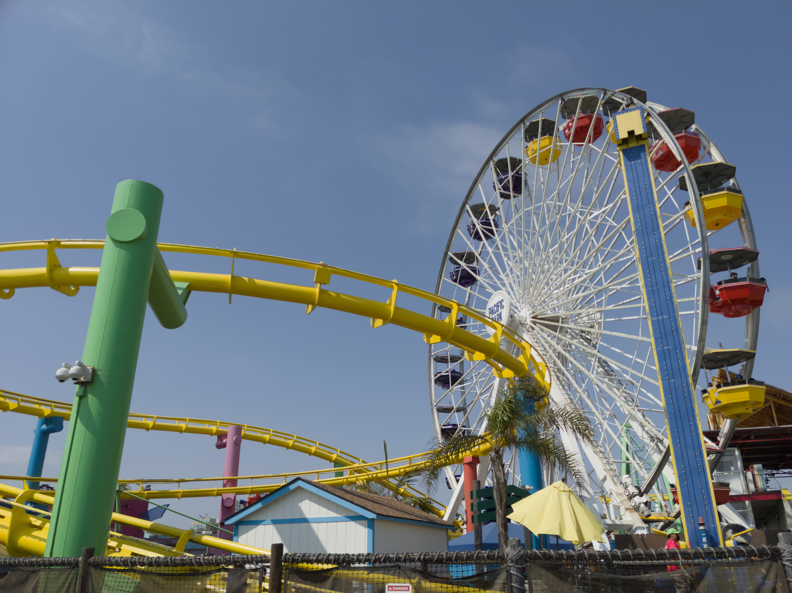
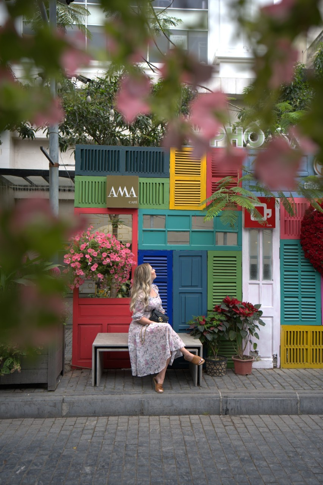
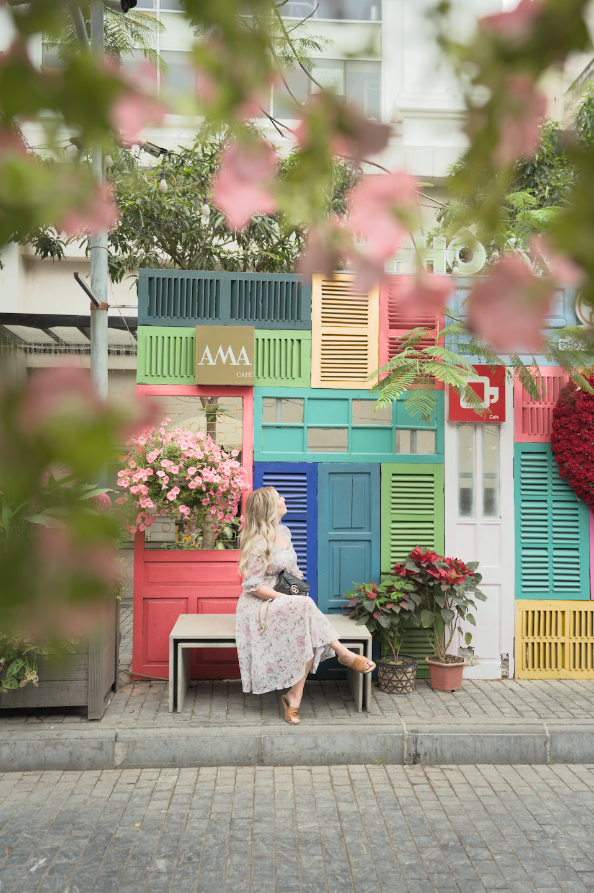

January 8, 2020 [Nishchal Bhandari](https://nishchalb.github.io/) [Original posted here.](https://nishchalb.github.io/posts/dt_pastel/)

Pastel colors are a useful tool to have in your photography toolkit. Editing images with this style can help you take advantage of
bright harsh light, lack of shadows, and colorful elements. 

What is a pastel color? Wikipedia says they have "high value and low saturation". With paint, you can achieve them by "mixing white" with your standard colors. But how can we do this in darktable?

To understand how we can accomplish this, its helpful to look at the [diagrams in the darktable manual on color dimensions.](https://docs.darktable.org/usermanual/development/en/special-topics/color-management/color-dimensions/). In particular, this image is very helpful:

Note that what many other softwares call "saturation", darktable correctly calls "chroma". The colors we are after have high lightness, and relatively low chroma. 

## Steps

First, it's helpful to start out with an image that suits the style. Flickr user [Matthias Heiderich](https://www.flickr.com/photos/weirdandwired/) has many great examples. Ideally you want something brightly lit, with minimal shadows, and colorful colors.

We are going to start with an image I took of a colorful amusement park on a bright day:

### Exposure

I shot the image exposing for the highlights to protect them. Let's bring them up now in the `Exposure` module:

### Color Balance

Next, we will use the `Color Balance RGB` module. This is very powerful module that can help you accomplish many different effects, so
I highly encourage taking a look at the [documentation for it](https://docs.darktable.org/usermanual/development/en/module-reference/processing-modules/color-balance-rgb/). We are going to use it to accomplish almost everything else!

Remember the color dimension diagram from earlier? To reach the pastel colors, we have two options. We could either

 - Decrease chroma and increase lightness, or
 - Decrease saturation and increase brilliance

I find the latter controls move more naturally in the colorspace for me, so I will use them here:

#### Color Balance: 4 ways

I want to push my image into the brighter tonal range, so I increase the luminance in all tonal regions. I also add some color to the shadows and higlights to make the image feel more colorful all around:

### Filmic

By increasing brilliance and higlights, we've lost some detail in the bright parts near the center of the ferris wheel. But, we can easily reign those higlights in (and further brighten the shadows) by increasing the range of the `filmic rgb` module.

### Color Balance: Blues

We have a much more pastel image than our starting point already, but it's alo typical for the blues in these images to be shiften teal. We can also use the `Color Balance RGB` module to accomplish this.

We can use darktable's powerful masking features to target the blues in our image:

And then use the `hue shift` slider to move our blues towards teal. I also repeated the previous process (decreasing saturation, increasing brilliance) for specifically the blues:

And we're done! It's amazing how simple this actually is in darktable, most of our work was done using just the `Color Balance RGB` module. Here's a before and after:

As another example, I repeated these steps on the image `tag @ryanbreitkreutz - free raws from @signatureeditsco DSC01513` from [Signature Edits](https://www.signatureedits.com/free-raw-photos/).

Before:

After:

And here is the [sidecar file](tag_@ryanbreitkreutz_free_raws_from_signatureeditsco_DSC01513.ARW.xmp) if you wanted to experiment with it in darktable.

