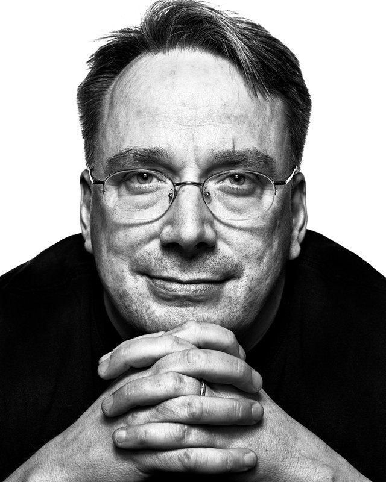
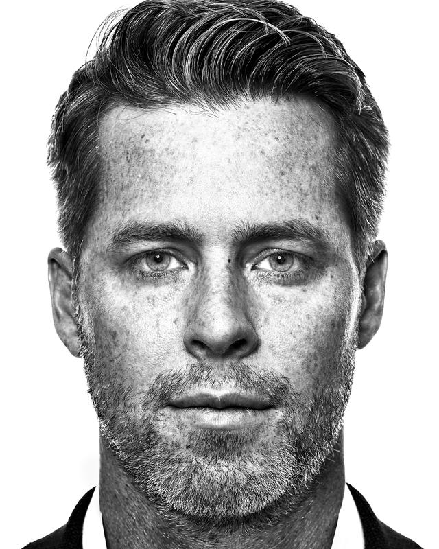
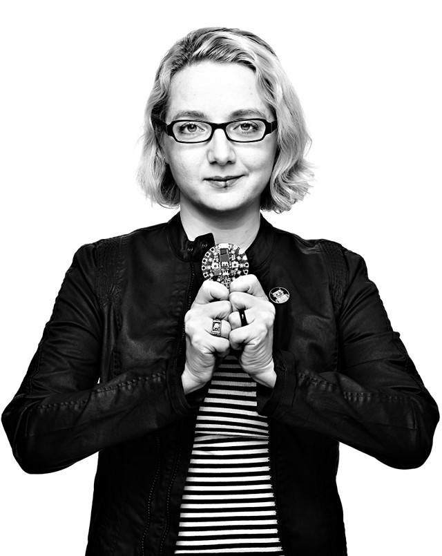

Recently, [@houz][] [posted about][] an amazing project by photographer [Peter Adams][] called **[Faces of Open Source][]**.

Peter really <small>_(ahem)_</small> throws a light on many amazing luminaries from not only the Free/Open Source Software community, but in some cases the history and roots of all modern computing.
He has managed to coordinate portrait sessions with many people that may be unassuming to a layperson, but take a moment to read any of the short bios on the site and the gravity of the contributions from the subjects to modern computing becomes apparent.

It's easy for non-technical folks to spot a Bill Gates or Steve Jobs, but what about those who invented [the most-used programming language][ritchie], created [the web server][behlendorf] that runs the majority of the internet, or [mapped the human genome][kent]?

<figure class='big-vid'>

<figcaption>
(From L-R): [Dennis Ritchie][ritchie], [Brian Behlendorf][behlendorf], and [Jim Kent][kent]
</figcaption>
</figure>

[ritchie]: http://facesofopensource.com/bill-and-john-ritchie/ "Dennis Ritchie"
[behlendorf]: http://facesofopensource.com/brian-behlendorf-2/ "Brian Behlendorf"
[kent]: http://facesofopensource.com/jim-kent/ "Jim Kent"

He is acutely aware that his subjects represent an important part of the [history of Open Source][], and 
in his [artist statement][] for the project he notes:

> This project is my attempt to highlight a revolution whose importance is not broadly understood by a world that relies heavily upon the fruits of its labor.

[@houz]: https://houz.org/ "houz.org"
[posted about]: https://discuss.pixls.us/t/faces-of-open-source/4772 "Discuss post about Faces of Open Source"
[Peter Adams]: http://www.peteradamsphoto.com/ "Peter Adams Photography"
[Faces of Open Source]: http://facesofopensource.com/ "Faces of Open Source"
[artist statement]: http://facesofopensource.com/artist-statement/ "Peter's Artist Statement"
[history of Open Source]: https://en.wikipedia.org/wiki/History_of_free_and_open-source_software "History of Free and Open Source Software at Wikipedia"

That's really what Peter has done here.
He has collected individuals whose contributions all add up to something far greater than their collective sums to shape the digital world many take for granted these days, and is presenting them in a powerful and thoughtful way more befitting their gifts.

<figure>
    
</figure>

## A Chat with Peter Adams
I was lucky enough to be able to get a little bit of time with Peter recently, and with some help from the community had a few questions to present to him.
He was kind enough to take some time out of his day and be patient while I prattled on...

<figure>

<figcaption>
[Linus Torvalds][], Santa Fe, New Mexico, 2016 by Peter Adams
</figcaption>
</figure>

[Linus Torvalds]: http://facesofopensource.com/linus-torvalds/ "Linus Torvalds by Peter Adams"

### What was the motivation for this particular project for you? Why these people?

I had a long career working in the tech industry, and kind of grew up on a lot of this software when I was in college.  
Then got to apply it throughout a career as senior technologist or CTO at a bunch of different companies in the valley. 
So I went from learning about it in college, to being someone that used it, to then being somebody that contributed to it and starting my own open source project back in 2006.
That open source ethos, the software, and the people that created, maintained and promoted it - it's something that's been right there in my face for, really, the last 25 years.

I wanted to marry my knowledge of it with my passion for photography, and shine a light on it.
I went through a few different chapters of the story myself in the 80's and then the mid-90's with linux.
I kind of felt like the story was starting to slip into obscurity, not because it's less important - in fact  I think it's more important now than it's ever been.

The software is actually used by more people now than it has ever been.
The smartphone revolution, mobile, has brought that to a forefront and all of these mobile platforms are based on this open source technology.
Everything Apple does is based on BSD, and everything Google/Android does is based on Linux.

I feel like it's a more impactful story now than ever, but very few people are telling the story.
As a photographer I've always cringed at the photographic response to the story.
Podium shot after podium shot of these incredible people.

So I wanted to put some faces to names, bring these people to life in a more impactful way than I think anyone has done before.  Hopefully that's what the project is doing!

**P: It absolutely does!**

<figure>

<figcaption>
[Brian Kernighan][], New York City, 2015 by Peter Adams
</figcaption>
</figure>

[Brian Kernighan]:http://facesofopensource.com/brian-kernighan/ "Brian Kernighan by Peter Adams"

### How long have you been shooting the project?

I started this project in 2013/2014, in earnest probably late 2014.

### Of all of the people that you've shot, I'm curious, who would you say is one that maybe stuck out with you the most, or even better, did you get any cool stories out of some of the subjects?

Everyone that I've photographed has been absolutely wonderful. I mean, that's the first thing about this community: it's a very gracious community.
Everybody was very gracious with their time, and eager to participate.
I think people recognize that this is a community they belong to and they really want me to be a part of it, which is really great.

So, I enjoyed my time with everybody.
Everybody brought a different, interesting story about things.
The UNIX crew from Bell Labs had particularly colorful stories, very interesting sort of historical tidbits about UNIX and Free Software.

I talked to Ken Thompson about going to Russia and flying MIGs right after the collapse of the Soviet Union.
Wonderful stories from Doug McIlroy about the team and the engineering - how they worked together at Bell labs.
Just a countless list of cool stories and cool people for sure.

<figure>

<figcaption>
[Ken Thompson][], Menlo Park, California, 2016 by Peter Adams
</figcaption>
</figure>

<figure>

<figcaption>
[Doug McIlroy][], Boston, Massachusetts, 2015 by Peter Adams
</figcaption>
</figure>

[Ken Thompson]: http://facesofopensource.com/ken-thompson-2/ "Ken Thompson by Peter Adams"
[Doug McIlroy]: http://facesofopensource.com/doug-mcilroy-2/ "Doug McIlroy by Peter Adams"

**P: It must have been fascinating!**

It's been really fun. A lot of these folks, I've really looked up to them over the years as sort of heroes, and so when you get people in front of your lens like that, it's a really wonderful experience.
It's also a challenging experience because you want to do justice to them.
Many of these folks that I've thought about for 20+ years, finally getting to shoot them is a real treat.

### Where are you shooting these?  Are you mostly bringing them into your studio in the valley? 

I shot a lot of people when I had a studio in Silicon Valley.
I brought a lot of people there and that was great.
Now typically I'm doing shoots on the coasts.
So I'll do shoots in NY and I'll rent a studio and bring 6 or 7 people in there or we'll do a studio up in SF for some people.
But I've done shoots in back alleyways, I've done shoots in tiny little conference rooms, 
I'll bring the studio to people if that's what I have to do.
So I'd say so far it's been about 50-50.

### The lighting setups are wonderful and do justice to the subjects, and I think somebody in the community was curious if you had decided on B&W from the beginning for this series of photos?  Was this a concious decision early on?  

B&W on a white background was a concious choice right from the beginning.
Knowing the group, I felt like that was going to be the best way to explore the people and the faces.
Every one of these faces just tells, I think, a really interesting story.
I try to bring the personality of the person into the photo, and B&W has always been my favorite way to do that.
The white background just puts the emphasis right on the person.

<figure>

<figcaption>
[Camille Fournier][], New York City, 2017 by Peter Adams
</figcaption>
</figure>

[Camille Fournier]: http://facesofopensource.com/camille-fournier/ "Camille Fournier by Peter Adams"

### How much of it would you say is you that goes into the final pose and setup of the person, or do you let the subject feel out the room and get comfortable and shoot from there?

It's a little bit of both.
I wish I got to spend a lot of time up front with the person before we started shooting, but the way everybody's schedule worked is - none of these shoots are more than an hour and many of them are much shorter than an hour.
There's definitely the pleasantries up front and talking for a little bit, but then I try to get people right in front of the camera as quick as possible.

I don't really pose them.
My process is to sit back and observe, and I always tell people _"if I'm not taking photos, it's not because you're doing anything wrong - I'm just waiting for you to settle or looking, examining"_.
Which is, for most people, a really uncomfortable process, I try to make it as comfortable as possible.
Then we'll start taking pictures.
I may move them a little bit, or we may setup a table so they can rest their hand on their chin or something like that.
Generally the photos that come out are not pre-meditated.

It's very rare that I go into any of these shoots with an actual _"I want the person like this, setup like that, etc..."_.
I'd say 99% of these shots, the expressions, the feeling that comes out, that I'm capturing is organic.
It's something that comes up in the shoot.
I just try to capture it whenever I see it by clicking the shutter, that's basically what I'm doing there.

### Do you use Free Software in your normal photographic workflow at all?

I don't use as much Free Software as I'd like in my own workflow.
My workflow, because I shoot with Phase One, the files go into Capture One and then from there they go into Photoshop for final edits.
I have used GIMP in the past.
I really would like to use more Free Software, so I'm a learner in that regard for what tools would make sense.

<figure>
    
    <figcaption>
    [Spencer Kimball][] (co-creator of GIMP), Menlo Park, 2015 by Peter Adams
    </figcaption>
</figure>

<figure>
    
    <figcaption>
    [Peter Mattis][] (co-creator of GIMP), New York City, 2015 by Peter Adams
    </figcaption>
</figure>

[Spencer Kimball]: http://facesofopensource.com/spencer-kimball/ "Spencer Kimball by Peter Adams"
[Peter Mattis]: http://facesofopensource.com/peter-mattis-3/ "Peter Mattis by Peter Adams"

### Did that habit grew out of the professional need of having those tools available to you?

Phase One, which makes the Medium Format digital back and camera that I use for all of my portrait work, also makes Capture One.
They have basically customized the software to get the most of their own files.
That's pretty much why I've wound up there instead of Lightroom or another tool.
It's just that that software tends to bring out the tonality, especially in the B&W side, better I've found than any other tool.

### This project was self financed to start with?

Yes, this is a self-financed project.
I do hope that we'll get some sponsors, especially for the book, just because it tends to be a pretty heavy upfront outlay to produce a book.
I'm going to think about things like Kickstarter but the corporate sponsors I think will be really helpful for the exhibits and the book.

### Speaking of the book, is it ready - have you already gone to print?

No, the book isn't ready yet.
I still have probably another 10-12 people that I need to photograph and then we'll start producing it.
I've done some prototypes and things on it but it's still a little bit of a ways away.
The biggest hurdle on this project is actually scheduling and logistics.
Getting access to people in a way that is economical.
Instead of me flying all over the place for one shot, I try to stack up a number of people into a day.
It's tough - this is a busy crowd, very in demand.

<figure class='big-vid'>
    
</figure>

### Did your working in open source teach you anything beyond computer code in some way?  Was there an influence from the people you may have worked around, or the ethos of Free Software in general that stuck with you? Working with this crowd, was there a takeaway for you beyond just the photographic aspects of it?  

Absolutely! 
First of all it's an incredibly inspiring group of people.
This is a group of people that have dedicated, in some cases most of, their lives to the development of software that they give away to the world, and don't monetize themselves.
The work they're doing is effectively a donation to humanity.
That's incredibly inspiring when you look at how much time goes into these projects and how much time this group of people spends on that.
It's a very humbling thing.

I'd say the other big lesson is that Open Source is such a unique thing.
There's really nothing like it.
It's starting to take over other industries and moving beyond just software - it's gone into hardware.
I've started to photograph some of the open source hardware pioneers.
It's going into bio-tech, pharmaceuticals, agriculture (there's an open source seed project).
I think that the lessons that are learned here and that this group of people is teaching is really affecting humanity on a much much larger level than the fact that this stuff is powering your cell phone or is powering your computer.

<figure>
    
    <figcaption>
    [Limor Fried][], New York City, 2017 by Peter Adams
    </figcaption>
</figure>

[Limor Fried]: http://facesofopensource.com/limor-fried-2/ "Limor Fried by Peter Adams"

Open source is really sort of a way of doing business now.
Even more than doing business it's a way of operating in the world.
More and more people, industries, and companies are choosing that.
In today's world where all you read is bad news, that's a lot of really good news.
It's an awesome thing to see that accelerating and catching on.
It's been incredibly inspiring to me.

**P: I think even all the way back to the Polio vaccine, is one of those things. The effect that it had on humanity was immeasurable, and the fact that it wasn't monetized by Salk was amazing.**

Look at how many lives were saved because of that.
If you think about the acceleration of the innovation we've had just in the technology sector - could things like the iPhone or the Android operating system - would these things have happened now, or over the last decade, without this [open source], or would we be looking at those types of innovations happening twenty years from now?
I think that's a question you have to ask.

I don't think it's an obvious answer that Apple or Google or somebody else would have just come up with this without the open source [contributions].
This stuff is so fundamental, it's such a basic building block for everything that's happening now.
It may be responsible for the golden age that we're seeing now.
I think it is.

The average teenager they pick up and post a photo to Instagram - they don't realize that there's a hundred open source projects at work to make that possible.

**P: And the fact that the people that underlay that entire stack gave it away.**

Right.
And that giving it away was necessary to create the Instagrams to create all these networks.
It wasn't just this happenstance thing where people didn't know any better.
In some cases obviously that did exist, but it's the fact that consciously people are contributing into a commons that makes it so powerful and enables all of this innovation to happen.
It's really cool.

### To close, is there another photographer, book, organization - that you'd like any of the readers to know about and maybe spend some time to go and check out. Something that maybe you've long admired or recently discovered?

Sure!
You've mentioned Martin Schoeller, who is one of my personal favorites and inspirations out there.
I'd say the other photographer who has had probably the most impact on my photography over the years has been Richard Avedon.
For people that aren't familiar with his work I'd say definitely go check out the Avedon foundation.
Pick up any of his books which are just wonderful.
You'll definitely see that influence on my photography, especially this project, since he shot black and white on white background.
Such stunning work.
I'd say that those are two great ones to start with.

**Alright!  Avedon and Schoeller - I can certainly think of worse people to go start a journey with.  Thank you so much for taking time with me today!**

Hey no problem!  It's been fun to talk to you.

---

<small>All images from “[Faces of Open Source][]” by [Peter Adams][], licensed [CC BY NC SA 4.0][].</small>

[CC BY NC SA 4.0]: http://creativecommons.org/licenses/by-nc-sa/4.0/ "Creative Commons Attribution-NonCommercial-ShareAlike 4.0"
