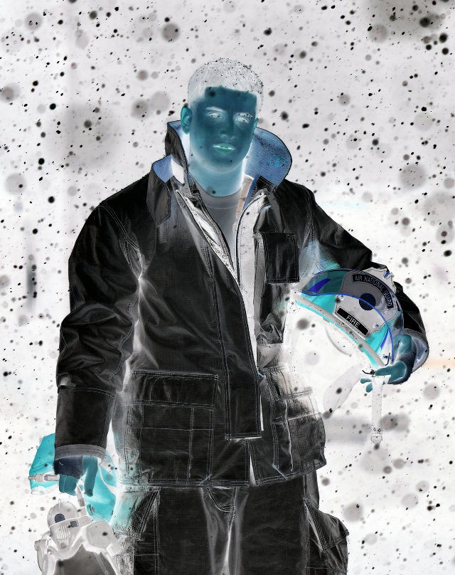
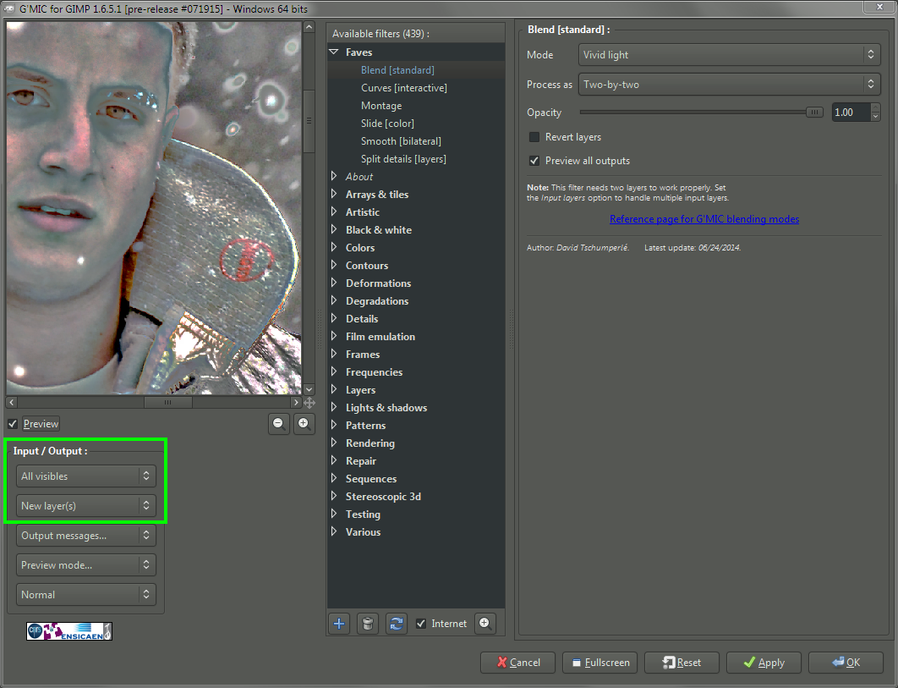

German photographer/digital artist/photoshop trainer [Calvin Hollywood](http://www.calvinhollywood-blog.com) has a rather unique style to his photography. It's a sort of edgy, gritty, hyper-realistic result, almost a blend between illustration and photography.

<figure>

</figure>

As part of one of his courses, he talks about a technique for accentuating details in an image that he calls "Freaky Details".  

Here is Calvin describing this technique using Photoshop:

<iframe width="560" height="315" src="https://www.youtube.com/embed/ZV9u0Wu8L0M" frameborder="0" allowfullscreen=""></iframe>

In my meandering around different retouching tutorials I came across it a while ago, and wanted to replicate the results in [GIMP](http://www.gimp.org) if possible. There were a couple of problems that I ran into for replicating the exact same workflow:  

1.  Lack of a "Vivid Light" layer blend mode in GIMP
2.  Lack of a "Surface Blur" in GIMP

Those problems have been rectified (and I have more patience these days to figure out what exactly was going on), so let's see what it takes to replicate this effect in GIMP!

## Replicating Freaky Details

### Requirements

The only extra thing you'll need to be able to replicate this effect is [G'MIC for GIMP](http://gmic.eu/).

You don't _technically_ need G'MIC to make this work, but the process of manually creating a **Vivid Light** layer is tedious and error-prone in GIMP right now.
Also, you won't have access to G'MIC's Bilateral Blur for smoothing. 
And, seriously, it's G'MIC - you should have it anyway for all the other cool stuff it does!

### Summary of Steps

Here's the summary of steps we are about to walk through to create this effect in GIMP:  

1.  Duplicate the background layer.
2.  Invert the colors of the top layer.
3.  Apply "Surface Blur" to top layer.
4.  Set top layer blend mode to "Vivid Light".
5.  New layer from visible.
6.  Set layer blend mode of new layer to "Overlay", hide intermediate layer.

There are just a couple of small things to point out though, so keep reading to be aware of them!  

### Detailed Steps

I'm going to walk through each step to make sure it's clear, but first we need an image to work with!  

As usual, I'm off to [Flickr Creative Commons](http://www.flickr.com/creativecommons) to search for a [CC licensed](https://creativecommons.org/ "Creative Commons") image to illustrate this with. 
I found an awesome portrait taken by the [U.S. National Guard/Staff Sergeant Christopher Muncy](https://www.flickr.com/photos/thenationalguard/):

<figure>

<figcaption>
[New York National Guard](https://www.flickr.com/photos/thenationalguard/15941126053) by [U.S. National Guard/Staff Sergeant Christopher Muncy](https://www.flickr.com/photos/thenationalguard/) 
on Flickr (<a href="https://creativecommons.org/licenses/by/2.0/" title="Creative Commons Attribution">cb</a>). 
Airman First Class Anthony Pisano, a firefighter with the New York National Guard's 106th Civil Engineering Squadron, 106th Rescue Wing conducts a daily equipment test during a major snowstorm on February 17, 2015. 
(New York Air National Guard / Staff Sergeant Christopher S Muncy / released)
</figcaption>
</figure>

This is a great image to test the effect, and to hopefully bring out the details and gritty-ness of the portrait.  

#### 1./2\. Duplicate background layer, and invert colors

So, duplicate your base image layer (Background in my example).  

Layer → Duplicate  
 (Shift-Ctrl-D,Shift-⌘-D)

I will usually name the duplicate layer something descriptive, like **"Temp"** ;).  

Next we'll just invert the colors on this **"Temp"** layer.  

Colors → Invert

So right now, we should be looking at this on our canvas:  

<figure>

<figcaption>
The inverted duplicate of the base layer.
</figcaption>
</figure>

<figure>

<figcaption>
What the Layers dialog should look like.
</figcaption>
</figure>

Now that we've got our inverted **"Temp"** layer, we just need to apply a little blur.  

#### 3\. Apply "Surface Blur" to Temp Layer

There's a couple of different ways you could approach this. Calvin Hollywood's tutorial explicitly calls for a Photoshop **Surface Blur**. I think part of the reason to use a **Surface Blur** vs. **Gaussian Blur** is to cut down on any halos that will occur along edges of high contrast.  

There are three main methods of blurring this layer that you could use:  

1.  Straight Gaussian Blur (easiest/fastest, but may halo - worst results)  

    Filters → Blur → Gaussian Blur

2.  Selective Gaussian Blur (closer to true "Surface Blur")  

    Filters → Blur → Selective Gaussian Blur

3.  G'MIC's Smooth [bilateral] (closest to true "Surface Blur")  

    Filters → G'MIC → Repair → Smooth [bilateral]

I'll leave it as an exercise for the reader to try some different methods and choose one they like. (At this point I personally pretty much just always use G'MIC's Smooth [bilateral] - this produces the best results by far).  

For the Gaussian Blurs, I've had good luck with radius values around 20% - 30% of an image dimension. As the blur radius increases, you'll be acting more on larger local contrasts (as opposed to smaller details) and run the risk of halos. So just keep an eye on that.  

So, let's try applying some G'MIC Bilateral Smoothing to the **"Temp"** layer and see how it looks!  

Run the command:  

Filters → G'MIC → Repair → Smooth [bilateral]

<figure class='big-vid'>

<figcaption>
The values I used in this example for Spatial/Value Variance.
</figcaption>
</figure>

The values you want to fiddle with are the Spatial Variance and Value Variance (25 and 20 respectively in my example). You can see the values I tried for this walkthrough, but I encourage you to _experiment a bit on your own as well_!  

Now we should see our canvas look like this:  

<figure >

<figcaption>
Our **"Temp"** layer after applying G'MIC Smoothing [bilateral]
</figcaption>
</figure>

<figure>

<figcaption>
Layers should still look like this.
</figcaption>
</figure>

Now we just need to blend the **"Temp"** layer with the base background layer using a **"Vivid Light"** blending mode...  

#### 4./5\. Set *Temp* Layer Blend Mode to *Vivid Light* & New Layer

Now we need to blend the **"Temp"** layer with the Background layer using a **"Vivid Light"** blending mode. Lucky for me, I'm friendly with the G'MIC devs, so I asked nicely, and [David Tschumperlé](https://tschumperle.users.greyc.fr/) added this blend mode for me.  

So, again we start up G'MIC:  

Filters → G'MIC → Layers → Blend [standard] - Mode: Vivid Light

<figure class='big-vid'>

<figcaption>
G'MIC **Vivid Light** blending mode, pay attention to Input/Output!
</figcaption>
</figure>

Pay careful attention to the Input/Output portion of the dialog. You'll want to set the **Input Layers** to **All visibles** so it picks up the **Temp** and **Background** layers. You'll also probably want to set the **Output** to **New layer(s)**.  

When it's done, you're going to be staring at a very strange looking layer, for sure:  

<figure> 

<figcaption>
Well, sure it looks weird out of context...
</figcaption>
</figure>

<figure> 

<figcaption>
The layers should now look like this.
</figcaption>
</figure>

Now all that's left is to hide the **"Temp"** layer, and set the new **Vivid Light** result layer to **Overlay** layer blending mode...  

#### 6\. Set Vivid Light Result to Overlay, Hide *Temp* Layer

We're just about done. Go ahead and hide the **"Temp"** layer from view (we won't need it anymore - you could delete it as well if you wanted to).  

Finally, set the G'MIC **Vivid Light** layer output to **Overlay** layer blend mode:  

<figure> 

<figcaption>
Set the resulting G'MIC output layer to **Overlay** blend mode.
</figcaption>
</figure>

The results we should be seeing will have enhanced details and contrasts, and should look like this (mouseover to compare the original image):  

<figure> 

<figcaption>
Our final results (whew!) 
(click to compare to original)
</figcaption>
</figure>

This technique will emphasize any noise in an image so there may be some masking and selective application required for a good final effect.

### Summary

This is not an effect for everyone. I can't stress that enough. It's also not an effect for every image. But if you find an image it works well on, I think it can really do some interesting things. It can definitely bring out a very dramatic, gritty effect (it works well with nice hard rim lighting and textures).  

The original image used for this article is another great example of one that works well with this technique:

<figure> 

<figcaption>
[After a Call](http://www.flickr.com/photos/shakeskc/6519028411/) by [Mark Shaiken](http://markshaiken.com/) on Flickr. (<a href="https://creativecommons.org/licenses/by-nc-sa/2.0/" title="Creative Commons Attribution Non-Commercial Share-Alike">cbna</a>)
</figcaption>
</figure>

I had muted the colors in this image before applying some Portra-esque color curves to the final result..

Finally, a **BIG THANK YOU** to [David Tschumperlé](https://tschumperle.users.greyc.fr/) for taking the time to add a **Vivid Light** blend mode in G'MIC.  

Try the method out and let me know what you think or how it works out for you! And as always, if you found this useful in any way, please share it, pin it, like it, or whatever you kids do these days...  

This tutorial was originally published [here](http://blog.patdavid.net/2013/02/calvin-hollywood-freaky-details-in-gimp.html).
