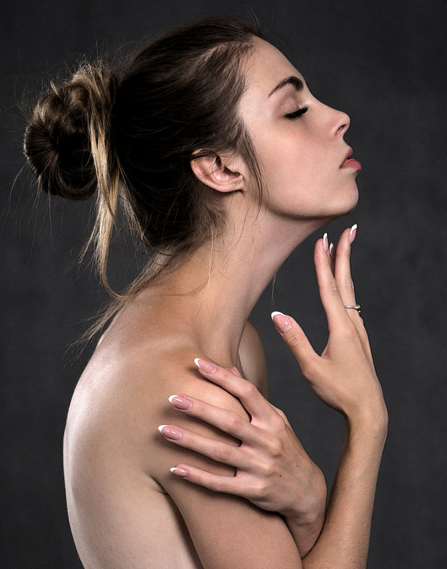

Over in [the forums][dpu] community member [Sebastien Guyader][] (@sguyader) posted a neat workflow for emulating a photo-illustrative look popularized by photographers like [Dave Hill][] where the resulting images often seem to have a sort of hyper-real feeling to them. Some of this feeling comes from a local-contrast boost and slight 'blooming' of the lighter tones in the image (though arguably most of the look is due to lighting and compositing of multiple elements).

To illustrate, here are a few representative samples of Dave Hill's work that reflects this feeling:

<figure>
<a href='http://davehillphoto.com/classics-2005-2010/4sj9tswggio55wowsdzl7vtflvfjm4'>
    
</a>
<a href='http://davehillphoto.com/classics-2005-2010/c8kqlov3w2osl8yvtqvro0ckl12q6m'>
    
</a>
<a href='http://davehillphoto.com/classics-2005-2010/yg988exvuge6ek4290vge1s4rarujf'>
    
</a>
<a href='http://davehillphoto.com/classics-2005-2010/4bt8vpcqi2vi1k8eve575sb861xk4m'>
    
</a>
<figcaption>
A collection of example images. &copy;[Dave Hill][]
</figcaption>
</figure>

A video of Dave presenting on how he brought together the idea and images for the series the first image above is from:

<div class='fluid-vid'>
<iframe width="560" height="315" src="https://www.youtube.com/embed/zSGY_N2Z_y0" frameborder="0" allowfullscreen></iframe>
</div>

This effect is also popularized in Photoshop<sup><small>®</small></sup> filters such as [LucisArt][] in an effort to attain what some would (_erroneously_) call an "HDR" effect.  Really what they likely mean is a not-so-subtle tone-mapping. In particular the exaggerated local contrasts is often what garners folks attention.

We had [previously posted][freaky] about a method for exaggerating fine local contrasts and details using the ["Freaky Details"][freaky] method described by Calvin Hollywood. This workflow provides a similar idea but different results that many might find more appealing (it's not as _gritty_ as the Freaky Details approach).

Sebastien produced some great looking preview images to give folks a feeling for what the process would produce:

<figure class='big-vid'>


<figcaption>
Images from [pixabay][] ([CC0, public domain][CC0]): [Motorcycle][], [car][], [woman][].
</figcaption>
</figure>

[CC0]: https://creativecommons.org/publicdomain/zero/1.0/deed.en "Creative Commons Zero - Public Domain"
[pixabay]: https://pixabay.com
[Motorcycle]: https://pixabay.com/en/bmw-vehicle-ride-bike-journey-1313343/
[car]: https://pixabay.com/en/ifa-f9-oldtimer-pkw-ddr-1661767/
[woman]: https://pixabay.com/en/fashion-woman-beauty-leisure-model-1636868/

## Replicating a "Dave Hill"/"LucasArt" effect

Sebastien's approach relies only on having the always useful [G'MIC][] plugin for [GIMP][]. The general workflow is to do a high-pass frequency separation, and to apply some effects like local contrast enhancement and some smoothing on the residual low-pass layer.  Then recombine the high+low pass layers to get the final result.

1. Open the image.
2. Duplicate the base layer.  
Rename it to _"Lowpass"_.
3. With the top layer (_"Lowpass"_) active, open G'MIC.
4. Use the _Photocomix smoothing_ filter:
<p><span class="Cmd">Testing → Photocomix → Photocomix smoothing</span></p>
Set the **Amplitude** to **10**. Apply.  
This is to taste, but a good startig place might be around 1% of the image dimensions (so a 2000px wide image - try using an Amplitude of 20).
5. Change the _"Lowpass"_ layer blend mode to _Grain extract_.
6. Right-Click on the layer and choose _New from visible_.  
Rename this layer from "_Visible_" to something more memorable like _"Highpass"_ and set its layer mode to _Grain merge_.  
Turn off this layer visibility for now.
7. Activate the _"Lowpass"_ layer and set its layer blend mode back to _Normal_.  
The rest of the filters are applied to this _"Lowpass"_ layer.
8. Open G'MIC again.  
Apply the _Simple local contrast_ filter:
<p><span class="Cmd">Details → Simple local contrast</span></p>
Using:
    * __Edge Sensitivity__ to __25__
    * __Iterations__ to __1__
    * __Paint effect__ to __50__
    * __Post-gamma__ to __1.20__  
9. Open G'MIC again.  
Now apply the _Graphic novel_ filter:
<p><span class="Cmd">Artistic → Graphic novel</span></p>
Using:
    * check the __Skip this step__ checkbox for __Apply Local Normalization__
    * __Pencil size__ to __1__
    * __Pencil amplitude__ to __100-200__
    * __Pencil smoother sharpness/edge protection/smoothness__  
        to __0__
    * Boost merging options __Mixer__ to __Soft light__
    * __Painter's touch sharpness__ to __1.26__
    * __Painter's edge protection flow__ to __0.37__
    * __Painter's smoothness__ to __1.05__
10. Finally, make the _"Highpass"_ layer visible again to bring back the fine details.


### Trying It Out!

Let's walk through the process. Sebastien got his sample images from the website https://pixabay.com, so I thought I would follow suit and find something suitable from there also.  After some searching I found this neat image from Jerzy Gorecki licensed [Create Commons 0/Public Domain][CC0].

<figure>

<figcaption>
The base image ([link][download]).  
From [pixabay][], ([CC0 - Public Domain][CC0]): Jerzy Gorecki.
</figcaption>
</figure>

[download]: https://pixabay.com/en/girl-hands-the-act-of-portrait-1527959/


#### Frequency Separation
The first steps (1&mdash;7) are to create a High/Low pass frequency separation of the image.  If you have a different method for obtaining the separation then feel free to use it.  Sebastien uses the Photocomix smoothing filter to create his low-pass layer (other options might be Gaussian blur, bi-lateral smoothing, or even wavelets).

The basic steps to do this are to duplicate the base layer, blur it, then set the layer blend mode to __Grain extract__ and create a new layer from visible. The new layer will be the Highpass (high-frequency) details and should have its layer blend mode set to __Grain merge__.  The original blurred layer is the Lowpass (low-frequency) information and should have its layer blend mode set back to __Normal__.

So, following Sebastien's steps, duplicate the base layer and rename the layer to "lowpass".  Then open G'MIC and apply:

<p><span class="Cmd">Testing → Photocomix → Photocomix smoothing</span></p>

with an amplitude of around 20. Change this to suit your own taste, but about 1% of the image width is a decent starting point.  You'll now have the base layer and the "lowpass" layer above it that has been smoothed:

<figure>

<figcaption>
"lowpass" layer after Photocomix smoothing with **Amplitude** set to 20.
</figcaption>
</figure>

Setting the "lowpass" layer blend mode to __Grain extract__ will reveal the high-frequency details:

<figure>


<figcaption>
The high-frequency details visible after setting the blurred "lowpass" layer blend mode to __Grain extract__.
</figcaption>
</figure>

Now create a new layer from what is currently visible.  Either right-click the "lowpass" layer and choose "New from visible" or from the menus:

<p><span class="Cmd">Layer → New from Visible</span></p>

Rename this new layer from "Visible" to "highpass" and set its layer blend mode to __Grain merge__.  Select the "lowpass" layer and set its layer blend mode back to __Normal__.

<figure>

</figure>

The visible result should be back to what your starting image looked like.
The rest of the steps for this tutorial will operate on the "lowpass" layer.
You can leave the "highpass" filter visible during the rest of the steps to see what your results will look like.


#### Modifying the Low-Frequency Layer

These next steps will modify the underlying low-frequency image information to smooth it out and give it a bit of a contrast boost. First the "Simple local contrast" filter will separate tones and do some preliminary smoothing, while the "Graphic novel" filter will provide a nice boost to light tones along with further smoothing.


#### Simple Local Contrast

On the "lowpass" layer, open [G'MIC][] and find the "Simple local contrast" filter:

<p><span class="Cmd">Details → Simple local contrast</span></p>

Change the following settings:
* __Edge Sensitivity__ to __25__
* __Iterations__ to __1__
* __Paint effect__ to __50__
* __Post-gamma__ to __1.20__  

This will smooth out overall tones while simultaneously providing a nice local contrast boost. This is the step that causes small lighting details to "pop":

<figure>

<figcaption>
After applying the "Simple local contrast" filter.  
(Click to compare to the original image)
</figcaption>
</figure>

The contrast increase provides a nice visual punch to the image. The addition of the "Graphic novel" filter will push the overall image much closer to a feeling of a photo-illustration.


#### Graphic Novel
Still on the "lowpass" layer, re-open [G'MIC][] and open the "Graphic Novel" filter:

<p><span class="Cmd">Artistic → Graphic novel</span></p>

Change the following settings:

* check the __Skip this step__ checkbox for __Apply Local Normalization__
* __Pencil size__ to __1__
* __Pencil amplitude__ to __100-200__
* __Pencil smoother sharpness/edge protection/smoothness__  
    to __0__
* Boost merging options __Mixer__ to __Soft light__
* __Painter's touch sharpness__ to __1.26__
* __Painter's edge protection flow__ to __0.37__
* __Painter's smoothness__ to __1.05__

The intent with this filter is to further smooth the overall tones, simplify details, and to give a nice boost to the light tones of the image:

<figure>

<figcaption>
After applying the "Graphic novel" filter.  
(Click to compare to the original image)
</figcaption>
</figure>

The effect at 100% opacity can be a little strong.  If so, simply adjust the opacity of the "lowpass" layer to taste. In some cases it would probably be desirable to mask areas you don't want the effect applied to.

I've included the GIMP .xcf.bz2 file of this image while I was working on it for this article.  You can [**download the file here**](girl-hands-the-act-of-portrait-1527959-full.xcf.bz2) (34.9MB). I did each step on a new layer so if you want to see the results of each effect step-by-step, simply turn that layer on/off:

<figure>

<figcaption>
Example XCF layers
</figcaption>
</figure>

Finally, a great big **Thank You!** to Sebastien Guyader (@sguyader) for [sharing this with everyone][sharing] in the community!

[sharing]: https://discuss.pixls.us/t/heres-some-kind-lucisart-processing-using-gmic-filters/


#### A G'MIC Command
Of course, this wouldn't be complete if someone didn't come along with the direct [G'MIC][] commands to get a similar result!  And we can thank Iain Fergusson (@Iain) for coming up with the commands:

```
--gimp_anisotropic_smoothing[0] 10,0.16,0.63,0.6,2.35,0.8,30,2,0,1,1,0,1

-sub[0] [1]

-simplelocalcontrast_p[1] 25,1,50,1,1,1.2,1,1,1,1,1,1
-gimp_graphic_novelfxl[1] 1,2,6,5,20,0,1,100,0,1,0,0.78,1.92,0,0,2,1,1,1,1.26,0.37,1.05
-add
-c 0,255
```


[G'MIC]: http://gmic.eu
[GIMP]: https://www.gimp.org
[dpu]: https://discuss.pixls.us/t/heres-some-kind-lucisart-processing-using-gmic-filters/2394 "Topic on Discuss"
[Sebastien Guyader]: https://discuss.pixls.us/users/sguyader/activity "sguyader on discuss"
[Dave Hill]: http://davehillphoto.com/classics-2005-2010/
[LucisArt]: https://www.google.com/search?q=photoshop+lucisart&rlz=1C1CHBF_enUS707US707&source=lnms&tbm=isch&sa=X&ved=0ahUKEwi-no2l_NXPAhUBYT4KHbekC9QQ_AUICCgB&biw=1353&bih=1073#tbm=isch&q=lucisart "Google Image search for 'Lucisart'"
[freaky]: /articles/freaky-details-calvin-hollywood/
