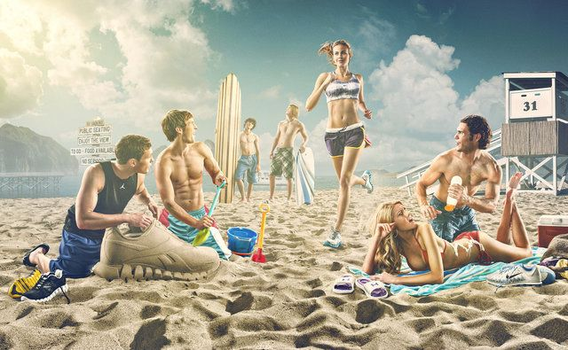

Over in [the forums][dpu] community member [Sebastien Guyader][] (@sguyader) posted a neat workflow for emulating a photo-illustrative look popularized by photographers like [Dave Hill][] where the resulting images often seem to have a sort of hyper-real feeling to them. Some of this feeling comes from a local-contrast boost and slight 'blooming' of the lighter tones in the image (though arguably most of the look is due to lighting and compositing of multiple elements).

To illustrate, here are a few representative samples of Dave Hill's work that reflects this feeling:

<figure>

<figcaption>
A collection of example images. &copy;[Dave Hill][]
</figcaption>
</figure>

A video of Dave presenting on how he brought together the idea and images for the series the first image above is from:

<iframe width="560" height="315" src="https://www.youtube.com/embed/zSGY_N2Z_y0" frameborder="0" allowfullscreen></iframe>

This effect is also popularized in Photoshop<small>®</small> filters such as [LucisArt][] in an effort to attain what some would (_erroneously_) call an "HDR" effect.  Really what they likely mean is a not-so-subtle tone-mapping. In particular the exaggerated local contrasts is often what garners folks attention.

We had [previously posted][freaky] about a method for exaggerating fine local contrasts and details using the ["Freaky Details"][freaky] method described by Calvin Hollywood. This workflow provides a similar idea but different results that many might find more appealing (it's not as _gritty_ as the Freaky Details approach).

## Replicating a "Dave Hill"/"LucasArt" effect

Sebastien's approach relies only on having the always useful [G'MIC][] plugin for [GIMP][]. The general workflow is to do a high-pass frequency separation, and to apply some effects like local contrast enhancement and some smoothing on the residual low-pass layer.  Then recombine the high+low pass layers to get the final result.

1. Open the image.
2. Duplicate the base layer.  
Rename it to _"Lowpass"_.
3. With the top layer (_"Lowpass"_) active, open G'MIC.
4. Use the _Photocomix smoothing_ filter:

Testing → Photocomix → Photocomix smoothing

Set the **Amplitude** to **10**. Apply.
5. Change the _"Lowpass"_ layer blend mode to _Grain extract_.
6. Right-Click on the layer and choose _New from visible_.  
Rename this layer from "_Visible_" to something more memorable like _"Highpass"_ and set its layer mode to _Grain merge_.  
Turn off this layer visibility for now.
7. Activate the _"Lowpass"_ layer and set its layer blend mode back to _Normal_.  
The rest of the filters are applied to this _"Lowpass"_ layer.
8. Open G'MIC again.  
Apply the _Simple local contrast_ filter:

Details → Simple local contrast

Using:
    * __Edge Sensitivity__ to __25__
    * __Iterations__ to __1__
    * __Paint effect__ to __50__
    * __Post-gamma__ to __1.20__  
9. Open G'MIC again.  
Now apply the _Graphic novel_ filter:

Artistic → Graphic novel

Using:
    * check the __Skip this step__ checkbox for __Apply Local Normalization__
    * __Pencil size__ to __1__
    * __Pencil amplitude__ to __100-200__
    * __Pencil smoother sharpness/edge protection/smoothness__  
        to __0__
    * Boost merging options __Mixer__ to __Soft light__
    * __Painter's touch sharpness__ to __1.26__
    * __Painter's edge protection flow__ to __0.37__
    * __Painter's smoothness__ to __1.05__
10. Finally, make the _"Highpass"_ layer visible again to bring back the fine details.

[G'MIC]: http://gmic.eu
[GIMP]: https://www.gimp.org
[dpu]: https://discuss.pixls.us/t/heres-some-kind-lucisart-processing-using-gmic-filters/2394 "Topic on Discuss"
[Sebastien Guyader]: https://discuss.pixls.us/users/sguyader/activity "sguyader on discuss"
[Dave Hill]: http://davehillphoto.com/classics-2005-2010/
[LucisArt]: https://www.google.com/search?q=photoshop+lucisart&rlz=1C1CHBF_enUS707US707&source=lnms&tbm=isch&sa=X&ved=0ahUKEwi-no2l_NXPAhUBYT4KHbekC9QQ_AUICCgB&biw=1353&bih=1073#tbm=isch&q=lucisart "Google Image search for 'Lucisart'"
[freaky]: /articles/freaky-details-calvin-hollywood/
