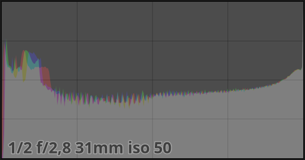
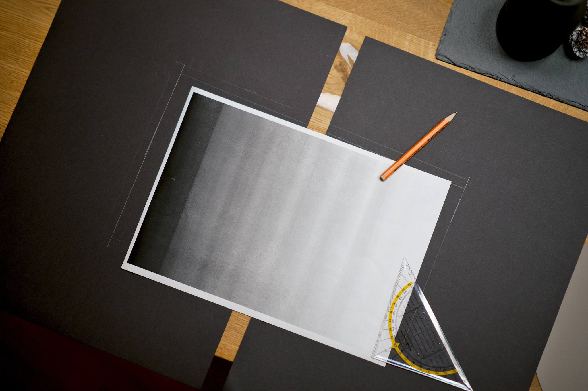
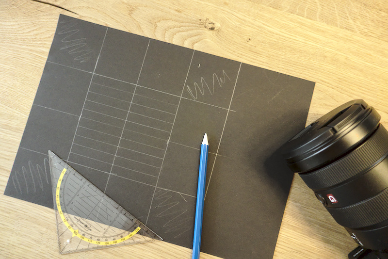
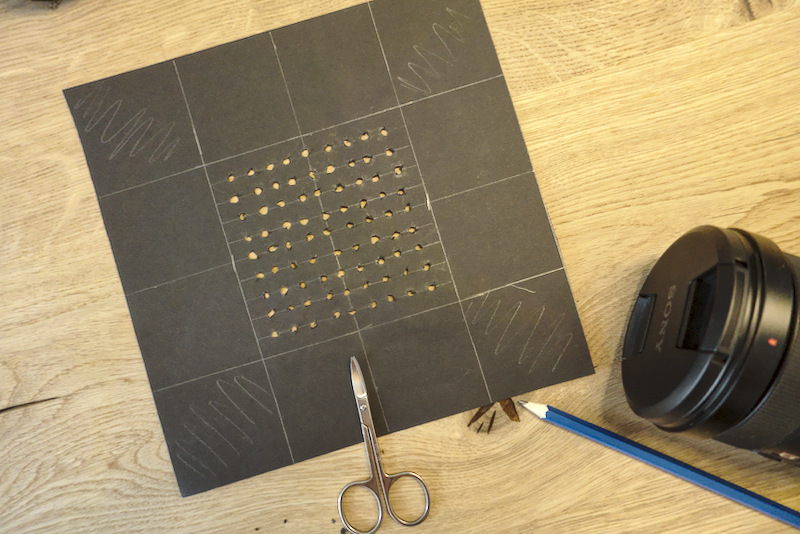
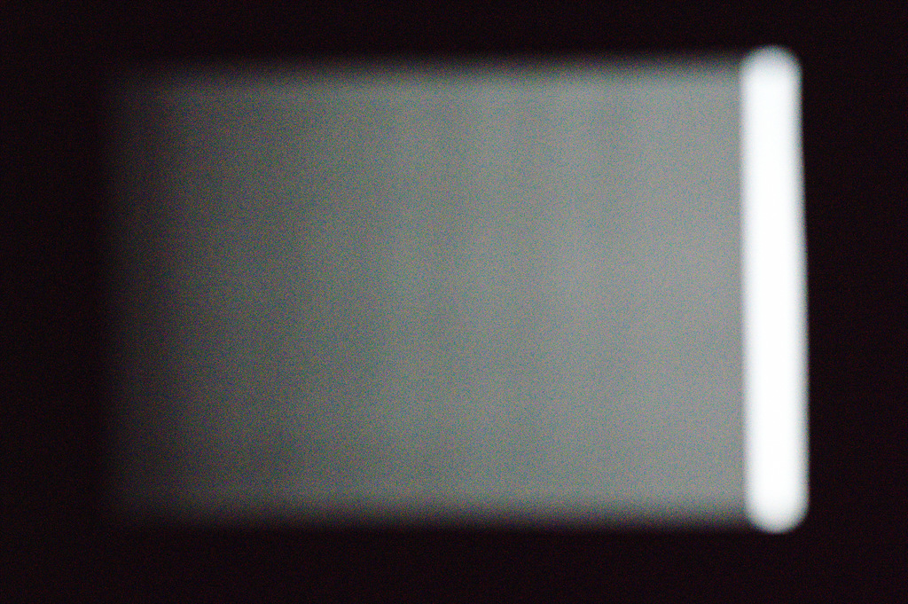

[Article updated on: 2018-11-06]

What is noise?
--------------

Noise in digital images is similar to film grain in analogue photography.  In
digital cameras, noise is either created by the amplification of digital
signals or heat produced by the sensor. It appears as random, colored speckles
on an otherwise smooth surface and can significantly degrade image quality.

Noise is always present, and if it gets too pronounced, it detracts from the
image and needs to be mitigated. Removing noise can decrease image quality or
sharpness. There are different algorithms to reduce noise, but the best option
is if having profiles for a camera to understand the noise patterns a camera
model produces.

Noise reduction is an image restoration process. You want to remove the digital
artifacts from the image in such a way that the original image is discernible.
These artifacts can be just some kind of grain (luminance noise) or colorful,
disturbing dots (chroma noise). It can either add to a picture or detract from
it. If the noise is disturbing, we want to remove it. The following pictures
show a picture with noise and a denoised version:

<figure>

</figure>

To get the best noise reduction, we need to generate noise profiles for each
ISO value for a camera.

Creating the pictures for noise profiling
-----------------------------------------

For every ISO value your camera has, you have to take a picture. The pictures
need to be exposed a particular way to gather the information correctly. The
photos need to be out of focus with a widespread histogram like in the
following image:

<figure>

</figure>

We need overexposed and underexposed areas, but mostly particularly the grey
areas in between. These areas contain the information we are looking for.

Let's go through the noise profile generation step by step. For easier creation
of the required pictures, we will create a stencil which will make it easier to
capture the photos.

### Building a profiling testbed

#### Requiements

* A dark room (wait till night time)
* Monitor
* Printer
* Sheets of black thick paper (DIN A3)
* White paper
* Scissors
* Sellotape (Tesafilm)

First you need to get some thicker black paper or cardboard. No light should shine
through it! Then you need to print out a gradient on white paper. Light
should shine through the white paper!

[Print this black to white gradient (PDF)](bw_gradient.pdf)

I got black thick paper (DIN A3) and used two sheets. You need to be able to
cover your monitor with the black paper. Put the printed gradient in the middle
and draw around it. From three sides (bottom, left, top) make the window
smaller by 1 cm, see Figure 1. On the right we need to have a gap.

<figure>

<figcaption>
<b>Figure 1:</b> Drawn window reduced by 1 cm on the bottom, left and top.
</figcaption>
</figure>

Next is to cut out the window and type the gradient onto the black paper like
in Figure 2. It is important that there is a gap between the white and the
black paper on the white side of the gradient. We need light for an overexposed
area.

<figure>

<figcaption>
<b>Figure 2: The gradient taped into the window of the black paper.</b> 
</figcaption>
</figure>

Once you have done that go to your monitor and make it all white. You can an
[all white image](white.png) for that. Then tape the sheets to your monitor
like in Figure 3.

<figure>

<figcaption>
<b>Figure 3: The sheets of black paper taped to the monitor.</b> 
</figcaption>
</figure>

Taking the pictures
-------------------

It is time to get your camera. You need to shoot in RAW. It is best to turn off
any noise reduction especially long exposure noise reduction. Mount the camera
on a tripod and use a lens between 35 mm to 85 mm (full frame). I used a 85 mm
f/1.4 lens.

Make sure the gradient fills most of the frame. Set your camera to manual focus
and focus on infinity. Select the manual mode of your camera and choose the
fastest aperture and ISO100. Depending on the lens you're using you might want
to close the aperture. For me f/1.4 was too blurry and I closed it till f/4.0.
You don't want to see any edges but also it shouldn't be too blurry, we want
nice transitions zones like in Figure 4.

Now you need to set the shutter speed. Make the picture really dark and then
make the shutter speed longer till the gap which gives us the white from the
monitor is overexposed, pure white see Figure 4. The black around the white
paper should be underexposed (pure black).

<figure>

<figcaption>
<b>Figure 3: Example shot for noise.</b> 
</figcaption>
</figure>

Now you need to take a picture for each ISO value of your camera. When you
increase the ISO value you need to decrease the shutter speed!

Creating the noise profiles
---------------------------

### STEP 1

Run

    /usr/lib/darktable/tools/darktable-gen-noiseprofile --help

If this gives you the help of the tool, continue with STEP 2 otherwise go to
STEP 1a.

### STEP 1a

Your darktable installation doesn't offer the noise tools so you need to
compile it yourself. Before you start make sure that you have the following
dependencies installed on your system:

* git
* gcc
* make
* gnuplot
* convert (ImageMagick)
* darktable-cli

Get the darktable source code using git:

    git clone https://github.com/darktable-org/darktable.git

Now change to the source and build the tools for creating noise profiles using:

    mkdir build
    cd build
    cmake -DCMAKE_INSTALL_PREFIX=/opt/darktable -DBUILD_NOISE_TOOLS=ON ..
    cd tools/noise
    make
    sudo make install

### STEP 2

Download the pictures from your camera and change to the directory on the
command line:

    cd /path/to/noise_pictures

and run the following command:

    /usr/lib/darktable/tools/darktable-gen-noiseprofile -d $(pwd)

or if you had to download and build the source, run:

    /opt/darktable_source/lib/tools/darktable-gen-noiseprofile -d $(pwd)

This will automatically do everything for you. Note that this can take quite
some time to finish. I think it took 15 to 20 minutes on my machine. If a
picture is not exposed correctly, the tool will tell you the image name and you
have to recapture the picture with that ISO. Remove the non-working picture.

The tool will tell you, once completed, how to test and verify the
noise profiles you created.

Once the tool finished, you end up with a tarball you can send to darktable for
inclusion. You can open a bug at:

[**https://redmine.darktable.org/**](https://redmine.darktable.org)

The interesting files are the `presets.json` file (darktable input) and, for the
developers, the noise_result.pdf file. You can find an example PDF 
[here](ilce-7m3_noise_result.pdf). It is a
collection of diagrams showing the histogram for each picture and the results
of the calculations.

A detailed explanation of the diagrams and the math behind it can be found in
[the original noise profile
tutorial](https://www.darktable.org/2012/12/profiling-sensor-and-photon-noise/)
by Johannes Hanika.

Feedback is very much welcome in the comments below!
