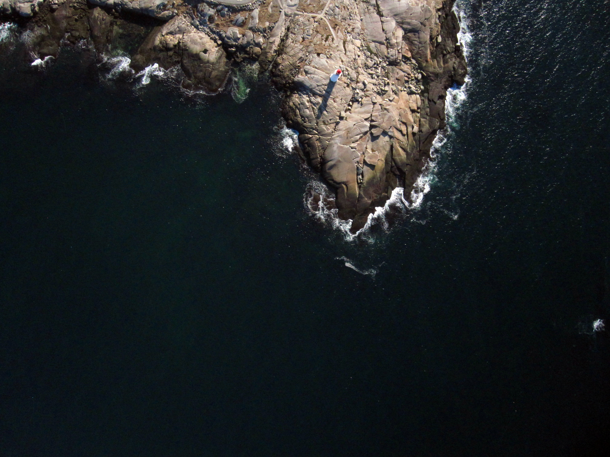
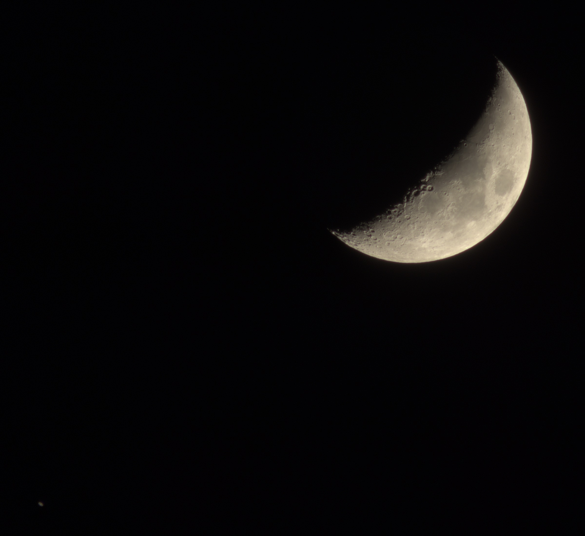
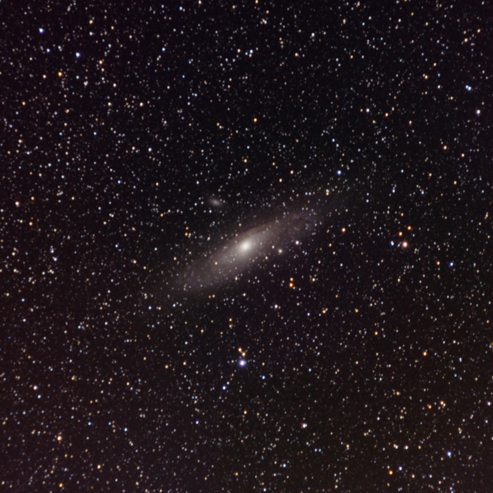

#### Introduction

CHDK is a free, open source software add-on that runs on Canon PowerShot cameras and expands their functionality. Some of its features are:
* Professional control: RAW files, bracketing, manual control over exposure, zebra mode, live histogram, grids, etc.
* Motion detection: Trigger exposure in response to motion, fast enough to catch lightning.
* USB remote: Simple DIY remote allows you to control your camera remotely.
* Scripting: Control CHDK and camera features using uBASIC and Lua scripts. Enables time lapse, motion detection, advanced bracketing, and more.
* PTP: Shooting control, live view, and file transfer from Linux and Windows.

I talked with the core team of developers to learn more about CHDK.

#### How did CHDK start? Who were the first developers? What was their role in those first steps? Do you have any information on who those people are, where they come from, or their professional background?

**reyalp** That was before my time. The very first developer was *VitalyB*, and I don’t know much about his background.

In truth, CHDK is very loosely organized and informal, so I don't know much about current contributors backgrounds either.

**waterwingz** Before my time too. The original hack seems to have taken off in 2006/2007 when it got mention on the <a href='https://www.dpreview.com/forums/thread/1836713' target='_blank'>dpreview.com</a> site. Many people shared random bits and pieces based on what they were personally interested in working on. There was no project organization and people did their own builds.

At some point, I believe someone with the nick *GrAnd*, got things organized around a wikia site and created a standardized set of build tools. Eventually an online discussion forum and autobuild server were added - not sure who gets credit for those. 

But over the last 10 years, more or less, *reyalp* has coordinated the ongoing volunteer development efforts. There is still no real plan or schedule but there seems to be community consensus of how things get done and what gets added to the package.

#### Some people say that CHDK was first developed by Andrei Gratchev (<a href='https://fr.wikipedia.org/wiki/CHDK' target='_blank'>here</a> and <a href='https://www.pcmag.com/article2/0,2817,2329392,00.asp' target='_blank'>here</a>). I believe he is *GrAnd*, right? Do you know something about it? Is it possible that Andrei Gratchev is *VitalyB*?

**reyalp** *GrAnd* (Andrei Gratchev) and *VitalyB* are definitely not the same person. They have separate accounts on *<a href='https://app.assembla.com/spaces/chdk/team' target='_blank'>assembla.com</a>*.
*VitalyB* did the very first work on what eventually became CHDK, while *GrAnd* was an early developer who played a major role in organizing the project.
It's possible that *GrAnd* originated the name CHDK.
I don't know that history directly, but it could explain confusion over whether he was the founder.

<figure>

<figcaption>
Lightning captured by a Canon PowerShot G7x with CHDK motion detection script <a href='https://chdk.setepontos.com/index.php?topic=10864.0' target='_blank'>MDFB2013</a>, by reyalp, licensed under CC BY-NC 2.0.
</figcaption>
</figure>

#### Canon cameras run on DIGIC boards. As far as I'm aware of, at the time *VitalyB* did the first hack, people had already hacked DIGIC-I compact Canon cameras and could execute custom programs. What was the big leap (in terms of development or finding hooks in the DIGIC-II firmware) that *VitalyB* made?

**reyalp** The original Digic-I cameras were actually ROM DOS running on a 16 bit x86 clone (except for S1 IS, which is VxWorks on ARM and has a partial CHDK port developed by *srsa_4c*).

A hack for the DOS based cameras was developed by a <a href='http://rayer.g6.cz/hardware/a70.htm' target='_blank'>Czech developer</a>.

I don't know if *VitalyB* was aware of this work, but the platforms were so different there wouldn't likely have been much overlap.

**waterwingz** As far as I know, the big leap in hooking the DIGIC-II firmware was figuring out how to hack Canon's firmware update process.

#### It's stated that he hacked the firmware update process and executed his own program instead of the firmware update itself. That first program aimed to make a copy of Canon firmware. How exactly could he get a copy of the Canon firmware by blinking a LED? Why did he need a copy of Canon firmware?

**waterwingz** From what I understand, he assembled a little piece of code that loaded and ran in the place of the expected firmware update code.

Once he could do that, by trial & error he learned what memory address needed to be poked to turn one of the camera's LEDs on & off. And once he could do that, he recoded so as to dump the camera's memory contents serially via that LED to a phototransistor interfaced to an external computer.

After that it was a matter of reverse assembly of the raw code to learn how the rest of the boot process and camera firmware worked.

**reyalp** I don't know the specifics of exactly what *VitalyB* did for the very first camera, but generally to make a hack work with the existing firmware, you need a copy of the firmware code to disassemble and analyze.

The advantage of using LED blinking is that the code is really simple: you just need to know how to control an LED (done writing to specific address on these cameras) and a loop.

In contrast, writing a file to the SD card requires a whole stack with an SD driver, a filesystem driver and so on.

Without having already analyzed the firmware, you don't know how to interface with those things, and on PowerShot cameras, they aren't really available after a firmware update file is loaded.

Blinking was used frequently in the early days of CHDK, but around 2010 Alfredo Ortega and Oren Isacson of Core Labs worked out how to run scripts in Canon's native scripting language (which we call Canon Basic). I wrote a script to dump the original firmware from Canon Basic, and we've used that as the primary way of dumping firmware ever since.

<figure>

<figcaption>
CHDK LED dump, by Andrei Gratchev, all rights reserved.
</figcaption>
</figure>

<figure>

<figcaption>
Reading CHDK LED dump, by Andrei Gratchev, all rights reserved.

1 - Spacing between bytes;

2 - Spacing between bits;

3 - Wide pulse - logical "1";

4 - Narrow pulse - logical "0".
</figcaption>
</figure>

#### Canon DSLR's also allow this same kind of hack. Why did *VitalyB* start with point-and-shoot cameras?

**waterwingz** I'm guessing, but probably he started there because he happened to own a PowerShot and not a DSLR. Or maybe it was just the first device that he was able to find a backdoor into.

**reyalp** While Canon DSLRs and P&S use the same basic CPU and operating systems, the rest of the code is very different.

Running custom code on Canon DSLRs uses different mechanisms which weren't figured out until much later.

My impression is *VitalyB* started on the camera he had (PowerShot A610?).

The lower cost of P&S also makes them more attractive to experiment with, and before the rise of smartphones, P&S were much more common than DSLRs so there was a better chance of interested developers having them.

#### Are there any ties between CHDK and Magic Lantern (a CHDK equivalent for Canon DSLRs)?

**waterwingz** There are several people who participate in both projects and some discoveries are occasionally useful to both. But there is no coordination beyond that.

**reyalp** We do share information and occasionally code, but as mentioned above, the Canon firmware up to now has been quite different. Some of the initial DSLR research took place on the CHDK forum.

<figure>

<figcaption>
Kite aerial photograph captured by a Canon PowerShot G7X, powered by a CHDK script, by <a href='https://www.flickr.com/photos/56388614@N05/albums' target='_blank'>Peter Laudanski</a>, licensed under CC BY-NC 2.0. The script was written by *waterwingz* and is better described <a href='http://chdk.wikia.com/wiki/KAP_UAV_Exposure_Control_Script' target='_blank'>here</a>.</figcaption>
</figure>

<figure>

<figcaption>
Kite mount showing, at top left, a box containing battery and a transmitter for the monitor at bottom right, that stays on the ground. By <a href='https://www.flickr.com/photos/56388614@N05/albums' target='_blank'>Peter Laudanski</a>, licensed under CC BY-NC 2.0. The script was written by *waterwingz* and is better described <a href='http://chdk.wikia.com/wiki/KAP_UAV_Exposure_Control_Script' target='_blank'>here</a>.</figcaption>
</figure>

#### CHDK was born as HDK, or Hack Development Kit, and only later the "C" was added. Regarding the idea behind the name, what exactly does it mean to say that CHDK is not a simple firmware add-on, but a development kit? Does it have to do with the capability of loading and executing custom user scripts?

**waterwingz** Way before my time again - I'd only be speculating on the name's origin. I guess the kit designation means you get the source code to do development with. I don't think it has anything to do with user scripting capabilities.

#### Is this kind of hack only possible on Canon cameras? Why?

**waterwingz** The exact details and mechanism will only work on Canon PowerShot cameras. They all build on how Canon supports firmware upgrades (even though CHDK does not actually modify any of the camera's firmware).

To do something similar on a different brand of camera, you'd need to find a way to exploit any firmware update method they might provide.  If there is no such mechanism, you'd need to get lucky and find some other vector.

**reyalp** As *waterwingz* says, the specifics only apply to these cameras, but in general, most embedded devices are hackable with enough effort.

Manufacturers put varying levels of effort into preventing it, but the success of CHDK (and later Magic Lantern) involves a lot of stuff that just lined up by chance.

Another important factor in these projects is that reverse engineering is additive: the more you build and understand, the easier it is to keep up with upstream changes in new models. It's also easier for people to add useful features, which gets more people involved and keeps the whole thing going.

Getting to that critical point on an entirely new system requires a lot of effort and/or luck.

Some of the lucky things that lined up to make CHDK take off were:
- The cameras ran VxWorks on ARM 946E-S, both of which had significant public documentation. Canon later switched to their proprietary DryOS operating system, but by that point CHDK had enough built up knowledge to carry on.
- Canon left a lot of diagnostic stuff in the code and didn't put a lot of effort into stopping unauthorized code from running.
- There were a lot of PowerShots in circulation and they were affordable, which provided more chances of a developer with the reverse engineering skills having one.
- Canon didn't make any effort to stop it.

#### Can authorized warranty repair shops refuse to service cameras because of CHDK? Does CHDK use leave any traces?

**waterwingz** So far it has not been a problem as CHDK runs in RAM - it makes no permanent changes to the camera. When you turn the camera off, it disappears and you have to reload it the next time you use it.

And while Canon has made no official statements about CHDK one way or the other, there is an email somewhere from someone in Canon tech service stating that as long as CHDK did not modify the camera in any way, there was no warranty issue.

If you remove the SD card containing CHDK prior to sending your camera for service, there is really no way of anyone knowing you've used CHDK.

**reyalp** CHDK doesn't normally leave obvious traces, but if the camera crashes, traces of CHDK can appear in an internal crash log the Canon firmware stores in onboard flash memory.

It's certainly possible that other traces could be present, the cameras have a lot of sub-components that could store their own diagnostic information.

I don't recall any cases of anyone reporting having warranty service rejected for this, but that doesn't mean it couldn't happen.

<figure>

<figcaption>
Jupiter captured by a Canon PowerShot A590IS, powered by CHDK, aligned and stacked with Registax. An afocal method was used for capturing on the Newtonian 114/900 telescope. By <a href='http://astrofoto.pondi.hr/' target='_blank'>blackhole</a>, licensed under CC BY-NC 2.0.
</figcaption>
</figure>

#### Could you give a brief explanation of how CHDK is designed? Do you have any kind of diagram that could illustrate it?

**waterwingz** CHDK is a volunteer effort and most volunteers would rather code than document in detail.

But you can learn a lot reading the <a href='https://chdk.wikia.com/wiki/For_Developers' target='_blank'>For Developers</a> section of the CHDK Wikia.

A short description is that CHDK loads by hijacking the camera's firmware update process and then intercepts some of the camera's RTOS tasks and replaces them with its own tasks. The CHDK tasks typically replicate the functionality of the original camera tasks but add features and functionality not included in the original Canon code.

#### In what language is CHDK built?

**waterwingz** A combination of ARM assembler and C.

**philmoz** I would add Lua to that - a lot of useful features are now in the scripts. *waterwingz* has built some impressive functionality with his scripts.

I suppose we should also include uBasic as we still include some testing scripts written in it. uBasic is very primitive compared to Lua, so Lua scripts are preferred.

Finally there is also the Canon Basic built into the firmware - we use this to do firmware dumping.

<figure>

<figcaption>
Winchester Cathedral captured by a Canon PowerShot G7X, powered by a CHDK script, by Garry George, licensed under CC BY-NC 2.0. <a href='http://chdk.wikia.com/wiki/Landscape_Focus_Bracketing_:_perfect_near_to_far_focus_brackets' target='_blank'>The script</a> was written by Garry himself.
</figcaption>
</figure>

#### What were some of the difficult issues in making CHDK easier to port to new cameras?

**waterwingz** Ummm... who said it was easy?

But seriously, most of CHDK is based on guesses about how the original Canon hardware and firmware works. So much of the coding was done on a "try it and see" basis. 

What makes it more difficult is changes to the firmware as Canon changes RTOS's or generations of DIGIC processors.

**philmoz** The Canon firmware remained pretty stable for a while. It continued to evolve but there weren't any real upheavals until Digic 6. This made it easier to improve the tools, and take some of the guesswork out of ports.

We have a "*sig finder*" tool that analyses a firmware dump and tries to find the things needed for a port. When I first started this was pretty primitive and a lot of things had to be done manually. I spent some time improving this tool, and I think that made porting a bit quicker until Digic 6.

*waterwingz* also created a GUI tool for disassembling the firmware in a way that could be used in a port - I added a scripting language to this to automate the generation of some of the files needed for a port, which I think helped with new ports.

With Digic 6 the architecture changed a lot and things slowed down quite a bit. A lot of reverse engineering on the new cameras has been done by *srsa_4c*, *reyalp*, *ant*, and others so things are getting better again.

**reyalp** One of the things that makes it difficult is how many there are. The official CHDK source supports over 150 distinct models (many with multiple firmware versions that each require distinct ports), spanning Canon releases from 2004 through 2015.

Essentially the same CHDK code runs on all of them, so if a new model does something different, you have to figure out how to accommodate it without breaking the existing cameras.

On top of that, the developers don't own most of the cameras, so testing is difficult.

As *Philmoz* mentioned, with Digic 6, Canon moved to a ARMv7 architecture processor and a new display system with a TAKUMI GPU, which took a lot of work supporting. *srsa_4c* did much of the initial reverse engineering work, while I took the concepts from *Philmoz*'s "*sig finder*" and implemented them in a new tool based on the open source Capstone disassembly library.

**nafraf** The scripting language developed by *Philmoz* helped a lot to port until Digic 5+ cameras. Using *code_gen* tool it was possible to port new models and improve the existing ports. On release 1.3, for example, *code_gen* was the key tool to add more than 60s exposure on all cameras.

<figure>

<figcaption>
This photo of the Peggy's Cove lighthouse was taken using CHDK with a Canon PowerShot SD780IS camera mounted on a Multiplex Easystar model airplane, by <a href='https://web.archive.org/web/20120408002225/http://www.andrewhazelden.com/blog/' target='_blank'>Andrew Hazelden</a>, licensed under CC BY-NC 2.0. The script was written by Andrew himself and is better described <a href='https://web.archive.org/web/20120329192621/http://www.andrewhazelden.com/blog/2010/09/ubasic-countdown-intervalometer-script-for-canon-PowerShots-running-chdk/' target='_blank'>here</a>.
</figcaption>
</figure>

#### In which OS do these tools run?

**waterwingz** CHDK is built using the *gcc* compiler so I guess the tools run on anything that supports that compiler - Windows and Linux for sure.

I do all my work under Linux although I have a laptop somewhere that runs the Windows tools.

The autobuild server that rebuilds CHDK after each update and provides current downloads runs under Linux.

And there are quite a few other tools that people have created, some of which are Windows only (or using Wine under Linux) and some of which are Java based and will run on Windows, Linux, or MacOS.

**philmoz** I use MacOS for CHDK development.

I also have a Linux VM I use for testing batch builds of the entire set of supported cameras, to make sure big changes don't break the autobuild server.

**reyalp** I use Windows on my primary development system, but all the core CHDK tools and build process have supported Linux for as long as I've been involved.

My normal CHDK development environment is MSYS shells and *gvim*.

I also use Linux in VMs and a Raspberry Pi for some things.

<figure>

<figcaption>
Winchester Cathedral captured by a Canon PowerShot G7X, powered by a CHDK script, by Garry George, licensed under CC BY-NC 2.0. <a href='http://chdk.wikia.com/wiki/Landscape_Focus_Bracketing_:_perfect_near_to_far_focus_brackets' target='_blank'>The script</a> was written by Garry himself.
</figcaption>
</figure>

#### Is there any camera emulator that allows to test core code before loading it into the camera?

**waterwingz** There are a couple of clever GUI emulators for testing CHDK uBASIC and Lua scripts.

But I don't believe anyone has really succeeded in making a <a href='https://chdk.wikia.com/wiki/GPL_Qemu' target='_blank'>QEMU emulator</a> for core code development. 

All testing is done on actual cameras.

And to date, I don't believe anyone in the dev community has bricked a camera which says something about the stability of the process!

**philmoz** Magic Lantern uses QEMU to run their code in an emulator.

In theory CHDK could do this as well, but to date no-one has invested the time to create the hardware simulation bits needed.

Debugging CHDK is old school - blinking LED's, printing messages (if you have the display working), writing log files, and lots of trial and error.

**reyalp** Not emulation, but I use *chdkptp* a lot for interactive testing. Being able to dump bits of memory or call functions interactively from a PC console is very useful.

#### What's the easiest way for someone to get involved with CHDK?

**waterwingz** <a href='https://chdk.fandom.com/wiki/Downloads' target='_blank'>Download it</a> and use it on a PowerShot.

Learn what it does and how to run scripts.

Then write some scripts on your own, or modify some existing ones.

Finally, do a port for an unsupported camera - pretty much every CHDK dev started off porting and then got hooked on doing more.

**blackhole** The easiest way is to use CHDK for something creative. It's nice to see when users show results that are the product of using CHDK. I think it's the biggest reward for developers when they see that their work is well-used.

**reyalp** <a href='https://chdk.setepontos.com/' target='_blank'>The forum</a> is the best place to get involved with the community.

To get involved with development, it really depends on your interests. If there's something you want to add, either dive into the code or ask for suggestions on where to start.

Ports of additional cameras are always welcome too, and doing one provides a good overview of how CHDK works.

<figure>

<figcaption>
Kite aerial photograph captured by a Canon PowerShot G7X, powered by a CHDK script, by <a href='https://www.flickr.com/photos/56388614@N05/albums' target='_blank'>Peter Laudanski</a>, licensed under CC BY-NC 2.0. The script was written by *waterwingz* and is better described <a href='http://chdk.wikia.com/wiki/KAP_UAV_Exposure_Control_Script' target='_blank'>here</a>.</figcaption>
</figure>

#### What are some tasks non-programmers can do to help the project?

**waterwingz** There has been a lot of work on the <a href='https://chdk.fandom.com/wiki/CHDK' target='_blank'>CHDK wiki</a> over the years, but there is still a ton to do.

For example, one CHDK user finds time each month to simply correct spelling and the worst of the grammar mistakes on the more popular pages and the CHDK User Manual.

**reyalp** If you do something interesting with CHDK, share it in the forum. A lot of interesting projects start as riffs on something someone else explored years earlier.

Documentation always needs help, but for CHDK, a lot of it really requires careful experimentation or knowledge of the source to do well.

**nafraf** If you are a CHDK user and find a bug, or a missing function on the port of your camera, please report the bug to the forum and help to test new versions. 

Developers don't have access to all models, then testing and receiving feedback from the users are necessary to help the project.

<figure>

<figcaption>
Moon and Saturn, 30x1/24 seconds aligned stacked with gmic and gimp. CHDK script <a href='https://chdk.fandom.com/wiki/Lua/Scripts:_Fixed_Exposure_Intervalometer' target='_blank'>fixedint.lua</a> used to capture frames, by reyalp, licensed under CC BY-NC 2.0.
</figcaption>
</figure>

#### How healthy is the production of user scripts? Is it easy for a non-programmer to write a script? In what languages?

**waterwingz** The huge improvements in mobile phone cameras have really impacted the market for all but the highest end or largest zoom P&S cameras.

Having said that, a core of serious photographers still work on what interests them and depend on CHDK to help capture their artistic vision.

As far as non programmers and script writing, uBASIC is about as simple as a computer language gets and there are lots of example scripts to study.

Lua provides a much richer programming environment, albeit with a bit of a learning curve.

**reyalp** Easy... depends on the user.

Because CHDK is a reverse engineered hack on top of an undocumented system, many behaviors are not well specified or understood.

*waterwingz* improved things a lot by creating a comprehensive reference of CHDK script functions, but developing non-trivial scripts still requires significant effort and a willingness to experiment.

I've been using CHDK for 10+ years, and still find myself greping the CHDK source and making test cases to figure out what functions actually do.

All that said, I don't think learning to write modest CHDK scripts is particularly harder than starting out with javascript or batch files or that sort of thing.

We should note CHDK uBASIC is based on Adam Dunkels code, not the UBASIC written by Yuji Kida for mathematical computing.

#### How many developers work on CHDK? How does it work?

**waterwingz** There have been hundreds of contributors to CHDK over the years.

Currently there is an active core of two or three people doing original work with low level firmware stuff, a couple of people working more on the user experience, several people generating custom scripts for unique photographic opportunities, and a core of maybe ten CHDK experts not doing much coding these days but continuing to provide support to the community.

<figure>

<figcaption>
Andromeda (M31) captured by a Canon PowerShot G7X with CHDK intervalometer script <a href='https://chdk.fandom.com/wiki/Lua/Scripts:_Fixed_Exposure_Intervalometer' target='_blank'>fixedint.lua</a>, by reyalp, licensed under CC BY-NC 2.0. It's worth mentioning that this image results from three thousand five second exposure frames, captured on different days, resulting a total exposure time of 4.16 hours.
</figcaption>
</figure>

#### What uses are people making of CHDK? Is there any that should be highlighted?

**waterwingz** There is a nice list on the main page of the <a href='https://chdk.wikia.com/wiki/CHDK' target='_blank'>CHDK Wiki</a> - unique things like motion triggering, scripting, RAW/DNG, bracketing, and full manual exposure control.

Originally, there was a lot of interest in just getting RAW files from an inexpensive P&S camera.

More recently the focus has been on making good multi-camera rigs with full centralized control using CHDK's PTP capability. Everything from book scanners, "bullet time" rigs, to full 3D capture for building small replicas of people. And of course the ongoing interest in time lapse videos and kite and drone photography work.

**reyalp** I get a kick out of how many different things show up searching google scholar for <a href='https://scholar.google.com/scholar?q=chdk+hack' target='_blank'>"CHDK hack"</a>

#### Currently, what is the main development effort underway? New functionality? Porting CHDK to new camera models?

**waterwingz** A lot of the current development is focused on very detailed features that interest the core developers. Not really anything that will revolutionize the CHDK user experience right away unfortunately.

But there are also potentially some interesting <a href='https://chdk.setepontos.com/index.php?topic=13293.0)' target='_blank'>new things</a> in the wings if the devs working on them can ever get them finished.

**reyalp** There aren't really any major features undergoing significant development right now.

There are some ideas and experimental stuff being kicked around, like the GUI concept and some work on capturing raw outside the normal shooting process, but what eventually gets added depends on developers time and interest.

I'm trying to wrap up a few things to release CHDK 1.5 before we start major projects in the official development branch.

#### So there's a new CHDK GUI underway, and it seems very interesting and more user oriented. Once finished, how will it be released to the many different camera models that already run CHDK?

**waterwingz** Oh oh - you noticed that?  Did you also see the comment about the dev working on it not being too good at it getting finished? ;)

For what it's worth, there has been quite a bit of thought about keeping it generic enough so that will run on all CHDK capable cameras. That's mostly about screen resolution issues but there will probably be other challenges. Touchscreen cameras like the PowerShot N come to mind.

<figure>

<figcaption>
The Moon captured by a Canon PowerShot A590IS, powered by CHDK, aligned and stacked with Registax. An afocal method was used for capturing on the Newtonian 114/900 telescope. By <a href='http://astrofoto.pondi.hr/' target='_blank'>blackhole</a>, licensed under CC BY-NC 2.0.
</figcaption>
</figure>

#### What is the future of CHDK, considering the evolution of technology? How long do you think point-and-shoot cameras will stay on the market, given the rise of smartphones? Do you think the latter will replace the former?

**waterwingz** As I mentioned earlier, smart phone cameras continue to improve and that has impacted the low end PowerShots that CHDK does so much for.

CHDK will continue as an interesting project as long as a people enjoy using it and creating new things with it.

**blackhole** The P&S cameras with the large zoom will likely survive the competition of smartphones. Smartphones in this area will not be competitive with cameras for a long time. CHDK is likely to have a future in this area.

**philmoz** I think there will also be demand for the higher end P&S cameras with larger sensors, although I don't think the market will be huge.

The number of people with these cameras interested in CHDK is probably going to be pretty small.

Canon's EOS-M mirrorless cameras can also run CHDK so there is some interest there.

**reyalp** Low end, mass market P&S are clearly on the way out. I agree with *blackhole* and *philmoz* that higher end stuff will be around for a while to come, but the possibility of running CHDK on future cameras is always uncertain.

As I mentioned earlier, Canon DSLRs and P&S cameras have been based on different codebases, which are different enough that it doesn't make sense to run the same hack on both.

CHDK supports the EOS M3 and M10 because they are built on the P&S codebase, while Magic Lantern does not support them.

There are signs Canon is moving to a unified codebase (likely motivated by the same market changes) in Digic 8 cameras, which may preclude CHDK as we currently know it.

However, with millions of CHDK capable P&S in circulation, there will still be potential uses for a long time to come.

Separate from smartphones, the rise of things like Rasbperry Pi, dedicated UAV and action cameras etc. have reduced cases where a hacked P&S is a clear win over other options.

In 2008, if you wanted a programmable, multi-megapixel camera with decent optics your choices were very limited and mostly expensive.

In 2019, you have a lot of options other than CHDK, but at the same time, a lot of these things can work well with CHDK too.

I think the collapse of P&S has also affected the pool of potential CHDK contributors: in 2008, a developer with a casual interest in photography would have a P&S, while today they would be more likely to have a smartphone. Someone who wants to tinker with camera software also has a lot more choices.

<figure>

<figcaption>
Shutter/flash speed test. <a href='http://chdk.wikia.com/wiki/Samples:_High-Speed_Shutter_%26_Flash-Sync' target='_blank'>Results</a> indicate an estimated shutter speed of 1/10,000 and flash firing speed of 1/60,000. By keoeeit, licensed under CC BY-NC 2.0.
</figcaption>
</figure>

#### Could CHDK benefit from the current boom in single board computers and single board microcontrollers, like Arduino, Raspberry Pi, Esp32, Beaglebone, etc? Could those boards add even more functionality to CHDK? How?

**waterwingz** Actually, there are quite a few successful projects out there using those little computers to control one or more Canon PowerShots running CHDK.

Basically anything that will support the necessary USB functionality to implement the PTP protocol and the CHDK extensions to the protocol. Applications like bookscanners, remote timelapse capture, photobooths, and multiple camera 3D image scanning.

#### Here is <a href='http://arduino-projects4u.com/chdk/' target='_blank'>an example of Arduino and CHDK usage</a>, with a nice PTP GUI.

**reyalp** The webcams on <a href='http://escursionisticivatesi.it/webcam/' target='_blank'>this site</a> are based Raspberry Pi's using *chdkptp* to control CHDK cameras (*chdkptp* is a tool which I maintain that allows controlling CHDK cameras over USB from Linux and Windows).

    

        <iframe src="https://www.youtube-nocookie.com/embed/_cqGBN9bGw0" frameborder="0" allowfullscreen></iframe>
    

One of the firsts tests with a full rig (72 cameras) shooting at same time. By *nafraf*, licensed under CC BY-NC 2.0.

    

        <iframe src="https://www.youtube-nocookie.com/embed/2egiBmt321k" frameborder="0" allowfullscreen></iframe>
    

A simple test to show the detail of a segment of the rig, how the cameras were mounted and their response after sending the turn off command using *chdkptp*. By *nafraf*, licensed under CC BY-NC 2.0.

#### Do you developers have time to play with CHDK? What are your preferred use?

**waterwingz** There are a ton of features in CHDK and I've had fun playing with most of them.  But for me, it's mostly about Lua scripting when I'm actually using CHDK.

**blackhole** Unfortunately my real life does not allow me to play with CHDK as much as I want.

My favorite use is when popularizing astronomy among children. It is a priceless experience when you see the glow in their eyes when they see the image of the planet they have taken themselves. For me, this is the highest value of CHDK.

**reyalp** I use CHDK raw for general shooting, and scripts to do timelapse.

I've used motion detection for lightning and fireworks.

I also do some lo-fi astrophotography using CHDK scripts to take lots of exposures to guide and stack in software.

But what I do most is take test shots of my desk while working on the code ;)

<figure>

<figcaption>
reayalp's desk, by reyalp, licensed under CC BY-NC 2.0.
</figcaption>
</figure>

#### When did you joined CHDK as a developer? Why? What is your background? What is your role?

**waterwingz** July 2010 according to the records on the CHDK forum.  But it seems like it was only nine years ago.

I got started because it combined two of my hobbies - computers and cameras.

Since then I've ported several cameras, contributed some original code, helped fix some bugs, coded many scripts, written a lot of documentation on the wiki, and helped a few newbies on the <a href='https://chdk.setepontos.com/index.php' target='_blank'>CHDK forum</a>.

**philmoz** I started with the G12 port in November 2010.

I've been a software developer for nearly 40 years and like *waterwingz*, photography is a hobby. CHDK looked like fun and I wanted something to keep me programming - my day job was more management than development.

I was pretty active until 2016, when real-life got in the way.

I now do mobile app development full time, so don't spend much time on CHDK coding these days.

**blackhole** I joined in August 2010.

Prior to that I was just reading the forum as a guest and using CHDK on the old A530 and A590 cameras. At that time I was looking for a better solution for cheap-modified webcams, which were then popular in amateur astronomy. The logical solution was to switch to something cheap with a CCD sensor, so the decision fell on Canon cameras and CHDK.

I became interested in the programming, so I started to collect knowledge on the forum and in the end I made my first port.

**reyalp** Around 2008, I happened to get a Canon A540 and google "firmware hack" or something like that just for kicks. I had a background in C and assembly, and a somewhat neglected interest in photography going back to film days, so it seemed like a fun thing to play with.

For me, CHDK development was a nice change of pace, a throwback to the early PC days where if you want to draw something, you write directly to video memory instead of going through a bunch of APIs.

As people came and went from the project I somehow ended up being the chief cat herder.

**nafraf** I started in June 2012. My first port was A810. I was using CHDK for a multi camera project and it was difficult to find ports of recent cameras.

    

        <iframe src="https://www.youtube-nocookie.com/embed/dsEw2cKN9KQ" frameborder="0" allowfullscreen></iframe>
    

With CHDK, the exposure time and ISO values can change in 1/96 EV steps. The first part of this video was made using a standard timer with exposure changes of 1/3 EV steps. The second part was made using script <a href='https://chdk.setepontos.com/index.php?topic=12165.0' target='_blank'>isoinc.lua</a>, no post-processing. By <a href='https://www.youtube.com/channel/UCrTH0tHy9OYTVDzWIvXEMlw' target='_blank'>c_joerg</a>, licensed under CC BY-NC 2.0.

#### Is there anything that you would like to add?

**waterwingz** Getting involved in CHDK is a bit of a trap. Once you get in, your free time just disappears. But it can be a lot of fun!

**philmoz** The people who have worked on CHDK over the years are an amazingly talented, fun, and helpful group. I have learned a lot from this project and really appreciate the willingness to help, and assistance I've received.

**reyalp** I'd like to thank all the people who have contributed over the years, and Canon for turning a blind eye to it for so long.

**blackhole** CHDK is a very fun and creative project. I invite all photographers and programmers to join us and express their creativity through this project and share their experiences with us. In the end, I would like to thank the entire CHDK community for a pleasant companionship for the last ten years.

**nafraf** Thanks to all people involved with this project. I have learned a lot during these years.

    

        <iframe src="https://www.youtube-nocookie.com/embed/z6PyjmPYtck" frameborder="0" allowfullscreen></iframe>
    

This video was created by changing the zoom levels between 24mm and 1200mm (35mm). For each zoom level, 2 images were taken at a time. The camera was a Canon SX50 with 200 zoom levels and CHDK. A <a href='https://chdk.setepontos.com/index.php?topic=13403.0' target='_blank'>special script</a> was used. By <a href='https://www.youtube.com/channel/UCrTH0tHy9OYTVDzWIvXEMlw' target='_blank'>c_joerg</a>, licensed under CC BY-NC 2.0.

## Thank You CHDK devs!

I want to thank CHDK devs again for taking the time and being patient enough to chat with us, as well as sharing images of their CHDK use!

I also want to thank CHDK users Garry George, Peter Laudanski, Andrew Hazelden, *c_joerg,* and *keoeeit* for having kindly shared some images and answered questions about how they shoot them!

Finally, I want to thank *Pixls* members *<a href='https://discuss.pixls.us/u/paperdigits' target='_blank'>paperdigits</a>* and *<a href='https://discuss.pixls.us/u/afre' target='_blank'>afre</a>* for their invaluable support, without which this interview wouldn't have been possible.

<figure>

</figure>

The CHDK community gathers around <a href='https://chdk.setepontos.com/' target='_blank'>https://chdk.setepontos.com/</a> and all official CHDK documentation can be found on <a href='http://chdk.wikia.com/wiki/CHDK' target='_blank'>http://chdk.wikia.com/wiki/CHDK</a>.

