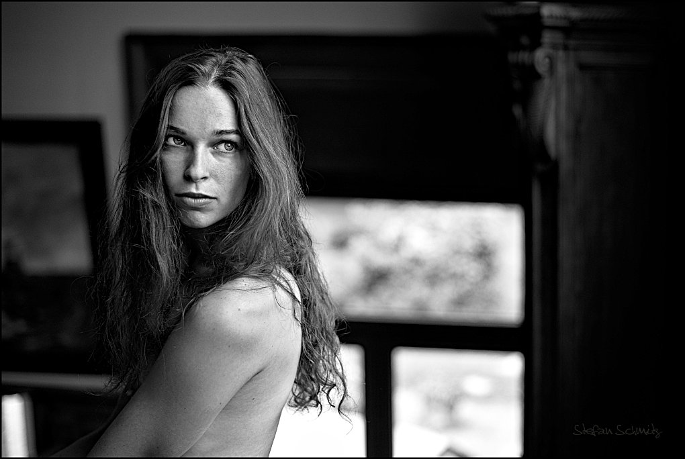
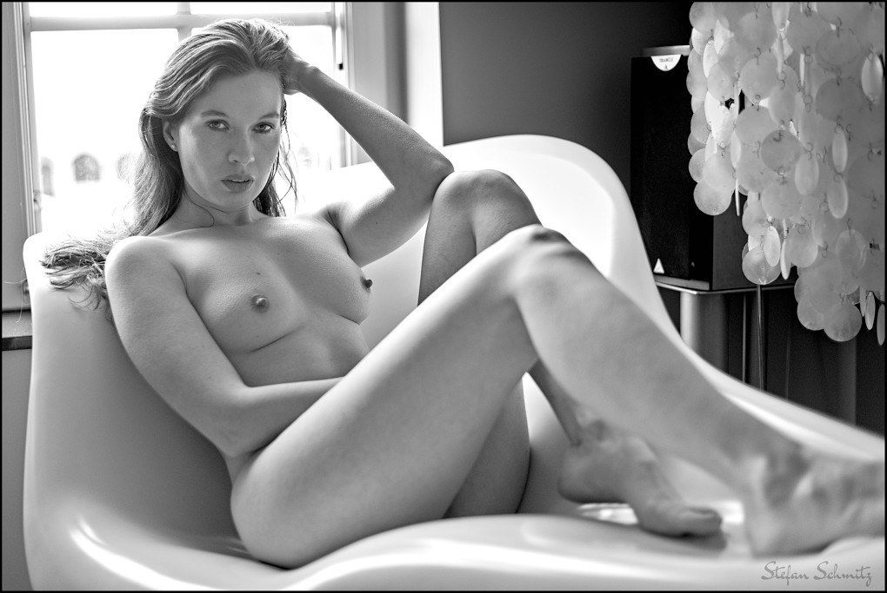
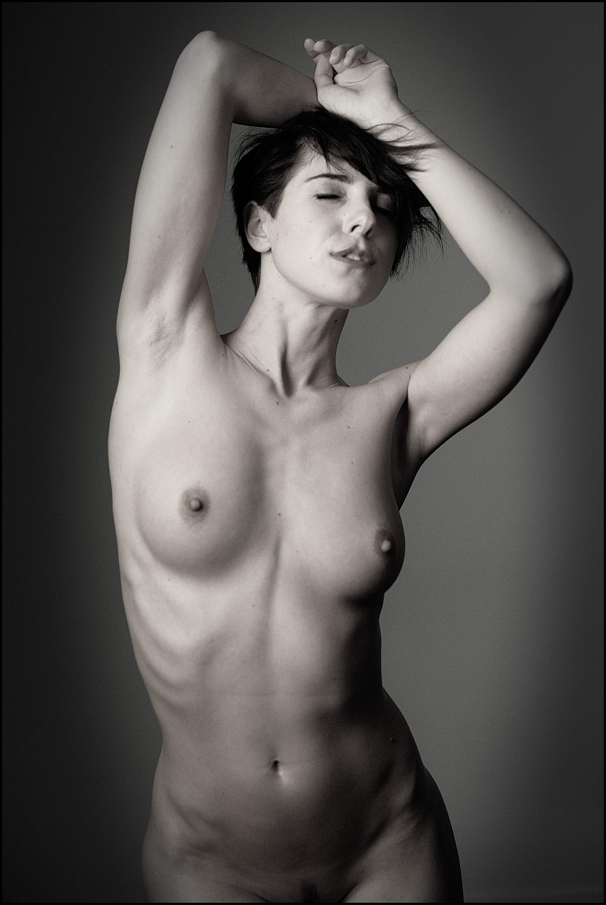

[Stefan Schmitz][] is a photographer living in Northern France and specializing in sensual and nude portraits.
I stumbled upon his work during one of my searches for photographers using Free Software on [Flickr][], and as someone who loves shooting portraits his work was an instant draw for me.

<figure class='big-vid'>

<figcaption>
[Franzi Skamet](https://www.flickr.com/photos/stefanschmitz/25163948263/) by Stefan Schmitz
</figcaption>
</figure>

<figure class='big-vid'>

<figcaption>
[Khiara Gray](https://www.flickr.com/photos/stefanschmitz/29264777344/) by Stefan Schmitz
</figcaption>
</figure>

He's a member of the forums here (@beachbum) and was gracious enough recently to spare some time chatting with me.  Here is our conversation (edited for clarity)...

### Are you shooting professionally?

Nope, I’m not a professional photographer, and I think I’m quite happy about that. I do happen to photograph my surroundings for &plusmn;40 years now, and I have a basic idea about camera-handling and light. Being a pro is about paying invoices by shooting photos, and I fear that the pressure at the end of some months or quarters can easily take the fun out of photography. I’m an engineer and photography is my second love behind wife and kids.

Every now and then some of my pictures are requested and published by some sort of magazine, press or web-service, and I appreciate the attention and exposure, but there is no (or very little) money in the kind of photography I specialize in, so … everything’s OK the way it is.

<figure>

<figcaption>
[Khiara Gray](https://www.flickr.com/photos/stefanschmitz/28484512994/) by Stefan Schmitz
</figcaption>
</figure>

### What would you say are your biggest influences?

Starting with photographers: [Andreas Feininger][], [Peter Lindbergh][] and [Alfred Stieglitz][]. Check out the portrait of [Georgia O’Keeffe][] by Alfred Stieglitz: it’s 100 years old and it’s all there. Pose, light, intensity, personality - nobody has invented anything [like it] afterwards. We all just try to get close. I feel the same when I look at images taken by Peter Lindbergh, but my eternal #1 is Andreas Feininger. 

<figure>

<figcaption>
Georgia O'Keeffe by Alfred Stieglitz
</figcaption>
</figure>

I got the photo-virus from my father and I learned nearly everything from daddy’s well-worn copy of _The Complete Photographer_ <a href="https://www.amazon.com/Complete-Photographer-Andreas-Feininger/dp/0131622145/ref=as_li_ss_tl?s=books&keywords=the+complete+photographer&ie=UTF8&qid=1525725015&sr=1-4&ref_=nav_ya_signin&_encoding=UTF8&linkCode=ll1&tag=httpblogpatda-20&linkId=7b777d7283db5795f369187731d437c5" title="Amazon affiliate link">[amzn]</a> (Feininger) from 1965. Every single photo in that book is a masterpiece, even the strictly “instructional” ones. You measure every photo-book in the world against this one and they all finish second. Get your copy!

[Andreas Feininger]: https://en.wikipedia.org/wiki/Andreas_Feininger "Andreas Feininger on Wikipedia"
[Peter Lindbergh]: https://en.wikipedia.org/wiki/Peter_Lindbergh "Peter Lindbergh on Wikipedia"
[Alfred Stieglitz]: https://en.wikipedia.org/wiki/Alfred_Stieglitz "Alfred Stieglitz on Wikipedia"
[Georgia O’Keeffe]: https://de.wikipedia.org/wiki/Georgia_O%E2%80%99Keeffe "Georgia O'Keeffe on Wikipedia"

### How would you describe your own style overall?

I shoot portraits of women and most of the time they don’t wear clothes. The _portrait_-part is very important for me: the model must connect with the viewer and ideally the communication goes beyond skin-deep. I want to see (and show) more than just the surface, and when that happens, I just press the shutter-button and try to get out of the way of the model’s performance.

<figure class='big-vid'>

<figcaption>
[Jennifer Polska](https://www.flickr.com/photos/stefanschmitz/38138319342/) by Stefan Schmitz
</figcaption>
</figure>

<figure class='big-vid'>

<figcaption>
[Franzi Skamet](https://www.flickr.com/photos/stefanschmitz/25163948263/) by Stefan Schmitz
</figcaption>
</figure>

### What motivates you when deciding what/how/who to shoot?

I like women, so I take photos of women. If I were interested in beetles, I’d buy a macro lens and shoot beetles. All kidding aside, I think it’s a natural thing to do. I am married to a beautiful woman, an ex-model, and when she got fed-up with my eternal “can we do one more shoot” requests, we discussed things and she allowed me to go ahead and shoot models. Her support is very important to me, but her taste is very different from mine.
I really never asked myself “why” I shoot sensual portraits and nudes. It just feels like “I want to do that” and I feel comfy with it. Does there have to be a reason?

The location is very important for me. Nothing is more boring than blinding a person with a flashlight in front of a gray wallpaper. A room, a window-sill, a landmark - there’s a lot of inspiration out there, and I often think “this is where I want to shoot”. Sometimes my wife tells me of some place she has been to or seen, and I check that out.

### If you had to pick your own favorite 3 images of your work, which ones would you choose and why?

<figure class='big-vid'>

<figcaption>
[Jennifer Polska](https://www.flickr.com/photos/stefanschmitz/38138319342/) by Stefan Schmitz
</figcaption>
</figure>

Jennifer is a very professional and inspiring model. We've worked together quite a number of times and while you may think that this shot was inspired by The Who's "Pinball Wizard", I'd answer "right band, wrong song".  It's The Who, alright, but the song's "A quick one while he's away".
I chose this photo because it's all about Jennifer's pose and facial expression. It's sensual, even sexy, but looking at Jennifer's face you forget about the naked skin and all. There's beauty, there's depth ... that's what I'm after.

<figure class='big-vid'>

<figcaption>
[Alice](https://www.flickr.com/photos/stefanschmitz/35542014503) by Stefan Schmitz
</figcaption>
</figure>

This shot of Alice is an example for the importance of natural light. There are photographers out there who can arrange light in a similar way, but I doubt that Alice would express this natural serenity in a studio setup with cables and stands and electric-transformers humming. 
She's at ease, the light is perfect - I just try to be invisible because I don't want to ruin the moment.

<figure class='big-vid'>

<figcaption>
[Khiara Gray](https://www.flickr.com/photos/stefanschmitz/29264777344/) by Stefan Schmitz
</figcaption>
</figure>

Try to escape Khiara's eyes. Go, do it. It's all there, the pose, the room, the ribbon-chair and the little icon, but those eyes make the picture. I did NOT whiten the eyeballs nor did I dodge the iris, and of course it's all natural/available light.  

### If you had to pick 3 favorite images from someone else, which ones would you choose and why? 

I already named Stieglitz' Georgia O'Keeffe as an inspiration further up - next to that there's Helmut Newton's _Big Nude III, Henrietta_ and Kim Basinger's striptease in 9 1&frasl;2 weeks (white silk nighty and  all).  Each one a masterpiece, each one very influential for me. Imagine the truth and depth of Georgia with the force and pride of Henrietta and the erotic playfulness of Kim Basinger. That photo would rule the world.

<figure>

<figcaption>
_Big Nude III, Henrietta_, [Helmut Newton](https://en.wikipedia.org/wiki/Helmut_Newton)
</figcaption>
</figure>

### Is there something outside of your comfort zone you wish you could try/shoot more of?

I would like to work more with women above the age of 35, but it’s hard to find them. In general they stop modeling nude when the kids arrive.

Shooting more often outdoors would be cool, too, but that’s not easy here in northern France - there is no guarantee for good weather, and it’s frustrating when you organize a shoot two weeks in advance just to call it off in the very last minute due to bad weather.

Last but not least there’s a special competition among photographers; it’s totally unofficial and called “the white shirt contest”. Shoot a woman in a white shirt and make everybody “feel” the texture of that shirt. I give it a try on every shoot and very few pictures come out the way I wish. Go for it - it’s way harder than I thought!

<figure class='big-vid'>

<figcaption>
[Alice](https://www.flickr.com/photos/stefanschmitz/35953665920/) by Stefan Schmitz
</figcaption>
</figure>

### How do you find your models usually?

There are websites where models and photographers can present their work and get in contact. The biggest-one worldwide is modelmayhem.com, and I highly recommend to become a member. Another good place is tumblr.com, but you have to go through a lot of dirt before you find some true gems. I have made contact via both sites and I recommend them.

You will need some pictures in your portfolio in order to show that you are - in fact - a photographer with a basic idea of portrait-work. If you shoot portraits (I mean really portraits, not some snapshots of granny and the kids under the Christmas-tree), you probably have enough photos on your disk to state the point. But if you don’t and you want to start (nude) portraits, spend some money on a workshop. I did that twice and it really helped me in several ways: communication with the model, how to start a session, do's and don’ts - and at the end of the day you will drive home with a handful of pictures for your portfolio.

<figure class='big-vid'>

<figcaption>
[Hannah](https://www.flickr.com/photos/stefanschmitz/30576600621/) by Stefan Schmitz
</figcaption>
</figure>

### Speaking of gear, what are you shooting with currently (or what is your favorite setup)?

Gear is overrated. I am with Nikon since 1979 and today I own and use two bodies: a 1975 Nikon F2 photomic (bought used in 82), loaded with Kodak Tri-X and a Nikon D610 DSLR. 90% of my pictures are shot with a 50mm standard lens.  Next on the list is the 35mm - you will need that in small rooms when the 50mm is already a bit too long and you want to keep some distance. I happen to own a 85mm, but the locations I book and shoot rarely offer enough space to make use of that lens.

There are these cheap, circular 1m silver reflectors on amazon. They cost about 15 €/$ and you get a crappy stand for the same price. That stuff is pure gold - I use the reflector a lot and I highly recommend to learn how to work with it. It’s my little secret weapon when I shoot against the light (see Alice here above).

A camera with a reasonably fast standard lens, a second battery and a silver reflector is all I need. The rest is luxury for me, but I am pretty much a one-trick-pony. Other photographers will benefit more from a bigger kit.

### Most of your images appear to be making great use of natural light. Do you use other lighting gear (speedlights, monoblocks, modifiers, etc)?

Right - available light is where it’s at. I very rarely shoot with a flash kit today because it distracts me from the work with the model. I’m a loner on the set, no assistants or friends who come and help, so everything must be totally simple and foolproof.

Saying that, I own an alarming number of speedlights, umbrellas, triggers and softboxes, but I don’t need that gear very often. I try to visit the locations before I shoot.  I check the directions and plan for a realistic timeframe, so today I will neither find myself in a totally dark dungeon nor in a sun-filled room with contrasts à gogo. Windows to the west - shoot in the morning, windows facing south-east: shooting in the (late) afternoon.

<figure>

<figcaption>
[Karolina Lewschenko](https://www.flickr.com/photos/stefanschmitz/31516298240/) by Stefan Schmitz
</figcaption>
</figure>

Here's a shot of Karolina Lewschenko. We took this photo in a hotel room by the end of October and the available (window) light got too weak, so I used an Aurora Firefly 65 cm softbox with  a Metz speedlight and set-up some classic Rembrandt-Light. I packed that gear because I knew that our timeframe wasn't guaranteed to work out perfectly. "Better be safe than sorry".

<figure class='big-vid'>

<figcaption>
[Franzi Skamet](https://www.flickr.com/photos/stefanschmitz/25163948263/) by Stefan Schmitz
</figcaption>
</figure>

### Do you pre-visualize and plan your shoots ahead of time usually, or is there a more organic interaction with the model and the space you’re shooting in?

Yes, I do. When I visit a place, a possible location, I have some Ideas of where to shoot, what furniture to push around and what pose to try. I can pretty much see the final picture (or my idea of it) before I book the model. Having said that, you know that no battle-plan has ever survived the first shot fired…

When the model arrives, we take some time to walk around the locations and discuss possible sets. We will then start to shoot fully clothed in order to get used to another and see how the light will be on the final shots. It’s very important for me to get feedback from the model. She might say that a pose is difficult for her or hurts after a few seconds, that she’s not comfy with something or that she would like to try a totally different thing here. I always pay a lot of attention to those ideas and - out of experience - those shots based on the model’s ideas are in general among the best of the day.

<figure class='big-vid'>

<figcaption>
[Karolina Lewschenko](https://www.flickr.com/photos/stefanschmitz/30900009814/) by Stefan Schmitz
</figcaption>
</figure>

I mean we’re not here because I shoot bugs or furniture, you don't give me the opportunity to express myself here because you are a fan of crickets; all the attention is linked to the beautiful women on my photos and how they connect with the beholder. I am just the one who captures the moments, it’s the models who fill those moments with intensity and beauty. It would be very stupid of me not to cooperate with a model who knows how to present herself and who comes up with her own ideas.

Always listen to the model, always communicate, never go quiet.

The discussion with the model also includes what degree of nudity we consider. So the second round of photos starts with the “open shirt” or topless shots before the model undresses completely. If we take photos in lingerie, we do that last (after the nudes) because lingerie often leaves traces on the skin and we don’t want that to show.

<figure>

<figcaption>
[Franzi Skamet](https://www.flickr.com/photos/stefanschmitz/27984856976/) by Stefan Schmitz
</figcaption>
</figure>

It is important to know what to do and in what order. You don't want to have a nude model standing in front of you, asking “what’s next?” and you answer “I dunno - maybe (!) try this or that again”. If you lose your directions for a moment, just say so or say "please get your bathrobe and let’s have a look at the last pictures together". If you are “not sure”, the model might be “not comfy”, and that’s something we want to avoid.

### Would you describe your workflow a bit? Which projects do you use regularly?

A typical session is 90 to 120 minutes and I will end-up with about 500 exposures on the SD-card and maybe a roll of exposed Kodak Tri-X. The film goes to a lab and I will get the negatives and scans back within 15 to 30 days.

There’s two SD-cards, one with RAW files that I import with [gThumb][] to /photos/year/month/day. The other card holds fine-quality JPG and those go to /pictures/year/name_of_model. My camera is already set to monochrome, I get every picture I shoot in b/w on the camera-screen and the JPG-files are also monochrome. 

[gThumb]: https://wiki.gnome.org/Apps/Gthumb

Next step is a pre-selection in [Geeqie][]. That’s one great picture viewer and I delete all the missed shots (bad framing, out of focus etc.) and note/mark all the promising/good shots here. This is normally the end of day one.

[Geeqie]: http://geeqie.org/

Switching from [RAWstudio](https://rawstudio.org/) to [darktable](https://darktable.org/) has been a giant step for me. dt is just a great program and I still learn about new functions and modules every day. The file comes in, is converted to monochrome and afterwards color saturation and lights (red and yellow) are manipulated . This way I can treat the skin (brighter or darker) without influencing the general brightness of the picture. Highlights and lowlights may be pushed a bit to the left and I add the signature and a frame 0,5% wide, lens correction is set automatically. That’s the whole deal. On very rare occasions I add some vignette or drop the brightness gradually from top to bottom, but again: it doesn't happen all that often. I never cut, crop or re-frame a shot. WYSIWYG. Cropping something out, turning the picture in order to get perfectly vertical lines or the likes - it all feels like cheating. I have no client to please, no deadline to meet, I can take a second longer and frame my photo when I look through the viewfinder.

<figure>

<figcaption>
[Franzi Skamet](https://www.flickr.com/photos/stefanschmitz/25464237123/) by Stefan Schmitz
</figcaption>
</figure>

The photos will then be treated in the [GIMP](https://www.gimp.org). Some dodge and burn (especially when there are problematic, very high or low contrasts), maybe stamp an electric plug away and in the end I re-size them down to 2560 on the long side (big enough for A3 prints) and (sometimes) apply the sharpening tool with value 20 or 25. Done. I can’t save a crappy shot in post-prod and I won’t try. Out of the 500 or so frames, 10 to 15 will be processed like that and it feels like nothing has changed over the last 40 years. The golden rule was “one good shot per roll of film” and I happen to be there, too. Spot-on!

I load those 15 pictures up on my [Flickr account][flickr-stefan] and about once or twice a week I place a shot in the many Flickr groups. Also once a week (or every ten days) I post a photo on my [Tumblr account][Tumblr]. Today I have about 5k followers and my photos are seen between 500’000 and one million times a month, depending on the time of year and weather. There’s less traffic on warm summer days and more during cold and rainy winter-nights.

It takes me some time before I add a shot to [my own website][Stefan Schmitz]. In comparison I show few photos there, every one for a reason and I point point people to that address, so I hope I only show the best.

<figure class='big-vid'>

<figcaption>
[Aya Kashi](https://www.flickr.com/photos/stefanschmitz/28006743752/) by Stefan Schmitz
</figcaption>
</figure>

### Is your choice to use Free Software for pragmatic reasons, or more idealistic?

I owned an Apple II in 1983 and a digital MicroVax in 1990 or so. My way to FOSS started out pragmatic and it became a conviction later on. In the late 90's and early 2000's I had my own small business and worked with MS Office on a Win NT machine. Photos were processed with a Nikon film-scanner through the proprietary software into an illegal copy of Adobe PS4. It was OK, stable and I didn't fear anything, but I wasn't really happy neither. One day I swung over to Star-Office/OpenOffice.org for financial reasons and I also got rid of that unlicensed PS and installed the GIMP (I don’t know what version, but I upgraded some time later to 1.2, that’s for sure). I had internet access and an email address since 1994, but in the late 90's big programs still came on CDs attached to computer-magazines. Downloading the GIMP was out of question.

Gaming was never my thing and when I installed Win XP, all hell broke lose - keeping a computer safe, virus-free and running wasn't easy before the first service pack, but MS reacted way too slow in my opinion - I tried debian (10 CD kit) on my notebook, got it running, found the GIMP and OOo - and that was it. It took a bit of trial and error and I had to buy a number of W-Lan sticks because very few were supported and so on, but in the end I got the machines running.

Later on I got hold of an Ubuntu 7.10 CD, tried that and never looked back. The few changes on my system were from Gnome to XFCE desktop and from Thunderbird to a browser-based mail-client. Xubuntu is a no-brainer, it runs stable and fast. I contribute every December 100.- € to FOSS. That’s in general 50 and 40 to two projects and a tenner to [Wikipedia](https://www.wikipedia.com). I’d spend an extra tenner to any project that helps to convert old star-office files (.sdw and so on) to today’s standards (odt…), but nobody seems interested.

### What is one piece of advice you would offer to another photographer?

Don’t take any advise from me, i’m still learning myself. Or wait: be kind and a gentleman with the models. They all - each and everyone of them - have had bad experiences with photographers who forgot that the models are nude for the camera, not for the man behind it. They all have been in a room with a photographer who breathes a bit too hard and doesn't get his gear working … don’t be that arsewipe!

<figure>

<figcaption>
[Irina](https://www.flickr.com/photos/stefanschmitz/17790276476/) by Stefan Schmitz
</figcaption>
</figure>

Arrange for a place where the model can undress in privacy - she didn't come for a strip-show and you shouldn't try to make it one. Have some bottles of water at hand and talk about your plans, poses and sets with the model. Few people can read minds, so communication works best when you say what you have in mind and the model says how she thinks this can be realized. The more you talk, the better you communicate, the better the pictures. No good photo has ever been shot during a quiet session, believe me.

In general the model will check your portfolio/website and expect to do more or less the same kind of work with you. If you want to do something different, say so when booking the model. If your website shows a lot of nude portraits, models will expect to do that kind of photos. They may be a bit upset if you ask them out of nowhere to wear a latex suit because it’s fetish-Friday in your world. The more open and honest you are from the beginning, the better the shooting will go down.

<figure>

<figcaption>
[Irina](https://www.flickr.com/photos/stefanschmitz/17196207163/) by Stefan Schmitz
</figcaption>
</figure>

Don’t overdo the gear-thingy. 90% of my photos are taken with the 50mm standard lens. Period. Sometimes I have to switch to 35mm because the room is a bit to small and the distance too close for the one four-fifty, so everything I bring to an indoor-shooting is the camera, a 50, a 35, an el-cheap-o 100cm reflector from amazon (+/- 15 €/$) and an even cheaper stand for the reflector. Gear is not important, communication is.

Want to spend 300 €/$ on new gear? Spend it on a workshop. Learn how to communicate, get inspiration and fill your portfolio with a first set of pictures, so the next model you email can see that you already have some experience in the field of (nude) portraits. That’s more important than a new flashlight in your bag.

<figure class='big-vid'>

<figcaption>
[Isabelle Descamps](https://www.flickr.com/photos/stefanschmitz/39424595835/) by Stefan Schmitz
</figcaption>
</figure>

## Thank You Stefan!

I want to thank Stefan again for taking the time and being patient enough to chat with me!

<figure>

</figure>

[Stefan Schmitz]: https://whatstefansees.com/ "what stefan sees - sensual & nude photography, Hauts de France"
[Flickr]: https://www.flickr.com "Flickr"

Stefan is currently living in Northern France.  Before that he lived and worked in Miami, FL, and Northern Germany where he is from, went to school, and met his wife.  His main website is at https://whatstefansees.com/, and he can be found on [Flickr][flickr-stefan], [Facebook][], [Twitter][], [Instagram][], and [Tumblr][].

[Facebook]: https://www.facebook.com/Stefan.Schmitz.Photo
[Twitter]: https://twitter.com/whatstefansees
[Instagram]: https://www.instagram.com/stafan.a.schmitz/
[Tumblr]: http://whatstefansees.tumblr.com/
[flickr-stefan]: https://www.flickr.com/photos/stefanschmitz/

Unless otherwise noted, all of the images are copyright Stefan Schmitz (all rights reserved) and are used with permission.
