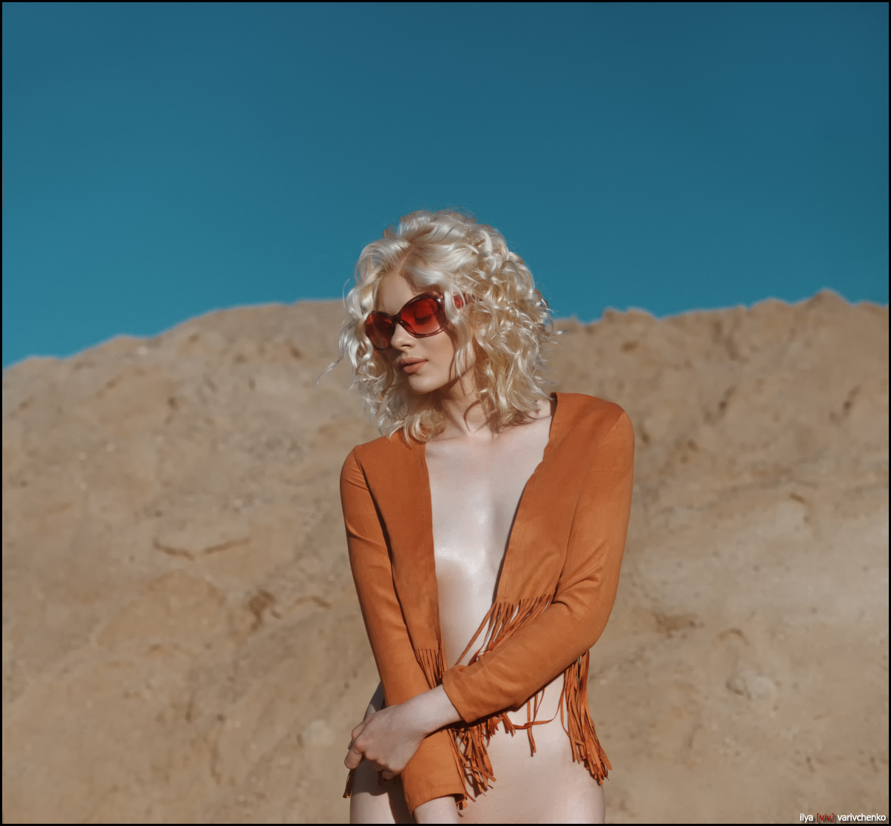
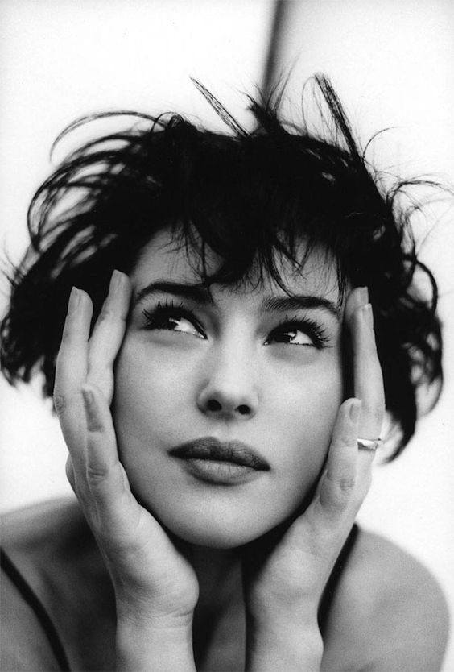
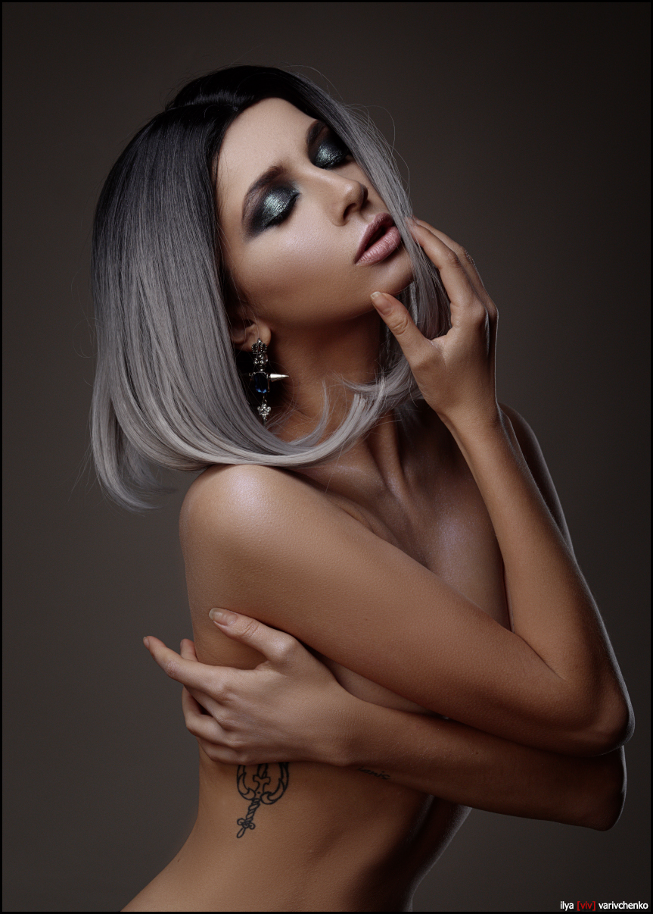
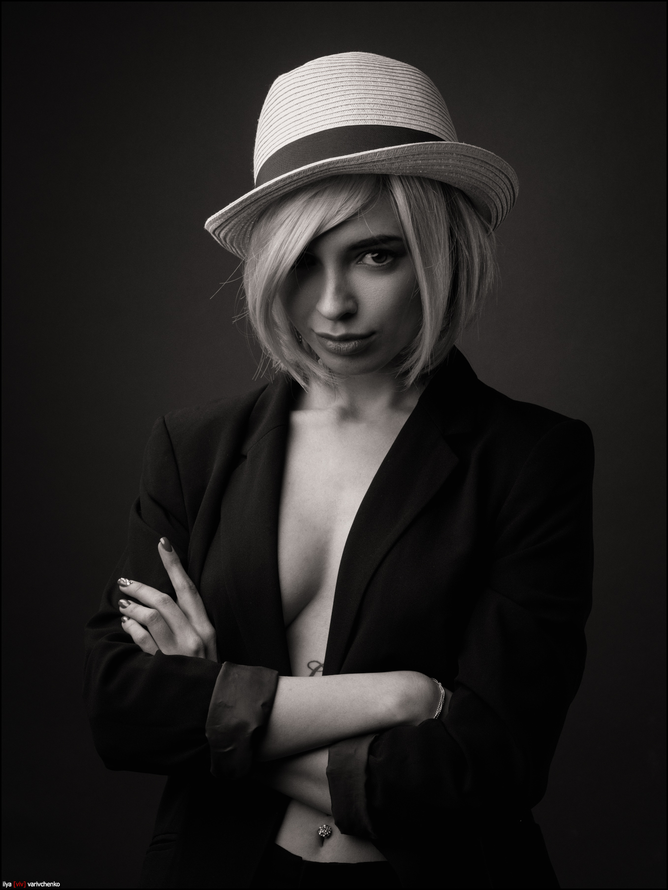

[Ilya Varivchenko][ilya] is a fashion and portrait photographer from Ivanovo, Russian Federation.  He's a UNIX administrator with a long-time passion for photography that has now become a second part-time job for him.  Working on location and in his studio, he's been producing [a wonderful body of work][blog] specializing in portraiture, model tests, and more.

He's a member of the community here (@viv), and he was kind enough to spare some time and answer a few questions (plus it gives me a good excuse to showcase some of his great work!).

[ilya]: http://www.varivchenko.com/ "Ilya Varivchenko's Website"
[blog]: http://varivchenko.com/blog/ "Ilya Varivchenko Blog"

<figure>

</figure>

### Much of your work feels very classical in posing and light, particularly your studio portraits.  What would you say are your biggest influences?

I am influenced by several time painters and great modern photographers.   Some of them are: [Patrick Demarchelier][], [Steven Meisel][] and  [Peter Lindbergh][].
The general mood defines what I see around me. Russia is a very neglected but beautiful country and women around are an inexhaustible source of inspiration.

[Patrick Demarchelier]: https://en.wikipedia.org/wiki/Patrick_Demarchelier
[Steven Meisel]: https://en.wikipedia.org/wiki/Steven_Meisel
[Peter Lindbergh]: https://en.wikipedia.org/wiki/Peter_Lindbergh

<figure>

</figure>

### How would you describe your own style overall?

My style is certainly a classic portrait in its modern performance.

### What motivates you when deciding who/how you shoot?

I usually plan shooting in advance. The range of models is rather narrow and it's not so easy to get there. However, I am constantly looking for new faces.  I choose the style and direction of a particular shooting based on my vision of the model and the current mood.

### Why portraits?  What about portraiture draws you to it?

I shoot portraits because people interest me. For me, photography is an instrument of knowing people and a means of communication.

<figure>

</figure>

### If you had to pick your own favorite 3 photographs of your work, which ones would you choose and why?

It's difficult to choose only three photographs, but maybe these:

<figure>

<figcaption>
This photo was chosen by Olympus as a logo for their series of photo events in Russia 2017.
</figcaption>
</figure>

<figure>

<figcaption>
This is one of my most reproducible photos. ;)
</figcaption>
</figure>

<figure>

<figcaption>
This photo has a perfect mood in my opinion.
</figcaption>
</figure>

### If you had to pick 3 favorite images from someone else, which ones would you choose and why?

It is very difficult to choose only three photos. The choice in any case will be incomplete, but here’s the first ones that comes to mind:

1. The portrait of Heather Stewart-Whyte by [Friedemann Hauss](http://friedemannhauss.eu/):  

<figure>

</figure>

2. The portrait of Monica Bellucci by [Chico Bialas](http://www.chicobialas.com/):

<figure>

</figure>

3) The portrait of Nicole Kidman by Patrick Demarchelier

<figure>

</figure>

### How do you find your models usually?

Via social media which is the best means for model searching, but if I meet a girl I really like in the street, I can try and talk to her straight away.
In fact, the problem is not to find a model, but to choose how to reject a request without offending a prospect model that is of no interest to me.

### Do you pre-visualize and plan your shoots ahead of time usually, or is there a more organic interaction with the model and the space you’re shooting in?

It's always good to have a plan. It is also very good to have a spare plan.

Usually I discuss some common points with the model and stylist before shooting. But these plans are more connected with the mood  and the general idea of the session. So when the magic of shooting begins, usually all the plans fly to hell. ;)

<figure>

</figure>

### Do you have a shooting assistant with you, or is normally just you and the model?

The preparatory stage of shooting often requires participation of many people: a makeup artist, a hair stylist, etc., but shooting itself goes better when only two persons are involved. This is a fairly intimate process. Just like sex. :)

On the other hand, if we do a fashion shoot on order, then the presence of the customer representatives is a must.

### Many shots have a strong editorial fashion feel to them: are those works for magazine/editorial use - or were they personal works you were planning to be that way?

I take pictures for local magazines and advertising agencies sometimes. Maybe it somehow influenced my other work.

<figure>

</figure>

### What do you do with the photos you shoot?

Most of my works are for personal use. 
However, I often print them in a large format and I've also had two solo exhibitions.   Prints with my works are sold and they can always be ordered. I also publish in photo magazines sometimes, but these magazines are russian ones so they are hardly known to you.

By the way: I periodically take part in the events held by [Olympus Russia][], where I demonstrate my workflow. 

This video shows that I use the RawTherapee as a raw converter  :)

    

        <iframe src="https://www.youtube-nocookie.com/embed/t3QUVFkO0lU" frameborder="0" allow="autoplay; encrypted-media" allowfullscreen></iframe>
    

[Olympus Russia]: https://www.olympus.com.ru/

### You’re shooting on Olympus gear quite a bit, are you officially affiliated with Olympus in some way?

On occasions I hold workshops as a part of the Olympus company marketing activities. Sometimes the Olympus company provides me with their products for testing and I am expected to follow up with a review.

### Is your choice to use Free Software for pragmatic reasons, or more idealistic?

The choice was dictated by purely practical considerations. I found a tool, the results of which I am almost completely satisfied with. Detail for example is outstanding, comfortable work with color grading, excellent black and white conversion, and much more.

The fact that the product is free and (which is more important to me) I have an opportunity to communicate with its developers is a huge plus!

For example, with the output of Fuji X-T20, when it was required to add a new DCP profile to the converter I simply contacted the developers, shot the test target and got what I wanted.

<figure>

</figure>

### Would you describe your workflow a bit? Which projects do you use regularly?

My workflow is quite simple:

1. Shooting.
   I try to shoot in a way which will not require heavy postprocessing at all. It is much easier to set up light properly than to fix it in Photoshop later.

2. Raw development with [RawTherapee][].
   My goal is to develop the image in a way which makes it as close to final as possible.
   Sometimes this is the end of my workflow. ;)

3. Color correction (if necessary) with 3DLutCreator.
   In rare cases, it is more convenient to make complex color correction with the help of LUTs.

4. Retouching with Adobe Photoshop. 
   Nothing special. Removal of skin and hair defects, etc. Dodge and burn technique with a Wacom Intuos Pro.

<figure>

</figure>

[RawTherapee]: http://rawtherapee.com/ "RawTherapee website"

### Speaking of gear, what are you shooting with currently?

I have two systems now: Micro Four Thirds system from Olympus and X Series from Fujifilm.
Typical setups are:

Studio: Olympus PEN-F + Panasonic G 42.5/1.7
Planair: Olympus PEN-F + M.Zuiko 75/1.8 or FujiFilm X-T20 + Fujinon 35/1.4

### Many of your images appear make great use of natural light. For your studio lighting setup, what type of lighting gear are you using?

My studio equipment is a mix of Aurora Codis and Bowens studio lights + a lot of modifiers from large 2 meters parabolic octobox to narrow 40x150 strip boxes and so on.

<figure>

</figure>

### Is there something outside your comfort zone you wish you could try/shoot more of?

It is definitely landscape photography. And macro photography also attracts me - ants and snails are all great models in fact. :)

### What is one piece of advice you would offer to another photographer?

Find in yourself what you want to share with others. Beauty is in the eye of the beholder. No beautiful models will help if you are empty inside.

    

        <iframe width="560" height="315" src="https://www.youtube-nocookie.com/embed/f98-mSyyCRM" frameborder="0" allow="autoplay; encrypted-media" allowfullscreen></iframe>
    

<figure>
    
</figure>

---

I want to thank Ilya for taking the time to chat with me!
Take some time to have a look through [his blog and work][] (it's chock full of wonderful work)!

[his blog and work]: http://varivchenko.com/blog/

<small>All images copyright Ilya Varivchenko and used with permission.</small>
