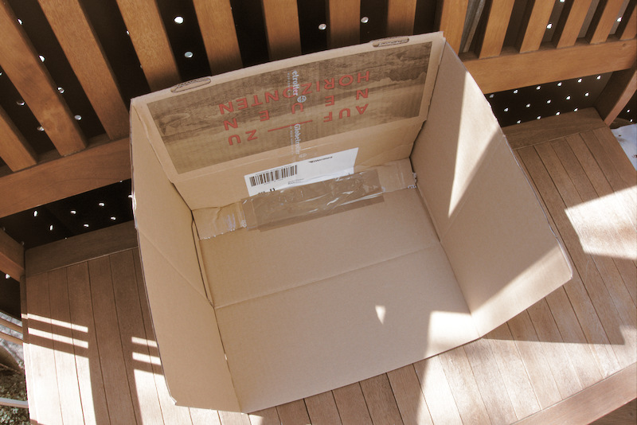
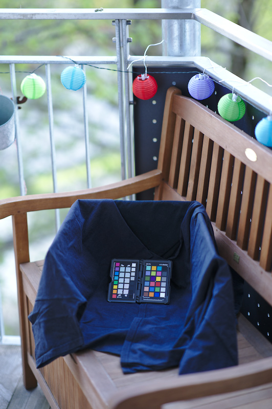
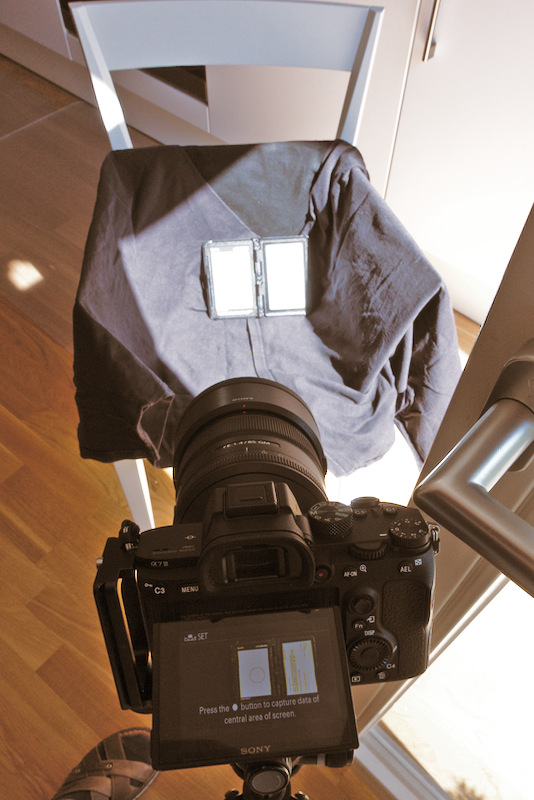
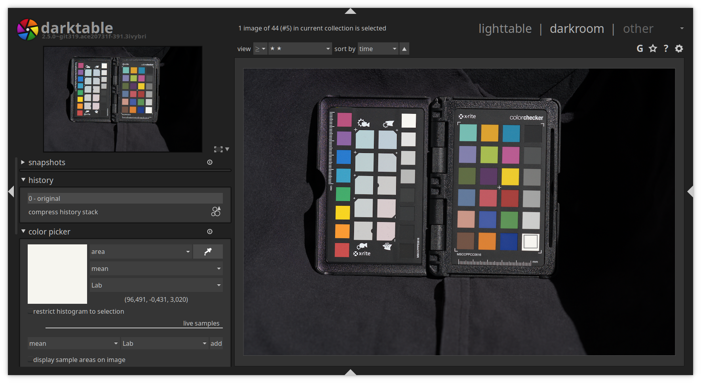
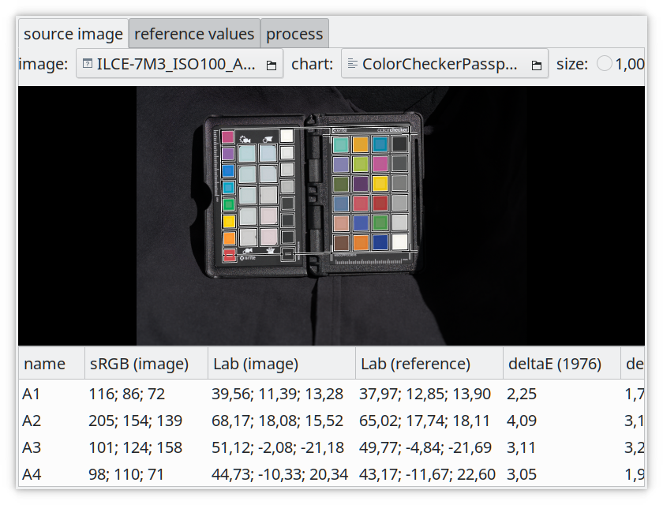
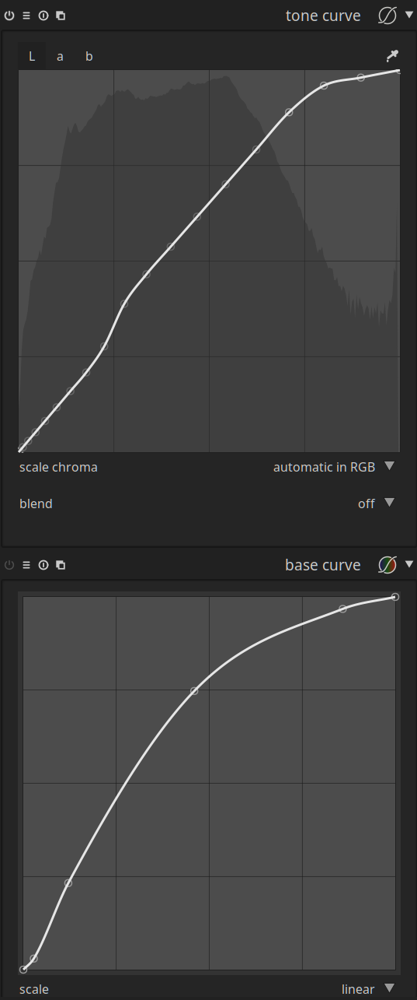
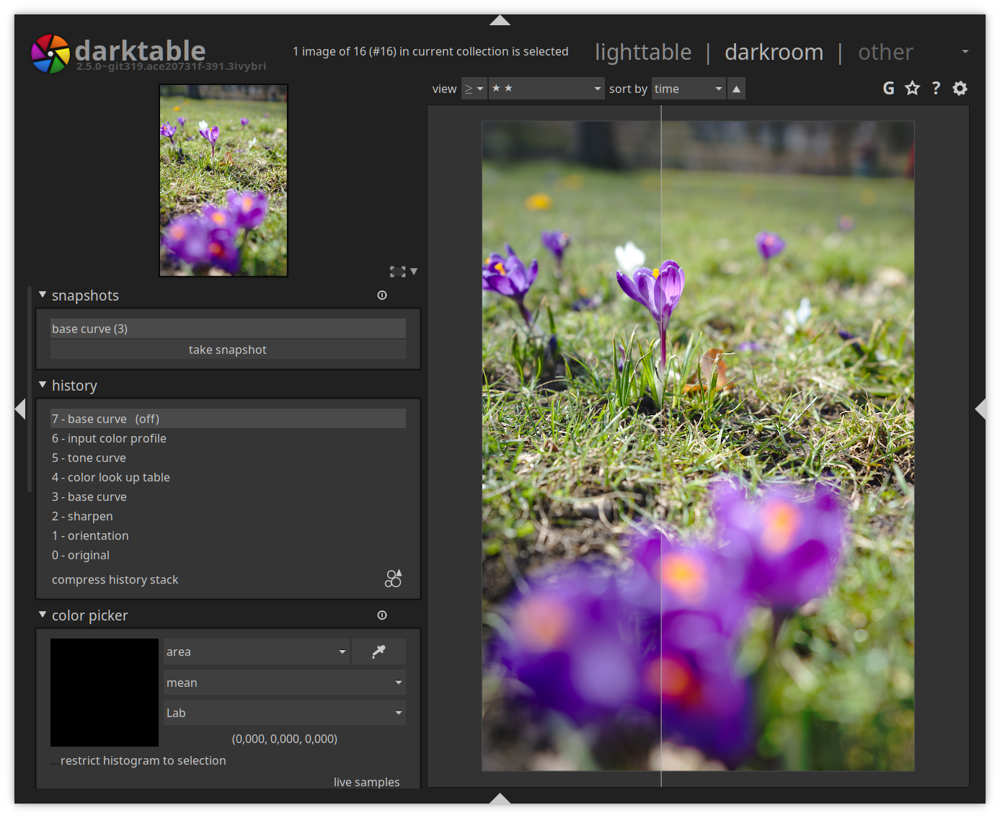

What is a camera profile?
-------------------------

A camera profile is a combination of a color lookup table (LUT) and a tone
curve which is applied to a RAW file to get a developed image. It translates
the colors that a camera captures into the colors they should look like. If you
shoot in RAW and JPEG at the same time, the JPEG file is already a developed
picture. Your camera can do color corrections to the data it gets from the
sensor when developing a picture. In other words, if a certain camera tends to
turn blue into turquoise, the manufacturers internal profile will correct for
the color shift and convert those turquoise values back to their proper hue.

The camera manufacturer creates a tone curve for the camera and understands
what color drifts the camera tends to capture and can correct it. We can mimic
what the camera does using a tone curve and a color LUT. We want to do this as
the base curves provided by darktable are generalised for a manufacturers
sensor behaviour, but indivudually profiling your camera can provide better
color results.

Why do we want a color profile?
-------------------------------

The camera captures light as linear RGB values. RAW development software needs
to transform those into [CIE XYZ tristimulus
values](https://en.wikipedia.org/wiki/CIE_1931_color_space) for mathematical
calculations. The color transformation is often done under the assumption that
the conversion from camera RGB to CIE XYZ is a linear 3x3 mapping. Unfortunately
it is not because the process is spectral and the camera sensor sensitivity
also absorbs spectral light. In darktable the conversion is done the
following way: The camera RGB values are transformed using the color matrix
(either coming from the Adobe DNG Converter or dcraw) to arrive at
approximately profiled XYZ values. darktable provides color lookup table in
[*Lab* color space](https://en.wikipedia.org/wiki/Lab_color_space) to fix
inaccuracies or implement styles which are semi-camera independent. A very cool
feature is that a user can edit the color LUT. This color LUT can be created by
darktable-chart as this article will show so that you don't have to create it
yourself.

What we want to have is the same knowlege about colors in our raw development
software as the manufacturer put into the camera. Therefore we have two ways to
achieve this. Either we fit to a JPEG generated by the camera, which can also
apply creative styles (such as film emulations, filters), or we profile against
*real color* reproduction. For *real color* a color
target ships with a file providing the color values for each patch it has.

In summary, we can create a profile that emulates the manufactures color
processing inside the body, or we can create a profile that renders *real color*
as accurately as possible.

The process for both is nearly identical, and we will note when it diverges in
the instructions.

Creating pictures for color profiling
-------------------------------------

To create the required pictures for camera profiling we need a [color chart
(aka Color Checker)](https://en.wikipedia.org/wiki/ColorChecker) or an [IT8
chart](https://en.wikipedia.org/wiki/Color_chart#IT8_charts) as our target. The
difference between a color chart and and IT8 chart is the number of patches and
the price. As the IT8 chart has more patches the result will be much better.
Optimal would be if the color target comes with a grey card for creating a
custom White Balance. I can recommend the [X-Rite ColorChecker Passport
Photo](https://www.xrite.com/categories/calibration-profiling/colorchecker-passport-photo).
It is small, lightweight, all plastic, a good quality tool and also has a grey
card. An alternative is the [Spyder
Checkr](http://www.datacolor.com/photography-design/product-overview/spyder-checkr-family/).
If you want a better profiling result, a good IT8 chart is the  [ColorChecker
Digital
SG](https://www.xrite.com/categories/calibration-profiling/colorchecker-digital-sg).

Note: ArgllCMS offers *CIE* and *CHT* files for different color charts, if you
already have one or are going to buy one, check if ArgyllCMS offers support for
it first! You can always add support to your color chart to ArgylCMS, but the
process is much more complex. This will be very important later!
You can find these files (generally) in:

    /usr/share/color/argyll/ref/

We are creating a color profile for sunlight conditions which can be used in
various scenarios. For this we need some special conditions.

The Color Checker needs to be photographed in direct light, which helps to
reduce any metamerism of colors on the target and ensures a good match to the
data file, that tells the profiling software what the colors on the target
should look like. However a major concern is glare, but we can reduce it with
some tricks.

One of the things we can do to reduce glare, is to build a simple shooting box.
For this we need a cardboard box and three black t-shirts. The box should be
open on the top and on the front like in the following picture (Figure 1).

<figure>

<figcaption>
<b>Figure 1:</b> Cardboard box suitable for color profiling
</figcaption>
</figure>

Normally you just need to cut one side open. Then coat the inside of the box
with black t-shirts like this:

<figure>

<figcaption><b>Figure 2:</b> A simple box for color profiling
</figcaption></figure>

To further reduce glare we just need the right location to shoot the picture.
Of course, a lot depends on where you are located and the time of year, but in
general, the best time to shoot the target is either 1-2 hours before mid-day
or 1-2 hours after mid-day (when the sun has the highest elevation, keep
Daylight Saving Time (DST) in mind). Try to shoot on a day with minimal clouds
so the sun isn't changing intensity while you shoot. The higher the temperature
the more water is in the atmosphere, which means the quality of the images for
profiling are reduced. Temperatures below 20°C are better than above.

In some countries it may not be possible to accurately produce these images
with sunlight. This could be due to air polution (or lack of), temperature,
humidity, latitude, and atomospheric conditions. For example, in Australia, one might be unable
to use sunlight to create this profile, and would have to use a set of color balanced
bulbs with the same box setup to create this.

### Shooting outdoor

If you want to shoot outdoor, look for an empty tared parking lot. It should be
pretty big, like from a mall, without any cars or trees. You should be far away
from walls or anything which can reflect. Put the box on the ground and shoot
with the sun above your right or left shoulder behind you. You can use a black
fabric (bed sheets) if the ground reflects.

### Shooting indoor

Find a place indoor where you can put the box in the sun and place you camera
with a tripod in the shadow. The darker the room the better! Garages with an
additional garage door are great. Also the sun needs to shine at an angle on
the Color Checker. This means when you photograph the color chart with the sun
above your right or left shoulder behind you. Use a black fabric to cover
anything which could reflect.

### Shooting indoor with artifical light

Avoid all windows and stained glass. Create the box as mentioned, and arrange
it in a V shape with your tripod. At the top left of the V is the camera, at
the bottom is the color target, at the top right is the light source. The
right source should be bright and even across the room and your setup. Position
yourself underneath it to avoid all shadows.

How to shoot the target?
------------------------

1. Put your shooting box in the light and setup your camera on a tripod. The best
   is to have the camera looking down on on the color chart like in the
   following picture:

<figure>

<figcaption><b>Figure 3:</b> Camera doing a custom white balance with the color profiling box
</figcaption></figure>

2. You should use a prime lens for taking the pictures. If possible a 50mm or
   85mm lens (or anything in between). The less glass the light has to travel
   through the better it is for profiling. Thus those two lenses are a good
   choice in the number of glass elements they have and their field of view!
   With a tele lens we would be too far away and with a wide angle lens we
   would need to be too near to have just the black box in the picture.

3. If your camera has a custom white balance feature and you have a gray card
   provided by your target, create a custom white balance with it and use it
   (see figure 3). Put the gray card in your black box in the sunlight at the
   same position as the Color Checker.

4. Set your metering mode to matrix metering (evaluative metering - this is often
   a symbol with 4 boxes and a circle in the centre) and use an aperture of at least
   f/4.0.

5. Make sure the color chart is parallel to plane of the camera sensors
   so all patches of the chart are in focus. The color chart should be in the
   middle of the image using about 1/3 of the screen so that vignetting is
   not an issue.

6. Set the camera to capture "RAW & JPEG" and disable lens corrections
   (vignetting corrections) for JPEG files if possible. This is important
   for JPEG and real color fitting.

Now you want to begin taking images. We want to have a camera profile for the
most used ISO values. So for each ISO value you need to take 4 pictures of your
target. This is so that if an image is over or under exposed, you have the step
above or below that make be exposed correctly. One photo for -1/3 EV,
0 EV, 1/3 EV and 2/3 EV. Start with ISO 100, don't shoot for Extended ISO
values (50, 64, 80). Some cameras (Fuji) ISO 100 is an Extended value, so
start at ISO 200. Normally they are captured with the lowest physical ISO and
overexposed and then exposure is reduced in software. Use the lowest ISO profile
for them. If you approach
the maximum shutter speed (1/8000 commonly, but 1/4000 is not rare), start to
close the aperture. Remember, your
camera may show you 1/8000 shutter for the 0 EV image, so the -1/3 EV image
may be over exposed. I started to close at 1/5000.

Creating profile for values above ISO 12800 doesn't really make sense. Probably after
ISO 6400 the results begin to be not 100% accurate anymore! You can use the
profile for ISO 6400 on higher values. This is for the same reason as the low
ISO values that are software processed. Many mirrorless cameras have a maximum
ISO, and all values above are software processed. Some have a maximum as low as
ISO 2000, others go to ISO 6400.

Once you have done all the required shots, it is time to download the RAW and
JPEG files to your computer.

Verifying correct images in darktable
-------------------------------------

For verifying the images we need to know the L-value from the [*Lab* color
space](https://en.wikipedia.org/wiki/Lab_color_space) of the neutral gray field
in the gray ramp of our color target. For the ColorChecker Passport we can look
it up in the color information (CIE) file
([ColorCheckerPassport.cie](ColorCheckerPassport.cie)) shipping with
[ArgyllCMS](http://www.argyllcms.com/), which should be located at:

    /usr/share/color/argyll/ref/ColorCheckerPassport.cie

The ColorChecker Passport has actually two gray ramps. The neutral gray field
is the field on the bottom right of the color target ramp and is called D1.
On creative enhancement target, the it is on the top right and is called NEU8.
If we check the CIE file, we will find out that
the neutral gray field D1 has an L-value of: *L=96.260066*. Lets round it to
*L=96*. For other color targets you can find the L-value in the description or
specification of your target, often it is *L=92*. Better check the CIE file!

You then open the RAW file in darktable and disable most modules, especially
the [base
curve](https://www.darktable.org/usermanual/en/modules.html#base_curve)! Select
the standard input matrix in the [input color
profile](https://www.darktable.org/usermanual/en/color_group.html#input_color_profile)
module and disable gamut clipping. Make sure "camera white balance" in the
[white
balance](https://www.darktable.org/usermanual/en/modules.html#whitebalance)
module is selected. If lens corrections are automatically applied to your JPEG
files, you need to enable [lens
corrections](https://www.darktable.org/usermanual/en/correction_group.html#lens_correction)
for your RAW files too! Only apply what has been applied to the JPEG file too.

For my configuration I was left with the follown modules enabled:

    Output Color Profile
    Input Color Profile
    Lens Correction (Optional)
    Denoise
    Demosaic
    White Balance
    Raw Black/White Point

**Apply the changes to all RAW files you have created!**

You could consider making a "profiling" style and applying it en-masse.

You can also crop the image but you need to apply exactly the same crop to the
RAW and JPEG file! (This is why you use a tripod!)

Now we need to use the [global color picker
module](https://www.darktable.org/usermanual/en/global_color_picker.html) in
darkroom to find out the value of the natural white field on the color target.

* Open the first RAW file in darkroom and expand the global color picker module
  on the left.
* Select *area*, *mean* and *Lab* in the color picker and use the eye-dropper
  to select the natural gray field of your target. on the Color Checker it's
  on the bottom right. Here is an example:

<figure>

<figcaption><b>Figure 4:</b> Determining the color of the neutral white patch
</figcaption></figure>

* If the value displayed in the color picker module matches the L-value of the
  field or is close (+/-2. This means L=94 to L=98 is acceptable), give the RAW
  file and the corresponding JPEG file 5
  stars. In the picture above it is the first value of: *(96.491, -0.431,
  3.020)*.  This means *L=96.491*, which is what you're looking for on
  this color target. You might be looking for e.g. *L=92* if you are using a
  different Color Checker. See above how to find our the L-value for your
  target.

Exporting images for darktable-chart
------------------------------------

For exporting we need to select *Lab* as output color profile. This color space
is not visible in the combo box by default. You can enable it by starting
darktable with the following command line argument:

    darktable --conf allow_lab_output=true

Or you always enable it by setting allow_lab_output to TRUE in

    ~/.config/darktable/darktablerc
    allow_lab_output=TRUE

As the output format select "PFM (float)" and for the export path you can use:

    $(FILE_FOLDER)/PFM/$(MODEL)_ISO$(EXIF_ISO)_$(FILE_EXTENSION)

Remember to select the *Lab* output color profile here as well.

You need to export all the RAW and JPEG files, not just the RAWs.

**Select all 5 star RAW and JPEG files and export them.**

<figure>

<figcaption><b>Figure 5:</b> Exporting the images for profiling
</figcaption></figure>

Profiling with darktable-chart
------------------------------

Before we can start you need the chart file for your color target. The chart
file contains the layout of the color checker. For example it tells the
profiling software where the gray ramp is located or which field contains
which color. For the "X-Rite Colorchecker Passport Photo" there is a
([ColorCheckerPassport.cht](ColorCheckerPassport.cht)) file provided by
ArgyllCMS. You can find it here:

    /usr/share/color/argyll/ref/ColorCheckerPassport.cht

Now it is time to start darktable-chart. The initial screen will look like
this:

<figure>

<figcaption><b>Figure 6:</b> The darktable-chart screen after startup
</figcaption></figure>

### Source Image

In the source image tab, select your PFM exported RAW file as *image* and for
*chart* your Color Checker chart file. Then fit the displayed grid on your
image.

<figure>

<figcaption><b>Figure 7:</b> Selecting the source image in darktable-chart
</figcaption></figure>

Make sure that the inner rectangular of the grid is completely inside of the
color field, see Figure 8. If it is to big, you can use the size slider in the
top right corner to adjust it. Better too small than too large.

<figure>

<figcaption><b>Figure 8:</b> Placing the chart grid on the source image
</figcaption></figure>

### Reference values

This is the only step where the process diverges for *real color* vs camera
profile creation.

If you are creating a color profile to match the manufacturers color
processing in body, you will want to select *color chart image* and as the
*reference image* select the PFM exported JPEG file which corresponds to the
RAW file in the source image tab. Once opened you need to resize the grid again
to match the Color Checker in your image. Adjust the size with the slider if
necessary.

<figure>

<figcaption><b>Figure 9:</b> Selecting the reference value for profiling in darktable-chart
</figcaption></figure>

If you are creating a color profile for *real color*, select the mode as
*cie/it8 file* and load the corresponding CIE file for your color target. If
you have issues with this, run darktable-chart from the CLI and check the output.
I found that my chart would not open with:

    error with the IT8 file, can't find the SAMPLE_ID column

It's worth checking the 'Lab (reference)' values at the bottom of the display
to ensure they match what you expect and were correctly loaded. I saw some
cool (but incorrect) results when they did not load!

### Process

In this tab you're asked to select the *patches with the gray ramp*. For the
'X-Rite Color Checker Passport' these are the 'NEU1 .. NEU8' fields. The input
*number of final patches* defines how many editable color patches the resulting
style will use within the color look up table module. More patches gives a
better result but slows down the process. I think 32 is a good compromise.

Once you have done this click on 'process' to start the calculation. The
quality of the result in terms of average delta E and maximum delta E are
displayed below the button. These data show how close the resulting style
applied to the source image will be able to match the reference values – the
lower the better.

You must click process each time you change source images or reference chart
to generate the new profiles. Sometimes process is "greyed out", so simply
toggling the grey ramp setting will reactivate it.

After running 'process', click on 'export' to save the darktable style.

<figure>

<figcaption>
<b>Figure 10:</b> Processing the image in darktable-chart
</figcaption>
</figure>

In the export window you should already get a good name for the style. Add a
leading zero for ISO values smaller than 1000 get get correct sorting in the
styles module, for example: *ILCE-7M3_ISO0100_JPG.dtstyle*. The JPG in the name
should indicate that we fitted against a JPG file. If you fitted against a CIE
file, remove the CIE filename from the style name. If you applied a creative style
(for example, a film emulation or filter in the camera).
to the JPG, probably add it at the end of the file name and style name.

Importing your dtstyle in darktable
-----------------------------------

To use your just created style, you need to import it in the [style
module](https://www.darktable.org/usermanual/en/styles.html) in the lighttable.
In the lighttable open the module on the right and click on 'import'. Select
the dtstyle file you created to add it. Once imported you can select a raw file
and then double click on the style in the 'style module' to apply it.

Open the image in darkroom and you will notice that the [base
curve](https://www.darktable.org/usermanual/en/modules.html#base_curve) has
been disabled and a few modules been enabled. The additional modules activated
are normally: [input color
profile](https://www.darktable.org/usermanual/en/color_group.html#input_color_profile),
[color lookup
table](https://www.darktable.org/usermanual/en/color_group.html#color_look_up_table)
and [tone
curve](https://www.darktable.org/usermanual/en/tone_group.html#tone_curve).

Verifying your profile
----------------------

To verify the style you created you can either apply it to one of the RAW files
you created for profiling. Then use the global color picker to compare the
color in the RAW with the style applied to the one in the JPEG file.

I also shoot a few normal pictures with nice colors like flowers in RAW and
JPEG and then compare the result. Sometimes some colors can be off which can
indicate that your pictures for profiling are not the best. This can be because
there were some kind of clouds, glare or the wrong daytime. Redo the shots till
you get the result you're satisfied with.

Sadly this is a trial and error process, so you will have to create some number
of profiles before you find the results you want. It's a good idea to
read this article again to see if you missed any important steps.

How does the result look like?
------------------------------

In the following screenshot (Figure 11) you can see the calculated tone curve by darktable
chart and the Sony base curve of darktable. The tone curve is based on the color LUT. It will
look flat if you apply it without the LUT.

<figure>

<figcaption>
<b>Figure 11:</b> Comparison of the default base curve with the new generated tone curve
</figcaption>
</figure>

Here is a comparison between the base curve for Sony on the left and the
dtstyle (color LUT + tone curve) created with darktable-chart:

<figure>

<figcaption>
<b>Figure 12:</b> Side by side comparison on an image (left the standard base curve, right the calculated dtstyle)
</figcaption>
</figure>

Other ideas
-----------

This process will work for extracting in-body black and white profiles, as
well as creative color profiles. I see a significant improvment in black
and white profiles from this process over the use of some of the black and white
modules in darktable.

You may find that the lowest ISO profile may provide pretty good results for
higher ISO values. This will save you a lot of time profiling, and allows
you to blanket-apply your profile to all your images quickly - you only
need one profile now! This is highly
dependant on your camera however, so experiment with this.

These profiles *should* work in all light conditions, provided your white
balance is correct. Given you now have a color target, you should always take
one photo of it, so you can correct the whitebalance later.

Discussion
----------

As always the ways to get better colors are open for discussion an it can be
improved in collaboration.

Feedback is very welcome.

Thanks to the darktable developers for such a great piece of software! :-)

*Updated 2018-07-24 by William Brown based on my own profiling experience following this tutorial.*
