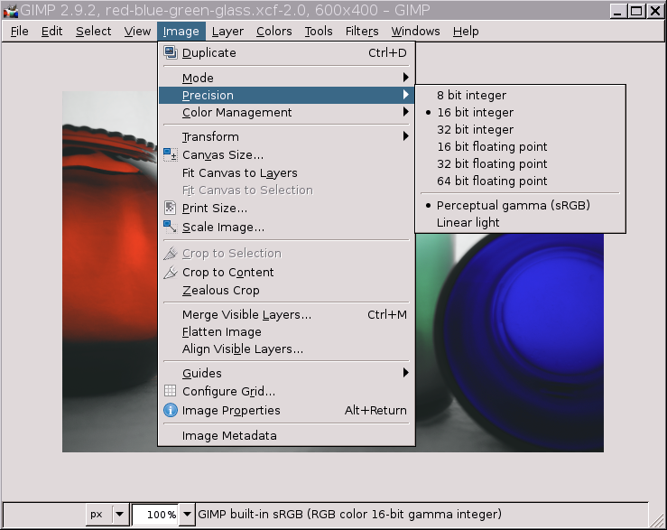
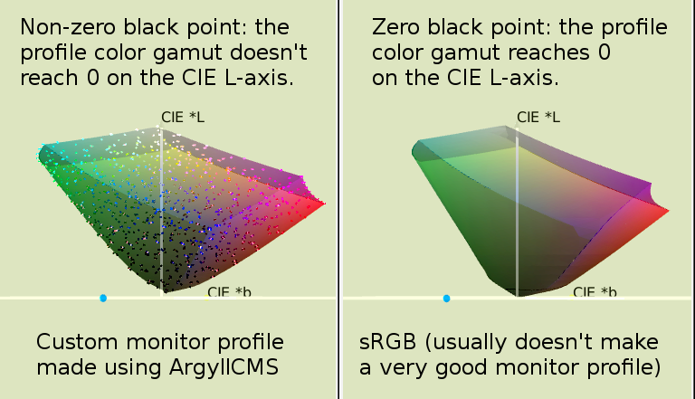

<!-- ## New high bit depth precision options, New color management options, New algorithms -->

### Contents

<ol class='toc'>
    <li><a href="#introduction-high-bit-depth-gimp-2-9-2">Introduction: high bit depth GIMP 2.9.2</a>

        <ol>
        <li><a href="#purpose-of-this-guide">Purpose of this guide</a></li>
        <li><a href="#useful-links-the-official-gimp-website-builds-for-windows-and-mac-building-gimp-on-linux">Useful links: the official GIMP website, builds for Windows and MAC, building GIMP on Linux</a></li>
        <li><a href="#editing-in-srgb-vs-editing-in-other-color-spaces">Editing in sRGB vs editing in other color spaces</a></li>
        <li><a href="#a-note-about-the-gamma-hack-that-s-provided-for-many-editing-operations">A note about the “Gamma hack” that’s provided for many editing operations</a></li>
        </ol></li>

    <li><a href="#new-high-bit-depth-precision-options">New high bit depth precision options</a>

        <ol>
        <li><a href="#menu-for-choosing-the-image-precision">Menu for choosing the image precision</a></li>
        <li><a href="#which-precision-should-you-choose-for-editing-">Which precision should you choose for editing?</a></li>
        <li><a href="#using-the-image-precision-options-when-exporting-an-image-to-disk">Using the image precision options when exporting an image to disk</a></li>
        </ol></li>

    <li><a href="#new-color-management-options">New color management options</a>

        <ol>
        <li><a href="#gimp-2-9-2-automatically-detects-camera-dcf-information">GIMP 2.9.2 automatically detects camera DCF information</a></li>
        <li><a href="#black-point-compensation">Black point compensation</a></li>
        </ol></li>

    <li><a href="#new-and-updated-algorithms-for-converting-to-luminance-lab-and-lch">New and updated algorithms for converting to Luminance, LAB, and LCH</a>

        <ol>
        <li><a href="#converting-srgb-images-from-color-to-black-and-white-using-luma-and-luminance">Converting sRGB images from Color to Black and White using Luma and Luminance</a></li>
        <li><a href="#decomposing-from-srgb-to-lab">Decomposing from sRGB to LAB</a></li>
        <li><a href="#lch-the-actually-usable-replacement-for-the-entirely-inadequate-color-space-known-as-hsv-">LCH: the actually usable replacement for the entirely inadequate color space known as “HSV”</a></li>
        </ol></li>
</ol>

---

## Introduction: high bit depth GIMP 2.9.2

### Purpose of this guide

As announced on the GIMP users and developers mailing lists, the recent (November 26, 2015) GIMP 2.9.2 release is <a title="GIMP user's mailing list: ANNOUNCE: GIMP 2.9.2 released" href="https://mail.gnome.org/archives/gimp-user-list/2015-November/msg00066.html">the first development release in the GIMP 2.9.x series leading to GIMP 2.10</a>. The release announcement summarizes the many code changes that were made to port the old GIMP code over to GEGL's high bit depth processing. 

This user's guide to high bit depth GIMP 2.9.2 introduces you to some of high bit depth GIMP's new editing capabilities that are made possible by GEGL's high bit depth processing. The guide also points out a few "gotchas" that you should be aware of. Please keep in mind that GIMP 2.9 really is a development branch, so many things don't yet work exactly like they will work when GIMP 2.10 is released. 

### Useful links: the official GIMP website, builds for Windows and MAC, building GIMP on Linux

<ul>
<li><a title="The official GIMP (Gnu Image Manipulation Program) website" href="http://www.gimp.org/">GIMP website</a></li>
<li><a title="GIMP and GEGL mailing lists and IRC" href="http://www.gimp.org/mail_lists.html">GIMP IRC and mailing list information</a></li>
<li><a title="Partha's Place" href="http://partha.com/">Partha's GIMP 2.9 builds for Windows and MAC</a>, including a portable Windows build of my patched GIMP plus information on compiling GIMP on Windows. </li>
<li>Precompiled versions of high bit depth GIMP are more or less widely available for the various Linux operating systems. If you run Linux and you'd like to compile high bit depth GIMP yourself, <a title="Nine Degrees Below Photography: Guide to building GIMP on Linux" href="http://ninedegreesbelow.com/photography/build-gimp-in-prefix-for-artists.html">Building GIMP for artists and photographers</a> has step-by-step instructions.</li>
</ul>

High bit depth GIMP is a work in progress. If you read the release notes for GIMP 2.9.2, you already know that the primary goal for the GIMP 2.10 release is full "Geglification" of the GIMP code base. 

### Editing in sRGB vs editing in other color spaces

For best results when using GIMP 2.9.2, ***only edit sRGB images***. 

GIMP 2.8 has hard-coded sRGB parameters that make many editing operations produce wrong results for images that are in RGB working spaces other than sRGB. GIMP 2.9.2 still has these hard-coded sRGB parameters. Almost certainly GIMP 2.10 also will have these same hard-coded sRGB parameters. 

Full support for editing images in other RGB working spaces won't happen
at least until GIMP 3.0, and maybe not until some time after GIMP 3.0.
The next big change for GIMP will be the change-over from GTK+2 to
GTK+3, which is a pretty critical step to make as GTK+2 is on the verge
of being retired. GIMP development is a volunteer effort, porting GIMP
over to GEGL has required an enormous amount of work, and porting from
GTK+2 to GTK+3 isn't exactly a trivial task. <a title="Hacking:Developer FAQ" href="http://wiki.gimp.org/wiki/Hacking:Developer_FAQ">More GIMP developers would help a lot</a>, so if you have any coding skills, please consider volunteering.

If you really do want to edit in color spaces other than sRGB "right now", and you are comfortable building GIMP from git, <a title="Nine Degrees Below Photography: Patching GIMP for artists and photographers" href="http://ninedegreesbelow.com/photography/patch-gimp-in-prefix-for-artists.html">my patched version of GIMP 2.9</a> is hard-coded to use the much larger Rec.2020 color space, and it should be obvious how to modify the patches for other RGB working spaces.

### A note about the "Gamma hack" that's provided for many editing operations

<figure>

</figure>

A "Gamma hack" option is provided by many GIMP 2.9.2 editing operations. This option sits next to some text that says "(temp hack, please ignore)". Unless you know exactly what you are doing, you really are better off not using the Gamma hack.

## New high bit depth precision options

### Menu for choosing the image precision

As shown by the screenshot below, GIMP 2.9.2 offers six different image precisions:
<ul><li>Three <em>integer</em> precisions: 8-bit integer, 16-bit integer, and 32-bit integer.</li> 
<li>Three <em>floating point</em> precisions: 16-bit floating point, 32-bit floating point, and 64-bit floating point.</li></ul>

<figure class=''>

<figcaption>
**Menu for choosing the image precision.**  
(The "Perceptual gamma (sRGB)" and "Linear light" switches are explained in <a href="/articles/users-guide-to-high-bit-depth-gimp-2-9-2-part-2/#radiometrically-correct-editing">Part 2 of this article, under "Radiometrically correct editing"</a>).
</figcaption>
</figure>

### Which precision should you choose for editing?

If you have a fast computer with a lot of RAM, I recommend that you always promote your images to 32-bit floating point before you begin editing. Here's why:

<ol class="double-space ">
<li><b>Regardless of which precision you choose, all babl/GEGL/GIMP <i>internal</i> processing is done at 32-bit floating point</b>. Read that sentence three times.</li>

<li><b>There seems to be a <a title="GIMP bug report: Use 32-bit floating-point linear by default unless 8-bit" href="https://bugzilla.gnome.org/show_bug.cgi?id=734657">small speed penalty for <em>not</em> using 32-bit floating point precision</a>.</b></li>

<li><b>The Precision menu options dictate <strong>how much memory is used to store in RAM</strong> the results of internal calculations:</b> 
<ul><li>Choosing 32-bit floating point precision allows you to take full advantage of GEGL's 32-bit floating point processing.</li>
<li>If you are working on a lower-RAM machine, performance will benefit from using 16-bit floating point or integer precision, but of course the price is a loss in precision as new editing operations use the results of previous edits as stored in memory.</li>

<li>On very low RAM systems, performance will benefit even more from using 8-bit integer precision. But if you use 8-bit integer precision, you are throwing away most of the advantages of working with a high bit depth image editor.</li>

<li>64-bit precision is made available mostly to accommodate importing and exporting very high bit precision images for scientific editing.  <em>You don't gain any computational precision from using 64-bit precision for actual editing</em>. If you choose 64-bit precision for editing, all you are really doing is wasting system RAM resources.</li></ul>
</li>

</ol>

As discussed in <a href="/articles/users-guide-to-high-bit-depth-gimp-2-9-2-part-2/#using-gimp-2-9-2-s-floating-point-precision-for-unclamped-editing">Part 2 of this article, "Using GIMP 2.9.2's floating point precision for unclamped editing"</a> (and depending on your editing style and goals), instead of 32-bit floating point precision, sometimes you might prefer using 16-bit or 32-bit <em>integer</em> precision. But making full use of all of high bit depth GIMP's new editing capabilities does require using floating point precision. 

Sometimes people assume that floating point is "more precise" than integer, but this isn't actually true: At any given bit-depth, integer precision is more precise than floating point precision, but uses about the same amount of RAM:

<ul class="double-space"><li>16-bit integer precision is *more* precise than 16-bit floating point precision, and the two precisions use about the same amount of RAM.</li>
<li>32-bit integer is <em>more</em> precise than 32-bit floating point precision, and the two precisions use about the same amount of RAM. </li>
</ul>

GEGL/GIMP's internal processing uses 32-bit floating point precision, so both of GIMP's 32-bit precisions actually provide the same degree of precision.

### Using the image precision options when exporting an image to disk

The precision menu options have another extremely important use beside dictating the precision with which the results of editing operations are held in RAM. When you export the image to disk, the precision options allow you to change the bit depth of the exported image.

For example, some image editors can't read floating point tiffs. So if you want to export an image as a tiff file that will be opened in another image editor that can only read 8-bit and 16-bit integer tiffs, and your GIMP XCF layer stack is currently using 32-bit floating point precision, you might want to change the XCF layer stack precision to 16-bit integer before exporting the tiff. 

After exporting the image, don't forget to hit "UNDO" ("Edit/Undo . . . ", or else just use the CNTL-Z keyboard shortcut) to get back to 32-bit floating point precision (or whatever other precision you were using).

## New color management options

### GIMP 2.9.2 automatically detects camera DCF information

For reasons only the camera manufacturers know, instead of embedding a proper ICC profile in camera-saved jpegs, usually they embed <a title="Nine Degrees Below Photography: What is embedded color profile information?" href="http://ninedegreesbelow.com/photography/embedded-color-space-information.html">"DCF" and "maker note"</a> information. Whenever a camera manufacturer offers the option to embed a color space that isn't officially supported by the DCF/Exif standards, each manufacturer feels free to improvise with new tags. 

GIMP 2.9.2 does detect and assign the correct color space for most camera-saved jpegs. Like all editing software, GIMP has to play "catch up" with new tags for new color spaces offered by new camera models.

Tell your camera manufacturer that you want proper ICC profiles embedded in your camera-saved jpegs.

### Black point compensation

Unlike GIMP 2.8, GIMP 2.9 does offer black point compensation as an explicit option, and it's enabled by default.

<figure>

 
<figcaption>
**GIMP 2.9 offers black point compensation as an explicit option.** 
As an aside, GIMP 2.8 actually did offer black point compensation, but in a very round-about way: In GIMP 2.8, if you used the default "Perceptual intent" for the Display rendering intent, then black point compensation was <em>dis</em>abled. And if you chose "Relative colorimetric" for the Display rendering intent, then black point compensation was <em>en</em>abled.</figcaption>
</figure>

Even though black point compensation is checked by default in GIMP 2.9.2, whether you should use black point compensation partly depends on the color management settings provided by the other imaging software that you routinely use. For example, <a title="Nine Degrees Below Photography: Viewing Photographs on the Web" href="http://ninedegreesbelow.com//galleries/viewing-photographs-on-the-web.html">Firefox doesn't provide for black point compensation</a>. As far as I can tell, neither does RawTherapee or darktable. If one of your goals is to make sure that images look the same as displayed in various softwares, you need to <a title="GIMP bug report: Gimp changes contrast and color of images" href="https://bugzilla.gnome.org/show_bug.cgi?id=723498">make sure all the relevant color management settings match</a>.

What is black point compensation? LCD monitors can't display "zero light". There's always some minimum amount of light coming from the screen. Fill your screen with a solid black image, turn out all the lights and close the doors and curtains, and you'll see what I mean.

Black point compensation compensates for the fact that RGB working spaces like sRGB allow you to produce colors (for example solid black) that are darker than your monitor can actually display. GIMP uses the LCMS black point compensation algorithm, which very sensibly scales the image tonality so that "solid black" in the image file maps to "darkest dark" in the monitor profile's color gamut.

<figure>

<figcaption>**Non-zero and zero black points** *(images produced using icc_examin and ArgyllCMS)*.</figcaption>
</figure>

However, depending on your monitor profile, using or not using black point compensation might not make any difference at all. The only time black point compensation makes a difference is if the Monitor profile you choose in "Preferences/Color management" actually does have a "higher than zero" black point. 

Why some monitor profiles do and some don't have "higher than zero" black points is beyond the scope of this tutorial. Suffice it to say that a very accurate LCD monitor profile will always have a higher than zero black point. But sometimes, and especially for consumer-grade monitors, a very accurate monitor profile will make displayed images look worse than they will when using a less accurate monitor profile.

## New and updated algorithms for converting to Luminance, LAB, and LCH

### Converting sRGB images from Color to Black and White using Luma and Luminance

Under "Colors/Desaturate", GIMP 2.8 offers three options for converting an sRGB image to black and white: Lightness, Luminosity, and Average:
<ol>
<li>The "Lightness" option adds the lowest and highest RGB channel values and divides the result by two.</li>
<li>The "Luminosity" option is equal to (the Red channel times 0.213) plus (the Green channel times 0.715) plus (the Blue channel times 0.072).</li>
<li>The "Average" option sums all three RGB channel values and divides the result by three.</li>
</ol>

GIMP 2.9.2 still offers all three options for converting an sRGB image to black and white. But the "Luminosity" option has been renamed <a title="Wikipedia: Luma (video)" href="https://en.wikipedia.org/wiki/Luma_%28video%29">Luma</a>, which is the technically correct term (<a title="Wikipedia: Luminosity (disambiguation)" href="https://en.wikipedia.org/wiki/Luminosity_%28disambiguation%29">though various image editors use the term "Luminosity" in various incorrect ways</a>. 
 

Also GIMP 2.9.2's "Luma" option uses slightly different multipliers for calculating Luma, being (the Red channel times 0.222) plus (the Green channel times 0.717) plus (the Blue channel times 0.061). The GIMP 2.8 multipliers were wrong and the GIMP 2.9 multipliers are correct.

Since I know you won't be able to get any sleep until someone tells you why the multipliers for calculating Luma were changed, the GIMP 2.9 multipliers have been Bradford-adapted from D65 to D50, which is required for use in an ICC profile color-managed editing application (at least until the next version of the ICC specs is released and people figure out how to deal with the new freedom to use non-D50 reference white points).

GIMP 2.9.2 also offers a fourth option for converting sRGB images to black and white, which is "Luminance". "Luminance" is short for <a title="Wikipedia: Relative Luminance" href="https://en.wikipedia.org/wiki/Relative_luminance">relative luminance</a>. Luminance is calculated using the same channel multipliers that are used to calculate Luma. The mathematical difference between calculating Luma and Luminance is as follows:
 
<ul>
<li>Luma is calculated using RGB channel values that are encoded using the sRGB TRC.</li>
<li>Luminance is calculated using linearized RGB channel values, producing a radiometrically correct and physically meaningful conversion from color to black and white.</li></ul>

Of the various options in the "Colors/Desaturate" menu, "Luminance" is the only physically meaningful way to convert from color to black and white.
 
The Red, Blue, and Green Luma and Luminance channel multipliers are specific to the sRGB color space. These channel multipliers are actually the "Y" components of the sRGB ICC profile's XYZ primaries. As you might expect, different RGB working spaces have different "Y" values, and so the GIMP 2.9.2 conversions to Luma and Luminance only produce correct results for sRGB images.

<figure class='big-vid'>

<figcaption style='text-align:left; max-width:772px; margin:0 auto;'>
**GIMP 2.9 sRGB Luminance and Luma conversions to black and white** 
Click to compare sRGB Luminance and Luma conversions to black and white:  
1. "Colors/Desaturate/Luminance" conversion to black and white
2. "Colors/Desaturate/Luma" conversion to black and white
</figcaption>
</figure>

### Decomposing from sRGB to LAB

Decomposing to LAB does use hard-coded sRGB parameters and so will produce wrong results in other RGB working spaces. 

In GIMP 2.8, decomposing an sRGB image to LAB produced flatly wrong results.
In GIMP 2.9.2, decomposing an sRGB image to LAB does produce mathematically correct results. But if you use "drag and drop" to pull the decomposed grayscale layers over to your sRGB layer stack, there is still a small error in the resulting RGB layer. Figure 3 below illustrates the problem:

<figure class='big-vid'>

<figcaption style='text-align: left; max-width: 768px; margin:0 auto;'>
**Decomposing to LAB and retrieving the LAB Lightness ("L") channel** 
*Click the links below the image to see the original color image and the results of decomposing to LAB plus "dragging and dropping the L channel" in GIMP 2.8 vs GIMP 2.9.*
1. Mathematically correct conversion to LAB Lightness
2. GIMP 2.9.2 decompose to LAB + drag and drop (a little wrong)
3. GIMP 2.8 decompose to LAB + drag and drop (not done on linearized RGB, so results are very wrong)
4. The original color layer that was decomposed to LAB
5. Difference between the LAB and sRGB companding curves (the reason why "drag and drop" in GIMP 2.9 produces slightly wrong results)
</figcaption>
</figure>

Assuming you start with an image in the regular sRGB color space, then:

<ul class="double-space">
<li>In GIMP 2.9.2, decomposing a layer to LAB in GIMP 2.9 produces mathematically correct results.

However, dragging the resulting grayscale channels back to the RGB XCF color stack results in a slightly wrong result. This is because the dropped grayscale layer(s), which don't have an embedded ICC profile, are assumed to be encoded using the sRGB <a title="Bruce Lindbloom's Equations for converting from RGB and LAB to XYZ" href="http://brucelindbloom.com/index.html?Eqn_RGB_to_XYZ.html">companding curve</a> (Tone Reproduction Curve, "TRC"), when really they are encoded using the LAB companding curve. This is a color management problem that can be solved by enabling GIMP to do grayscale color management (all that's needed is a little developer time — did I mention that GIMP really does need more developers?).

As an incredibly important aside, a mathematically correct conversion from sRGB to LAB Lightness and back to sRGB produces exactly the same thing as using GIMP 2.9.2's "Colors/Desaturate/Luminance" option to change an sRGB image from color to black and white.
</li>

<li>In GIMP 2.8, decomposing a layer to LAB produces wildly mathematically incorrect results, and dragging the resulting channel(s) back to the RGB XCF color stack also produces wildly mathematically incorrect results. So older GIMP tutorials on using the LAB Lightness channel to convert an image to black and white won't produce anywhere near the same results when using GIMP 2.9/GIMP 2.10.</li> 
</ul>

If you'd like to know more about "LAB Lightness to black and white", the following two-part article untangles the massive amounts of confusion regarding converting an RGB image to black and white using the LAB Lightness channel:

<ol>
<li><a title="LAB Tutorial, Part 1, Nine Degrees Below Photography" href="http://ninedegreesbelow.com/photography/lab-lightness-to-black-and-white-gimp28.html">LAB Lightness to black and white using GIMP 2.8</a>. </li>
<li><a title="LAB Tutorial, Part 2, Nine Degrees Below Photography" href="http://ninedegreesbelow.com/photography/lab-lightness-to-black-and-white-gimp29-photoshop.html">LAB Lightness to black and white using GIMP 2.9 and PhotoShop</a> (the typical PhotoShop tutorial on using the LAB Lightness channel to convert to black and white does produce mathematically <em>in</em>correct results).</li>
</ol>

### LCH: the actually usable replacement for the entirely inadequate color space known as "HSV"

LCH calculations do use hard-coded sRGB parameters, and so will produce wrong results in other RGB working spaces.

<a title="Wikipedia: HSL and HSV" href="https://en.wikipedia.org/wiki/HSL_and_HSV">HSV</a> ("Hue/Saturation/Value") is a <a title="Wikipedia: HSL and HSV Disadvantages" href="https://en.wikipedia.org/wiki/HSL_and_HSV#Disadvantages">sad little color space</a> designed for <a title="Wikipedia: HSL and HSV Motivations" href="https://en.wikipedia.org/wiki/HSL_and_HSV#Motivation">fast processing on slow computers, way back in the stone age of digital processing</a>. HSV is OK for picking colors from a color wheel. But it's really wretched for just about any other editing application, because despite the fact that "HSV" stands for "Hue/Saturation/Value", you actually can't adjust color and tonality separately in the HSV color space.

"LCH" stands for "Lightness, Chroma, Hue". LCH is mathematically derived from the <a title="Nine Degrees Below Photography: A small guided tour of color patches as located in the CIELAB reference color space." href="http://ninedegreesbelow.com/photography/pictures-of-color-spaces.html">CIELAB reference color space</a>, which in turn is a perceptually uniform transform of the <a title="Nine Degrees Below Photography: Completely Painless Programmer's Guide to XYZ, RGB, ICC, xyY, and TRCs" href="http://ninedegreesbelow.com/photography/xyz-rgb.html">CIEXYZ reference color space</a>. Unlike HSV, LCH is a physically meaningful color space that allows you to edit separately for color and tonality.

Very roughly speaking:

<ul>
<li>LCH <em>Lightness</em> corresponds to HSV <em>Value</em>.</li>

<li>LCH <em>Chroma</em> corresponds to HSV <em>Saturation</em>.</li>

<li>LCH <em>Hue</em> corresponds to HSV <em>Hue</em> (the names are the same, but the two blend modes are based on very different mathematics).</li>

<li>LCH <em>Color</em> is a combination of LCH Chroma and Hue, and corresponds to HSV <em>Color</em>, which is a combination of HSV Hue and Saturation (again, the names are the same, but the two blend modes are based on very different mathematics).</li></ul>

LCH blend modes and painting are a game-changing addition to high bit depth GIMP editing capabilities. If you'd like to see examples of what you can do with LCH, that you can't even come close to doing with HSV, I've written a couple of tutorials on using GIMP's LCH color space capabilities:

<ol class="double-space">
<li><a title="LCH Blend modes tutorial, Nine Degrees Below Photograhy" href="http://ninedegreesbelow.com/photography/gimp-lch-blend-modes.html">A tutorial on GIMP's very awesome LCH Blend Modes</a>, which shows how to use GIMP's new LCH blend modes to repair a badly damaged image, and then to colorize a black and white rendering of the image.</li>

<li><a title="Tutorial on using LCH, Nine Degrees Below Photography" href="http://ninedegreesbelow.com/photography/high-bit-depth-gimp-tutorial-edit-tonality-color-separately.html">Autumn colors: An Introduction to High Bit Depth GIMP's New Editing Capabilities</a>, which shows how to use GIMP's new LCH blend modes to edit separately for color and tonality. </li>
</ol>

<figure class='big-vid'>

<figcaption style='max-width: 772px; text-align:left; margin:0 auto;'>Restoring color to a damaged image: LCH Color blend mode vs the HSV Color blend mode: The LCH Color blend mode produces smooth, believable color transitions. The HSV Color blend mode produces very splotchy results.
</figcaption>
</figure>

<figure class='big-vid'>

<figcaption style='max-width: 772px; text-align:left; margin:0 auto;'>Changing an image's color: LCH Color blend mode vs HSV Color blend mode: The LCH Color blend mode changes the image color without modifying the image tonality, whereas the HSV Color blend mode simultaneously changes tonality along with color (HSV blending with blue made the tonality darker, HSV blending with yellow made the tonality lighter).</figcaption>
</figure>

I'm not an especially skilled programmer. In fact I find writing code to be a painfully slow exercise. But one major reason why I maintain a <a title="Nine Degrees Below Photography: Patching GIMP for artists and photographers" href="http://ninedegreesbelow.com/photography/patch-gimp-in-prefix-for-artists.html">patched version of high bit depth GIMP</a> is precisely so I can use the LCH color space not just for blending and painting, but also for <a title="GIMP bug report: Add LCH to the color picker" href="https://bugzilla.gnome.org/show_bug.cgi?id=749902">picking colors and as a replacement for the essentially useless HSV "Hue-Saturation" tool</a>. These particular editing capabilities will eventually make it into an official GIMP release, but I didn't want to wait for "eventually" to happen.

[Click here to go to Part 2](/articles/users-guide-to-high-bit-depth-gimp-2-9-2-part-2/) of this guide to GIMP 2.9.2!  
Part 2 discusses using GIMP 2.9.2 to do radiometrically correct editing, unbounded ICC profile conversions, and unclamped editing.

<small>**All text and images &copy;2015 [Elle Stone](http://ninedegreesbelow.com/), all rights reserved.**</small>
