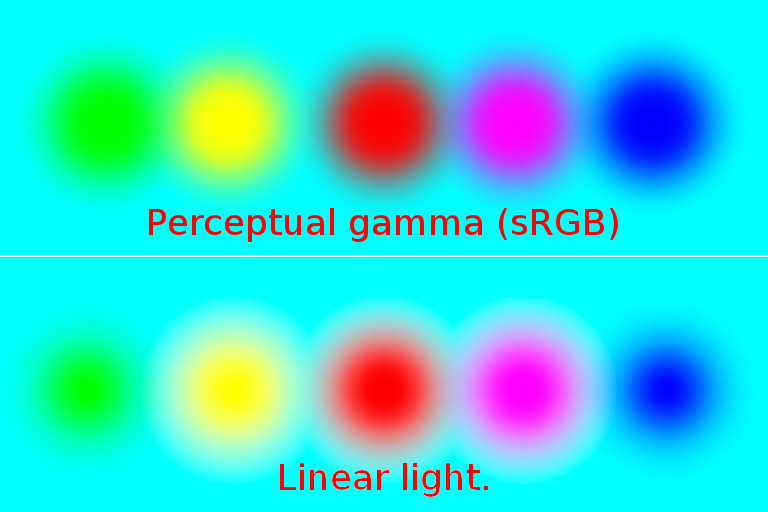
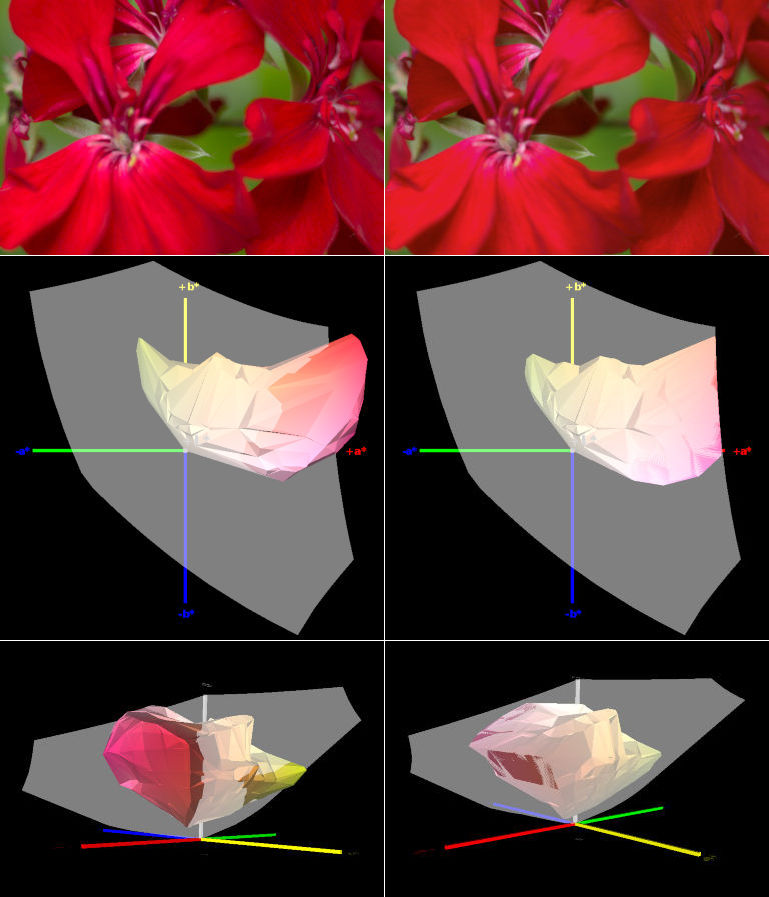

This is Part 2 of a two-part guide to high bit depth editing in GIMP 2.9.2 with Elle Stone.  
The first part of this article can be found here: [*Part 1*](/articles/users-guide-to-high-bit-depth-gimp-2-9-2-part-1/).

### Contents

<ol class='toc'>
<li><a href="#radiometrically-correct-editing">Using GIMP 2.9.2 for radiometrically correct editing</a>

    <ol>
    <li><a href="#linearized-srgb-channel-values-and-radiometrically-correct-editing">Linearized sRGB channel values and radiometrically correct editing</a></li>
    <li><a href="#using-the-linear-light-option-in-the-image-precision-menu">Using the “Linear light” option in the “Image/Precision” menu</a></li>
    <li><a href="#a-note-on-interoperability-between-krita-and-gimp">A note on interoperability between Krita and GIMP</a></li>
    </ol>
</li>

<li><a href="#gimp-2-9-2-s-unbounded-floating-point-icc-profile-conversions-handle-with-care-">GIMP 2.9.2’s unbounded floating point ICC profile conversions (handle with care!)</a></li>

<li><a href="#using-gimp-2-9-2-s-floating-point-precision-for-unclamped-editing">Using GIMP 2.9.2’s floating point precision for unclamped editing</a>

    <ol>
    <li><a href="#high-bit-depth-gimp-s-unclamped-editing-a-whole-realm-of-new-editing-possibilities">High bit depth GIMP’s unclamped editing: a whole realm of new editing possibilities</a></li>
    <li><a href="#if-the-thought-of-working-with-unclamped-rgb-data-is-unappealing-use-integer-precision">If the thought of working with unclamped RGB data is unappealing, use integer precision</a></li>
    </ol>
</li>

<li>
<a href="#looking-to-the-future-gimp-3-0-and-beyond">Looking to the future: GIMP 3.0 and beyond</a>
</li>
</ol>

---

## Radiometrically correct editing

### Linearized sRGB channel values and radiometrically correct editing

One goal for GIMP 2.10 is to make it easy for users to produce radiometrically correct editing results. "Radiometrically correct editing" reflects the way light and color combine out there in the real world, and so requires that the relevant editing operations be done on linearized RGB.

Like many commonly used RGB working spaces, the sRGB color space is encoded using perceptually uniform RGB. Unfortunately colors simply don't blend properly in perceptually uniform color spaces. So when you open an sRGB image using GIMP 2.9.2 and start to edit, in order to produce radiometrically correct results, many GIMP 2.9 editing operations will silently linearize the RGB channel information before the editing operation is actually done.

GIMP 2.9.2 editing operations that automatically linearize the RGB channel values include scaling the image, Gaussian blur, UnSharp Mask, Channel Mixer, Auto Stretch Contrast, decomposing to LAB and LCH, all of the LCH blend modes, and quite a few other editing operations.

GIMP 2.9.2 editing operations that <a title="GIMP bug report:  Curves and Levels should operate by default on linear RGB and present linear RGB Histograms" href="https://bugzilla.gnome.org/show_bug.cgi?id=757444">ought to, but don't yet, linearize the RGB channels include the all-important Curves and Levels operations.</a> For Levels and Curves, to operate on linearized RGB, change the precision to "Linear light" and use the Gamma hack. However, <a title="Jpeg attachment to bug757444 illustrating the problem. with the Curves histogram" href="https://bug757444.bugzilla-attachments.gnome.org/attachment.cgi?id=314590">the displayed histogram will be misleading</a>.

The GIMP 2.9.2 editing operations that automatically linearize the RGB channel values do this regardless of whether you choose "Perceptual gamma (sRGB)" or "Linear light" precision. The only thing that changes when you switch between the "Perceptual gamma (sRGB)" and "Linear light" precisions is <em>how colors blend when painting and when blending different layers together</em>.

(Well, what the Gamma hack actually does changes when you switch between the "Perceptual gamma (sRGB)" and "Linear light" precisions, but the way it changes varies from one operation to the next, which is why I advise to not use the Gamma hack unless you know exactly what you are doing.)

### Using the "Linear light" option in the "Image/Precision" menu

<figure class='big-vid' style='max-width:768px;'>

<figcaption>**Large soft disks painted on a cyan background.** 
 <ol><li><i>Top row:</i> Painted using "Perceptual gamma (sRGB)" precision. Notice the darker colors surrounding the red and magenta disks, and the green surrounding the yellow disk: those are "gamma" artifacts.</li> <li><i>Bottom row:</i> Painted using "Linear Light" precision. This is how light waves blend to make colors out there in the real world.</li></ol>
</figcaption>
</figure>

<figure class='big-vid' style='max-width: 768px;'>

<figcaption>**Circles painted on a red background.** 
 <ol><li><i>Top row:</i> Painted using "Perceptual gamma (sRGB)" precision. The dark edges surrounding the paint strokes are "gamma" artifacts.</li> <li><i>Bottom row:</i> Painted using "Linear Light" precision. This is how light waves blend to make colors out there in the real world.</li></ol>
</figcaption>
</figure>

In GIMP 2.9.2, when using the Normal, Multiply, Divide, Addition, and Subtract painting and Layer blending:

<ul class="double-space">
<li>For radiometrically correct Layer blending and painting, use the "Image/Precision" menu to select the "Linear light" precision option.</li> 

<li>When "Perceptual gamma (sRGB)" is selected, layers and colors will blend and paint like they blend in GIMP 2.8, which is to say there will be "gamma" artifacts.</li> </ul>

The LCH painting and Layer blend modes will <em>always</em> blend using Linear light precision, regardless of what you choose in the "Image/Precision" menu.

What about all the other Layer and painting blend modes? The concept of "radiometrically correct" doesn't really apply to those other blend modes, so choosing between "Perceptual gamma (sRGB)" and "Linear light" depends entirely on what you, the artist or photographer, actually want to accomplish. Switching back and forth is time-consuming so I tend to stay at "Linear light" precision all the time, unless I really, really, really want a blend mode to operate on perceptually uniform RGB.

### A note on interoperability between Krita and GIMP

Many digital artists and photographers are switching to linear gamma image editing. Let's say you use Krita for digital painting in a true linear gamma sRGB profile, specifically <a title="Krita/Manual/ColorManagement, section on Linear and Gamma corrected colours. The whole tutorial is very well worth reading." href="https://userbase.kde.org/Krita/Manual/ColorManagement">the "sRGB-elle-V4-g10.icc" profile that is supplied with recent Krita installations</a>, and you want to export your image from Krita and open it with GIMP 2.9.2.
 

Upon opening the image, GIMP will automatically detect that the image is in a linear gamma color space, and will offer you the option to keep the embedded profile or convert to the GIMP built-in sRGB profile. Either way, GIMP will automatically mark the image as using "Linear light" precision.
 

For interoperability between Krita and GIMP, when editing a linear gamma sRGB image that was exported to disk by Krita:
 
<ol>
<li>Upon importing the Krita-exported linear gamma sRGB image into GIMP, elect to <em>keep</em> the embedded "sRGB-elle-V4-g10.icc" profile.</li> 
<li><em>Keep the precision at "Linear light"</em>. </li>
<li>Then <em>assign</em> the GIMP built-in Linear RGB profile ("Image/Color management/Assign"). The GIMP built-in Linear RGB profile is functionally exactly the same as Krita's supplied "sRGB-elle-V4-g10.icc" profile (as are the GIMP built-in sRGB profile and Krita's "sRGB-elle-V4-srgbtrc.icc" profile).</li></ol>

Once you've assigned the GIMP built-in Linear RGB profile to the imported linear gamma sRGB Krita image, then feel free to change the precision back and forth between "Linear light" and "Perceptual gamma (sRGB)", as suits your editing goal.

When you are finished editing the image that was imported from Krita to GIMP:

<ol>
<li>Convert the image to one of the "Perceptual gamma (sRGB) precisions ("Image/Precision").</li>
<li>Convert the image to the Krita-supplied "sRGB-elle-V4-g10.icc" profile ("Image/Color management/Convert").</li>
<li>Export the image to disk and import it into Krita.</li>
</ol>

If your Krita image is in a color space other than sRGB, I would suggest that you simply not try to edit non-sRGB images in GIMP 2.9.2 because many GIMP 2.9.2 editing operations do depend on hard-coded sRGB color space parameters.

## GIMP 2.9.2's unbounded floating point ICC profile conversions (handle with care!)

Compared to most other RGB color spaces, the sRGB color space gamut is very small. When shooting raw, it's <a title="Nine Degrees Below Photography: Photographic colors that exceed the very small sRGB color gamut" href="http://ninedegreesbelow.com/photography/srgb-versus-photographic-colors.html">incredibly easy to capture colors that exceed the sRGB color space</a>.
 

<figure class='big-vid' style='max-width: 768px;'>

<figcaption>**The sRGB (the gray blob) and ProPhotoRGB (the multicolored wire-frame) color spaces as seen from different viewing angles inside the CIELAB reference color space.** *(Images produced using ArgyllCMS and View3DScene).*</figcaption>
</figure>

Every time you convert saturated colors from larger gamut RGB working spaces to GIMP's built-in sRGB working space <em>using floating point precision</em>, you run the risk of producing out of gamut RGB channel values. Rather than just explaining how this works, it's better if you experiment and see for yourself:

<ol class="double-space">
<li>Download this 16-bit integer ProPhotoRGB png, "<a href="http://ninedegreesbelow.com/photography/gimp/users-guide/saturated-colors.png">saturated-colors.png</a>".</li>

<li>Open "saturated-colors.png" with GIMP 2.9.2. GIMP will report the color space profile as "LargeRGB-elle-V4-g18.icc" — this profile is functionally equivalent to ProPhotoRGB.</li>

<li>Immediately change the precision to 32-bit floating point precision ("Image/Precision/32-bit floating point) and check the "Perceptual gamma (sRGB)" option.</li>

<li>Using the Color Picker Tool, make sure the Color Picker is set to "Use info Window" in the Tools dialog. Then eye-dropper the color squares, and make sure to set one of the columns in the Color Picker info Window to "Pixel". The red square will eye-dropper as (1.000000, 0.000000, 0.000000). The cyan square will eyedropper as (0.000000, 1.000000, 1.000000), and so on. All the channel values will be either 1.000000 or 0.000000.</li>

<li>While still at 32-bit floating point precision, and still using the "Perceptual gamma (sRGB)" option, convert "saturated-colors.png" to GIMP's built-in sRGB.</li>

<li>Eyedropper the color squares again. The red square will now eyedropper as approximately (1.363299, -2.956852, -0.110389), the cyan square will eyedropper as approximately (-13.365499, 1.094588, 1.003746), and so on.</li> 

<li>For extra credit, change the precision from 32-bit floating point "Perceptual gamma (sRGB)" to 32-bit floating point "Linear light" and eye-dropper the colors again. I will leave it to you as an exercise to figure out why the eye-droppered RGB "Pixel" values change so radically when you switch back and forth between "Perceptual gamma (sRGB)" and "Linear light".</li>

</ol>

Where did the funny RGB channel values come from? At floating point precision, GIMP uses LCMS2 to do <a title="Nine Degrees Below Photography: LCMS2 Unbounded ICC Profile Conversions" href="http://ninedegreesbelow.com/photography/lcms2-unbounded-mode.html"><i>unbounded</i> ICC profile conversions</a>. This allows an RGB image to be converted from the source to the destination color space without clipping otherwise out of gamut colors. So instead of clipping the RGB channels values to the <a title="Nine Degrees Below Photography: What are 'Clipped Colors' from ICC Profile Conversions?" href="http://ninedegreesbelow.com/photography/icc-profile-conversion-clipped-colors-examples.html">boundaries of the very small sRGB color gamut</a>, the sRGB color gamut was effectively "unbounded".

When you do an unbounded ICC profile conversion from a larger color space to sRGB, all the otherwise out of gamut colors are encoded using at least one sRGB channel value that is less than zero. And you might get one or more channel values that are greater than 1.0. Figure 11 below gives you a visual idea of the difference between bounded and unbounded ICC profile conversions:
 

<figure class='big-vid' style="max-width: 769px;">

<figcaption>**Unbounded (unclipped floating point) and bounded (clipped integer) conversions of a very colorful red flower from the original ProPhotoRGB color space to the much smaller sRGB color space.** *(Images produced using ArgyllCMS and View3DScene).*  

<ul>
<li><i>Top row:</i> Unbounded (unclipped floating point) and bounded (clipped integer) conversions of a very colorful red flower from the original ProPhotoRGB color space to the much smaller sRGB color space. The unclipped flower is on the left and the clipped flower is on the right.</li>

<li><i>Middle and bottom rows:</i> the unclipped and clipped flower colors in the sRGB color space. The unclipped colors are shown on the left and the clipped colors are shown on the right: <ul> <li class="none">The gray blobs are the boundaries of the sRGB color gamut.</li>
<li>The middle row shows the view inside CIELAB looking straight down the LAB Lightness axis.</li> 
<li>The bottom row shows the view inside CIELAB looking along the plane formed by the LAB A and B axes.</li></ul></li>
</ul>

The unclipped sRGB colors shown on the left are all encoded using at least one sRGB channel value that is less than zero, that is, using a negative RGB channel value.
</figcaption>
</figure>

When converting saturated colors from larger color spaces to sRGB, not clipping would seem to be much better than clipping. Unfortunately a whole lot of RGB editing operations don't work when performed on negative RGB channel values. In particular, <a title="Nine Degrees Below Photography: Multiplying out of gamut colors in the unbounded sRGB color space produces meaningless results" href="http://ninedegreesbelow.com/photography/unbounded-srgb-multiply-produces-meaningless-results.html">multiplying such colors produces meaningless results</a>, which of course applies not just to the Multiply and Divide blend modes (division and multiplications are inverse operations), but to <em>all</em> editing operations that involve multiplication by a color (other than gray, which is a special case).

So here's one workaround you can use to clip the out of gamut channel values: Change the precision of "saturated-colors.png" from 32-bit floating point to 32-bit <i>integer</i> precision ("Image/Precision/32-bit integer"). This will clip the out of gamut channel values (integer precision always clips out of gamut RGB channel values). Depending on your monitor profile's color gamut, you might or might not see the displayed colors change appearance; on a wide-gamut monitor, the change will be obvious.
 

When switching to integer precision, all colors are <em>clipped</em> to fit within the sRGB color gamut. Switching back to floating point precision won't restore the clipped colors.

<aside class="more"><h4>More about out of gamut channel values</h4>

Editing operations that only use add/subtract (which are inverse of each other), and/or multiply/divide by gray (where R=G=B), work just fine on colors that are encoded using one or more negative channel values. Almost all of the problems with <a title="Nine Degrees Below Photography: Using unbounded sRGB as a universal color space for image editing is a really bad idea" href="http://ninedegreesbelow.com/photography/unbounded-srgb-as-universal-working-space.html">unbounded sRGB image editing</a> have to do with editing operations that use multiply and divide.

I'm glossing over the difference between "out of gamut and encoded using at least one negative channel value" and "in gamut high dynamic range colors", which are encoded using at least one channel value that is &gt;1.0, but no channel value that is &lt;0.0. In this latter case the color is inside the sRGB color gamut for HDR editing, but it falls outside the "0.0 to 1.0" floating point range for <a title="Nine Degrees Below Photography: Models for image editing: Display-referred and scene-referred" href="http://ninedegreesbelow.com/photography/display-referred-scene-referred.html">display-referred editing.</a>

</aside>

As an important aside (and contrary to a distressingly popular assumption), when doing a normal "bounded" conversion to sRGB, <a title="Nine Degrees Below Photography: ICC Profile Conversion Intents" href="http://ninedegreesbelow.com/photography/icc-profile-conversion-intents.html">using "Perceptual intent" does <em>not</em> "keep all the colors"</a>. The regular and linear gamma sRGB working color space profiles are matrix profiles, which don't have perceptual intent tables. When you ask for perceptual intent and the destination profile is a matrix profile, what you get is relative colorimetric intent, which clips.

## Using GIMP 2.9.2's floating point precision for unclamped editing

### High bit depth GIMP's unclamped editing: a whole realm of new editing possibilities 

I've warned you about the bad things that can happen when you try to multiply or divide colors that are encoded using negative sRGB channel values. However, out of gamut sRGB channel values can also be incredibly useful.
 

GIMP 2.9.2 does provide a number of "unclamped" editing operations from which the clipping code in the equivalent GIMP 2.8 operation has been removed. For example, at floating point precision, the Levels upper and lower sliders, Unsharp Mask, Channel Mixer and "Colors/Desaturate/Luminance" do not clip out of gamut RGB channel values (however, Curves does clip). Also the Normal, Lightness, Chroma, and Hue blend modes do not clip out of gamut channel values. 
 

Unclamped editing opens up a whole realm of new editing possibilities. Quoting from <a title="Nine Degrees Below Photography: tutorial on using high bit depth GIMP's new LCH blend modes and unclamped editing operations." href="http://ninedegreesbelow.com/photography/high-bit-depth-gimp-tutorial-edit-tonality-color-separately.html">Autumn colors: An Introduction to High Bit Depth GIMP's New Editing Capabilities</a>:

<blockquote>

Unclamped editing operations might sound more arcane than interesting, but especially for photographers this is a really big deal:

<ul>
    <li>Automatically clipped RGB data produces lost detail and causes hue and saturation shifts.</li>
    <li>Unclamped editing operations allow you, the photographer, to choose when and how to bring the colors back into gamut.</li>
    <li>Of interest to photographers and digital artists alike, unclamped editing sets the stage for (and already allows very rudimentary) HDR scene-referred image image editing.</li></ul>
</blockquote>

Having used high bit depth GIMP for quite a while now, I can't imagine going back to editing that is constrained to only using clipped RGB channel values. The <cite>Autumn colors</cite> tutorial provides a start-to-finish editing example making full use of unclamped editing and the LCH blend modes, with a downloadable XCF file so you can follow along.

### If the thought of working with unclamped RGB data is unappealing, use integer precision

If working with unclamped RGB channel data is simply not something you want to do, then use integer precision for all your image editing. At integer precision <i>all</i> editing operations clip. This is a function of integer encoding and so happens regardless of whether the particular editing function includes or doesn't include clipping code.

## Looking to the future: GIMP 3.0 and beyond

Even though GIMP 2.10 hasn't yet been released, high bit depth GIMP is already an amazing image editor. GIMP 3.0 and beyond will bring many more changes, including the port to GTK+3 (for GIMP 3.0), full color management for any well-behaved RGB working space (maybe by 3.2?), plus extended LCH processing with HSV strictly for use with legacy files. Also users will eventually have the ability to choose "Perceptual" encodings other than the sRGB TRC.
 

If you would like to see GIMP 3.0 and beyond arrive sooner rather than later, GIMP is coded, documented, and maintained by volunteers, and GIMP needs more developers. If you are not a programmer, there are <a title="GIMP website: Ways to contribute to GIMP development" href="http://www.gimp.org/develop/">many other ways you can contribute to GIMP development.</a>

<small>**All text and images &copy;2015 [Elle Stone](http://ninedegreesbelow.com/), all rights reserved.**</small>
