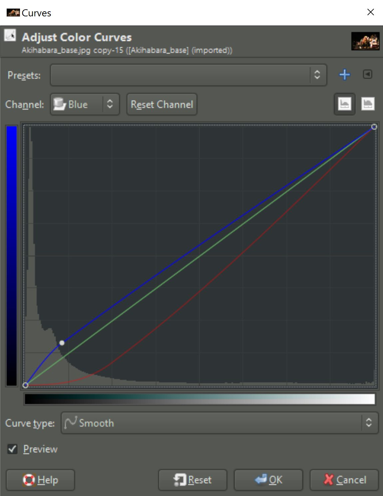
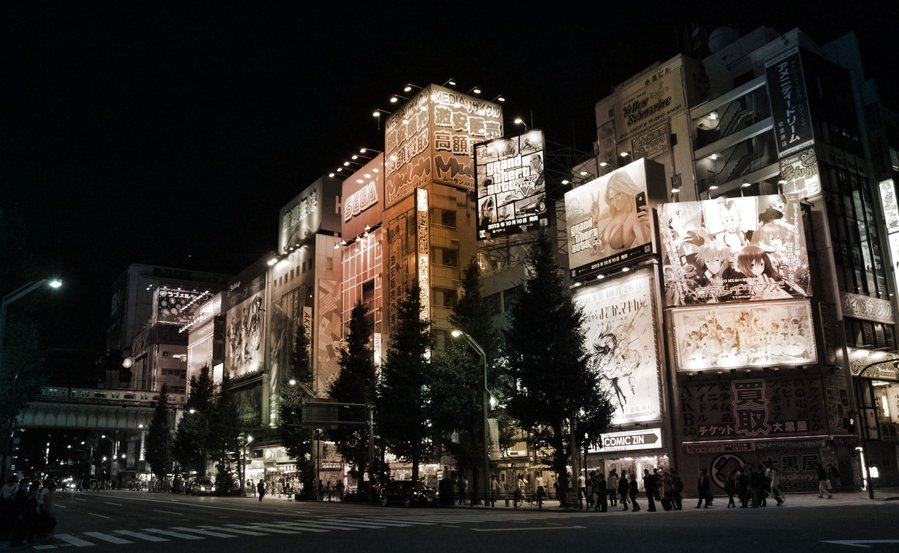
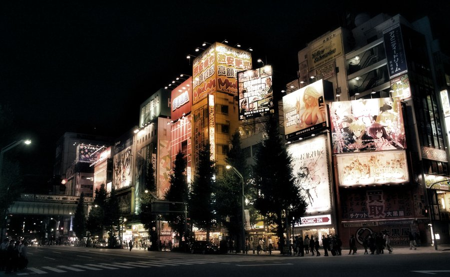
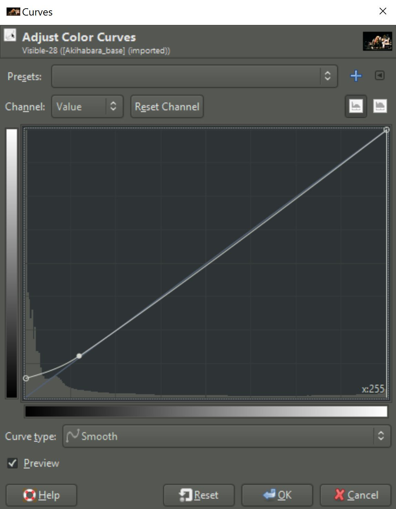

Welcome to this tutorial explaining how to achieve the effect shown in this [post](https://discuss.pixls.us/t/technique-inspired-by-masashi-wakui-post/2618 "Technique inspired by masashi wakui post"), which again was inspired by this [post](https://discuss.pixls.us/t/achieve-the-masashi-wakui-look/634 "Achieve the Masashi Wakui look") about the Masashi Wakui look.

We will be doing some basic toning and then we will be applying Gimp's wavelet decompose filter to do some magic.
Two things will be used from the wavelet decompose results:
- the residual
- the coarsest wavelet scale (number 8 in this case)

The basic idea is to use the residual of the the wavelet decompose filter to color the image. What this does is basically averaging and blurring colors. In this night scene much of the color comes from the lights. The trick stregthens the effect of the surroundings being colored by the lights.
The wavelet scale 8 will then produce overemphasised local contrasts, which will accentuate the lights further. This works nicely in pictures with lights as the brightest areas will be around lights. Used on daytime picture this effect will also accentuate brighter areas which will lead to a kind of "glow" effect. I tried this as well and it does look good on some pictures while on others it looks just wrong. Try it!

We will be applying all the following steps to this picture, taken in Akihabara, Tokyo.

<figure class="big-vid">
    
</figure>

1. Apply the _luminosity mask_ filter to the base picture. We will need this later.
    Filters - Generic - Luminosity Masks

1. Duplicate the base picture.

1. Tone the shadows of the duplicated picture using the _tone curve_ and lowering the reds in the shadows. If you want your shadows to be less green, also slightly raise the blues in the shadows.
    Colors - Curves

<figure>
    
</figure>

<figure class="big-vid">
    
</figure>

1. Apply a _layer mask_ to the duplicated and toned picture. Choose a mask from a channel and choose the DD mask.

1. With all two layers visible click on one of the layers and choose _new from visible_. Let's call this layer our blended layer.

<figure class="big-vid">
    
</figure>

1. Apply the _wavelet decompose_ filter to the blended layer and choose 8 as number of detail scales.

1. Make the blended layer and the residual visible. Then set the mode of the residual to _color_. This will give you a picture with averaged blurred colors.

<figure class="big-vid">
    
</figure>

1. Turn the opacity of the residual down to 70%, or any other value to your taste, to bring back some color detail.

<figure class="big-vid">
    
</figure>

1. Turn the wavelet scale 8 on (should be in _grain merge_ mode), and see how the lights start shining.

<figure class="big-vid">
    
</figure>

1. Optional: Turn the wavelet scale 3 (or any other) on to sharpen the picture and blend to taste.

1. Make sure the following layers are visible:
- blended
- residual
- wavelet scale 8
- Any other wavelet scale you want to use for sharpening

1. Make a new layer from visible

1. Raise the shadows using the tone curve again.

<figure>
    
</figure>

1. Adjust saturation to taste. I didn't use this step on this picture but on some it may be worth trying. If there are predominantly white lights and the colors come mainly from other objects, the residual will be washed out.

The final result:

<figure class="big-vid">
    
</figure>
