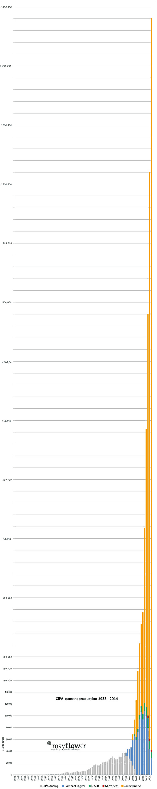

I think we are at an interesting time for digital imaging.
I came across this graph on [Petapixel](http://petapixel.com/2015/04/09/this-is-what-the-history-of-camera-sales-looks-like-with-smartphones-included/) the other day that showed camera sales from 1947 - 2014:

There was explosive growth driven by the *Compact Digital* market right around 2000.
Likely driven by the advent of those inexpensive compact digital cameras and the ubiquity of home computers.
It was relatively cheap to get a decent digital camera and the cost per photo suddenly dropped to a previously unheard of amount (compared to shooting film).

This meant that substantially more people were now able to take and share photographs.

That precarious plummet after 2011 seems frightful for the photography industry as a whole, though.
The numbers from the graph would seem to indicate that production in 2014 dropped to *below* the values from 2001.

<!-- more -->
Petapixel had a follow-up article where photographer Sven Skafisk added in smartphone sales using data from Gartner Inc.: 

If that graph doesn't describe an industry in the throes of change, then I don't know what does.
It looks like the camera industry is less in decline and more about being in a big transition phase.

### So What?
So why would this matter?
Because now, more than ever, there is a large amount of people who may be interested in learning to process their photographs in some way.
As the costs and barrier to entry to photography as a hobby get lower we see more and more people finding the fun and joy of photography.

Couple that with the fact that the modern language of media consumption is primarily *visual* and I see a great opportunity brewing.

I feel this is important to *us* as free software users as it gives us an opportunity to help make people aware of free software (and its ideas).
New hobbyists will invariably look for an inexpensive way to get started processing photos and will almost always run into various free software projects at some point in the search.

It's entirely on us as a community to make sure that there will be good resources to learn from.
If we do a good enough job, some of those folks will realize that free software more than meets their needs.
If we do a *really* good job, some of those people will become valuable parts of our communities.

## Articles Have Comments Now Also
So I have now also enabled the comments for more than just blog posts.
They should now be working just fine on full articles as well.
So feel free to head over to [Ian Hex's][1] neat [Luminosity Masking in darktable][2] tutorial and leave a comment to let him know what you thought of it!
(Or any of the other articles, too.)

[1]: http://lightsweep.co.uk
[2]: http://pixls.us/articles/luminosity-masking-in-darktable

