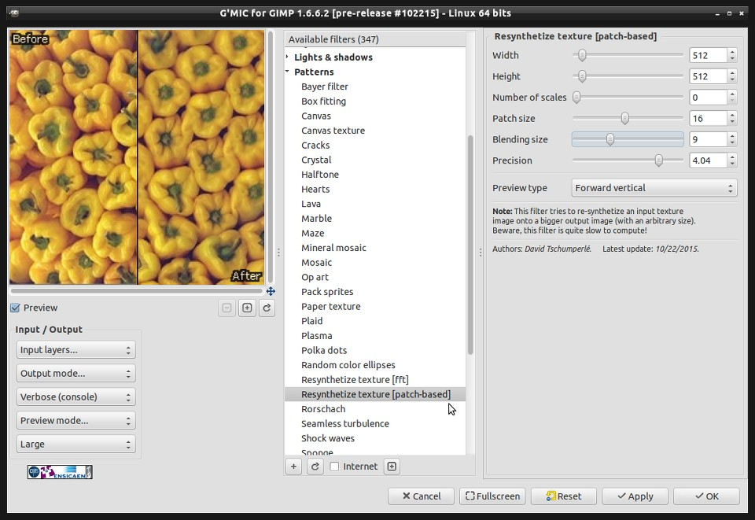

Some awesome updates from the community and activity over on [the forums]!
People have been busy doing some really neat things (that really never fail to astound me).
The level of expertise we have floating around on so many topics is quite inspiring.

<iframe width="480" height="360" src="https://www.youtube-nocookie.com/embed/aiwA0JrGfjA?rel=0" frameborder="0" allowfullscreen></iframe>

 

<!-- more -->

## darktable 2.0 Release Candidate
### Towards a Better darktable!

[the forums]: https://discuss.pixls.us

A nice Halloween weekend gift for the F/OSS photo community from [darktable][]: a first Release Candidate for a 2.0 release is now available!

[darktable]: http://www.darktable.org

[Houz][] made the announcement on the forums this past weekend and includes some caveats. (Edits will be preserved going up, but it won't be possible to downgrade back to 1.6.x).

Preliminary notes from houz (and [Github][]):

[Houz]: http://houz.org/
[Github]: https://github.com/darktable-org/darktable/releases/tag/release-2.0rc1

* darktable has been ported to gtk-3.0
* new thumbnail cache replaces mipmap cache (much improved speed, less crashiness)
* added print mode
* reworked screen color management (softproof, gamut check etc.)
* text watermarks
* color reconstruction module
* raw black/white point module
* delete/trash feature
* addition to shadows&highlights
* more proper Kelvin temperature, fine-tuning preset interpolation in WB iop
* noiseprofiles are in external JSON file now
* monochrome raw demosaicing (not sure whether it will stay for release, like Deflicker, but hopefully it will stay)
* aspect ratios for crop&rotate can be added to conf (ae36f03)
* navigating lighttable with arrow keys and space/enter
* pdf export -- some changes might happen there still
* brush size/hardness/opacity have key accels
* the facebook login procedure is a little different now
* export can upscale
* we no longer drop history entries above the selected one when leaving dr or switching images
* text/font/color in watermarks
* image information now supports gps altitude
* allow adding tone- and basecurve nodes with ctrl-click
* we renamed mipmaps to thumbnails in the preferences
* new "mode" parameter in the export panel
* high quality export now downsamples before watermark and frame to guarantee consistent results
* lua scripts can now add UI elements to the lighttable view (buttons, sliders etc...)
* a new repository for external lua scripts was started.

 

## G'MIC 1.6.7

Because apparently David Tschumperlé doesn't sleep, a new release of [G'MIC][] was [recently announced][] as well!
This release includes a really neat new patch-based texture resynthesizer that David has been playing with for a while now.

[G'MIC]: http://gmic.eu
[recently announced]: https://discuss.pixls.us/t/release-of-gmic-1-6-7/426

<figure class='big-vid'>

<figcaption>
Re-synthesizing an input texture to an output of arbitrary size.
</figcaption>
</figure>

It will build an output texture of arbitrary size based on an input texture (and can result in some neat looking peppers apparently).

Speaking of G'MIC...

### G'MIC for Adobe After Effects and Premier Pro

Yes, I know it's Adobe.
Still, I can't help but think that this might be an awesome way to introduce some people to the amazing work being done by so many F/OSS creators.

Tobias Fleischer announced on [this post][] that he has managed to get G'MIC working with After Effects and Premier Pro.
Even some of the more intensive filters like skeleton and Rodilius appear to be working fine (if a bit sluggish)!

[this post]: https://discuss.pixls.us/t/gmic-for-adobe-after-effects-and-premiere-pro/452 

<figure class='big-vid'>

</figure>

## PhotoFlow

You might remember [PhotoFlow][] as the project that creator [Andrea Ferrero][] used when writing his [Blended Panorama Tutorial][] from a few months ago.
What you might not realize is that Andrea has also been working at a furious pace improving PhotoFlow (indeed it feels like every few days he is announcing new improvements - almost as fast as G'MIC!).

[PhotoFlow]: http://photoflowblog.blogspot.ch/
[Andrea Ferrero]: http://photoflowblog.blogspot.com/ 
[Blended Panorama Tutorial]: https://pixls.us/blog/2015/07/photoflow-blended-panorama-tutorial/

<figure class='big-vid'>

<figcaption>
Example of PhotoFlow perspective correction.
</figcaption>
</figure>

His latest release was [announced a few days ago] as 0.2.3.
He's incorporated some nice new improvements in this version:

[announced a few days ago]: https://discuss.pixls.us/t/release-of-photoflow-version-0-2-3/476

* the additon of the **LMMSE demosaicing** method, directly derived from the algorithm implemented in RawTherapee
* an **impulse noise** (also known as **salt&pepper**) reduction tool, again derived from rawTherapee. It effectively reduces isolated bright and dark pixels.
* a **perspective correction** tool, derived from Darktable. It can simultaneously correct horizontal and vertical perspective as well as tilting, and works interactively.

Head on over to the [PhotoFlow Blog][] to check things out!

[PhotoFlow Blog]: http://photoflowblog.blogspot.com/

## LightZone 4.1.3 Released

We don't hear as often from folks using [LightZone][], but that doesn't mean they're not working on things!
In fact, Doug Pardee just stopped by the forums a while ago to [announce a new release] is available, 4.1.3.
(Bonus fun - read that topic to see the [_Revised BSD License_] go flying right over my head!)

[LightZone]: http://lightzoneproject.org/
[announce a new release]: https://discuss.pixls.us/t/lightzone-4-1-3-released/447 
[_Revised BSD License_]: http://opensource.org/licenses/BSD-3-Clause

Head over to [their announcement] to see what they're up to.
[their announcement]: http://lightzoneproject.org/content/september-27-2015-lightzone-v413-now-available

## Rapid Photo Downloader

We also had the developer of [Rapid Photo Downloader][], Damon Lynch, [stop by the forums to solicit feedback][] from users just the other day.
A nice discussion ensued and is well worth reading (or even contributing to!).

[Rapid Photo Downloader]: http://www.damonlynch.net/rapid/
[stop by the forums to solicit feedback]: https://discuss.pixls.us/t/feedback-wanted-about-rapid-photo-downloader/463

Damon is working hard on the next release of RPD (apparently the biggest update since the projects inception in 2007!), so go show some support and provide some feedback for him.

## RawTherapee Forum

<figure>

</figure>

The [RawTherapee][] team is testing out having a [forum over here on discuss] as well (we welcomed the [G'MIC community] a little while ago).
This is currently an alternate forum for the project (which *may* become the official forum in the future).
The category is quiet as we only just set it up, so drop by and say hello!

[RawTherapee]: http://rawtherapee.com/
[forum over here on discuss]: https://discuss.pixls.us/c/software/rawtherapee
[G'MIC community]: https://discuss.pixls.us/c/software/gmic

Speaking of RawTherapee...

## Lede Image

I want to thank [Morgan Hardwood (LondonLight.org)][] for providing us a wonderful view of Röstånga, Sweden as a background image on the [main page](/).

[Morgan Hardwood (LondonLight.org)]: http://www.londonlight.org/

<figure class='big-vid'>

<figcaption>
Röstånga by <a href="http://www.londonlight.org">Morgan Hardwood</a> 
<a class="cc" href="https://creativecommons.org/licenses/by-sa/4.0/">cba</a>

</figcaption>
</figure>
